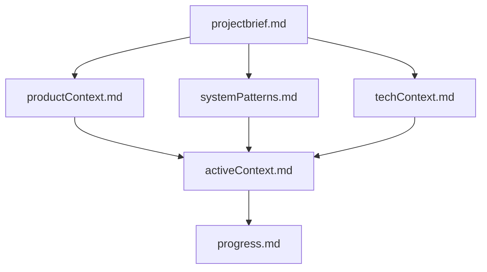
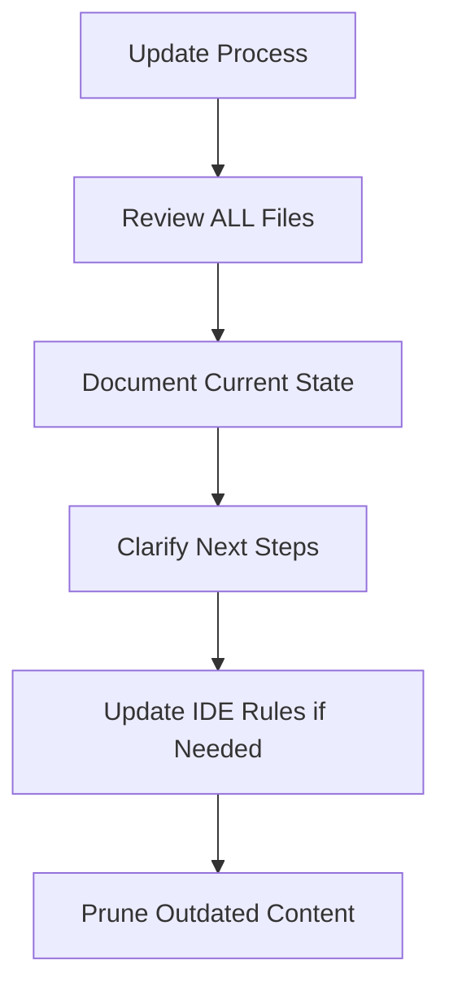
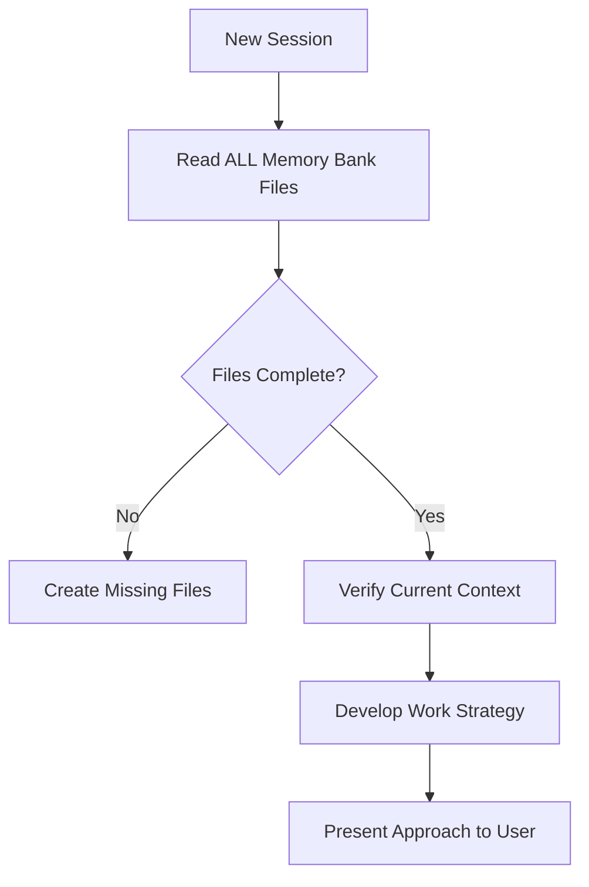

**Description:** Universal memory bank principles for AI models to maintain project context and continuity.
**AppliesTo:** `memory-bank/**/*`, project context files
**AutoAttach:** true
**Type:** Auto-attach
**Version:** 2.0
**LastUpdated:** 2025-09-24

# Universal Memory Bank System

## Purpose
Establish universal principles for maintaining project context and ensuring AI effectiveness through structured documentation, enabling seamless context recovery across session resets regardless of specific AI model or editor implementation.

## Rule Type and Scope

- **Type:** Auto-attach
- **Scope:** Universal memory bank principles for project context management across all AI models and editors

## Contract
- **Inputs/Prereqs:** Project context files; clear documentation structure; session reset understanding
- **Allowed Tools:** Read-only context tools; documentation tools; structured update tools
- **Forbidden Tools:** Tools that duplicate information across contexts; unstructured narrative documentation
- **Required Steps:** 
  1. Read all relevant context at session start (non-optional)
  2. Maintain single source of truth per information type
  3. Update context after significant changes
  4. Prune outdated information aggressively
  5. Structure information for rapid context recovery
- **Output Format:** Structured documentation with clear sections, minimal redundancy, forward-looking focus
- **Validation Steps:** Context completeness check; information uniqueness verification; productivity within 20 lines test

## Key Principles

- **Rapid Recovery:** AI must be productive within first 20 lines of reading
- **Signal Maximization:** Every line must provide actionable value
- **Zero Redundancy:** Each piece of information lives in exactly one place
- **Aggressive Pruning:** Remove outdated or redundant content ruthlessly
- **Structured Communication:** Use lists, tables, and bullets over narrative prose
- **Reference Over Duplication:** Link to existing documentation rather than copying
- **Temporal Boundaries:** Separate current, recent, and historical context clearly
- **Forward Focus:** Emphasize what's next, not what's done

## 1. Universal Context Structure

### Core Information Types
- **Project Brief**: Foundation, scope, and requirements (stable reference)
- **Active Context**: Current work, immediate next steps, blocking issues (most critical)
- **Technical Context**: Stack, constraints, essential commands (stable reference)
- **System Patterns**: Architecture decisions and design patterns in use (evolving reference)
- **Progress Tracking**: Status, accomplishments, known issues (dynamic status)
- **Product Context**: Why project exists, problems solved, user experience goals (stable vision)

### File Organization Principles


**File Structure:**
- **Single Purpose**: Each file serves one specific context type
- **Clear Hierarchy**: Dependencies and relationships between contexts are explicit
- **Bounded Size**: Each context file maintains specific size limits
- **Forward Focus**: Current context emphasizes what's next, not what's done

## 2. Content Guidelines

### Core Files (Required)

#### activeContext.md (≤100 lines) - MOST CRITICAL
**Structure Required:**
1. Quick Start section (lines 1-30)
2. Current work focus (≤2 paragraphs)
3. Active decisions (blocking current work only)
4. Dependencies & blockers (current only)
5. Session change log (≤5 entries)

**Content Rules:**
- Current + last session only; archive older content
- Start with Quick Start section (primary objective, next steps, validation)
- Update after every significant task completion
- Remove completed work details (archive them)

#### projectbrief.md (≤120 lines)
- Foundation document defining core requirements and project scope
- Source of truth for project boundaries and goals
- Stable reference document (rarely changes)

#### productContext.md (≤120 lines)
- Why this project exists and problems it solves
- User experience goals and success criteria
- Business context and value proposition

#### systemPatterns.md (≤150 lines)
- System architecture and key technical decisions
- Design patterns currently in use with rationale
- Component relationships and integration points

#### techContext.md (≤150 lines)
- Technology stack (table format preferred)
- Technical constraints and dependencies
- Essential commands and development workflow
- Reference setup instructions rather than duplicating them

#### progress.md (≤140 lines)
- Current state summary and compressed accomplishments
- Known issues and technical debt (current only)
- Immediate roadmap (next 2-3 sprints maximum)

## 3. Performance Standards

### Size Budgets (Mandatory)
- **Total context**: ≤600 lines across all files
- **Active context**: ≤100 lines (most critical)
- **Technical context**: ≤150 lines
- **Progress tracking**: ≤140 lines
- **Project brief**: ≤120 lines
- **Product context**: ≤120 lines
- **System patterns**: ≤150 lines

### Efficiency Targets  
- **Context Load Time**: AI productive within 20 lines of reading
- **Information Density**: Every line provides actionable value
- **Update Frequency**: Balance currency with maintenance overhead
- **Reference Accuracy**: All links and references remain current
- **Session Recovery**: ≤ 1 minute for complex projects, ≤ 30 seconds for familiar projects

## 4. Maintenance Workflows

### Context Update Triggers
- After implementing significant changes
- When discovering new project patterns  
- When user requests with **"update memory bank"** (MUST review ALL files)
- When context needs clarification for effectiveness
- At major project milestones

### Update Process


1. **Review All Contexts**: Check each context type for relevance
2. **Document Current State**: Capture new patterns and decisions  
3. **Clarify Next Steps**: Update active context with immediate priorities
4. **Prune Outdated Content**: Remove completed, changed, or irrelevant information
5. **Update IDE Rules**: Capture new patterns in project-specific rules

### Session Start Protocol


**Critical:** Read ALL memory bank files at the start of EVERY session - this is not optional.

## 5. IDE Integration

### Project Intelligence Rules
- **Purpose**: IDE-specific rules file serves as learning journal for each project
- **Content**: Capture patterns, preferences, and project intelligence that improve effectiveness
- **Format**: Flexible - focus on capturing valuable insights
- **Evolution**: Treat as living document that grows smarter over time

### What to Document in IDE Rules
- Critical implementation paths and user workflow patterns
- Project-specific conventions and known challenges
- Tool usage patterns and evolution of project decisions
- Solutions to recurring problems

## Quick Compliance Checklist
- [ ] All core memory bank files exist and are within size budgets
- [ ] activeContext.md updated after significant changes
- [ ] No information duplication across contexts
- [ ] Quick start information readily accessible in activeContext.md
- [ ] Outdated content removed or archived appropriately
- [ ] All references and links are current and functional
- [ ] Context structure follows hierarchical dependencies
- [ ] Forward-looking focus maintained (what's next vs what's done)
- [ ] Essential commands and workflows documented in techContext.md
- [ ] AI can resume work effectively using only context files

## Validation
- **Success Checks**: AI can resume work effectively using only context files; no duplicate information exists; all references work; productivity achieved within 20 lines of reading; context load completes within time targets
- **Negative Tests**: Context files with missing quick start fail effectiveness test; duplicate information causes confusion and wasted time; broken references impede progress; oversized contexts delay session recovery

## Response Template
```markdown
## Memory Bank Analysis
- **Session Status**: [New session / Continuing work]
- **Context Health**: [Complete / Missing files / Needs updates]
- **Active Focus**: [Current priority from activeContext.md]  
- **Next Steps**: [Immediate actions from context]
- **Blockers**: [Any dependencies or constraints]
- **Validation**: [How to verify completion]

## Context Summary
- **Project**: [Brief description from projectbrief.md]
- **Current State**: [Status from progress.md]
- **Technical Stack**: [Key technologies from techContext.md]

## Implementation Plan
[Minimal changes based on context understanding]
```

## References

### External Documentation
- [Technical Writing Best Practices](https://developers.google.com/tech-writing) - Google's guide for clear, effective documentation
- [Documentation Systems](https://documentation.divio.com/) - Framework for organizing technical documentation  
- [Cursor Documentation](https://docs.cursor.com/) - AI-powered code editor features and capabilities
- [Cursor Rules Guide](https://docs.cursor.com/en/context/rules) - Project rules and context management
- [Markdown Guide](https://www.markdownguide.org/) - Complete Markdown syntax and formatting reference

### Related Rules
- **Global Core**: `000-global-core.md`
- **Rule Governance**: `002-rule-governance.md`