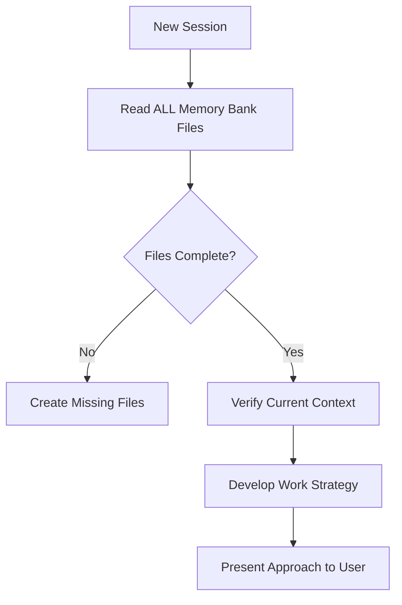
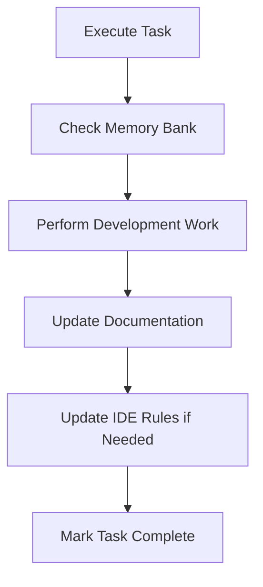

# AI Coding Rules

[](https://opensource.org/license/apache-2-0)
[](https://www.python.org/downloads/)
[](https://taskfile.dev)

> **One universal rule set for all AI assistants, IDEs, and agents — portable, intelligent, and IDE-agnostic**

## Project Scope and Intent

This repository provides a **universal-first rule system** designed to work seamlessly with any AI assistant, IDE, or development tool. Write rules once in a universal format, use them everywhere.

### About the Project

This repository provides a comprehensive collection of engineering rules designed to work seamlessly with AI coding assistants including Claude, ChatGPT, GitHub Copilot, Cursor, and others. The rules cover everything from Python and SQL best practices to data engineering, analytics, and project governance. Some aspects of the **rules are opinionated**, particularly where it relates to:

- naming conventions
- project structure
- usage of uv and ruff
- usage of Task
- README.md and CHANGELOG.md

You are **encouraged to review the rules and make adjustments** as desired to better align with your best practices or preferred approaches.

This project was inspired, in part, by: [how-to-add-cline-memory-bank-feature-to-your-cursor](https://forum.cursor.com/t/how-to-add-cline-memory-bank-feature-to-your-cursor/67868) and [cline memory bank](https://docs.cline.bot/prompting/cline-memory-bank)

## Table of Contents

### Getting Started
- [Document Map: What to Read First](#document-map-what-to-read-first)
- [Quick Start](#quick-start)
  - [For Rule Consumers](#for-rule-consumers-using-the-rules)
  - [For Rule Maintainers](#for-rule-maintainers-contributing-to-rules)
- [Rule Selection Decision Tree](#rule-selection-decision-tree)

### Core Documentation
- [Rule Categories](#rule-categories)
  - [Core Foundation (000-099)](#core-foundation-000-099)
  - [Data Platform - Snowflake (100-199)](#data-platform---snowflake-100-199)
  - [Software Engineering - Python (200-299)](#software-engineering---python-200-299)
  - [Software Engineering - Shell Scripts (300-399)](#software-engineering---shell-scripts-300-399)
  - [Software Engineering - Containers (400-499)](#software-engineering---containers-400-499)
  - [Data Science & Analytics (500-599)](#data-science--analytics-500-599)
  - [Data Governance (600-699)](#data-governance-600-699)
  - [Business Intelligence (700-799)](#business-intelligence-700-799)
  - [Project Management (800-899)](#project-management-800-899)
  - [Demo & Synthetic Data (900-999)](#demo--synthetic-data-900-999)
- [Directive Language Hierarchy](#directive-language-hierarchy)

### Architecture & Philosophy
- [Why Smaller, Focused Rules?](#why-smaller-focused-rules)
- [Universal-First Design](#universal-first-design)
- [Rule Generator Architecture](#rule-generator-architecture)

### Advanced Features
- [AI Configuration](#ai-configuration)
- [Memory Bank System](#memory-bank-system)
- [Programmatic Rule Loading](#programmatic-rule-loading-example)

### Development & Integration
- [System-Wide Script (gen-rules)](#system-wide-script-gen-rules)
- [Development Commands](#development-commands)
- [Troubleshooting](#troubleshooting)

### Contributing & Support
- [Contributing](#contributing)
- [Compatibility Matrix](#compatibility-matrix)
- [License](#license)
- [Support](#support)

## Document Map: What to Read First

This repository contains multiple documentation files for different audiences:

### For Human Users

| File | Purpose | When to Read |
|------|---------|--------------|
| **README.md** | Project overview, setup, usage | Start here (you are here) |
| **docs/ONBOARDING.md** | Team onboarding guide | When setting up for your team |
| **CONTRIBUTING.md** | Development guidelines, PR process | When contributing rules |
| **docs/ARCHITECTURE.md** | System architecture, design decisions | When understanding internals or extending |
| **CHANGELOG.md** | Version history, changes | When checking updates |
| **Taskfile.yml** | Build automation reference | When running tasks |

### For AI Assistants (Add to AI Context)

| File | Purpose | Required? |
|------|---------|-----------|
| **AGENTS.md** | Rule loading protocol and discovery guide (prescriptive instructions FOR AI) | ✅ Required |
| **RULES_INDEX.md** | Machine-readable rule catalog with keywords | ✅ Required |
| **rules/*.md** | The actual rules (74 rule files) | ✅ Required (loaded on-demand) |

### Generated Outputs (Use These)

| Directory | Format | Use With |
|-----------|--------|----------|
| **generated/universal/** | Clean Markdown | Any IDE, LLM, or agent |
| **generated/cursor/rules/** | .mdc files | Cursor IDE |
| **generated/copilot/instructions/** | .md with YAML | GitHub Copilot |
| **generated/cline/** | Plain .md | Cline AI |

**Quick Decision**: 
- **New to the project?** → See [Team Onboarding](docs/ONBOARDING.md)
- **Just want to use rules?** → See [For Rule Consumers](#for-rule-consumers-using-the-rules)
- **Want to modify rules?** → See [For Rule Maintainers](#for-rule-maintainers-contributing-to-rules)
- **Want to configure your AI?** → See [AI Configuration](#ai-configuration)
- **Want to understand the system?** → See [Architecture](docs/ARCHITECTURE.md)

---

## Quick Start

### Video Walkthroughs

For video walkthroughs see [Overview](videos/ai_coding_rules_overview.mov) and [Demo](videos/ai_coding_rules_demo.mov)

### For Rule Consumers (Using the Rules)

**Want to use these rules in your project?** Follow this simple guide:

#### Option A: Deployment (Recommended)

Deploy rules directly to your project with automatic path configuration:

```bash
# Clone this repository
git clone https://snow.gitlab-dedicated.com/snowflakecorp/SE/sales-engineering/ai_coding_rules.git
cd ai_coding_rules

# Deploy to your project
task deploy:universal DEST=~/my-project   # For any IDE/LLM (most portable)
task deploy:cursor DEST=~/my-project      # For Cursor IDE
task deploy:copilot DEST=~/my-project     # For GitHub Copilot
task deploy:cline DEST=~/my-project       # For Cline

# Or deploy to current directory
cd ~/my-project
task deploy:universal
```

**What happens:**
- Generates rules for your target agent/IDE
- Copies to correct location (`.cursor/rules/`, `rules/`, `.github/copilot/instructions/`, `.clinerules/`)
- Updates `AGENTS.md` with proper paths for your agent (replaces `{rule_path}` template variable)
- Updates `RULES_INDEX.md` with correct paths and file extensions for your agent
- Both files configured to point AI assistants to the correct rule locations
- Ready to use immediately!

#### Option B: Git Submodule (Version Tracking)

Track rule updates via git submodule:

```bash
# From your project root
git submodule add https://snow.gitlab-dedicated.com/snowflakecorp/SE/sales-engineering/ai_coding_rules.git .ai-rules
cd .ai-rules
task deploy:universal DEST=..   # Deploy to parent project

# Update rules later
cd .ai-rules && git pull && task deploy:universal DEST=..
```

#### Option C: Deployment Without Task

If you don't have Task installed, use the Python deployment script directly:

```bash
# Clone the rules repository
git clone https://snow.gitlab-dedicated.com/snowflakecorp/SE/sales-engineering/ai_coding_rules.git /tmp/ai-rules
cd /tmp/ai-rules

# Install Python dependencies
/opt/homebrew/bin/uv sync

# Deploy using Python script (handles everything automatically)
/opt/homebrew/bin/uv run scripts/deploy_rules.py --agent universal --destination ~/my-project

# Verify deployment
ls ~/my-project/rules/*.md | wc -l  # Should show 72+
ls ~/my-project/AGENTS.md ~/my-project/RULES_INDEX.md  # Both files should exist
```

**For other formats:**
```bash
# Cursor
/opt/homebrew/bin/uv run scripts/deploy_rules.py --agent cursor --destination ~/my-project

# Copilot
/opt/homebrew/bin/uv run scripts/deploy_rules.py --agent copilot --destination ~/my-project

# Cline
/opt/homebrew/bin/uv run scripts/deploy_rules.py --agent cline --destination ~/my-project
```

**What the script does automatically:**
- Generates rules for the specified agent type
- Copies rules to the correct directory (`.cursor/rules/`, `rules/`, etc.)
- Updates `AGENTS.md` with correct paths (replaces `{rule_path}` template variable)
- Updates `RULES_INDEX.md` with correct paths and file extensions (e.g., `.mdc` for Cursor)
- Ensures AI assistants can accurately locate rules by reading either file
- No manual `sed` or path editing needed!

#### Verify Setup

```bash
# Check rules are present (universal deployment)
ls rules/*.md | wc -l  # Should show 72+

# Or for Cursor
ls .cursor/rules/*.mdc | wc -l  # Should show 72+
```

**Success!** Your AI assistant can now access 72+ specialized rules. See [AI Configuration](#ai-configuration) for IDE-specific setup.

---

### For Rule Maintainers (Contributing to Rules)

**Want to modify or contribute rules?** Follow this development setup:

#### Prerequisites

- **Python 3.11+** — Required for running generation scripts
- **uv** — Fast dependency management ([install guide](https://github.com/astral-sh/uv))
- **Task** — Simplified commands ([install guide](https://taskfile.dev/installation/))

#### Setup

```bash
# Clone the repository
git clone https://snow.gitlab-dedicated.com/snowflakecorp/SE/sales-engineering/ai_coding_rules.git
cd ai_coding_rules

# Set up Python environment
task deps:dev

# Generate all rule formats
task rule:all
```

#### Project Structure

See [Project Structure](#project-structure) section below for full details.

**Quick Overview:**
- `templates/` — 72 source template files (edit these)
- `discovery/` — Rule loading protocol and catalog
- `generated/` — IDE-ready outputs (auto-generated, don't edit)
- `scripts/` — Generation and deployment tools

#### Development Workflow

```bash
# 1. Edit templates
vi templates/200-python-core.md

# 2. Generate outputs
task rule:all            # All formats
task rule:universal      # Just universal
task rules:index         # Regenerate RULES_INDEX.md (in discovery/ dir of this repo)

# 3. Validate
task validate            # Runs linting, tests, and checks

# 4. Test locally
# Copy generated/universal/ to a test project and verify

# 5. Commit
git add templates/ discovery/
git commit -m "feat: update Python core rules"
```

#### Common Tasks

```bash
# Generate specific formats
task rule:cursor         # Cursor IDE format
task rule:copilot        # GitHub Copilot format
task rule:cline          # Cline format
task rule:universal      # Universal format

# Regenerate rule index
task rules:index         # Generate RULES_INDEX.md (in discovery/ dir of this repo)

# Validate everything
task validate            # Lint, test, and check staleness

# Check if outputs are stale
task rule:universal:check
task rules:index:check

# Clean generated files
task clean:rules
```

#### Verification Checklist

**After making changes:**
- [ ] Edit source files in `templates/`
- [ ] Run `task rule:all` to regenerate
- [ ] Run `task rules:index` to update catalog
- [ ] Run `task validate` to verify quality
- [ ] Test with actual AI assistant
- [ ] Commit `templates/` and `discovery/` only

**What NOT to commit:**
- ❌ `generated/` directory (auto-generated)
- ❌ `.venv/` or Python cache files
- ❌ IDE-specific settings (unless intentional)

#### Testing Your Changes

```bash
# Option 1: Validate with task suite
task validate

# Option 2: Manual testing with AI assistant
# Copy generated/universal/ to a test project
mkdir ~/test-rules
cp -r generated/universal/* ~/test-rules/
cp discovery/AGENTS.md ~/test-rules/AGENTS.md
cp discovery/RULES_INDEX.md ~/test-rules/RULES_INDEX.md

# Point your AI assistant to ~/test-rules/ and verify behavior
```

**Success Indicators:**
- ✅ `task validate` passes all checks
- ✅ `generated/universal/` contains 74 rule files
- ✅ `RULES_INDEX.md` (in test directory) lists all rules with metadata
- ✅ AI assistant can load and apply rules correctly
- ✅ No linting errors in templates

**See also:** [CONTRIBUTING.md](./CONTRIBUTING.md) for detailed contribution guidelines.

### Universal Format Philosophy

This repository follows a **template-first architecture**: 72 source templates in `templates/` generate portable rules for any tool.

**Key Features:**
- **Any AI Assistant**: Claude, GPT, Gemini, custom agents
- **Any IDE**: Cursor, VS Code, IntelliJ, JetBrains, Vim
- **Any Tool**: CLI tools, scripts, custom integrations
- **No lock-in**: Standard Markdown with semantic metadata

### Core Principles

1. **Template-First Design**: Source templates in `templates/` directory → Generate to `generated/` outputs
2. **Generate Once, Use Everywhere**: Run `task rule:universal` to create portable rules
3. **Automatic Rule Discovery**: AI assistants use `AGENTS.md` and `RULES_INDEX.md` (deployed to project root) for semantic keyword matching
4. **Dependency-Aware Architecture**: Explicit dependency chains ensure correct rule loading order
5. **Token-Efficient Design**: Modular, focused rules (150-500 lines) minimize context usage
6. **Technology Coverage**: 72 specialized rules covering Snowflake, Python, Docker, Shell scripting, and project management
7. **Auto-Generated Catalog**: `RULES_INDEX.md` automatically generated from template metadata and deployed to project root

### What This Repository Provides

- **72 source templates** in `templates/` directory covering best practices, patterns, and governance
- **Universal format** in `generated/universal/` with preserved metadata (Keywords, TokenBudget, ContextTier, Depends)
- **Discovery system** files (deployed to project root):
  - `AGENTS.md` - Rule loading protocol FOR AI assistants (prescriptive instructions)
  - `RULES_INDEX.md` - Auto-generated catalog with semantic keywords
- **IDE-specific formats** in `generated/` for Cursor, Copilot, Cline
- **Automated generation pipeline** with validation and CI checks

### Who Should Use This

- **Developers** working with AI coding assistants who want consistent, high-quality guidance
- **Teams** seeking to standardize AI-assisted development practices across multiple IDEs
- **Organizations** implementing AI coding standards with version control
- **Tool Builders** creating AI-powered development environments
- **Contributors** wanting to extend or customize rules for their domain

## Rule Selection Decision Tree

```
┌─────────────────────────────────────────────────┐
│         Start: What are you building?           │
└─────────────────┬───────────────────────────────┘
                  │
    ┌─────────────┴─────────────┬─────────────────┬──────────────┐
    ▼                           ▼                 ▼              ▼
┌─────────┐            ┌──────────────┐   ┌─────────────┐  ┌──────────┐
│Snowflake│            │Python App    │   │Infrastructure│  │General   │
└────┬────┘            └──────┬───────┘   └──────┬──────┘  └────┬─────┘
     │                        │                   │              │
     ├─SQL/Pipeline           ├─FastAPI           ├─Docker       │
     │ └►100-snowflake-core   │ └►210-fastapi     │ └►400-docker └►000-global-core
     │                        │                   │
     ├─Streamlit              ├─Flask             ├─Shell/Bash
     │ └►101-snowflake-streamlit-core   │ └►250-python-flask       │ └►300-bash-scripting-core
     │   +101a (viz)          │                   │
     │   +101b (perf)         ├─CLI Tool          └─CI/CD
     │   +101c (security)     │ └►220-python-typer-cli         └►806-git-workflow-management
     │                        │
     ├─Notebooks/ML           └─Data Science
     │ └►109-notebooks          └►500-data-science
     │
     └─AI/ML Features
       └►114-cortex-aisql
         +114a (agents)
         +114b (search)

Loading Order (Follow Dependencies):
1. Always load 000-global-core first
2. Load domain foundation (100-snowflake, 200-python, etc.)
3. Load specialized rules based on task
4. Check Depends field and load prerequisites
```

### How the Decision Tree Works

1. **Identify your primary technology** (Snowflake, Python, Infrastructure, etc.)
2. **Select your use case** within that technology
3. **Start with the recommended base rule** 
4. **Follow the dependency chain** using the Depends metadata
5. **Add specialized rules** as needed for specific features

### Example Loading Sequences

**Snowflake Streamlit Dashboard:**
```
000-global-core (foundation)
└── 100-snowflake-core (SQL patterns)
    └── 101-snowflake-streamlit-core (app basics)
        ├── 101a-streamlit-visualization (if using charts)
        └── 101b-streamlit-performance (if optimizing)
```

**Python FastAPI with Testing:**
```
000-global-core (foundation)
└── 200-python-core (Python basics)
    ├── 210-python-fastapi-core (API framework)
    │   └── 210a-fastapi-security (if auth needed)
    └── 206-python-pytest (testing patterns)
```

## Why Smaller, Focused Rules?

This project uses **smaller, topic-focused rules** instead of large monolithic rule files. This architectural decision significantly improves both LLM accuracy and context window efficiency.

### LLM Accuracy and Comprehension

**Focused rules improve AI assistant accuracy** in several ways:

- **Clear Signal-to-Noise Ratio**: When a rule covers only Python FastAPI security (211), the LLM receives targeted, unambiguous guidance without wading through unrelated Flask or Django content.
- **Reduced Conflicting Guidance**: Smaller rules minimize the risk of contradictory advice within the same context. A 200-line FastAPI security rule is far less likely to contain conflicting patterns than a 2,000-line "web frameworks" mega-rule.
- **Precise Activation**: Agent-requested rules mean only relevant guidance loads into context. Working on Snowflake Snowpipe? You get `121-snowflake-snowpipe.md` (1,017 lines) without loading unrelated Cortex AI or SPCS guidance.
- **Better Pattern Matching**: LLMs excel at pattern recognition. Focused rules create clear patterns (e.g., "Snowpipe → auto-ingest → cloud events") that are easier to recall and apply accurately.

**Example**: Compare a 3,000-line "Snowflake Everything" rule with our modular approach:
- **Monolithic**: LLM must sift through warehouse management, Snowpipe, Cortex AI, security, and cost governance simultaneously—increasing the chance of applying warehouse sizing advice to Snowpipe (which uses serverless compute).
- **Modular**: Request `121-snowflake-snowpipe.md` and `119-snowflake-warehouse-management.md` separately. Each rule provides focused, non-conflicting guidance for its specific domain.

### Context Window Efficiency

**Context windows are precious and expensive.** Every token counts, especially with Claude, GPT-4, or Gemini models where you pay per token.

**Smaller rules optimize context usage**:

- **Load Only What's Needed**: A 300-line Pydantic rule (`230-python-pydantic.md`) uses ~600 tokens. A 2,000-line "Python Everything" rule uses ~4,000 tokens but you only need 15% of it.
- **Leave Room for Code**: With a 200k token context window, loading 10 focused rules (3,000 tokens total) leaves 197k tokens for your actual codebase, conversation history, and responses. Loading 3 monolithic rules (12,000 tokens) leaves only 188k tokens—a 4.5% reduction in usable context.
- **Avoid Token Waste**: Why load Bash scripting rules when you're working on Python? Focused rules mean you activate `200-python-core.md` (500 tokens) instead of "All Scripting Languages" (2,000 tokens).
- **Enable Rule Combinations**: Need FastAPI + Pydantic + pytest? Load `210-python-fastapi-core.md` (400 tokens) + `230-python-pydantic.md` (300 tokens) + `206-python-pytest.md` (350 tokens) = 1,050 tokens. A monolithic "Python Web Testing" rule would be 1,500+ tokens even if you only need those three topics.

**Real-world impact**: On a Snowflake data engineering project, you might need:
- `100-snowflake-core.md` (500 tokens) - foundational practices
- `104-snowflake-streams-tasks.md` (400 tokens) - incremental pipelines
- `121-snowflake-snowpipe.md` (2,000 tokens) - continuous ingestion
- `200-python-core.md` (500 tokens) - Python basics

**Total: 3,400 tokens of highly relevant, focused guidance** vs. loading a single 5,000-token "Data Engineering Monolith" that includes Spark, Airflow, and other irrelevant content.

### Practical Development Benefits

Beyond LLM performance, smaller rules provide:

- **Easier Maintenance**: Update Snowpipe best practices in one 1,000-line file instead of searching through a 5,000-line data engineering rule.
- **Better Composability**: Mix and match rules for your tech stack (FastAPI + Snowflake + pytest) without loading irrelevant content.
- **Faster Updates**: When Snowflake releases a new feature, update one focused rule instead of maintaining a massive monolith.
- **Clear Dependencies**: Rule cross-references (e.g., `121-snowflake-snowpipe.md` references `108-snowflake-data-loading.md`) make relationships explicit.
- **Reduced Cognitive Load**: Developers can review and understand a 300-line rule in minutes. A 3,000-line monolith requires hours.

### The Cost of Monolithic Rules

**What happens with large, all-encompassing rules?**

1. **Accuracy Degrades**: More content = more chances for conflicting advice = LLM confusion
2. **Token Waste**: Loading 5,000 tokens when you need 500 = 90% waste = fewer tokens for actual code
3. **Maintenance Nightmare**: Finding and updating specific guidance in 5,000 lines is error-prone
4. **Slow Iteration**: Every update requires reviewing the entire monolith for conflicts

**Our approach**: Keep individual rules under 1,000 lines (target 150-500 lines), use clear cross-references, and let users compose rule sets for their specific needs.

## System-Wide Script (gen-rules)

Install the `gen-rules` wrapper script to deploy/generate rules from anywhere on your system:

**Installation:**

```bash
# From the ai_coding_rules directory
cp scripts/gen-rules.sh ~/bin/gen-rules
chmod +x ~/bin/gen-rules
# Ensure ~/bin is in your PATH
```

**Basic Usage:**

```bash
# Deploy rules (recommended)
cd /path/to/my-project
gen-rules deploy:cursor            # Deploy to .cursor/rules/
gen-rules deploy:universal         # Deploy to rules/
gen-rules deploy:copilot           # Deploy to .github/copilot/instructions/
gen-rules deploy:cline             # Deploy to .clinerules/

# Generate for development/testing
gen-rules rule:cursor              # Generate to generated/cursor/rules/
gen-rules rule:all                 # Generate all formats

# Override destination
gen-rules deploy:universal DEST=/custom/path
```

**Advanced Options:**

```bash
gen-rules --help                   # Show full usage
gen-rules --version                # Show version
gen-rules --verbose deploy:cursor  # Verbose output
gen-rules --debug rule:all         # Debug mode
gen-rules --project ~/my-rules rule:cursor  # Override project dir
```

**Features:**
- ✅ Production-ready with comprehensive error handling
- ✅ Works from any directory
- ✅ Flexible configuration via flags or environment variables
- ✅ Debug support for troubleshooting
- ✅ Meaningful exit codes (0-4)

See `gen-rules --help` for complete documentation.

## AI Configuration

To enable automatic rule discovery with your AI assistant, you need to add the discovery files to your AI's context. The AI will then automatically discover and load relevant rules based on your tasks.

### One-Time Setup

**What the AI needs access to:**
1. `AGENTS.md` - Rule loading protocol with agent-specific paths (prescriptive instructions FOR the AI)
2. `RULES_INDEX.md` - Rule catalog with agent-specific paths and extensions (auto-generated from templates)
3. `rules/` directory - All rule files (loaded on-demand; path varies by agent type)

### IDE-Specific Configuration

| IDE/Tool | Setup Method | Files Needed |
|----------|--------------|--------------|
| **Cursor** | Deploy rules via `task deploy:cursor` | Auto-configured in `.cursor/rules/` |
| **GitHub Copilot** | Deploy via `task deploy:copilot`, then commit | `.github/copilot/instructions/*.md` |
| **Cline** | Deploy via `task deploy:cline` | Auto-configured in `.clinerules/` |
| **Claude Projects** | Deploy universal, upload to knowledge base | `AGENTS.md`, `RULES_INDEX.md`, `rules/*.md` |
| **ChatGPT** | Deploy universal, add to custom instructions | Upload `AGENTS.md`, `RULES_INDEX.md`, `rules/*.md` files |
| **VS Code Extensions** | Deploy universal or use AI extension settings | `rules/*.md` files |

### Verification: Is Your AI Configured Correctly?

**Test 1: Protocol Awareness**
```
Ask: "What is your rule loading protocol?"

✅ Expected: AI references AGENTS.md and describes 5-step process
❌ Problem: AI doesn't mention AGENTS.md → Files not in context
```

**Test 2: Rule Discovery**
```
Ask: "What rules are available for Snowflake development?"

✅ Expected: AI searches RULES_INDEX.md and lists 100-series rules
❌ Problem: AI doesn't find rules → RULES_INDEX.md not in project root or not accessible
```

**Test 3: Automatic Loading**
```
Ask: "Build a Snowflake Streamlit dashboard"

✅ Expected: AI states loaded rules at start:
    "## Rules Loaded
    - 000-global-core.md (foundation)
    - 100-snowflake-core.md (Snowflake patterns)
    - 101-snowflake-streamlit-core.md (Streamlit basics)"

❌ Problem: AI doesn't list rules → AGENTS.md protocol not followed
```

### Troubleshooting AI Configuration

| Problem | Cause | Solution |
|---------|-------|----------|
| AI doesn't list loaded rules | AGENTS.md not in context | Add AGENTS.md to AI context (should be in project root) |
| AI can't find specific rules | RULES_INDEX.md not accessible | Verify RULES_INDEX.md is in project root and accessible |
| AI loads wrong rules | Keywords don't match task | Check RULES_INDEX.md Keywords column |
| Token budget exceeded | Too many rules loaded | Remove Medium/Low tier rules from context |
| Dependency errors | Prerequisites not loaded | Verify AI follows "Depends On" chain in rules |

### Advanced: Programmatic Configuration

For custom agents or CLI tools, you can programmatically load rules:

```python
from pathlib import Path
import re

def configure_ai_context(rules_dir="generated/universal"):
    """Build AI context with discovery files and rules."""
    context_files = [
        "AGENTS.md",
        "RULES_INDEX.md"
    ]
    
    # Load discovery files first
    context = []
    for file in context_files:
        context.append(Path(file).read_text())
    
    # Rules loaded on-demand based on task
    # (AI will request specific rules from rules_dir)
    
    return {
        "knowledge_base": context,     # All discovery files
        "rules_directory": rules_dir
    }
```

See [Programmatic Rule Loading](#programmatic-rule-loading-example) for more examples.

## Project Structure

```
ai_coding_rules/
├── templates/              ← Edit these: 72 source template files
├── discovery/              ← Discovery system sources (AGENTS.md, RULES_INDEX.md)
├── generated/              ← Generated outputs (committed to git)
│   ├── universal/          ← Universal format (portable Markdown)
│   ├── cursor/rules/       ← Cursor-specific (.mdc files)
│   ├── copilot/instructions/ ← GitHub Copilot format
│   └── cline/              ← Cline format
├── scripts/                ← Generation and deployment tools
├── docs/                   ← Documentation
└── tests/                  ← Test suite
```

**Key Concepts:**
- **templates/** — Source of truth, always edit here (never in `generated/`)
- **discovery/** — Rule loading protocol and catalog for AI assistants
- **generated/** — IDE-ready outputs, regenerated via `task rule:all`
- **scripts/** — `generate_agent_rules.py` (generation), `deploy_rules.py` (deployment)

**Workflows:**
```bash
# For users: Deploy rules
task deploy:universal DEST=~/my-project

# For contributors: Edit and regenerate
vim templates/200-python-core.md
task rule:all
git add templates/ generated/ && git commit -m "feat: update Python rules"
```

## Rule Categories

### Core Foundation (000-099)
- See the consolidated index: [RULES_INDEX.md](RULES_INDEX.md)
- **`000-global-core.md`** — Universal operating principles and safety protocols
- **`001-memory-bank.md`** — Universal memory bank for AI context continuity  
- **`002-rule-governance.md`** — Comprehensive rule authoring governance: creation standards, naming conventions, structure requirements, validation workflows, and rule creation template
- **`003-context-engineering.md`** — Context management strategies for AI agents (attention budgets, context rot, progressive disclosure, compaction)
- **`004-tool-design-for-agents.md`** — Token-efficient tool design patterns for AI agents (single responsibility, minimal tool sets, LLM-friendly parameters)
- **discovery/AGENTS.md** — Rule loading protocol FOR AI assistants (prescriptive instructions, not for human users)

#### Universal Rule Authoring Best Practices

The following best practices apply to all AI coding assistants and development environments:

**Structure Standards**
- Use a single `#` H1 title for each rule file
- Keep rules focused and concise (target 150-300 lines, max 500 lines)
- Split large topics into multiple composable rules
- Include clear metadata at the top with description and scope

**Content Guidelines**  
- Use explicit directive language: `Critical`, `Mandatory`, `Always`, `Requirement`, `Rule`, `Consider`, `Avoid`
- Avoid content duplication across rules; reference other files instead
- Include links to current, relevant documentation for validation
- Provide practical examples and usage patterns

**Naming & Organization**
- Use snake-case naming with `.md` extension (e.g., `my_rule_name.md`)
- Place universal rules in the canonical directory structure
- Group related rules by domain/technology (100-199 for Snowflake, 200-299 for Python, etc.)
- Use consistent 3-digit numbering for logical ordering and scalability

**Scope Management**
- Keep rule scope tightly focused on specific domains or technologies
- Prefer on-demand (Agent Requested) pattern over auto-attach for specialized rules
- Only global core rules should auto-attach universally
- Design rules to be composable and reusable across projects

**Validation & Maintenance**
- Test rules with multiple AI models and development environments
- Verify syntax, best practices, and API usage against current documentation
- Regularly update rules to reflect evolving best practices
- Remove outdated content and consolidate overlapping guidance

### Data Platform - Snowflake (100-199)
- **`100-snowflake-core.md`** — Core Snowflake guidelines (SQL, performance, security, DDL object naming conventions)
- **`101-snowflake-streamlit-core.md`** — Streamlit core: setup, navigation, state management, deployment modes (SiS vs SPCS)
- **`101a-snowflake-streamlit-visualization.md`** — Streamlit visualization: Plotly charts, maps, dashboard integration
- **`101b-snowflake-streamlit-performance.md`** — Streamlit performance: caching, optimization, data loading from Snowflake
- **`101c-snowflake-streamlit-security.md`** — Streamlit security: input validation, secrets management, best practices
- **`101d-snowflake-streamlit-testing.md`** — Streamlit testing: AppTest patterns, unit testing, debugging workflows
- **`102-snowflake-sql-demo-engineering.md`** — SQL patterns for demos and customer learning environments (educational comments, progress indicators, demo-safe idempotent patterns)
- **`102a-snowflake-sql-automation.md`** — Production SQL automation with parameterized templates and CI/CD integration (Snowflake variable syntax, environment-agnostic patterns)
- **`103-snowflake-performance-tuning.md`** — Query optimization and warehouse tuning
- **`104-snowflake-streams-tasks.md`** — Incremental data pipelines
- **`105-snowflake-cost-governance.md`** — Cost optimization and resource management
- **`106-snowflake-semantic-views.md`** — Core DDL syntax and validation rules for creating semantic views
- **`106a-snowflake-semantic-views-querying.md`** — Query patterns and testing strategies for semantic views using SEMANTIC_VIEW() function
- **`106b-snowflake-semantic-views-integration.md`** — Cortex Analyst/Agent integration, governance, and development workflows for semantic views
- **`107-snowflake-security-governance.md`** — Security policies and access control
- **`108-snowflake-data-loading.md`** — Data ingestion best practices
- **`109-snowflake-notebooks.md`** — Jupyter notebook standards (nbqa + Ruff linting, code quality, reproducibility)
- **`109a-snowflake-notebooks-tutorials.md`** — Tutorial design patterns for educational notebooks (learning objectives, checkpoints, progressive complexity, pedagogical patterns)
- **`109c-snowflake-app-deployment.md`** — Streamlit in Snowflake deployment requirements (AUTO_COMPRESS=FALSE, stage path requirements, troubleshooting TypeError errors)
- **`110-snowflake-model-registry.md`** — ML model lifecycle, versioning, and governance
- **`111-snowflake-observability.md`** — Comprehensive telemetry, logging, tracing, and metrics best practices
- **`112-snowflake-snowcli.md`** — Snowflake CLI usage best practices with pinned `uvx` execution
- **`113-snowflake-feature-store.md`** — Feature Store best practices (feature engineering, entity modeling, feature views, ML pipeline integration)
- **`114-snowflake-cortex-aisql.md`** — Cortex AISQL functions (cost, batching, governance, SQL/Snowpark examples)
- **`114a-snowflake-cortex-agents.md`** — Cortex Agents (grounding, tools, RBAC, observability)
- **`114b-snowflake-cortex-search.md`** — Cortex Search (indexing, metadata filters, hybrid retrieval)
- **`114c-snowflake-cortex-analyst.md`** — Cortex Analyst & Semantic Views (modeling, governance, prompts)
- **`114d-snowflake-cortex-rest-api.md`** — Cortex REST API (auth, retries, streaming, cost)
- **`119-snowflake-warehouse-management.md`** — Warehouse management best practices (creation, type selection CPU/GPU/High-Memory, sizing, tagging, cost governance)
- **`120-snowflake-spcs.md`** — Snowpark Container Services best practices (containerized applications, compute pools, service management)
- **`121-snowflake-snowpipe.md`** — Snowpipe and Snowpipe Streaming best practices (continuous near-real-time ingestion, auto-ingest, REST API, SDK)
- **`122-snowflake-dynamic-tables.md`** — Dynamic Tables best practices (refresh modes, lag configuration, pipeline design, performance optimization)
- **`123-snowflake-object-tagging.md`** — Object tagging best practices (governance, cost attribution, tag-based masking policies, inheritance, monitoring)
- **`124-snowflake-data-quality.md`** — Data Quality Monitoring best practices (DMFs, data profiling, expectations, scheduling, alerts, cost management)

### Software Engineering - Python (200-299)
- **`200-python-core.md`** — Modern Python engineering with `uv` and Ruff (environment management, code structure, reliability)
- **`201-python-lint-format.md`** — Authoritative linting and formatting with Ruff (code quality and consistency)
- **`202-markup-config-validation.md`** — Markup and configuration file validation (YAML, TOML, environment files, Markdown linting with pymarkdownlnt)
- **`203-python-project-setup.md`** — Python project setup and packaging best practices (avoiding build issues)
- **`204-python-docs-comments.md`** — Python documentation, comments, and docstring standards with Ruff enforcement
- **`205-python-classes.md`** — Python class design and usage best practices (composition, dataclasses, properties, ABCs/Protocols)
- **`206-python-pytest.md`** — pytest testing best practices (fixtures, parametrization, isolation, markers, CI)

#### FastAPI Framework (210-219)
- **`210-python-fastapi-core.md`** — FastAPI core patterns (application structure, async programming, Pydantic validation)
- **`210a-python-fastapi-security.md`** — FastAPI security patterns (authentication, authorization, CORS, middleware)
- **`210b-python-fastapi-testing.md`** — FastAPI testing strategies (TestClient, pytest-asyncio, comprehensive API testing)
- **`210c-python-fastapi-deployment.md`** — FastAPI deployment and documentation (Docker, ASGI servers, OpenAPI customization)
- **`210d-python-fastapi-monitoring.md`** — FastAPI monitoring and performance (health checks, logging, caching, observability)

#### CLI Applications (220-229)
- **`220-python-typer-cli.md`** — Typer CLI development (setup, design patterns, testing, async commands, packaging)

#### Data Validation & Testing (230-249)
- **`230-python-pydantic.md`** — Pydantic data validation (models, settings, serialization, FastAPI integration)
- **`240-python-faker.md`** — Faker data generation (providers, localization, testing integration, performance)

#### Web Frameworks (250-259)
- **`250-python-flask.md`** — Flask web framework (application factory pattern, blueprints, security, Jinja2 templates, SQLAlchemy integration)
- **`251-python-datetime-handling.md`** — Comprehensive datetime handling for Python, Pandas, Plotly, and Streamlit (timezone management, type conversions, cross-library compatibility)
- **`252-pandas-best-practices.md`** — Pandas performance and best practices (vectorization, memory optimization, anti-patterns, Streamlit/Plotly integration)

### Software Engineering - Shell Scripts (300-399)

#### Bash Scripting (300-309)
- **`300-bash-scripting-core.md`** — Foundation bash scripting patterns (script structure, variables, functions, essential error handling)
- **`300a-bash-security.md`** — Security best practices (input validation, path security, permissions, credential management)
- **`300b-bash-testing-tooling.md`** — Testing frameworks, debugging, ShellCheck integration, and CI/CD workflows

#### Zsh Scripting (310-319)
- **`310-zsh-scripting-core.md`** — Foundation zsh patterns (unique features, advanced arrays, parameter expansion, globbing)
- **`310a-zsh-advanced-features.md`** — Advanced zsh capabilities (completion system, hooks, modules, performance optimization)
- **`310b-zsh-compatibility.md`** — Cross-shell compatibility (bash migration, portable scripting, mixed environments)

### Software Engineering - Containers (400-499)
- **`400-docker-best-practices.md`** — Docker and Dockerfile best practices (builds, security, supply chain, runtime, Compose)

### Data Science & Analytics (500-599)
- **`500-data-science-analytics.md`** — ML lifecycle, feature engineering, and analytics

### Data Governance (600-699)  
- **`600-data-governance-quality.md`** — Data quality, lineage, and stewardship

### Business Intelligence (700-799)
- **`700-business-analytics.md`** — Business-oriented reporting and visualization

### Project Management (800-899)
- **`800-project-changelog-rules.md`** — Changelog governance using Conventional Commits
- **`801-project-readme-rules.md`** — Professional README.md structure and content standards
- **`805-project-contributing-rules.md`** — Contribution workflow and PR standards
- **`806-git-workflow-management.md`** — Git workflow best practices for GitHub and GitLab with branching strategies and merge workflows
- **`820-taskfile-automation.md`** — Project automation with Taskfile (YAML-safe task orchestration)

### Demo & Synthetic Data (900-999)
- **`900-demo-creation.md`** — Realistic demo application development
- **`901-data-generation-modeling.md`** — Comprehensive data generation and dimensional modeling standards (Kimball methodology, universal naming conventions, business-first view taxonomy, backward compatibility strategies)

## Directive Language Hierarchy

The rules use a structured directive language with clear priority levels to guide both AI agents and human developers:

### Behavioral Control Directives (By Strictness)

```
├── Critical        [System Safety]      🔴 Must never violate
├── Mandatory       [Non-negotiable]     🟠 Must always follow  
├── Always          [Universal Practice] 🟡 Should be consistent
├── Requirement     [Technical Standard] 🔵 Should implement
├── Rule            [Best Practice]      🟢 Recommended pattern
└── Consider        [Optional]           ⚪ Suggestions & alternatives
```

### Informational Directives

```
├── Error           [Problem Description]  - Troubleshooting guidance
├── Exception       [Special Case]        - Override conditions
├── Forbidden       [Explicit Prohibition] - Explicitly prohibited actions
└── Note            [Additional Info]     - Cross-references and context
```

### Usage Examples

- **Critical:** `Critical: In PLAN mode, you are FORBIDDEN from using ANY file-modifying tools`
- **Mandatory:** `Mandatory: You MUST ask for explicit user confirmation of the TASK LIST`
- **Always:** `Always: Reference the most recent online official documentation`
- **Requirement:** `Requirement: Use fenced code blocks with language tags`
- **Rule:** `Rule: Act as a senior, pragmatic software engineer`
- **Consider:** `Consider: Use tables for structured information`
- **Avoid:** `Avoid: Mixing business logic and UI rendering in a single function`

This hierarchy ensures consistent interpretation across different AI models and provides clear guidance on the relative importance of each directive.

## Rule Architecture

### Universal-First Design

The project follows a **universal-first architecture** where source rule files are generated into portable formats:

```
┌────────────────────────────────────────────────────────────┐
│              Source Repository (Clone This)                │
│                  (ai_coding_rules/)                        │
│                                                            │
│  Source Rule Files (*.md in project root)                  │
│  ├── 000-global-core.md         [Foundation]               │
│  ├── 100-snowflake-core.md      [Domain Core]              │
│  ├── 200-python-core.md         [Language Core]            │
│  ├── 210-python-fastapi-core.md [Framework Specific]       │
│  └── ... (72 total rules)                                   │
│                                                            │
│  Discovery System (Committed in Repo, deployed to root)    │
│  ├── AGENTS.md          [Rule loading protocol FOR AI]     │
│  ├── RULES_INDEX.md     [Searchable catalog]               │
│  └── generate_agent_rules.py [Generation script]           │
│                                                            │
│  ⚠️  The rules/ directory does NOT exist yet               │
└────────────────────────────────────────────────────────────┘
                            │
                            │ Run generation command
                            ▼
        ┌───────────────────────────────────────┐
        │   task rule:universal                 │
        │   (Generates Universal Format)        │
        └───────────────────────────────────────┘
                            │
                            ▼
        ┌───────────────────────────────────────┐
        │   Created: rules/ Directory           │
        │   (in current directory or DEST)      │
        │                                       │
        │  Generated files:                     │
        │  ├── rules/000-global-core.md         │
        │  ├── rules/100-snowflake-core.md      │
        │  ├── rules/200-python-core.md         │
        │  └── ... (all rules, cleaned)         │
        │                                       │
        │  ✅ Works with ANY tool/IDE/Agent     │
        │  ✅ Portable Markdown                 │
        │  ✅ Embedded metadata preserved       │
        │  ✅ No lock-in                        │
        │  ✅ Ready to use immediately          │
        └───────────────────────────────────────┘
                            │
                            │ (Optional)
                            ▼
        ┌────────────────────────────────────────┐
        │   Optional: Generate IDE-Specific      │
        │        Convenience Formats             │
        │                                        │
        │  task rule:cursor   → .cursor/rules/   │
        │  task rule:copilot  → .github/inst.../ │
        │  task rule:cline    → .clinerules/     │
        │                                        │
        │  (Same rules, different packaging)     │
        └────────────────────────────────────────┘
```

### Key Architectural Principles

1. **Single Source of Truth**: Universal rules in source repository are canonical
2. **Generate Anywhere**: Use `DEST` parameter to generate to any project directory
3. **Universal by Default**: `task rule:universal` creates portable format first
4. **IDE Formats Optional**: Generate IDE-specific formats only if you need convenience features
5. **Metadata Preservation**: Keywords, TokenBudget, ContextTier, and Depends metadata preserved in universal format
6. **Automatic Discovery**: AGENTS.md + RULES_INDEX.md (deployed to project root) enable intelligent rule loading

### Rule Generator Architecture

The project includes a sophisticated rule generator (`generate_agent_rules.py`) that transforms universal Markdown rules into IDE-specific formats with intelligent content adaptation:

### Supported Output Formats

| IDE/Tool | Output Format | Location | Features |
|----------|---------------|----------|----------|
| **Cursor** | `.mdc` files | `.cursor/rules/` | YAML frontmatter with globs, auto-apply, automatic `*.md` → `*.mdc` reference conversion |
| **GitHub Copilot** | `.md` files | `.github/instructions/` | YAML frontmatter with appliesTo patterns, preserves original `*.md` references |
| **Cline** | `.md` files | `.clinerules/` | Plain Markdown (no YAML frontmatter), all files automatically processed |
| **Universal** | `.md` files | `rules/` | Clean Markdown, no frontmatter/comments/metadata - works with any IDE/Agent/LLM |

### Reference Conversion Feature

The rule generator automatically converts cross-references for consistency:

**For Cursor Rules (`.mdc` files):**
- `201-python-lint-format.md` → `201-python-lint-format.mdc`
- `@some-rule.md` → `@some-rule.mdc`
- `path/to/file.md` → `path/to/file.mdc`
- **Preserves**: `README.md`, `CHANGELOG.md`, `CONTRIBUTING.md`, and other documentation files

**For Copilot Rules (`.md` files):**
- All references remain unchanged as `*.md`

This ensures that generated Cursor rules reference the correct `.mdc` file format while maintaining compatibility with standard documentation files.

**For Universal Rules (`.md` files):**
- All references remain unchanged as `*.md`
- No YAML frontmatter or generated comments
- **Preserves essential metadata:** Keywords, TokenBudget, ContextTier (as regular markdown after H1)
- **Strips IDE-specific metadata:** Type, Description, AutoAttach, AppliesTo, Version, LastUpdated
- Clean, portable Markdown suitable for any IDE, agent, or LLM
- Use `RULES_INDEX.md` and `AGENTS.md` (in project root) for semantic rule discovery

**Preserved Metadata Benefits:**
- **Keywords** - Enables semantic discovery and grep-based searches
- **TokenBudget** - Helps LLMs manage attention budget and decide which rules to load
- **ContextTier** - Provides prioritization (Critical/High/Medium/Low) for rule loading
- **Depends** - Specifies prerequisite rules that must be loaded first (dependency chain)

**Example Universal Rule Format:**
```markdown
# Rule Title

**Keywords:** keyword1, keyword2, keyword3
**TokenBudget:** ~400
**ContextTier:** High
**Depends:** 000-global-core, 100-snowflake-core

## Purpose
Rule content starts here...
```

The universal format is ideal for:
- Custom AI agents or LLM integrations
- Manual inclusion in project contexts
- Environments where IDE-specific formatting is not supported
- Maximum portability across different AI development tools

### Metadata Parsing

Rules support embedded metadata in Markdown:

```markdown
**Description:** Brief description of the rule's purpose
**Applies to:** `**/*.py`, `**/*.sql` (file patterns)  
**Auto-attach:** true (automatically apply rule)
**Version:** 2.0
**Last updated:** 2024-01-15
```

## Key Features

- **Universal Compatibility** — Works with Claude 4.x, GPT-4, Gemini, Copilot, Cursor, Cline, and more
- **Claude 4 Optimized** — Native support for XML semantic tags, context awareness, and explicit behavior specifications
- **LLM-Optimized Format** — Token budgets, anti-pattern libraries, and investigation-first protocols minimize hallucinations
- **Structured Directive Language** — Clear hierarchical directive patterns from `Critical` to `Consider`  
- **Modular Architecture** — Mix and match rules by domain/technology with declared dependencies
- **Intelligent Auto-Generation** — Transform universal rules into IDE-specific formats with automatic reference conversion
- **Multi-Session Support** — State tracking patterns for long-horizon reasoning across multiple context windows
- **Data-Focused** — Comprehensive coverage of data engineering and analytics
- **Production-Ready** — Battle-tested patterns for reliability and performance
- **Modern Tooling** — Built for `uv`, Ruff, and contemporary Python development
- **Configuration Safety** — YAML syntax safety and build error prevention

## Using Rules with Different Tools

After deployment via `task deploy:*`, your AI assistant automatically discovers and loads rules based on your tasks.

**How It Works:**
1. Deploy rules to your project (e.g., `task deploy:universal DEST=~/my-project`)
2. AI reads `AGENTS.md` (rule loading protocol) and `RULES_INDEX.md` (catalog) from project root
3. AI searches for keywords matching your task
4. AI loads relevant rules following dependency chains
5. AI applies rules to generate code

**Example:**
```
User: "Build a Snowflake Streamlit dashboard"
AI loads: 000-global-core → 100-snowflake-core → 101-snowflake-streamlit-core
```

**CLI Tools:**
```bash
# Search for rules by keyword
grep -i "performance" RULES_INDEX.md

# Check rule dependencies
grep "**Depends:**" rules/101-snowflake-streamlit-core.md

# Calculate total token budget
grep "**TokenBudget:**" rules/*.md | awk -F: '{sum+=$3} END {print sum}'
```

### Programmatic Rule Loading Example

```python
import re
from pathlib import Path

def load_rule_with_dependencies(rule_name, rules_dir="rules"):
    """Load a rule and all its dependencies in correct order."""
    loaded = []
    to_load = [rule_name]
    
    while to_load:
        current = to_load.pop(0)
        if current not in loaded and current != "None":
            # Read the rule file
            rule_path = Path(rules_dir) / current
            if rule_path.exists():
                content = rule_path.read_text()
                
                # Extract dependencies
                depends_match = re.search(r'\*\*Depends:\*\* (.+)', content)
                if depends_match:
                    deps = depends_match.group(1).split(', ')
                    # Add dependencies to load queue (they'll load first)
                    to_load = [f"{d}.md" for d in deps if d != "None"] + to_load
                
                loaded.append(current)
    
    return loaded  # Returns rules in dependency order

# Example usage
rules_to_load = load_rule_with_dependencies("101-snowflake-streamlit-core.md")
# Returns: ["000-global-core.md", "100-snowflake-core.md", "101-snowflake-streamlit-core.md"]
```

## Contributing

We welcome contributions! See [CONTRIBUTING.md](CONTRIBUTING.md) for detailed guidelines on:
- Improving existing rules
- Generating new rules
- Rule validation procedures
- Code review process

### Quick Contribution Steps

1. Fork the repository
2. Create a feature branch: `git checkout -b feature/my-new-rule`
3. Follow rule authoring guidelines in `002-rule-governance.md` section 9
4. Test your changes: `task lint` and `task rule:universal --dry-run`
5. Validate rules: `task rules:validate`
6. Submit a pull request

### Key Guidelines

- Use standard Markdown with clear section headers (`#`, `##`, `###`)
- Follow directive language: `Critical`, `Mandatory`, `Always`, `Requirement`, `Rule`, `Consider`, `Avoid`
- Keep rules focused and under 500 lines (target 150-300)
- Include current official documentation links
- Test with `task rules:validate` before submitting

**For detailed workflows and examples, see [CONTRIBUTING.md](CONTRIBUTING.md).**

### Configuration Safety Guidelines

- **YAML Safety**: Avoid Unicode characters (bullets, checkmarks) that cause parsing errors
- **Shell Quoting**: Quote arguments with special characters: `".[dev]"` not `.[dev]`
- **Taskfile Validation**: Always test with `task --list` after YAML changes
- **Python Packaging**: Ensure `__init__.py` files exist before `uv pip install -e .`

## Development Commands

### Environment Setup
```bash
# Python environment with uv (recommended)
task deps:dev              # Install development dependencies
task uv:pin               # Pin Python version and create venv

# Alternative with pip (fallback)
python -m venv .venv
source .venv/bin/activate  # On Windows: .venv\Scripts\activate
pip install -e ".[dev]"
```

### Code Quality & Linting
```bash
# Ruff (primary linter and formatter)
task lint                 # Check code with Ruff
task format              # Check formatting
task lint:fix            # Auto-fix linting issues
task format:fix          # Apply formatting

# Manual commands (if task unavailable)
uvx ruff check .          # Check linting
uvx ruff format --check . # Check formatting
uvx ruff format .         # Apply formatting
```

### Rule Deployment
```bash
# Deploy rules with automatic path configuration
task deploy:universal DEST=~/my-project    # For any IDE/LLM (recommended)
task deploy:cursor DEST=~/my-project       # For Cursor IDE
task deploy:copilot DEST=~/my-project      # For GitHub Copilot
task deploy:cline DEST=~/my-project        # For Cline

# Deploy to current directory (omit DEST)
cd ~/my-project
task deploy:cursor
```

### Rule Generation & Validation
```bash
# Generate IDE-specific rules (advanced - use deployment instead for projects)
task rule:cursor         # Generate Cursor rules to generated/cursor/rules/
task rule:copilot        # Generate Copilot rules to generated/copilot/instructions/
task rule:cline          # Generate Cline rules to generated/cline/
task rule:universal      # Generate Universal rules to generated/universal/
task rule:all            # Generate all IDE-specific rules (including universal)

# Optional DEST variable to change base output directory
task rule:all DEST=/custom/output

# Validate rule structure (002-rule-governance.md v2.1 compliance)
task rules:validate         # Standard validation (fails on critical errors)
task rules:validate:verbose # Show all files including clean ones
task rules:validate:strict  # Strict mode (fail on warnings too)

# Direct validation script usage
uv run python scripts/validate_agent_rules.py              # Standard validation
uv run python scripts/validate_agent_rules.py --verbose    # Verbose output
uv run python scripts/validate_agent_rules.py --fail-on-warnings  # Strict mode
uv run python scripts/validate_agent_rules.py --help       # Show all options

# Other validations
task --list              # Validate Taskfile syntax
uv run scripts/generate_agent_rules.py --source . --dry-run  # Test rule generation
```

### Utilities  
```bash
task clean_venv          # Remove virtual environment
task -l                  # List all available tasks
```

## Memory Bank System (Optional)

> **Note:** Memory Bank is optional and designed for complex, long-running projects with multiple AI sessions. **Skip this section if you're just getting started** with the rule system.

The Memory Bank is a project-level documentation system that enables AI assistants to maintain context and continuity across sessions. Since AI assistants reset their memory between sessions, the Memory Bank serves as the critical link for understanding project state, decisions, and ongoing work.

### Overview

The Memory Bank addresses a fundamental challenge in AI-assisted development: **memory reset between sessions**. When an AI assistant starts a new session, it has no knowledge of previous work, decisions, or project context. The Memory Bank solves this by maintaining a structured set of documentation files that capture:

- **Project foundation** — Core requirements, goals, and scope
- **System architecture** — Technical decisions and design patterns  
- **Current context** — Active work, recent changes, and next steps
- **Development progress** — What works, what's left to build, known issues

### File Structure

The Memory Bank uses a hierarchical structure with required core files:

```
memory-bank/
├── projectbrief.md      # Foundation document (project scope & goals)
├── productContext.md    # Why project exists, problems solved
├── systemPatterns.md    # Architecture & technical decisions  
├── techContext.md       # Technologies, setup, constraints
├── activeContext.md     # Current work focus & recent changes
├── progress.md          # Status, what works, known issues
└── [additional]/        # Optional: features, APIs, testing docs
```

#### Core Files (Required)

| File | Purpose |
|------|---------|
| `projectbrief.md` | Foundation document defining core requirements and project scope |
| `productContext.md` | Business context: why project exists, problems solved, user experience goals |
| `systemPatterns.md` | System architecture, key technical decisions, design patterns |
| `techContext.md` | Technologies used, development setup, technical constraints |
| `activeContext.md` | Current work focus, recent changes, next steps, active decisions |
| `progress.md` | Current status, what works, what's left to build, known issues |

### Memory Bank Commands

#### Initialization
For new projects, create the memory bank structure:

```bash
# Create memory bank directory
mkdir memory-bank

# Initialize core files (manual creation)
touch memory-bank/{projectbrief,productContext,systemPatterns,techContext,activeContext,progress}.md
```

The Memory Bank can be automatically created triggered by:

1. **Explicit user request**: `"initialize memory bank"`

#### Update Commands
The Memory Bank updates automatically during development, triggered by:

1. **Explicit user request**: `"update memory bank"`
2. **After significant changes**: Major feature implementations or architectural decisions
3. **Context clarification needs**: When project understanding requires documentation
4. **Pattern discovery**: New technical patterns or workflow insights

### Workflow Integration

#### Plan Mode Workflow


#### Act Mode Workflow  


### Usage Examples

#### Starting a New Session
```bash
# AI assistant workflow (automatic)
1. Read all memory-bank/*.md files
2. Understand current project state  
3. Review activeContext.md for recent work
4. Check progress.md for known issues
5. Proceed with informed context
```

#### Updating Memory Bank
```bash
# User command
"update memory bank"

# AI assistant workflow (automatic)
1. Review ALL memory bank files
2. Update current state in activeContext.md
3. Record progress in progress.md  
4. Document new patterns in systemPatterns.md
5. Update technical context if needed
```

#### Best Practices

- **Always read**: Memory Bank files at session start (non-optional)
- **Update frequently**: After major changes or discoveries
- **Keep current**: Focus on activeContext.md and progress.md
- **Be precise**: Accuracy directly impacts work effectiveness
- **Stay organized**: Use additional files for complex features

## Troubleshooting

### Rules Directory Not Generated

**Problem:** Rules directory doesn't exist after running generation/deployment

**Solutions:**

1. **Verify Python Version**
```bash
python --version
# Must be 3.11 or higher
```

2. **Install Dependencies**
```bash
task deps:dev
# OR without Task:
uv sync
```

3. **Check for Errors**
   - Review terminal output for error messages
   - Look for permission issues or missing dependencies

4. **Try Direct Script**
```bash
# For generation
uv run scripts/generate_agent_rules.py --agent universal --source templates --destination .

# For deployment (recommended)
uv run scripts/deploy_rules.py --agent universal --destination ~/my-project
```

5. **Verify Project Structure**
```bash
# Check required files exist
ls scripts/generate_agent_rules.py scripts/deploy_rules.py Taskfile.yml templates/
```

---

### Task Command Not Found

**Problem:** `task: command not found` or `bash: task: command not found`

**Solutions:**

**Option A - Install Task (Recommended)**
```bash
# macOS
brew install go-task/tap/go-task

# Linux
sh -c "$(curl --location https://taskfile.dev/install.sh)" -- -d -b ~/.local/bin

# Windows (PowerShell)
choco install go-task
```

**Option B - Deployment Without Task**

See [Option C: Deployment Without Task](#option-c-deployment-without-task) in Quick Start for complete instructions.

Quick example for universal rules:
```bash
cd /tmp/ai-rules
/opt/homebrew/bin/uv sync
/opt/homebrew/bin/uv run scripts/deploy_rules.py --agent universal --destination ~/my-project
```

**Validation:**
```bash
# If Task installed successfully
task --version

# Should show: Task version: v3.x.x
```

---

### Python Version Conflicts

**Problem:** Wrong Python version or dependency conflicts

**Solutions:**

1. **Check Python Version**
```bash
python --version
python3 --version
# Need 3.11 or higher
```

2. **Use uv to Pin Version**
```bash
task uv:pin
# Creates .python-version file pinning to 3.11
```

3. **Clean and Reinstall**
```bash
task clean_venv   # Remove virtual environment
task deps:dev     # Reinstall dependencies
```

4. **Manual venv Setup (fallback)**
```bash
python3.11 -m venv .venv
source .venv/bin/activate  # Linux/macOS
# OR
.venv\Scripts\activate     # Windows

pip install -e ".[dev]"
```

---

### IDE Not Recognizing Rules

**Problem:** AI assistant not using generated rules

**For Cursor:**

1. **Verify Rules Exist**
```bash
ls generated/cursor/rules/*.mdc | wc -l
# Should show 72+ files
```

2. **Check Cursor Settings**
   - Open Cursor Settings (Cmd/Ctrl + ,)
   - Navigate to "Rules" or "AI" section
   - Verify rules directory is recognized

3. **Restart Cursor IDE**
   - Sometimes requires full restart to detect new rules

4. **Verify File Extension**
   - Cursor rules must use `.mdc` extension
   - Run `task rule:cursor` to regenerate if needed

**For GitHub Copilot:**

1. **Verify Instructions Exist**
```bash
ls .github/instructions/*.md | wc -l
# Should show 74 files
```

2. **Check Repository Settings**
   - Instructions must be committed to repository
   - GitHub Copilot reads from remote, not local files
   - Commit and push changes: `git add .github/instructions/ && git commit && git push`

3. **Wait for Sync**
   - May take 5-10 minutes for GitHub to index new instructions
   - Try reloading VS Code after pushing

**For Universal Format (Claude, ChatGPT, etc.):**

1. **Verify Files Generated**
```bash
ls generated/universal/*.md | wc -l
# Should show 72+ files
```

2. **Add to AI Context Manually**
   - **Claude Projects:** Upload `discovery/AGENTS.md`, `discovery/RULES_INDEX.md`, and relevant `generated/universal/*.md` files to project knowledge
   - **ChatGPT:** Add files to custom instructions or upload via file attachment
   - **Other LLMs:** Refer to specific tool documentation for context management

3. **Test Rule Loading**
   - Ask: "What rules are available for Snowflake development?"
   - AI should reference RULES_INDEX.md and list rules
   - If not working, verify RULES_INDEX.md is in context

---

### How to Verify Rules Are Working

**Test 1: Rule Discovery**
```
Prompt: "What rules are available for Snowflake development?"
Expected: AI references RULES_INDEX.md and lists 100-series rules
```

**Test 2: Rule Application**
```
Prompt: "Build a simple FastAPI endpoint following project rules"
Expected: AI follows patterns from 210-python-fastapi-core.md
```

**Test 3: Dependency Loading**
```
Prompt: "Create a Snowflake Streamlit app"
Expected: AI loads 000-global-core, 100-snowflake-core, 101-snowflake-streamlit-core
```

**Manual Verification:**
```bash
# Verify files exist
ls generated/universal/*.md | wc -l  # Should be 72+

# Check discovery files (in this repo's discovery/ directory)
ls discovery/AGENTS.md discovery/RULES_INDEX.md

# After deployment, check files in project root
cat AGENTS.md | head -20
cat RULES_INDEX.md | head -20

# Test keyword search
grep -i "fastapi" RULES_INDEX.md
grep -i "snowflake" RULES_INDEX.md
```

---

### Permission Errors During Generation

**Problem:** Permission denied when generating rules

**Solutions:**

1. **Check Current Directory Permissions**
```bash
# Verify you can write to current directory
touch test.txt && rm test.txt
```

2. **Use Custom Destination**
```bash
# Generate to home directory
task rule:universal DEST=~/ai-coding-rules-output

# Or use absolute path
task rule:universal DEST=/tmp/rules-output
```

3. **Fix Repository Permissions**
```bash
# If cloned repository has wrong permissions
chmod -R u+w .
```

---

### Still Having Issues?

**Get Help:**
- **Check Issues:** [GitLab Issues](https://snow.gitlab-dedicated.com/snowflakecorp/SE/sales-engineering/ai_coding_rules.git/issues)
- **Review Validation:** Run `task rules:validate` to check rule structure
- **Enable Debug Mode:** `task rule:universal --verbose` for detailed output
- **Check Logs:** Review terminal output for specific error messages

**Common Fixes:**
- Update uv: `curl -LsSf https://astral.sh/uv/install.sh | sh`
- Clear cache: `rm -rf .venv __pycache__`
- Reinstall dependencies: `task clean_venv && task deps:dev`

## Compatibility Matrix

| LLM/Tool | Reads Universal Markdown | IDE-Specific Format | Auto-Discovery | Status |
|----------|--------------------------|---------------------|----------------|--------|
| **Claude (API/Web)** | ✅ Yes | N/A | ✅ via AGENTS.md | Full Support |
| **Gemini (API/Web)** | ✅ Yes | N/A | ✅ via AGENTS.md | Full Support |
| **ChatGPT** | ✅ Yes | N/A | ✅ via AGENTS.md | Full Support |
| **GitHub Copilot** | ⚠️ Limited | ✅ `generated/copilot/instructions/` | ⚠️ Partial | Full Support |
| **Cursor** | ✅ Yes | ✅ `generated/cursor/rules/*.mdc` | ✅ Auto-attach | Full Support |
| **Cline** | ✅ Yes | ✅ `generated/cline/*.md` | ✅ Auto-process | Full Support |

**Legend:**
- **Reads Universal Markdown:** Can use `generated/universal/*.md` files without conversion
- **IDE-Specific Format:** Has optional IDE-specific format available in `generated/` directory
- **Auto-Discovery:** Supports automatic rule loading via discovery/AGENTS.md
- **Status:** Overall compatibility and support level

## License

This project is licensed under the Apache 2.0 License - see the [LICENSE](LICENSE) file for details.

## Support

- **Issues:** [GitLab Issues](https://snow.gitlab-dedicated.com/snowflakecorp/SE/sales-engineering/ai_coding_rules.git/issues) *(Snowflake internal)*
- **Discussions:** [GitLab Discussions](https://snow.gitlab-dedicated.com/snowflakecorp/SE/sales-engineering/ai_coding_rules.git/discussions) *(Snowflake internal)*
- **Documentation:** All rules include links to official documentation
- **Contributing:** See [CONTRIBUTING.md](CONTRIBUTING.md)
