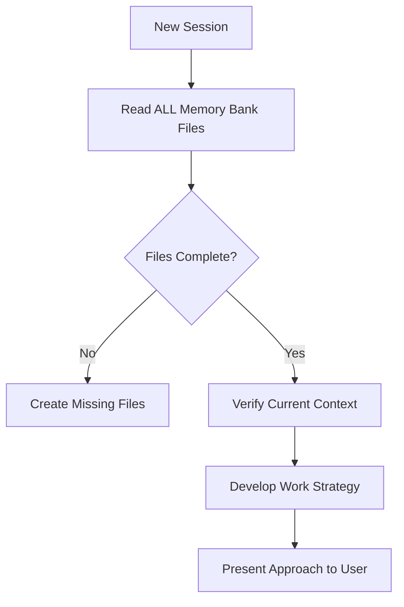
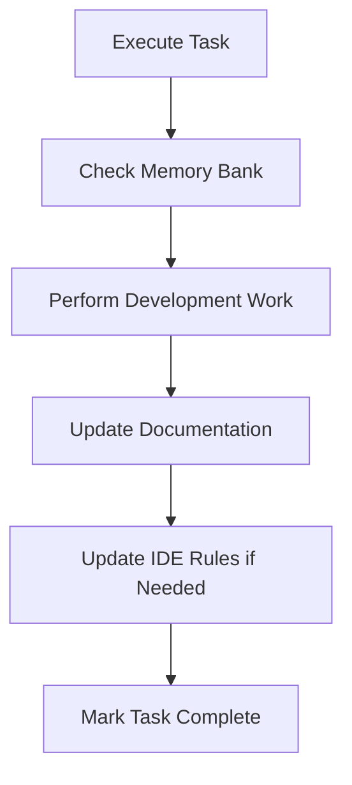

# AI Coding Rules

[](https://opensource.org/license/apache-2-0)
[](https://www.python.org/downloads/)
[](https://taskfile.dev)

> **Universal AI coding rules for consistent, reliable software engineering across LLMs and IDEs**

This repository provides a comprehensive collection of engineering rules designed to work seamlessly with AI coding assistants including Claude, ChatGPT, GitHub Copilot, Cursor, and others. The rules cover everything from Python and SQL best practices to data engineering, analytics, and project governance. Some aspects of the **rules are opinionated**, particularly where it relates to:

- naming conventions
- project structure
- usage of uv and ruff
- usage of Task.
- README.md and CHANGELOG.md

You are **encouraged to review the rules and make adjustments** as desired to better align with your best practices or prefered approaches.

This project was inspired, in part, by: [how-to-add-cline-memory-bank-feature-to-your-cursor](https://forum.cursor.com/t/how-to-add-cline-memory-bank-feature-to-your-cursor/67868) and [cline memory bank](https://docs.cline.bot/prompting/cline-memory-bank)

## Why Smaller, Focused Rules?

This project uses **smaller, topic-focused rules** instead of large monolithic rule files. This architectural decision significantly improves both LLM accuracy and context window efficiency.

### LLM Accuracy and Comprehension

**Focused rules improve AI assistant accuracy** in several ways:

- **Clear Signal-to-Noise Ratio**: When a rule covers only Python FastAPI security (211), the LLM receives targeted, unambiguous guidance without wading through unrelated Flask or Django content.
- **Reduced Conflicting Guidance**: Smaller rules minimize the risk of contradictory advice within the same context. A 200-line FastAPI security rule is far less likely to contain conflicting patterns than a 2,000-line "web frameworks" mega-rule.
- **Precise Activation**: Agent-requested rules mean only relevant guidance loads into context. Working on Snowflake Snowpipe? You get `121-snowflake-snowpipe.md` (1,017 lines) without loading unrelated Cortex AI or SPCS guidance.
- **Better Pattern Matching**: LLMs excel at pattern recognition. Focused rules create clear patterns (e.g., "Snowpipe → auto-ingest → cloud events") that are easier to recall and apply accurately.

**Example**: Compare a 3,000-line "Snowflake Everything" rule with our modular approach:
- **Monolithic**: LLM must sift through warehouse management, Snowpipe, Cortex AI, security, and cost governance simultaneously—increasing the chance of applying warehouse sizing advice to Snowpipe (which uses serverless compute).
- **Modular**: Request `121-snowflake-snowpipe.md` and `119-snowflake-warehouse-management.md` separately. Each rule provides focused, non-conflicting guidance for its specific domain.

### Context Window Efficiency

**Context windows are precious and expensive.** Every token counts, especially with Claude, GPT-4, or Gemini models where you pay per token.

**Smaller rules optimize context usage**:

- **Load Only What's Needed**: A 300-line Pydantic rule (`230-python-pydantic.md`) uses ~600 tokens. A 2,000-line "Python Everything" rule uses ~4,000 tokens but you only need 15% of it.
- **Leave Room for Code**: With a 200k token context window, loading 10 focused rules (3,000 tokens total) leaves 197k tokens for your actual codebase, conversation history, and responses. Loading 3 monolithic rules (12,000 tokens) leaves only 188k tokens—a 4.5% reduction in usable context.
- **Avoid Token Waste**: Why load Bash scripting rules when you're working on Python? Focused rules mean you activate `200-python-core.md` (500 tokens) instead of "All Scripting Languages" (2,000 tokens).
- **Enable Rule Combinations**: Need FastAPI + Pydantic + pytest? Load `210-python-fastapi-core.md` (400 tokens) + `230-python-pydantic.md` (300 tokens) + `206-python-pytest.md` (350 tokens) = 1,050 tokens. A monolithic "Python Web Testing" rule would be 1,500+ tokens even if you only need those three topics.

**Real-world impact**: On a Snowflake data engineering project, you might need:
- `100-snowflake-core.md` (500 tokens) - foundational practices
- `104-snowflake-streams-tasks.md` (400 tokens) - incremental pipelines
- `121-snowflake-snowpipe.md` (2,000 tokens) - continuous ingestion
- `200-python-core.md` (500 tokens) - Python basics

**Total: 3,400 tokens of highly relevant, focused guidance** vs. loading a single 5,000-token "Data Engineering Monolith" that includes Spark, Airflow, and other irrelevant content.

### Practical Development Benefits

Beyond LLM performance, smaller rules provide:

- **Easier Maintenance**: Update Snowpipe best practices in one 1,000-line file instead of searching through a 5,000-line data engineering rule.
- **Better Composability**: Mix and match rules for your tech stack (FastAPI + Snowflake + pytest) without loading irrelevant content.
- **Faster Updates**: When Snowflake releases a new feature, update one focused rule instead of maintaining a massive monolith.
- **Clear Dependencies**: Rule cross-references (e.g., `121-snowflake-snowpipe.md` references `108-snowflake-data-loading.md`) make relationships explicit.
- **Reduced Cognitive Load**: Developers can review and understand a 300-line rule in minutes. A 3,000-line monolith requires hours.

### The Cost of Monolithic Rules

**What happens with large, all-encompassing rules?**

1. **Accuracy Degrades**: More content = more chances for conflicting advice = LLM confusion
2. **Token Waste**: Loading 5,000 tokens when you need 500 = 90% waste = fewer tokens for actual code
3. **Maintenance Nightmare**: Finding and updating specific guidance in 5,000 lines is error-prone
4. **Slow Iteration**: Every update requires reviewing the entire monolith for conflicts

**Our approach**: Keep individual rules under 1,000 lines (target 150-500 lines), use clear cross-references, and let users compose rule sets for their specific needs.


## Quick Start

### Prerequisites

This project assumes that you are using `uv` and `uvx` for python venv management and tooling. The assumption is that you are using Taskfile for task management instead of Makefiles or shell scripts.

- **Python 3.11+** (required: pin to 3.11 for consistency)
- **uv** (recommended: [install uv](https://github.com/astral-sh/uv) for fast dependency management)  
- **Task** (recommended: install via `brew install go-task/tap/go-task` or [other methods](https://taskfile.dev/installation/))

### Installation

```bash
# Clone the repository
git clone https://snow.gitlab-dedicated.com/snowflakecorp/SE/sales-engineering/ai_coding_rules.git
cd ai_coding_rules

# Set up development environment
task deps:dev

# Generate IDE-specific rule files
task rule:cursor    # For Cursor IDE
task rule:copilot   # For GitHub Copilot
task rule:cline     # For Cline AI assistant
```

### Basic Usage

#### Option 1: Direct Rule Usage
Open any `.md` rule file directly in your IDE and follow the directive language (`Critical`, `Mandatory`, `Always`, `Requirement`, `Rule`, `Consider`, `Avoid`).

#### Option 2: Generate IDE-Specific Rules
```bash
# Generate Cursor project rules
task rule:cursor
# Creates .cursor/rules/*.mdc files with automatic *.md → *.mdc reference conversion

# Generate GitHub Copilot instructions  
task rule:copilot
# Creates .github/instructions/*.md files with preserved *.md references

# Generate Cline rules
task rule:cline
# Creates .clinerules/*.md files with plain Markdown (no YAML frontmatter)

# Optional: write outputs to a custom base directory using DEST
task rule:cursor DEST=/path/to/output     # Creates /path/to/output/.cursor/rules/*.mdc
task rule:copilot DEST=../                # Creates ../.github/instructions/*.md
task rule:cline DEST=~/projects/my-app    # Creates ~/projects/my-app/.clinerules/*.md

# Manual generation with options
uv run generate_agent_rules.py --agent cursor --source . --dry-run
uv run generate_agent_rules.py --agent copilot --source . --check
uv run generate_agent_rules.py --agent cline --source . --dry-run

# Generate to custom base directory 
# The --destination parameter specifies a base directory where agent-specific subdirectories are created
uv run generate_agent_rules.py --agent cursor --source . --destination /path/to/output
# Creates: /path/to/output/.cursor/rules/*.mdc

uv run generate_agent_rules.py --agent copilot --source . --destination ../
# Creates: ../.github/instructions/*.md

uv run generate_agent_rules.py --agent cline --source . --destination ~/projects/my-app
# Creates: ~/projects/my-app/.clinerules/*.md
```

#### Option 3: System Prompt Integration
Concatenate selected `.md` files for use with LLM tools like Claude Projects, ChatGPT custom instructions, or other AI coding assistants.

#### Option 4: System-Wide Rule Generation Script (gen-rules)

For convenient rule generation from anywhere on your system, install the production-ready `gen-rules` wrapper script in your `~/bin/` directory. This script automatically runs rule generation tasks from any location, defaulting to generate rules into your current working directory.

**Installation:**

1. Copy the script from the project directory to your `~/bin/` directory:

```bash
# From the ai_coding_rules directory
cp gen-rules ~/bin/gen-rules
chmod +x ~/bin/gen-rules
```

2. Update the default `PROJECT_DIR` in `~/bin/gen-rules` if your installation path differs, or use the `--project` flag or `GEN_RULES_PROJECT_DIR` environment variable
3. Ensure `~/bin` is in your `PATH`

**Features:**

- ✅ **Production-ready** - Comprehensive error handling, validation, and logging
- ✅ **Flexible configuration** - Override project directory via flag or environment variable
- ✅ **Debug support** - Verbose and debug modes for troubleshooting
- ✅ **Robust validation** - Checks dependencies, permissions, and project structure
- ✅ **Help documentation** - Built-in help and version information
- ✅ **Meaningful exit codes** - Distinguishes between error types (0-4)

**Basic Usage:**

```bash
# From ANY directory, generate rules into that directory
cd /path/to/my-project
gen-rules rule:cursor              # Generates to /path/to/my-project/.cursor/rules/
gen-rules rule:copilot             # Generates to /path/to/my-project/.github/instructions/
gen-rules rule:all                 # Generates all formats to /path/to/my-project/

# Override destination if needed
gen-rules rule:cursor DEST=/custom/path

# Run any task from ai_coding_rules project
gen-rules validate                 # Run validation checks
gen-rules status                   # Check project status
gen-rules rule:cursor:dry          # Dry run preview
```

**Advanced Usage:**

```bash
# Show help and all options
gen-rules --help

# Show version
gen-rules --version

# Enable verbose output
gen-rules --verbose rule:all

# Enable debug mode (includes verbose output)
gen-rules --debug rule:cursor

# Override project directory with flag
gen-rules --project ~/my-custom-rules rule:cursor

# Override project directory with environment variable
export GEN_RULES_PROJECT_DIR=~/my-rules
gen-rules rule:copilot

# Combine options
gen-rules --verbose --project ~/my-rules rule:all DEST=/output
```

**Options:**

| Option | Description |
|--------|-------------|
| `-h, --help` | Show help message with full usage documentation |
| `-v, --verbose` | Enable verbose output (shows info-level logs) |
| `-d, --debug` | Enable debug mode (shows all logs including debug) |
| `-V, --version` | Show script version information |
| `-p, --project DIR` | Override project directory location |

**Environment Variables:**

| Variable | Description |
|----------|-------------|
| `GEN_RULES_PROJECT_DIR` | Override default project directory path |
| `DEBUG` | Enable debug mode (set to `true`) |
| `VERBOSE` | Enable verbose mode (set to `true`) |

**Exit Codes:**

| Code | Meaning |
|------|---------|
| 0 | Success |
| 1 | General error |
| 2 | Invalid arguments |
| 3 | Missing dependency (e.g., `task` not installed) |
| 4 | Invalid project directory |

**How It Works:**

- Uses Task's `-d` flag to run tasks from the ai_coding_rules project directory
- Automatically passes `DEST=${PWD}` to default to your current directory
- Validates dependencies (`task` command) before execution
- Checks project directory structure (Taskfile.yml, generate_agent_rules.py)
- Verifies current directory is writable before proceeding
- Provides detailed error messages with suggestions for resolution
- Allows explicit `DEST` override for custom output locations
- No `cd` required—works from anywhere

**Benefits:**

- ✅ Generate rules for any project without navigating to ai_coding_rules directory
- ✅ Automatic current-directory detection (no manual path specification needed)
- ✅ Clean, memorable command (`gen-rules` vs full task path)
- ✅ Access to all Taskfile tasks from anywhere
- ✅ Production-ready with comprehensive error handling
- ✅ Flexible configuration via flags or environment variables
- ✅ Debug and troubleshooting support built-in
- ✅ Follows bash scripting best practices (see `300-bash-scripting-core.md`)

## Rule Categories

### Core Foundation (000-099)
- See the consolidated index: `RULES_INDEX.md`
- **`000-global-core.md`** — Universal operating principles and safety protocols
- **`001-memory-bank.md`** — Universal memory bank for AI context continuity  
- **`002-rule-governance.md`** — Comprehensive rule authoring governance: creation standards, naming conventions, structure requirements, validation workflows, and rule creation template
- **`AGENTS.md`** — Agent operating workflow (PLAN/ACT), setup commands, validation, and development guidelines

#### Universal Rule Authoring Best Practices

The following best practices apply to all AI coding assistants and development environments:

**Structure Standards**
- Use a single `#` H1 title for each rule file
- Keep rules focused and concise (target 150-300 lines, max 500 lines)
- Split large topics into multiple composable rules
- Include clear metadata at the top with description and scope

**Content Guidelines**  
- Use explicit directive language: `Critical`, `Mandatory`, `Always`, `Requirement`, `Rule`, `Consider`, `Avoid`
- Avoid content duplication across rules; reference other files instead
- Include links to current, relevant documentation for validation
- Provide practical examples and usage patterns

**Naming & Organization**
- Use snake-case naming with `.md` extension (e.g., `my_rule_name.md`)
- Place universal rules in the canonical directory structure
- Group related rules by domain/technology (100-199 for Snowflake, 200-299 for Python, etc.)
- Use consistent 3-digit numbering for logical ordering and scalability

**Scope Management**
- Keep rule scope tightly focused on specific domains or technologies
- Prefer on-demand (Agent Requested) pattern over auto-attach for specialized rules
- Only global core rules should auto-attach universally
- Design rules to be composable and reusable across projects

**Validation & Maintenance**
- Test rules with multiple AI models and development environments
- Verify syntax, best practices, and API usage against current documentation
- Regularly update rules to reflect evolving best practices
- Remove outdated content and consolidate overlapping guidance

### Data Platform - Snowflake (100-199)
- **`100-snowflake-core.md`** — Core Snowflake guidelines (SQL, performance, security, DDL object naming conventions)
- **`101-snowflake-streamlit-core.md`** — Streamlit core: setup, navigation, state management, deployment modes (SiS vs SPCS)
- **`101a-snowflake-streamlit-visualization.md`** — Streamlit visualization: Plotly charts, maps, dashboard integration
- **`101b-snowflake-streamlit-performance.md`** — Streamlit performance: caching, optimization, data loading from Snowflake
- **`101c-snowflake-streamlit-security.md`** — Streamlit security: input validation, secrets management, best practices
- **`101d-snowflake-streamlit-testing.md`** — Streamlit testing: AppTest patterns, unit testing, debugging workflows
- **`102-snowflake-sql-best-practices.md`** — Advanced SQL authoring patterns
- **`103-snowflake-performance-tuning.md`** — Query optimization and warehouse tuning
- **`104-snowflake-streams-tasks.md`** — Incremental data pipelines
- **`105-snowflake-cost-governance.md`** — Cost optimization and resource management
- **`106-snowflake-semantic-views.md`** — Semantic models and semantic views (Cortex Analyst)
- **`107-snowflake-security-governance.md`** — Security policies and access control
- **`108-snowflake-data-loading.md`** — Data ingestion best practices
- **`109-snowflake-notebooks.md`** — Jupyter notebook standards
- **`110-snowflake-model-registry.md`** — ML model lifecycle, versioning, and governance
- **`111-snowflake-observability.md`** — Comprehensive telemetry, logging, tracing, and metrics best practices
- **`112-snowflake-snowcli.md`** — Snowflake CLI usage best practices with pinned `uvx` execution
- **`113-snowflake-feature-store.md`** — Feature Store best practices (feature engineering, entity modeling, feature views, ML pipeline integration)
- **`114-snowflake-cortex-aisql.md`** — Cortex AISQL functions (cost, batching, governance, SQL/Snowpark examples)
- **`115-snowflake-cortex-agents.md`** — Cortex Agents (grounding, tools, RBAC, observability)
- **`116-snowflake-cortex-search.md`** — Cortex Search (indexing, metadata filters, hybrid retrieval)
- **`117-snowflake-cortex-analyst.md`** — Cortex Analyst & Semantic Views (modeling, governance, prompts)
- **`118-snowflake-cortex-rest-api.md`** — Cortex REST API (auth, retries, streaming, cost)
- **`119-snowflake-warehouse-management.md`** — Warehouse management best practices (creation, type selection CPU/GPU/High-Memory, sizing, tagging, cost governance)
- **`120-snowflake-spcs.md`** — Snowpark Container Services best practices (containerized applications, compute pools, service management)
- **`121-snowflake-snowpipe.md`** — Snowpipe and Snowpipe Streaming best practices (continuous near-real-time ingestion, auto-ingest, REST API, SDK)
- **`122-snowflake-dynamic-tables.md`** — Dynamic Tables best practices (refresh modes, lag configuration, pipeline design, performance optimization)
- **`123-snowflake-object-tagging.md`** — Object tagging best practices (governance, cost attribution, tag-based masking policies, inheritance, monitoring)
- **`124-snowflake-data-quality.md`** — Data Quality Monitoring best practices (DMFs, data profiling, expectations, scheduling, alerts, cost management)

### Software Engineering - Python (200-299)
- **`200-python-core.md`** — Modern Python engineering with `uv` and Ruff (environment management, code structure, reliability)
- **`201-python-lint-format.md`** — Authoritative linting and formatting with Ruff (code quality and consistency)
- **`202-markup-config-validation.md`** — Markup and configuration file validation (YAML, TOML, environment files, Markdown linting with pymarkdownlnt)
- **`203-python-project-setup.md`** — Python project setup and packaging best practices (avoiding build issues)
- **`204-python-docs-comments.md`** — Python documentation, comments, and docstring standards with Ruff enforcement
- **`205-python-classes.md`** — Python class design and usage best practices (composition, dataclasses, properties, ABCs/Protocols)
- **`206-python-pytest.md`** — pytest testing best practices (fixtures, parametrization, isolation, markers, CI)

#### FastAPI Framework (210-219)
- **`210-python-fastapi-core.md`** — FastAPI core patterns (application structure, async programming, Pydantic validation)
- **`211-python-fastapi-security.md`** — FastAPI security patterns (authentication, authorization, CORS, middleware)
- **`212-python-fastapi-testing.md`** — FastAPI testing strategies (TestClient, pytest-asyncio, comprehensive API testing)
- **`213-python-fastapi-deployment.md`** — FastAPI deployment and documentation (Docker, ASGI servers, OpenAPI customization)
- **`214-python-fastapi-monitoring.md`** — FastAPI monitoring and performance (health checks, logging, caching, observability)

#### CLI Applications (220-229)
- **`220-python-typer-cli.md`** — Typer CLI development (setup, design patterns, testing, async commands, packaging)

#### Data Validation & Testing (230-249)
- **`230-python-pydantic.md`** — Pydantic data validation (models, settings, serialization, FastAPI integration)
- **`240-python-faker.md`** — Faker data generation (providers, localization, testing integration, performance)

#### Web Frameworks (250-259)
- **`250-python-flask.md`** — Flask web framework (application factory pattern, blueprints, security, Jinja2 templates, SQLAlchemy integration)

### Software Engineering - Shell Scripts (300-399)

#### Bash Scripting (300-309)
- **`300-bash-scripting-core.md`** — Foundation bash scripting patterns (script structure, variables, functions, essential error handling)
- **`301-bash-security.md`** — Security best practices (input validation, path security, permissions, credential management)
- **`302-bash-testing-tooling.md`** — Testing frameworks, debugging, ShellCheck integration, and CI/CD workflows

#### Zsh Scripting (310-319)
- **`310-zsh-scripting-core.md`** — Foundation zsh patterns (unique features, advanced arrays, parameter expansion, globbing)
- **`311-zsh-advanced-features.md`** — Advanced zsh capabilities (completion system, hooks, modules, performance optimization)
- **`312-zsh-compatibility.md`** — Cross-shell compatibility (bash migration, portable scripting, mixed environments)

### Software Engineering - Containers (400-499)
- **`400-docker-best-practices.md`** — Docker and Dockerfile best practices (builds, security, supply chain, runtime, Compose)

### Data Science & Analytics (500-599)
- **`500-data-science-analytics.md`** — ML lifecycle, feature engineering, and analytics

### Data Governance (600-699)  
- **`600-data-governance-quality.md`** — Data quality, lineage, and stewardship

### Business Intelligence (700-799)
- **`700-business-analytics.md`** — Business-oriented reporting and visualization

### Project Management (800-899)
- **`800-project-changelog-rules.md`** — Changelog governance using Conventional Commits
- **`801-project-readme-rules.md`** — Professional README.md structure and content standards
- **`805-project-contributing-rules.md`** — Contribution workflow and PR standards
- **`806-git-workflow-management.md`** — Git workflow best practices for GitHub and GitLab with branching strategies and merge workflows
- **`820-taskfile-automation.md`** — Project automation with Taskfile (YAML-safe task orchestration)

### Demo & Synthetic Data (900-999)
- **`900-demo-creation.md`** — Realistic demo application development
- **`901-data-generation-modeling.md`** — Comprehensive data generation and dimensional modeling standards (Kimball methodology, universal naming conventions, business-first view taxonomy, backward compatibility strategies)

### Templates
- **`UNIVERSAL_PROMPT.md`** — Universal response guidelines template

## Directive Language Hierarchy

The rules use a structured directive language with clear priority levels to guide both AI agents and human developers:

### Behavioral Control Directives (By Strictness)

```
├── Critical        [System Safety]      🔴 Must never violate
├── Mandatory       [Non-negotiable]     🟠 Must always follow  
├── Always          [Universal Practice] 🟡 Should be consistent
├── Requirement     [Technical Standard] 🔵 Should implement
├── Rule            [Best Practice]      🟢 Recommended pattern
└── Consider        [Optional]           ⚪ Suggestions & alternatives
```

### Informational Directives

```
├── Error           [Problem Description]  - Troubleshooting guidance
├── Exception       [Special Case]        - Override conditions
├── Forbidden       [Explicit Prohibition] - Explicitly prohibited actions
└── Note            [Additional Info]     - Cross-references and context
```

### Usage Examples

- **Critical:** `Critical: In PLAN mode, you are FORBIDDEN from using ANY file-modifying tools`
- **Mandatory:** `Mandatory: You MUST ask for explicit user confirmation of the TASK LIST`
- **Always:** `Always: Reference the most recent online official documentation`
- **Requirement:** `Requirement: Use fenced code blocks with language tags`
- **Rule:** `Rule: Act as a senior, pragmatic software engineer`
- **Consider:** `Consider: Use tables for structured information`
- **Avoid:** `Avoid: Mixing business logic and UI rendering in a single function`

This hierarchy ensures consistent interpretation across different AI models and provides clear guidance on the relative importance of each directive.

## Rule Generator Architecture

The project includes a sophisticated rule generator (`generate_agent_rules.py`) that transforms universal Markdown rules into IDE-specific formats with intelligent content adaptation:

### Supported Output Formats

| IDE/Tool | Output Format | Location | Features |
|----------|---------------|----------|----------|
| **Cursor** | `.mdc` files | `.cursor/rules/` | YAML frontmatter with globs, auto-apply, automatic `*.md` → `*.mdc` reference conversion |
| **GitHub Copilot** | `.md` files | `.github/instructions/` | YAML frontmatter with appliesTo patterns, preserves original `*.md` references |
| **Cline** | `.md` files | `.clinerules/` | Plain Markdown (no YAML frontmatter), all files automatically processed |

### Reference Conversion Feature

The rule generator automatically converts cross-references for consistency:

**For Cursor Rules (`.mdc` files):**
- `201-python-lint-format.md` → `201-python-lint-format.mdc`
- `@some-rule.md` → `@some-rule.mdc`
- `path/to/file.md` → `path/to/file.mdc`
- **Preserves**: `README.md`, `CHANGELOG.md`, `CONTRIBUTING.md`, and other documentation files

**For Copilot Rules (`.md` files):**
- All references remain unchanged as `*.md`

This ensures that generated Cursor rules reference the correct `.mdc` file format while maintaining compatibility with standard documentation files.

### Metadata Parsing

Rules support embedded metadata in Markdown:

```markdown
**Description:** Brief description of the rule's purpose
**Applies to:** `**/*.py`, `**/*.sql` (file patterns)  
**Auto-attach:** true (automatically apply rule)
**Version:** 2.0
**Last updated:** 2024-01-15
```

## Memory Bank System

The Memory Bank is a project-level documentation system that enables AI assistants to maintain context and continuity across sessions. Since AI assistants reset their memory between sessions, the Memory Bank serves as the critical link for understanding project state, decisions, and ongoing work.

### Overview

The Memory Bank addresses a fundamental challenge in AI-assisted development: **memory reset between sessions**. When an AI assistant starts a new session, it has no knowledge of previous work, decisions, or project context. The Memory Bank solves this by maintaining a structured set of documentation files that capture:

- **Project foundation** — Core requirements, goals, and scope
- **System architecture** — Technical decisions and design patterns  
- **Current context** — Active work, recent changes, and next steps
- **Development progress** — What works, what's left to build, known issues

### File Structure

The Memory Bank uses a hierarchical structure with required core files:

```
memory-bank/
├── projectbrief.md      # Foundation document (project scope & goals)
├── productContext.md    # Why project exists, problems solved
├── systemPatterns.md    # Architecture & technical decisions  
├── techContext.md       # Technologies, setup, constraints
├── activeContext.md     # Current work focus & recent changes
├── progress.md          # Status, what works, known issues
└── [additional]/        # Optional: features, APIs, testing docs
```

#### Core Files (Required)

| File | Purpose |
|------|---------|
| `projectbrief.md` | Foundation document defining core requirements and project scope |
| `productContext.md` | Business context: why project exists, problems solved, user experience goals |
| `systemPatterns.md` | System architecture, key technical decisions, design patterns |
| `techContext.md` | Technologies used, development setup, technical constraints |
| `activeContext.md` | Current work focus, recent changes, next steps, active decisions |
| `progress.md` | Current status, what works, what's left to build, known issues |

### Memory Bank Commands

#### Initialization
For new projects, create the memory bank structure:

```bash
# Create memory bank directory
mkdir memory-bank

# Initialize core files (manual creation)
touch memory-bank/{projectbrief,productContext,systemPatterns,techContext,activeContext,progress}.md
```

The Memory Bank can be automatically created triggered by:

1. **Explicit user request**: `"initialize memory bank"`

#### Update Commands
The Memory Bank updates automatically during development, triggered by:

1. **Explicit user request**: `"update memory bank"`
2. **After significant changes**: Major feature implementations or architectural decisions
3. **Context clarification needs**: When project understanding requires documentation
4. **Pattern discovery**: New technical patterns or workflow insights

### Workflow Integration

#### Plan Mode Workflow


#### Act Mode Workflow  


### Usage Examples

#### Starting a New Session
```bash
# AI assistant workflow (automatic)
1. Read all memory-bank/*.md files
2. Understand current project state  
3. Review activeContext.md for recent work
4. Check progress.md for known issues
5. Proceed with informed context
```

#### Updating Memory Bank
```bash
# User command
"update memory bank"

# AI assistant workflow (automatic)
1. Review ALL memory bank files
2. Update current state in activeContext.md
3. Record progress in progress.md  
4. Document new patterns in systemPatterns.md
5. Update technical context if needed
```

#### Best Practices

- **Always read**: Memory Bank files at session start (non-optional)
- **Update frequently**: After major changes or discoveries
- **Keep current**: Focus on activeContext.md and progress.md
- **Be precise**: Accuracy directly impacts work effectiveness
- **Stay organized**: Use additional files for complex features

## Key Features

- **Universal Compatibility** — Works with Claude 4.x, GPT-4, Gemini, Copilot, Cursor, Cline, and more
- **Claude 4 Optimized** — Native support for XML semantic tags, context awareness, and explicit behavior specifications
- **LLM-Optimized Format** — Token budgets, anti-pattern libraries, and investigation-first protocols minimize hallucinations
- **Structured Directive Language** — Clear hierarchical directive patterns from `Critical` to `Consider`  
- **Modular Architecture** — Mix and match rules by domain/technology with declared dependencies
- **Intelligent Auto-Generation** — Transform universal rules into IDE-specific formats with automatic reference conversion
- **Multi-Session Support** — State tracking patterns for long-horizon reasoning across multiple context windows
- **Data-Focused** — Comprehensive coverage of data engineering and analytics
- **Production-Ready** — Battle-tested patterns for reliability and performance
- **Modern Tooling** — Built for `uv`, Ruff, and contemporary Python development
- **Configuration Safety** — YAML syntax safety and build error prevention

## Contributing

We welcome contributions! See [CONTRIBUTING.md](CONTRIBUTING.md) for detailed guidelines.

### Quick Contribution Steps

1. **Fork** the repository
2. **Create** a feature branch: `git checkout -b feature/my-new-rule`
3. **Follow** the rule authoring guidelines in `002-rule-governance.md` section 9 (Rule Creation Template)
4. **Test** your changes: `task lint` and `task rule:cursor --dry-run`
5. **Submit** a pull request

### Rule Authoring Guidelines

- Use standard Markdown headings (`#`, `##`, `###`) for structure
- Use explicit directive words: `Critical`, `Mandatory`, `Always`, `Requirement`, `Rule`, `Consider`, `Avoid`
- Keep rules focused and under 500 lines
- Include relevant documentation links
- Test with the rule generator before submitting

### Improving Existing Rules

It is not unexpected to run into a scenario where an agent or LLM fails to follow one or more of the rules you are using. In these scenarios, the best approach is to prompt the agent/llm within the same session the following:

```
MODE PLAN:

My rule files should have prevented this behavior or outcome. Thoroughly review all rule files in the project and the currently selected rule files for this session. Determine what specific improvements I can make to the rules to ensure this does not happen again.
```

For this to be affective, you should have a copy of this project repo `ai_coding_rules/` within your project directory, even if only temporarily to make changes to the rule file templates which are used to generate the final IDE-specific rule files. It is also important to verify that `002-rule-governance.md` is an actively selected rule in the project. It should be auto attached, but it never hurts to verify. This will ensure any rule changes will follow best practices and structure laid out for the `ai_coding_rules/` project.

Available LLMs are always evolving and improving in their capabilities. You should periodically ask your LLM of choice to review and make recommendations on rule improvements using the following prompt:

```
MODE PLAN:

Thoroughly review all of the rule files in the project directory. Ensure all of the rules are consistent with 002-rule-governance.md and follow the prescribed rule structure and format. Determine if there are any improvements that can be made to any rule files which will improve rule effectiveness while ensuring good management of context size with an emphasis on reducing duplicate and/or conflicting guidance.
```

Using `MODE PLAN:` is a best practice and directly uses the functionality from `000-global-core.md` to reduce the chances of the agent from making unverify or unconfirmed changes. This ensures that you have an opportunity to review the proposed task list and suggest changes in plan for the changes are implemented. In most scenarios, the agent/llm should move forward with implementing the plan when you type `ACT`.

### Generating New Rules

There will be times when you determine that you need to add a new rule to follow best practices for a specific framework or library, often when you introduce new frameworks or libraries. In these scenarios, the best approach is to prompt the agent/llm with the following:

```
MODE PLAN:

Create a rule for < INSERT FEATURE/FRAMEWORK/LIBRARY> best practices consistent with my rule repository in `ai_coding_rules/`. Determine if a single rule file is the best approach, or if there should be multiple rule files. Use the following documentation as primary points of reference:
@URL1
@URL2
@URL3
```

In my experience, you will get consistently better results when you provide live reference links to documentation and any reference links that specifically cover best practices, syntax, etc. If you let the agent/llm try to determine their own references, you are likely to incorporate innaccruate or dated reference information that results in less than ideal rules being generated.

### Configuration Safety Guidelines

- **YAML Safety**: Avoid Unicode characters (bullets, checkmarks) that cause parsing errors
- **Shell Quoting**: Quote arguments with special characters: `".[dev]"` not `.[dev]`
- **Taskfile Validation**: Always test with `task --list` after YAML changes
- **Python Packaging**: Ensure `__init__.py` files exist before `uv pip install -e .`

## Development Commands

### Environment Setup
```bash
# Python environment with uv (recommended)
task deps:dev              # Install development dependencies
task uv:pin               # Pin Python version and create venv

# Alternative with pip (fallback)
python -m venv .venv
source .venv/bin/activate  # On Windows: .venv\Scripts\activate
pip install -e ".[dev]"
```

### Code Quality & Linting
```bash
# Ruff (primary linter and formatter)
task lint                 # Check code with Ruff
task format              # Check formatting
task lint:fix            # Auto-fix linting issues
task format:fix          # Apply formatting

# Manual commands (if task unavailable)
uvx ruff check .          # Check linting
uvx ruff format --check . # Check formatting
uvx ruff format .         # Apply formatting
```

### Rule Generation & Validation
```bash
# Generate IDE-specific rules
task rule:cursor         # Generate Cursor rules
task rule:copilot        # Generate Copilot rules
task rule:cline          # Generate Cline rules
task rule:all            # Generate all IDE-specific rules

# Optional DEST variable to change base output directory
task rule:all DEST=/custom/output

# Validate rule structure (002-rule-governance.md v2.1 compliance)
task rules:validate         # Standard validation (fails on critical errors)
task rules:validate:verbose # Show all files including clean ones
task rules:validate:strict  # Strict mode (fail on warnings too)

# Direct validation script usage
uv run python validate_agent_rules.py              # Standard validation
uv run python validate_agent_rules.py --verbose    # Verbose output
uv run python validate_agent_rules.py --fail-on-warnings  # Strict mode
uv run python validate_agent_rules.py --help       # Show all options

# Other validations
task --list              # Validate Taskfile syntax
uv run generate_agent_rules.py --source . --dry-run  # Test rule generation
```

### Utilities  
```bash
task clean_venv          # Remove virtual environment
task -l                  # List all available tasks
```

## IDE Integration Examples

### Cursor IDE
```bash
task rule:cursor
# Rules appear in Cursor's AI context automatically
# Configure via .cursor/rules/*.mdc files
```

### GitHub Copilot
```bash  
task rule:copilot
# Add repository instructions to GitHub
# Configure via .github/instructions/*.md files
```

### Cline AI Assistant
```bash
task rule:cline
# Generate rules for Cline AI assistant
# Configure via .clinerules/*.md files
# All Markdown files in .clinerules/ are automatically processed
```

### Claude Projects
Add selected `.md` rule files to your Claude project knowledge base for consistent code generation.

### VS Code Extensions
Use the generated `.md` files with VS Code AI extensions or copy content for custom instructions.

## Compatibility Matrix

| LLM/Tool | Direct Rules | Generated Rules | Status |
|----------|--------------|-----------------|--------|
| **Claude (API/Web)** | Yes Markdown | No Native | Full Support |
| **Gemini (API/Web)** | Yes Markdown | No Native | Full Support |
| **ChatGPT** | Yes Markdown | No Native | Full Support |
| **GitHub Copilot** | No Limited | Yes Instructions | Full Support |
| **Cursor** | Yes Markdown | Yes .mdc Rules | Full Support |
| **Cline** | Yes Markdown | Yes .clinerules | Full Support |

## License

This project is licensed under the Apache 2.0 License - see the [LICENSE](LICENSE) file for details.

## Support

- **Issues**: [GitLab Issues](https://snow.gitlab-dedicated.com/snowflakecorp/SE/sales-engineering/ai_coding_rules.git/issues)  
- **Discussions**: [GitLab Discussions](https://snow.gitlab-dedicated.com/snowflakecorp/SE/sales-engineering/ai_coding_rules.git/discussions)
- **Documentation**: All rules include links to official documentation

---

<p align="center">
  <strong>Built for the AI-powered development era</strong><br>
  Consistent • Reliable • Production-Ready
</p>
