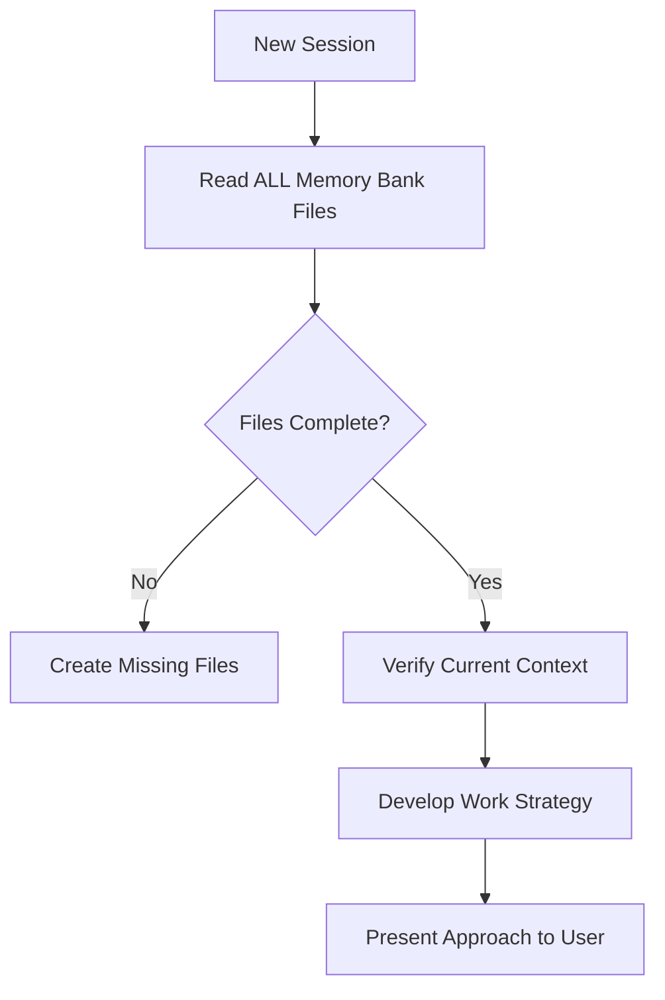
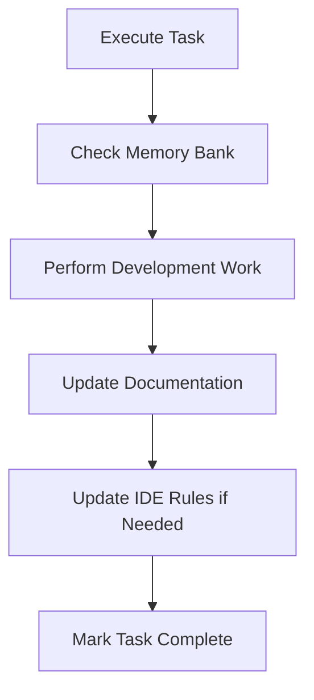

# AI Coding Rules

[](https://opensource.org/license/apache-2-0)
[](https://www.python.org/downloads/)
[](https://taskfile.dev)

> **Universal AI coding rules for consistent, reliable software engineering across LLMs and IDEs**

This repository provides a comprehensive collection of engineering rules designed to work seamlessly with AI coding assistants including Claude, ChatGPT, GitHub Copilot, Cursor, and others. The rules cover everything from Python and SQL best practices to data engineering, analytics, and project governance.

This project was inspired, in part, by: [how-to-add-cline-memory-bank-feature-to-your-cursor](https://forum.cursor.com/t/how-to-add-cline-memory-bank-feature-to-your-cursor/67868) and [cline memory bank](https://docs.cline.bot/prompting/cline-memory-bank)


## Quick Start

### Prerequisites

- **Python 3.11+** (required: pin to 3.11 for consistency)
- **uv** (recommended: [install uv](https://github.com/astral-sh/uv) for fast dependency management)  
- **Task** (recommended: install via `brew install go-task/tap/go-task` or [other methods](https://taskfile.dev/installation/))

### Installation

```bash
# Clone the repository
git clone https://snow.gitlab-dedicated.com/snowflakecorp/SE/sales-engineering/ai_coding_rules.git
cd ai_coding_rules

# Set up development environment
task deps:dev

# Generate IDE-specific rule files
task rule:cursor    # For Cursor IDE
task rule:copilot   # For GitHub Copilot
task rule:cline     # For Cline AI assistant
```

### Basic Usage

#### Option 1: Direct Rule Usage
Open any `.md` rule file directly in your IDE and follow the directive language (`Critical`, `Mandatory`, `Always`, `Requirement`, `Rule`, `Consider`, `Avoid`).

#### Option 2: Generate IDE-Specific Rules
```bash
# Generate Cursor project rules
task rule:cursor
# Creates .cursor/rules/*.mdc files with automatic *.md → *.mdc reference conversion

# Generate GitHub Copilot instructions  
task rule:copilot
# Creates .github/instructions/*.md files with preserved *.md references

# Generate Cline rules
task rule:cline
# Creates .clinerules/*.md files with plain Markdown (no YAML frontmatter)

# Manual generation with options
uv run generate_agent_rules.py --agent cursor --source . --dry-run
uv run generate_agent_rules.py --agent copilot --source . --check
uv run generate_agent_rules.py --agent cline --source . --dry-run

# Generate to custom base directory 
# The --destination parameter specifies a base directory where agent-specific subdirectories are created
uv run generate_agent_rules.py --agent cursor --source . --destination /path/to/output
# Creates: /path/to/output/.cursor/rules/*.mdc

uv run generate_agent_rules.py --agent copilot --source . --destination ../parent
# Creates: ../parent/.github/instructions/*.md

uv run generate_agent_rules.py --agent cline --source . --destination ~/projects/my-app
# Creates: ~/projects/my-app/.clinerules/*.md
```

#### Option 3: System Prompt Integration
Concatenate selected `.md` files for use with LLM tools like Claude Projects, ChatGPT custom instructions, or other AI coding assistants.

## Rule Categories

### Core Foundation (000-099)
- See the consolidated index: `RULES_INDEX.md`
- **`000-global-core.md`** — Universal operating principles and safety protocols
- **`001-cursor-memory-bank.md`** — Project memory management for AI assistants  
- **`002-cursor-rules-governance.md`** — Comprehensive rule authoring governance: creation standards, naming conventions, structure requirements, and validation workflows

#### Universal Rule Authoring Best Practices

The following best practices apply to all AI coding assistants and development environments:

**Structure Standards**
- Use a single `#` H1 title for each rule file
- Keep rules focused and concise (target 150-300 lines, max 500 lines)
- Split large topics into multiple composable rules
- Include clear metadata at the top with description and scope

**Content Guidelines**  
- Use explicit directive language: `Critical`, `Mandatory`, `Always`, `Requirement`, `Rule`, `Consider`, `Avoid`
- Avoid content duplication across rules; reference other files instead
- Include links to current, relevant documentation for validation
- Provide practical examples and usage patterns

**Naming & Organization**
- Use snake-case naming with `.md` extension (e.g., `my_rule_name.md`)
- Place universal rules in the canonical directory structure
- Group related rules by domain/technology (100-199 for Snowflake, 200-299 for Python, etc.)
- Use consistent 3-digit numbering for logical ordering and scalability

**Scope Management**
- Keep rule scope tightly focused on specific domains or technologies
- Prefer on-demand (Agent Requested) pattern over auto-attach for specialized rules
- Only global core rules should auto-attach universally
- Design rules to be composable and reusable across projects

**Validation & Maintenance**
- Test rules with multiple AI models and development environments
- Verify syntax, best practices, and API usage against current documentation
- Regularly update rules to reflect evolving best practices
- Remove outdated content and consolidate overlapping guidance

### Data Platform - Snowflake (100-199)
- **`100-snowflake-core.md`** — Core Snowflake guidelines (SQL, performance, security)
- **`101-snowflake-streamlit-ui.md`** — Modern Streamlit application development
- **`102-snowflake-sql-best-practices.md`** — Advanced SQL authoring patterns
- **`103-snowflake-performance-tuning.md`** — Query optimization and warehouse tuning
- **`104-snowflake-streams-tasks.md`** — Incremental data pipelines
- **`105-snowflake-cost-governance.md`** — Cost optimization and resource management
- **`106-snowflake-semantic-views.md`** — Layered data modeling architecture
- **`107-snowflake-security-governance.md`** — Security policies and access control
- **`108-snowflake-data-loading.md`** — Data ingestion best practices
- **`109-snowflake-notebooks.md`** — Jupyter notebook standards
- **`110-snowflake-model-registry.md`** — ML model lifecycle, versioning, and governance
- **`111-snowflake-observability.md`** — Comprehensive telemetry, logging, tracing, and metrics best practices
- **`120-snowflake-spcs.md`** — Snowpark Container Services best practices (containerized applications, compute pools, service management)

### Software Engineering - Python (200-299)
- **`200-python-core.md`** — Modern Python engineering with `uv` and Ruff (environment management, code structure, reliability)
- **`201-python-lint-format.md`** — Authoritative linting and formatting with Ruff (code quality and consistency)
- **`202-yaml-config-best-practices.md`** — YAML and configuration file syntax safety (preventing parsing errors)
- **`203-python-project-setup.md`** — Python project setup and packaging best practices (avoiding build issues)

#### FastAPI Framework (210-219)
- **`210-python-fastapi-core.md`** — FastAPI core patterns (application structure, async programming, Pydantic validation)
- **`211-python-fastapi-security.md`** — FastAPI security patterns (authentication, authorization, CORS, middleware)
- **`212-python-fastapi-testing.md`** — FastAPI testing strategies (TestClient, pytest-asyncio, comprehensive API testing)
- **`213-python-fastapi-deployment.md`** — FastAPI deployment and documentation (Docker, ASGI servers, OpenAPI customization)
- **`214-python-fastapi-monitoring.md`** — FastAPI monitoring and performance (health checks, logging, caching, observability)

#### CLI Applications (220-229)
- **`220-python-typer-cli.md`** — Typer CLI development (setup, design patterns, testing, async commands, packaging)

#### Data Validation & Testing (230-249)
- **`230-python-pydantic.md`** — Pydantic data validation (models, settings, serialization, FastAPI integration)
- **`240-python-faker.md`** — Faker data generation (providers, localization, testing integration, performance)

#### Web Frameworks (250-259)
- **`250-python-flask.md`** — Flask web framework (application factory pattern, blueprints, security, Jinja2 templates, SQLAlchemy integration)

### Software Engineering - Shell Scripts (300-399)

#### Bash Scripting (300-309)
- **`300-bash-scripting-core.md`** — Foundation bash scripting patterns (script structure, variables, functions, essential error handling)
- **`301-bash-security.md`** — Security best practices (input validation, path security, permissions, credential management)
- **`302-bash-testing-tooling.md`** — Testing frameworks, debugging, ShellCheck integration, and CI/CD workflows

#### Zsh Scripting (310-319)
- **`310-zsh-scripting-core.md`** — Foundation zsh patterns (unique features, advanced arrays, parameter expansion, globbing)
- **`311-zsh-advanced-features.md`** — Advanced zsh capabilities (completion system, hooks, modules, performance optimization)
- **`312-zsh-compatibility.md`** — Cross-shell compatibility (bash migration, portable scripting, mixed environments)

### Data Science & Analytics (500-599)
- **`500-data-science-analytics.md`** — ML lifecycle, feature engineering, and analytics

### Data Governance (600-699)  
- **`600-data-governance-quality.md`** — Data quality, lineage, and stewardship

### Business Intelligence (700-799)
- **`700-business-analytics.md`** — Business-oriented reporting and visualization

### Project Management (800-899)
- **`800-project-changelog-rules.md`** — Changelog governance using Conventional Commits
- **`801-project-readme-rules.md`** — Professional README.md structure and content standards
- **`805-project-contributing-rules.md`** — Contribution workflow and PR standards
- **`820-taskfile-automation.md`** — Project automation with Taskfile (YAML-safe task orchestration)

### Demo & Synthetic Data (900-999)
- **`900-demo-creation.md`** — Realistic demo application development

### Templates
- **`universal_prompt.md`** — Universal response guidelines template

## Directive Language Hierarchy

The rules use a structured directive language with clear priority levels to guide both AI agents and human developers:

### Behavioral Control Directives (By Strictness)

```
├── Critical        [System Safety]      🔴 Must never violate
├── Mandatory       [Non-negotiable]     🟠 Must always follow  
├── Always          [Universal Practice] 🟡 Should be consistent
├── Requirement     [Technical Standard] 🔵 Should implement
├── Rule            [Best Practice]      🟢 Recommended pattern
└── Consider        [Optional]           ⚪ Suggestions & alternatives
```

### Informational Directives

```
├── Error           [Problem Description]  - Troubleshooting guidance
├── Exception       [Special Case]        - Override conditions
├── Forbidden       [Explicit Prohibition] - Explicitly prohibited actions
└── Note            [Additional Info]     - Cross-references and context
```

### Usage Examples

- **Critical:** `Critical: In PLAN mode, you are FORBIDDEN from using ANY file-modifying tools`
- **Mandatory:** `Mandatory: You MUST ask for explicit user confirmation of the TASK LIST`
- **Always:** `Always: Reference the most recent online official documentation`
- **Requirement:** `Requirement: Use fenced code blocks with language tags`
- **Rule:** `Rule: Act as a senior, pragmatic software engineer`
- **Consider:** `Consider: Use tables for structured information`
- **Avoid:** `Avoid: Mixing business logic and UI rendering in a single function`

This hierarchy ensures consistent interpretation across different AI models and provides clear guidance on the relative importance of each directive.

## Rule Generator Architecture

The project includes a sophisticated rule generator (`generate_agent_rules.py`) that transforms universal Markdown rules into IDE-specific formats with intelligent content adaptation:

### Supported Output Formats

| IDE/Tool | Output Format | Location | Features |
|----------|---------------|----------|----------|
| **Cursor** | `.mdc` files | `.cursor/rules/` | YAML frontmatter with globs, auto-apply, automatic `*.md` → `*.mdc` reference conversion |
| **GitHub Copilot** | `.md` files | `.github/instructions/` | YAML frontmatter with appliesTo patterns, preserves original `*.md` references |
| **Cline** | `.md` files | `.clinerules/` | Plain Markdown (no YAML frontmatter), all files automatically processed |

### Reference Conversion Feature

The rule generator automatically converts cross-references for consistency:

**For Cursor Rules (`.mdc` files):**
- `201-python-lint-format.md` → `201-python-lint-format.mdc`
- `@some-rule.md` → `@some-rule.mdc`
- `path/to/file.md` → `path/to/file.mdc`
- **Preserves**: `README.md`, `CHANGELOG.md`, `CONTRIBUTING.md`, and other documentation files

**For Copilot Rules (`.md` files):**
- All references remain unchanged as `*.md`

This ensures that generated Cursor rules reference the correct `.mdc` file format while maintaining compatibility with standard documentation files.

### Metadata Parsing

Rules support embedded metadata in Markdown:

```markdown
**Description:** Brief description of the rule's purpose
**Applies to:** `**/*.py`, `**/*.sql` (file patterns)  
**Auto-attach:** true (automatically apply rule)
**Version:** 2.0
**Last updated:** 2024-01-15
```

## Memory Bank System

The Memory Bank is a project-level documentation system that enables AI assistants to maintain context and continuity across sessions. Since AI assistants reset their memory between sessions, the Memory Bank serves as the critical link for understanding project state, decisions, and ongoing work.

### Overview

The Memory Bank addresses a fundamental challenge in AI-assisted development: **memory reset between sessions**. When an AI assistant starts a new session, it has no knowledge of previous work, decisions, or project context. The Memory Bank solves this by maintaining a structured set of documentation files that capture:

- **Project foundation** — Core requirements, goals, and scope
- **System architecture** — Technical decisions and design patterns  
- **Current context** — Active work, recent changes, and next steps
- **Development progress** — What works, what's left to build, known issues

### File Structure

The Memory Bank uses a hierarchical structure with required core files:

```
memory-bank/
├── projectbrief.md      # Foundation document (project scope & goals)
├── productContext.md    # Why project exists, problems solved
├── systemPatterns.md    # Architecture & technical decisions  
├── techContext.md       # Technologies, setup, constraints
├── activeContext.md     # Current work focus & recent changes
├── progress.md          # Status, what works, known issues
└── [additional]/        # Optional: features, APIs, testing docs
```

#### Core Files (Required)

| File | Purpose |
|------|---------|
| `projectbrief.md` | Foundation document defining core requirements and project scope |
| `productContext.md` | Business context: why project exists, problems solved, user experience goals |
| `systemPatterns.md` | System architecture, key technical decisions, design patterns |
| `techContext.md` | Technologies used, development setup, technical constraints |
| `activeContext.md` | Current work focus, recent changes, next steps, active decisions |
| `progress.md` | Current status, what works, what's left to build, known issues |

### Memory Bank Commands

#### Initialization
For new projects, create the memory bank structure:

```bash
# Create memory bank directory
mkdir memory-bank

# Initialize core files (manual creation)
touch memory-bank/{projectbrief,productContext,systemPatterns,techContext,activeContext,progress}.md
```

The Memory Bank can be automatically created triggered by:

1. **Explicit user request**: `"initialize memory bank"`

#### Update Commands
The Memory Bank updates automatically during development, triggered by:

1. **Explicit user request**: `"update memory bank"`
2. **After significant changes**: Major feature implementations or architectural decisions
3. **Context clarification needs**: When project understanding requires documentation
4. **Pattern discovery**: New technical patterns or workflow insights

### Workflow Integration

#### Plan Mode Workflow


#### Act Mode Workflow  


### Usage Examples

#### Starting a New Session
```bash
# AI assistant workflow (automatic)
1. Read all memory-bank/*.md files
2. Understand current project state  
3. Review activeContext.md for recent work
4. Check progress.md for known issues
5. Proceed with informed context
```

#### Updating Memory Bank
```bash
# User command
"update memory bank"

# AI assistant workflow (automatic)
1. Review ALL memory bank files
2. Update current state in activeContext.md
3. Record progress in progress.md  
4. Document new patterns in systemPatterns.md
5. Update technical context if needed
```

#### Best Practices

- **Always read**: Memory Bank files at session start (non-optional)
- **Update frequently**: After major changes or discoveries
- **Keep current**: Focus on activeContext.md and progress.md
- **Be precise**: Accuracy directly impacts work effectiveness
- **Stay organized**: Use additional files for complex features

## Key Features

- **Universal Compatibility** — Works with Claude, ChatGPT, Copilot, Cursor, and more
- **Structured Directive Language** — Clear hierarchical directive patterns from `Critical` to `Consider`  
- **Modular Architecture** — Mix and match rules by domain/technology
- **Intelligent Auto-Generation** — Transform universal rules into IDE-specific formats with automatic reference conversion
- **Data-Focused** — Comprehensive coverage of data engineering and analytics
- **Production-Ready** — Battle-tested patterns for reliability and performance
- **Modern Tooling** — Built for `uv`, Ruff, and contemporary Python development
- **Configuration Safety** — YAML syntax safety and build error prevention

## Contributing

We welcome contributions! See [CONTRIBUTING.md](CONTRIBUTING.md) for detailed guidelines.

### Quick Contribution Steps

1. **Fork** the repository
2. **Create** a feature branch: `git checkout -b feature/my-new-rule`
3. **Follow** the rule authoring guidelines in `002-cursor-rules-governance.md`
4. **Test** your changes: `task lint` and `task rule:cursor --dry-run`
5. **Submit** a pull request

### Rule Authoring Guidelines

- Use standard Markdown headings (`#`, `##`, `###`) for structure
- Use explicit directive words: `Critical`, `Mandatory`, `Always`, `Requirement`, `Rule`, `Consider`, `Avoid`
- Keep rules focused and under 500 lines
- Include relevant documentation links
- Test with the rule generator before submitting

### Configuration Safety Guidelines

- **YAML Safety**: Avoid Unicode characters (bullets, checkmarks) that cause parsing errors
- **Shell Quoting**: Quote arguments with special characters: `".[dev]"` not `.[dev]`
- **Taskfile Validation**: Always test with `task --list` after YAML changes
- **Python Packaging**: Ensure `__init__.py` files exist before `uv pip install -e .`

## Development Commands

### Environment Setup
```bash
# Python environment with uv (recommended)
task deps:dev              # Install development dependencies
task uv:pin               # Pin Python version and create venv

# Alternative with pip (fallback)
python -m venv .venv
source .venv/bin/activate  # On Windows: .venv\Scripts\activate
pip install -e ".[dev]"
```

### Code Quality & Linting
```bash
# Ruff (primary linter and formatter)
task lint                 # Check code with Ruff
task format              # Check formatting
task lint:fix            # Auto-fix linting issues
task format:fix          # Apply formatting

# Manual commands (if task unavailable)
uvx ruff check .          # Check linting
uvx ruff format --check . # Check formatting
uvx ruff format .         # Apply formatting
```

### Rule Generation & Validation
```bash
# Generate IDE-specific rules
task rule:cursor         # Generate Cursor rules
task rule:copilot        # Generate Copilot rules
task rule:cline          # Generate Cline rules

# Validate configurations
task --list              # Validate Taskfile syntax
uv run generate_agent_rules.py --source . --dry-run  # Test rule generation
task rules:validate-structure  # Ensure all rules contain required sections
```

### Utilities  
```bash
task clean_venv          # Remove virtual environment
task -l                  # List all available tasks
```

## IDE Integration Examples

### Cursor IDE
```bash
task rule:cursor
# Rules appear in Cursor's AI context automatically
# Configure via .cursor/rules/*.mdc files
```

### GitHub Copilot
```bash  
task rule:copilot
# Add repository instructions to GitHub
# Configure via .github/instructions/*.md files
```

### Cline AI Assistant
```bash
task rule:cline
# Generate rules for Cline AI assistant
# Configure via .clinerules/*.md files
# All Markdown files in .clinerules/ are automatically processed
```

### Claude Projects
Add selected `.md` rule files to your Claude project knowledge base for consistent code generation.

### VS Code Extensions
Use the generated `.md` files with VS Code AI extensions or copy content for custom instructions.

## Compatibility Matrix

| LLM/Tool | Direct Rules | Generated Rules | Status |
|----------|--------------|-----------------|--------|
| **Claude (API/Web)** | Yes Markdown | No Native | Full Support |
| **Gemini (API/Web)** | Yes Markdown | No Native | Full Support |
| **ChatGPT** | Yes Markdown | No Native | Full Support |
| **GitHub Copilot** | No Limited | Yes Instructions | Full Support |
| **Cursor** | Yes Markdown | Yes .mdc Rules | Full Support |
| **Cline** | Yes Markdown | Yes .clinerules | Full Support |

## License

This project is licensed under the Apache 2.0 License - see the [LICENSE](LICENSE) file for details.

## Support

- **Issues**: [GitLab Issues](https://snow.gitlab-dedicated.com/snowflakecorp/SE/sales-engineering/ai_coding_rules.git/issues)  
- **Discussions**: [GitLab Discussions](https://snow.gitlab-dedicated.com/snowflakecorp/SE/sales-engineering/ai_coding_rules.git/discussions)
- **Documentation**: All rules include links to official documentation

## Roadmap

- [x] **FastAPI Framework Support** — Comprehensive FastAPI patterns (Completed)
- [x] **3-Digit Numbering System** — Scalable rule organization with conflict resolution (Completed)
- [ ] **Multi-language Support** — Rules for Go, JavaScript/TypeScript, Rust
- [ ] **Cloud Platform Rules** — AWS, Azure, GCP best practices  
- [ ] **Framework-Specific Rules** — Django, React, Vue patterns
- [ ] **IDE Plugin Development** — Native integrations beyond file generation
- [ ] **Community Rule Registry** — User-contributed specialized rules

---

<p align="center">
  <strong>Built for the AI-powered development era</strong><br>
  Consistent • Reliable • Production-Ready
</p>
