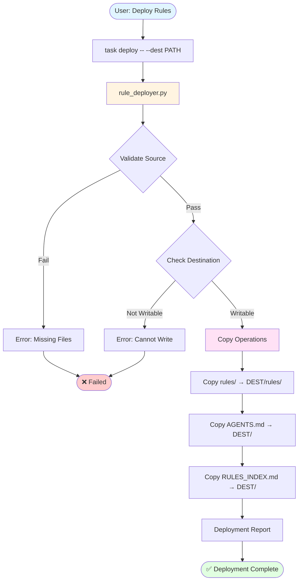

# Architecture: AI Coding Rules (v3.0)

## Table of Contents

- [System Overview](#system-overview)
- [Production-Ready Rules System](#production-ready-rules-system)
- [Directory Structure](#directory-structure)
- [Rule Creation Workflow](#rule-creation-workflow)
- [Schema Validation System](#schema-validation-system)
- [Deployment System](#deployment-system)
- [Testing Infrastructure](#testing-infrastructure)
- [Scripts Reference](#scripts-reference)
- [Architecture Diagrams](#architecture-diagrams)
- [Design Decisions](#design-decisions)
- [Extension Points](#extension-points)
- [Migration from v2.x](#migration-from-v2x)

## System Overview

The AI Coding Rules v3.0 architecture represents a fundamental shift from template-based generation (v2.x) to a **production-ready rules system**. This architecture prioritizes simplicity, maintainability, and universal compatibility across all AI assistants and IDEs.

### Core Architecture Principles

1. **Production-Ready by Default** — All 100 rule files in `rules/` are directly editable and deployment-ready
2. **No Generation Step** — Rules are maintained in their final form, eliminating build complexity
3. **Universal Format** — Standard Markdown with embedded metadata works with any AI assistant or IDE
4. **Schema-Validated** — Declarative YAML schema ensures consistency and quality
5. **Agent-Agnostic Deployment** — Single `--dest` flag deploys to any project structure

### What Changed in v3.0

| Aspect | v2.x (Template-Based) | v3.0 (Production-Ready) |
|--------|----------------------|-------------------------|
| **Source Location** | `templates/` directory | `rules/` directory |
| **File State** | Templates requiring generation | Production-ready files |
| **Workflow** | Edit → Generate → Deploy | Edit → Deploy |
| **Formats** | 4 formats (Cursor .mdc, Copilot, Cline, Universal) | 1 universal format (.md) |
| **Discovery Files** | `discovery/` directory | Project root (AGENTS.md, RULES_INDEX.md) |
| **Deployment** | Agent-specific paths | Agent-agnostic `--dest` flag |
| **Complexity** | ~2800 lines across 3 scripts | ~2762 lines across 5 focused scripts |

### Architecture Benefits

**For Users:**
- Clone and use immediately (no build step)
- Direct editing of production rules
- Simplified deployment (one command)
- Works with any AI assistant or IDE

**For Contributors:**
- Clear file ownership (edit `rules/` only)
- Automated validation catches errors
- Test suite ensures script reliability
- Single source of truth (no template/generated divergence)

**For Maintainers:**
- Reduced complexity (no generation engine)
- Schema-driven validation (declarative)
- Comprehensive test coverage (100+ tests)

## Production-Ready Rules System

### Philosophy

v3.0 eliminates the template-generation-deployment pipeline in favor of **direct rule editing**. Rules are stored in their final, deployable form with embedded metadata that enables intelligent discovery and loading.

### Rule File Format

Every rule file follows this structure:

```markdown
# Rule Title

## Metadata

**SchemaVersion:** v3.0
**Keywords:** keyword1, keyword2, keyword3, ... (10-15 total)
**TokenBudget:** ~1200
**ContextTier:** Critical|High|Medium|Low
**Depends:** rules/000-global-core.md, rules/XXX-dependency.md

## Purpose
[1-2 sentence description]

## Rule Scope
[Single line scope statement]

## Quick Start TL;DR
[30-second overview with Essential Patterns and Pre-Execution Checklist]

## Contract
<inputs_prereqs>...</inputs_prereqs>
<mandatory>...</mandatory>
<forbidden>...</forbidden>
<steps>...</steps>
<output_format>...</output_format>
<validation>...</validation>

## Key Principles
[Core concepts - optional for simple rules]

## Anti-Patterns and Common Mistakes
[Problem/Correct Pattern pairs - strongly recommended]

## Post-Execution Checklist
[5+ verification items]

## Validation
[Success checks and negative tests]

## Output Format Examples
[Concrete code/command examples]

## References
[Related rules and external documentation]
```

### Metadata Fields

| Field | Purpose | Format | Example |
|-------|---------|--------|---------|
| **Keywords** | Semantic discovery by AI agents | 10-15 comma-separated terms | `python, testing, pytest, fixtures, coverage` |
| **TokenBudget** | LLM context management | `~NUMBER` (approximate tokens) | `~1200` |
| **ContextTier** | Loading prioritization | Critical \| High \| Medium \| Low | `High` |
| **Depends** | Prerequisite rules | Comma-separated rule paths | `rules/000-global-core.md, rules/200-python-core.md` |

**Why These Fields Matter:**

- **Keywords** enable AI assistants to automatically discover relevant rules based on task descriptions
- **TokenBudget** helps LLMs manage attention budget and decide which rules to load
- **ContextTier** provides prioritization when context windows are constrained
- **Depends** ensures prerequisite rules are loaded first (dependency chain)

### Rule Numbering System

Rules use 3-digit prefixes for logical organization:

| Range | Domain | Example Rules |
|-------|--------|---------------|
| **000-099** | Core/Foundational | 000-global-core, 002-rule-governance |
| **100-199** | Snowflake Ecosystem | 100-snowflake-core, 101-snowflake-streamlit-core |
| **200-299** | Python Ecosystem | 200-python-core, 201-python-lint-format, 221-python-htmx-core, 221b-python-htmx-flask, 221c-python-htmx-fastapi |
| **300-399** | Shell/Bash Scripting | 300-bash-scripting-core, 310-zsh-scripting-core |
| **400-499** | Frontend/Containers | 350-docker-best-practices, 420-javascript-core, 430-typescript-core, 440-react-core, 441-react-backend |
| **500-599** | Frontend | 500-frontend-htmx-core |
| **600-699** | Systems/Backend Languages | 600-golang-core (Go project structure, error handling, interfaces, testing, concurrency) |
| **800-899** | Project Management | 800-project-changelog, 801-project-readme |
| **900-999** | Demo/Examples | 900-demo-creation, 901-data-generation-modeling, 920-data-science-analytics, 930-data-governance-quality, 940-business-analytics |

**Split Rules Pattern:** Rules may use letter suffixes (e.g., 101a, 101b, 101c) for subtopic specialization, improving token efficiency by allowing focused loading.

### HTMX Rules Architecture (v3.1.0)

Starting in v3.1.0, the project includes comprehensive HTMX support for building hypermedia-driven web applications. The HTMX rules follow a layered architecture:

**Architecture Layers:**

1. **Core Foundation (220)** — Request/response lifecycle, HTTP headers, security patterns (CSRF, XSS), HATEOAS principles
2. **Templates (221)** — Jinja2 organization patterns, partials, fragments, conditional rendering
3. **Framework Integration (222-223)** — Flask-HTMX extension and FastAPI async patterns with dependency injection
4. **Testing (224)** — Pytest fixtures, header assertions, HTML validation, mocking strategies  
5. **Patterns (225)** — Common implementation patterns (CRUD, forms, infinite scroll, search, real-time, modals)
6. **Frontend Integration (226, 500)** — Alpine.js, _hyperscript, CSS frameworks, pure HTMX frontend reference

**Design Decisions:**

- **Consistent Naming:** All HTMX rules follow `python-htmx-*.md` pattern for easy discovery
- **Framework Parity:** Separate rules for Flask (222) and FastAPI (223) to cover both ecosystems equally
- **Security First:** Core rule (220) includes CSRF and XSS protection as foundational concepts
- **Testing Emphasis:** Dedicated testing rule (224) ensures testability is a first-class concern
- **Progressive Enhancement:** Rules emphasize graceful degradation and accessibility throughout

**Dependency Chain:**

```
000-global-core.md (foundation)
  └── 200-python-core.md (Python basics)
      └── 221-python-htmx-core.md (HTMX foundation)
          ├── 221a-python-htmx-templates.md (template patterns)
          ├── 221b-python-htmx-flask.md (Flask integration)
          ├── 221c-python-htmx-fastapi.md (FastAPI integration)
          ├── 221d-python-htmx-testing.md (testing strategies)
          ├── 221e-python-htmx-patterns.md (common patterns)
          └── 221f-python-htmx-integrations.md (frontend libraries)

500-frontend-htmx-core.md (standalone frontend reference)
```

**Token Budget Management:**

Total HTMX token budget: ~9500 tokens across 8 rules
- Core (220): ~1500 tokens — Largest due to security, headers, and HATEOAS coverage
- Templates (221): ~1200 tokens — Template organization patterns
- Flask (222): ~1000 tokens — Framework-specific patterns
- FastAPI (223): ~1000 tokens — Async patterns
- Testing (224): ~1200 tokens — Comprehensive testing strategies
- Patterns (225): ~1800 tokens — Largest due to multiple pattern examples (CRUD, forms, search, etc.)
- Integrations (226): ~800 tokens — Lightest, focused on library integration points
- Frontend (500): ~1000 tokens — Pure HTMX reference without backend concerns

### Go/Golang Rules Architecture

Starting in v3.2.0, the project includes Go/Golang support establishing the 600s range for systems/backend languages.

**Architecture:**

The 600s range is reserved for systems and backend programming languages, with Go as the first entry:

1. **Core Foundation (600)** — Project structure, naming conventions, error handling, interfaces, testing patterns, concurrency fundamentals

**Future Rules (Reserved Numbers):**
- 601-golang-testing.md — Advanced testing patterns, benchmarks, fuzzing
- 602-golang-web-frameworks.md — Gin, Echo, Fiber, Chi integration
- 603-golang-cli.md — Cobra, urfave/cli patterns
- 605-golang-concurrency.md — Advanced goroutine patterns, channels, sync primitives
- 610-golang-project-structure.md — Detailed project layouts, monorepo patterns

**Design Decisions:**

- **New Domain Range:** 600s established for systems/backend languages (distinct from Python 200s and frontend 400s)
- **Industry Standards:** Rule follows Effective Go, Go Code Review Comments, and Uber Go Style Guide
- **Tooling Focus:** Emphasizes `go fmt`, `go vet`, `golangci-lint`, and `go test -race`
- **Error Handling:** Comprehensive coverage of `fmt.Errorf`, `%w` wrapping, `errors.Is`/`errors.As`

**Dependency Chain:**

```
000-global-core.md (foundation)
  └── 600-golang-core.md (Go foundation)
      ├── 601-golang-testing.md (future)
      ├── 602-golang-web-frameworks.md (future)
      └── 603-golang-cli.md (future)
```

**Token Budget:**
- Core (600): ~3500 tokens — Comprehensive coverage of Go fundamentals

## Directory Structure

```
ai_coding_rules/
├── rules/                      # 100 production-ready rule files
│   ├── 000-global-core.md      # Foundation (ContextTier: Critical)
│   ├── 001-memory-bank.md      # Context management
│   ├── 002-rule-governance.md  # v3.0 schema standards
│   ├── 100-snowflake-core.md   # Domain cores
│   ├── 200-python-core.md
│   ├── 221-python-htmx-core.md # HTMX foundation
│   ├── 221a-python-htmx-templates.md
│   ├── 221b-python-htmx-flask.md
│   ├── 221c-python-htmx-fastapi.md
│   ├── 221d-python-htmx-testing.md
│   ├── 221e-python-htmx-patterns.md
│   ├── 221f-python-htmx-integrations.md
│   ├── 500-frontend-htmx-core.md
│   ├── 600-golang-core.md      # Go/Golang foundation
│   └── ... (100 total)
│
├── scripts/                    # Automation and validation (~3600 lines)
│   ├── template_generator.py  # Creates new rule templates (500 lines)
│   ├── rule_deployer.py        # Deploys rules to projects (400 lines)
│   ├── schema_validator.py     # Schema validation (600 lines)
│   ├── token_validator.py      # Token budget validation (300 lines)
│   ├── keyword_generator.py    # Keyword extraction using TF-IDF (850 lines)
│   └── index_generator.py      # Generates RULES_INDEX.md (400 lines)
│
├── schemas/                    # Validation schemas
│   ├── rule-schema-v3.yml      # v3.0 schema definition (556 lines)
│   └── README.md               # Schema documentation
│
├── tests/                      # Test suite (100+ passing tests)
│   ├── test_template_generator.py
│   ├── test_rule_deployer.py
│   ├── test_schema_validator.py
│   ├── test_token_validator.py
│   └── test_index_generator.py
│
├── prompts/                    # Example user prompts
│   ├── EXAMPLE_PROMPT_01.md    # Linting task example
│   ├── EXAMPLE_PROMPT_02.md    # Performance optimization example
│   ├── EXAMPLE_PROMPT_03.md    # Simple task example
│   └── README.md               # Prompt writing guide
│
├── docs/                       # Project documentation
│   ├── ARCHITECTURE.md         # This file
│   └── MEMORY_BANK.md          # Memory Bank system guide
│
├── AGENTS.md                   # AI assistant discovery guide (project root)
├── RULES_INDEX.md              # Searchable rule catalog (project root)
├── CHANGELOG.md                # Version history (Keep a Changelog v1.1.0)
├── CONTRIBUTING.md             # Contribution guidelines
├── README.md                   # Project overview and quick start
├── Taskfile.yml                # Task automation (Task v3)
└── pyproject.toml              # Python dependencies (uv-based)
```

### Key Directory Roles

**`rules/`** — Single source of truth for all rules
- Production-ready files
- Directly editable
- No generation required
- 100 rules covering all domains (including 8 HTMX rules and Go/Golang core)

**`scripts/`** — Automation and validation tools
- `template_generator.py` creates new rules compliant with v3.0 schema
- `rule_deployer.py` copies rules to target projects
- `schema_validator.py` validates rules against schema
- `token_validator.py` checks token budget accuracy
- `keyword_generator.py` extracts semantic keywords using TF-IDF analysis
- `index_generator.py` generates RULES_INDEX.md catalog

**`schemas/`** — Declarative validation
- `rule-schema-v3.yml` defines all requirements
- Used by schema_validator.py
- Single source of truth for validation logic

**`prompts/`** — User guidance
- Example prompts showing best practices
- Demonstrates keyword triggers
- Helps users write effective task descriptions

## Rule Creation Workflow

### Creating a New Rule

**Step 1: Generate Template**

```bash
# Basic usage (generates in rules/ directory)
task rule:new FILENAME=300-example-rule

# With custom context tier
task rule:new FILENAME=300-example-rule TIER=High

# With custom keywords (10-15 required)
task rule:new FILENAME=300-example-rule KEYWORDS="keyword1, keyword2, ... (10-15 total)"

# Overwrite existing file (use with caution)
task rule:new:force FILENAME=300-example-rule
```

**What Happens:**
1. `scripts/template_generator.py` executes
2. Generates v3.0-compliant template in `rules/300-example-rule.md`
3. Auto-populates metadata based on numbering range
4. Includes all required sections with placeholders
5. Contract section pre-filled with 6 XML tags

**Step 2: Fill Template Content**

Edit `rules/300-example-rule.md`:

```markdown
# Example Rule Title

## Metadata
**SchemaVersion:** v3.0
**Keywords:** [AUTO-GENERATED - review and adjust]
**TokenBudget:** ~1200
**ContextTier:** Medium
**Depends:** rules/000-global-core.md

## Purpose
[Write 1-2 sentences explaining what this rule does]

## Rule Scope
[Single line: who/what this applies to]

## Quick Start TL;DR
**Essential Patterns:**
- Pattern 1
- Pattern 2
- Pattern 3 (minimum)

**Pre-Execution Checklist:**
- [ ] Item 1
- [ ] Item 2
... (5-7 total)

[Fill remaining sections...]
```

**Step 3: Validate**

```bash
# Validate single rule
python scripts/schema_validator.py rules/300-example-rule.md

# Validate all rules
task test:all

# Verbose output
python scripts/schema_validator.py rules/300-example-rule.md --verbose
```

**Validation Checks:**
- 4 metadata fields present and correctly formatted
- Keywords count: 10-15 terms
- 9 required sections present in correct order
- Contract has 6 XML tags before line 160
- Quick Start has minimum 3 Essential Patterns
- Post-Execution Checklist has 5+ items

**Step 4: Generate Index Entry**

```bash
# Regenerate RULES_INDEX.md to include new rule
python scripts/index_generator.py
```

**Step 5: Commit**

```bash
git add rules/300-example-rule.md RULES_INDEX.md
git commit -m "feat(rules): add 300-example-rule for [purpose]"
```

### Keyword Selection Strategy

**Primary Keywords** (technology/framework):
- Exact technology names: `python`, `snowflake`, `docker`, `pytest`
- Framework names: `fastapi`, `streamlit`, `pandas`

**Activity Keywords** (what the rule helps with):
- Action verbs: `testing`, `deployment`, `optimization`, `validation`
- Outcomes: `performance`, `security`, `quality`, `debugging`

**Pattern Keywords** (specific techniques):
- Design patterns: `fixtures`, `caching`, `batching`, `async`
- Best practices: `error handling`, `type hints`, `documentation`

**Count Target:** Aim for 12-13 keywords (range: 10-15)

**Example (200-python-core.md):**
```
**Keywords:** python, best-practices, core, standards, uv, ruff, typing, 
code quality, linting, formatting, development workflow, testing
```
(12 keywords covering technology, practices, tools, outcomes)

## Schema Validation System

### Overview

v3.0 uses a **declarative YAML schema** (`schemas/rule-schema-v3.yml`) to define all validation requirements. This approach separates validation logic from implementation, making the system more maintainable and extensible.

### Schema Architecture

**Schema File:** `schemas/rule-schema-v3.yml` (556 lines)

**Structure:**
```yaml
schema_version: "3.0"

metadata:
  required_fields:
    - name: Keywords
      pattern: '^\*\*Keywords:\*\* .+'
      validation: keyword_count
      min_count: 10
      max_count: 15
    - name: TokenBudget
      pattern: '^\*\*TokenBudget:\*\* ~\d+'
    # ... more fields

sections:
  required:
    - name: Purpose
      order: 1
      min_lines: 1
    - name: Rule Scope
      order: 2
    # ... more sections

contract:
  required_before_line: 160
  required_tags:
    - inputs_prereqs
    - mandatory
    - forbidden
    - steps
    - output_format
    - validation
```

### Validation Features

**1. Metadata Validation**
- Required fields: Keywords, TokenBudget, ContextTier, Depends
- Pattern matching: `**FieldName:** value` format
- Count validation: Keywords must be 10-15 terms
- Enum validation: ContextTier must be Critical|High|Medium|Low

**2. Section Validation**
- 9 required sections in specific order
- Optional sections: Key Principles, Anti-Patterns
- Minimum content checks (e.g., 3 Essential Patterns)
- Section hierarchy validation

**3. Contract Validation**
- All 6 XML tags required: `<inputs_prereqs>`, `<mandatory>`, `<forbidden>`, `<steps>`, `<output_format>`, `<validation>`
- Must appear before line 160
- Non-empty content required

**4. Content Quality**
- Post-Execution Checklist: minimum 5 items
- Output Format Examples: must contain code blocks
- References: related rules and external docs

### Using the Validator

**Basic Usage:**

```bash
# Validate single rule
python scripts/schema_validator.py rules/100-snowflake-core.md

# Validate all rules
python scripts/schema_validator.py rules/

# Verbose output (show all checks)
python scripts/schema_validator.py rules/100-snowflake-core.md --verbose

# Strict mode (warnings become errors)
python scripts/schema_validator.py rules/ --strict

# Debug mode (show schema loading)
python scripts/schema_validator.py rules/100-snowflake-core.md --debug

# Custom schema file
python scripts/schema_validator.py rules/ --schema custom-schema.yml
```

**Output Format:**

```
================================================================================
VALIDATION REPORT: rules/100-snowflake-core.md
================================================================================

SUMMARY:
  ❌ CRITICAL: 0
  ⚠️  HIGH: 0
  ℹ️  MEDIUM: 0
  ✓ Passed: 460 checks

✅ All validations passed!

================================================================================
```

**Error Example:**

```
================================================================================
VALIDATION REPORT: rules/example-bad.md
================================================================================

❌ CRITICAL ERRORS (2):
  Line 5: Missing required metadata field: Keywords
  Line 45: Contract section missing required tag: <validation>

⚠️  HIGH WARNINGS (1):
  Line 12: Keywords count is 8, expected 10-15

SUMMARY:
  ❌ CRITICAL: 2
  ⚠️  HIGH: 1
  ℹ️  MEDIUM: 0
  ✓ Passed: 457 checks

❌ Validation failed with CRITICAL errors

================================================================================
```

### Integration with Development Workflow

**Pre-Commit Hook:**
```bash
# .git/hooks/pre-commit
#!/bin/bash
python scripts/schema_validator.py rules/ --strict
```

**Task Automation:**
```yaml
# Taskfile.yml
tasks:
  test:all:
    desc: "Run all tests including schema validation"
    cmds:
      - uv run pytest tests/ -v
      - python scripts/schema_validator.py rules/
```

**CI/CD Pipeline:**
```yaml
# .github/workflows/validate.yml
validate-rules:
  script:
    - python scripts/schema_validator.py rules/ --strict
    - exit $?
```

### Schema Evolution (v3.0 Phases)

**Phase 1: Relaxation (2025-11-23)**
- Removed 160-line limit constraint
- Reduced Essential Patterns minimum (7 → 3)
- Industry best practices alignment

**Phase 2: Enhancement (2025-11-24)**
- Clearer section names and descriptions
- Enhanced quality requirements
- Better error messages

**Phase 3: Content Cleanup (2025-11-25)**
- Keyword optimization: 50.6% → 96.6% compliance (43 rules)
- Section renaming: "Response Template" → "Output Format Examples"
- Section ordering fixes: 85.1% → 93.1% compliance (13 rules)
- Contract field completion: 95.4% → 100% compliance (4 rules)

**Current Compliance (v3.0.0):**
- Keywords (10-15): 97% (89/92 rules)
- Section names: 100% (92/92 rules)
- Section ordering: 93% (86/92 rules)
- Contract fields: 100% (92/92 rules)

## Deployment System

### Philosophy

v3.0 deployment is **agent-agnostic** — a single `--dest` flag deploys rules to any project structure. AI assistants discover and load rules using AGENTS.md (discovery guide) and RULES_INDEX.md (searchable catalog).

### Deployment Architecture

**Source Files (in ai_coding_rules repository):**
- `rules/` — 100 production-ready rule files
- `AGENTS.md` — Discovery guide with loading protocol
- `RULES_INDEX.md` — Searchable catalog with keywords

**Deployment Process:**
1. Copy `rules/` directory to `DEST/rules/`
2. Copy `AGENTS.md` to `DEST/`
3. Copy `RULES_INDEX.md` to `DEST/`
4. Validate deployment integrity

**Target Structure (in user's project):**
```
/path/to/user-project/
├── rules/                  # 100 rule files
│   ├── 000-global-core.md
│   ├── 100-snowflake-core.md
│   └── ...
├── AGENTS.md               # Discovery guide
├── RULES_INDEX.md          # Rule catalog
└── [user's project files]
```

### Using the Deployer

**Basic Deployment:**

```bash
# Deploy to current directory
task deploy -- --dest .

# Deploy to specific path
task deploy -- --dest /path/to/project

# Deploy to home directory project
task deploy -- --dest ~/my-project

# Dry-run (preview without copying)
task deploy:dry -- --dest /path/to/project

# Verbose output
task deploy:verbose -- --dest /path/to/project
```

**Direct Script Usage:**

```bash
# Using Python directly
python scripts/rule_deployer.py --dest /path/to/project

# With uv
uv run scripts/rule_deployer.py --dest /path/to/project

# Dry-run mode
python scripts/rule_deployer.py --dest /path/to/project --dry-run

# Verbose mode
python scripts/rule_deployer.py --dest /path/to/project --verbose
```

**Output:**

```
================================================================================
AI Coding Rules Deployment
================================================================================

Configuration:
  Source: /Users/user/ai_coding_rules
  Destination: /path/to/project
  Mode: LIVE (files will be copied)

Validation:
  ✓ Source rules/ directory exists (100 files)
  ✓ Source AGENTS.md exists
  ✓ Source RULES_INDEX.md exists
  ✓ Destination writable

Deployment:
  → Creating destination rules/ directory
  → Copying 100 rule files...
  ✓ Copied 100 rules to /path/to/project/rules/
  ✓ Copied AGENTS.md to /path/to/project/
  ✓ Copied RULES_INDEX.md to /path/to/project/

================================================================================
✅ Deployment completed successfully!
================================================================================

Next Steps:
  1. Configure your AI assistant to reference /path/to/project/rules/
  2. Read /path/to/project/AGENTS.md for loading protocol
  3. Search /path/to/project/RULES_INDEX.md for rule discovery
```

### AI Assistant Configuration

After deployment, configure your AI assistant to load rules:

**For Cursor:**
```
Settings → Cursor Settings → Rules → Add folder: /path/to/project/rules/
```

**For VS Code with GitHub Copilot:**
```
Settings → GitHub Copilot → Copilot Instructions → Reference: /path/to/project/AGENTS.md
```

**For Claude Code:**
```
Project Settings → Include files: /path/to/project/rules/
                                  /path/to/project/AGENTS.md
```

**For any AI assistant:**
Include this in your prompt:
```
Load rules from /path/to/project/rules/ following the protocol in /path/to/project/AGENTS.md
```

### Discovery System

**AGENTS.md Purpose:**
- Explains the rule loading protocol
- Mandatory rule loading checklist
- File type and activity keyword extraction
- Progressive loading strategy

**RULES_INDEX.md Purpose:**
- Searchable catalog with keywords
- Dependency information
- Scope descriptions
- Quick reference table

**How AI Assistants Use Them:**

1. **Read AGENTS.md** → Understand loading protocol
2. **Extract keywords** → From user's task description
3. **Search RULES_INDEX.md** → Find matching rules by keywords
4. **Check dependencies** → Load prerequisite rules first
5. **Load rules** → In dependency order
6. **State loaded rules** → In response header

**Example Discovery Flow:**

```
User: "Fix linting errors in Python script"

AI Analysis:
  - File type: .py → Load rules/200-python-core.md
  - Activity: "linting" → Search RULES_INDEX.md for "linting"
  - Found: 201-python-lint-format.md
  - Dependencies: 000-global-core.md, 200-python-core.md
  
AI Response:
  MODE: PLAN
  
  ## Rules Loaded
  - rules/000-global-core.md (foundation)
  - rules/200-python-core.md (Python file type: .py)
  - rules/201-python-lint-format.md (activity: linting)
  
  [Analysis and task list...]
```

## Testing Infrastructure

### Test Suite Overview

v3.0 includes comprehensive test coverage ensuring script reliability:

**Test Statistics:**
- **100+ passing tests** across 5 test files
- **2762 lines** of production code covered
- **pytest-based** test framework
- **Fixture-driven** test data management

### Test Files

**`tests/test_template_generator.py`**
- Template structure validation
- Metadata generation tests
- Keyword generation algorithm
- Output file creation tests
- Error handling for invalid inputs

**`tests/test_rule_deployer.py`**
- Deployment success scenarios
- Dry-run mode validation
- Source file validation
- Destination writability checks
- Error handling for missing files

**`tests/test_schema_validator.py`**
- Schema loading and parsing
- Metadata validation tests
- Section validation tests
- Contract XML tag validation
- Error reporting accuracy

**`tests/test_token_validator.py`**
- Token count accuracy
- TokenBudget format validation
- Tolerance checks (±20%)
- Multiple rule validation
- Statistical reporting

**`tests/test_keyword_generator.py`**
- KeywordCandidate dataclass tests
- ExtractionResult diff calculations
- Header, code language, emphasis extraction
- Technology term matching
- TF-IDF corpus building
- Ranking and deduplication
- File update functionality
- Domain constants validation

**`tests/test_index_generator.py`**
- RULES_INDEX.md generation
- Metadata extraction accuracy
- Table formatting validation
- Dependency parsing
- Keyword extraction

### Running Tests

**All Tests:**
```bash
# Using Task
task test:all

# Using pytest directly
uv run pytest tests/ -v

# With coverage report
task test:coverage
```

**Single Test File:**
```bash
uv run pytest tests/test_schema_validator.py -v
```

**Specific Test:**
```bash
uv run pytest tests/test_schema_validator.py::test_validate_metadata_fields -v
```

**Coverage Report:**
```bash
task test:coverage
# Generates htmlcov/index.html
```

### Test Fixtures

**`tests/fixtures/`** — Sample rule files for testing
- `valid_rule.md` — Fully compliant v3.0 rule
- `invalid_metadata.md` — Missing Keywords field
- `invalid_sections.md` — Sections out of order
- `invalid_contract.md` — Missing XML tags

### CI/CD Integration

**GitHub Actions (.github/workflows/test.yml):**
```yaml
name: Test Suite
on: [push, pull_request]
jobs:
  test:
    runs-on: ubuntu-latest
    steps:
      - uses: actions/checkout@v4
      - uses: astral-sh/setup-uv@v1
      - run: uv sync --all-groups
      - run: uv run pytest tests/ -v
      - run: python scripts/schema_validator.py rules/ --strict
```

## Scripts Reference

### 1. template_generator.py (~500 lines)

**Purpose:** Create new v3.0-compliant rule templates

**Usage:**
```bash
python scripts/template_generator.py FILENAME [OPTIONS]
```

**Options:**
- `FILENAME` — Rule filename (e.g., 300-example-rule)
- `--context-tier TIER` — Set ContextTier (Critical/High/Medium/Low, default: Medium)
- `--keywords "k1, k2, ..."` — Custom keywords (10-15 required)
- `--output-dir DIR` — Custom output directory (default: rules/)
- `--force` — Overwrite existing file

**Features:**
- Auto-generates keywords based on numbering range
- Creates all 9 required sections with placeholders
- Pre-fills Contract section with 6 XML tags
- Validates output against v3.0 schema

**Example:**
```bash
python scripts/template_generator.py 300-bash-example \
  --context-tier High \
  --keywords "bash, shell, scripting, automation, error handling, best practices, functions, variables, testing, debugging, performance"
```

### 2. rule_deployer.py (~400 lines)

**Purpose:** Deploy production-ready rules to target projects

**Usage:**
```bash
python scripts/rule_deployer.py --dest PATH [OPTIONS]
```

**Options:**
- `--dest PATH` — Destination directory (required)
- `--dry-run` — Preview without copying files
- `--verbose` — Detailed logging output

**Features:**
- Validates source files exist
- Checks destination writability
- Copies rules/ directory
- Copies AGENTS.md and RULES_INDEX.md
- Detailed deployment report

**Example:**
```bash
python scripts/rule_deployer.py \
  --dest ~/my-project \
  --verbose
```

### 3. schema_validator.py (~600 lines)

**Purpose:** Validate rules against v3.0 schema

**Usage:**
```bash
python scripts/schema_validator.py PATH [OPTIONS]
```

**Options:**
- `PATH` — Rule file or directory to validate
- `--schema PATH` — Custom schema file (default: schemas/rule-schema-v3.yml)
- `--verbose` — Show all validation checks
- `--strict` — Treat warnings as errors
- `--debug` — Show schema loading and parsing

**Features:**
- Declarative schema-based validation
- Metadata field validation
- Section ordering validation
- Contract XML tag validation
- Detailed error reporting with line numbers

**Example:**
```bash
python scripts/schema_validator.py rules/ --verbose --strict
```

### 4. token_validator.py (~300 lines)

**Purpose:** Validate TokenBudget accuracy against actual token counts

**Usage:**
```bash
python scripts/token_validator.py PATH [OPTIONS]
```

**Options:**
- `PATH` — Rule file or directory to validate
- `--tolerance PERCENT` — Acceptable variance (default: 20%)
- `--update` — Update TokenBudget in files (use with caution)
- `--verbose` — Detailed token count breakdown

**Features:**
- Calculates actual token counts using tiktoken
- Compares against declared TokenBudget
- Allows ±20% tolerance
- Statistical summary for multiple files
- Optional auto-update mode

**Example:**
```bash
python scripts/token_validator.py rules/100-snowflake-core.md --verbose
```

### 5. index_generator.py (~400 lines)

**Purpose:** Generate RULES_INDEX.md catalog from rule files

**Usage:**
```bash
python scripts/index_generator.py [OPTIONS]
```

**Options:**
- `--source DIR` — Source directory (default: rules/)
- `--output FILE` — Output file (default: RULES_INDEX.md)
- `--verbose` — Detailed processing log

**Features:**
- Extracts metadata from all rule files
- Generates markdown table with columns: File, Scope, Keywords, Depends
- Sorts by filename (numeric order)
- Validates metadata completeness

**Example:**
```bash
python scripts/index_generator.py --verbose
```

### 6. keyword_generator.py (~850 lines)

**Purpose:** Generate semantically relevant keywords for rule files using TF-IDF and multi-signal extraction

**Usage:**
```bash
python scripts/keyword_generator.py PATH [OPTIONS]
```

**Options:**
- `PATH` — Rule file or directory to analyze
- `--update` — Update Keywords field in-place
- `--diff` — Show diff between current and suggested keywords
- `--corpus` — Build TF-IDF corpus from rules/ for better scoring
- `--count N` — Target number of keywords (default: 12)
- `--debug` — Enable debug output

**Features:**
- Multi-signal keyword extraction:
  - TF-IDF scoring against corpus of all rules
  - Section header extraction (H2/H3)
  - Code block language detection
  - Bold/backtick emphasis extraction
  - Technology term matching
- Domain-aware filtering with 100+ stop terms
- Compound term preservation (e.g., "session state" → "session_state")
- Case-insensitive deduplication with proper display casing

**Example:**
```bash
# Suggest keywords for a single rule
python scripts/keyword_generator.py rules/101-snowflake-streamlit-core.md --corpus

# Show diff between current and suggested
python scripts/keyword_generator.py rules/101-snowflake-streamlit-core.md --corpus --diff

# Update keywords in-place
python scripts/keyword_generator.py rules/101-snowflake-streamlit-core.md --corpus --update

# Analyze all rules
python scripts/keyword_generator.py rules/ --corpus
```

**Algorithm:**
1. Parse rule file content (sections, headers, code blocks, emphasized terms)
2. Build TF-IDF corpus from all rules in `rules/` directory (if --corpus)
3. Extract candidates from multiple sources with weighted scores
4. Filter candidates using domain stop terms and normalize
5. Rank and deduplicate by combined score
6. Return top 10-15 keywords sorted by relevance

## Architecture Diagrams

### Rule Creation Flow

```mermaid
flowchart TD
    Start([User: Create New Rule]) --> Generate
    Generate[task rule:new FILENAME=XXX] --> Template
    Template[template_generator.py] --> Create[Create rules/XXX.md<br/>with v3.0 structure]
    Create --> Edit[User: Edit Content]
    Edit --> Validate{Validate?}
    Validate -->|task test:all| SchemaVal[schema_validator.py]
    SchemaVal --> Pass{Passed?}
    Pass -->|No| Fix[Fix Errors]
    Fix --> Edit
    Pass -->|Yes| Index[python scripts/index_generator.py]
    Index --> UpdateIndex[Update RULES_INDEX.md]
    UpdateIndex --> Commit[git commit -m 'feat(rules): add XXX']
    Commit --> End([Rule Ready])
    
    style Start fill:#e1f5ff
    style Template fill:#fff4e1
    style SchemaVal fill:#ffe1f5
    style Pass fill:#f5ffe1
    style End fill:#e1ffe1
```

### Deployment Flow



### Directory Structure Visualization

```mermaid
graph TD
    Root[ai_coding_rules/] --> Rules[rules/<br/>100 production files]
    Root --> Scripts[scripts/<br/>5 Python scripts]
    Root --> Schemas[schemas/<br/>v3.0 YAML schema]
    Root --> Tests[tests/<br/>91 passing tests]
    Root --> Prompts[prompts/<br/>Example prompts]
    Root --> Docs[docs/<br/>Documentation]
    Root --> RootFiles[Root Files]
    
    Rules --> Rule1[000-global-core.md]
    Rules --> Rule2[100-snowflake-core.md]
    Rules --> Rule3[... 92 total]
    
    Scripts --> S1[template_generator.py]
    Scripts --> S2[rule_deployer.py]
    Scripts --> S3[schema_validator.py]
    Scripts --> S4[token_validator.py]
    Scripts --> S5[keyword_generator.py]
    Scripts --> S6[index_generator.py]
    
    Schemas --> Schema[rule-schema-v3.yml]
    
    Tests --> T1[test_template_generator.py]
    Tests --> T2[test_rule_deployer.py]
    Tests --> T3[test_schema_validator.py]
    Tests --> T4[test_token_validator.py]
    Tests --> T5[test_keyword_generator.py]
    Tests --> T6[test_index_generator.py]
    
    Prompts --> P1[EXAMPLE_PROMPT_01.md]
    Prompts --> P2[EXAMPLE_PROMPT_02.md]
    Prompts --> P3[EXAMPLE_PROMPT_03.md]
    
    RootFiles --> RF1[AGENTS.md]
    RootFiles --> RF2[RULES_INDEX.md]
    RootFiles --> RF3[CHANGELOG.md]
    RootFiles --> RF4[README.md]
    RootFiles --> RF5[Taskfile.yml]
    
    style Root fill:#e1f5ff
    style Rules fill:#fff4e1
    style Scripts fill:#ffe1f5
    style Tests fill:#f5ffe1
```



## Design Decisions

### Why Production-Ready Rules?

**Decision:** Store rules in final, deployable form instead of templates requiring generation

**Rationale:**

1. **Simplicity** — Users clone and use immediately, no build step
2. **Transparency** — What you see is what you get (no hidden transformations)
3. **Maintainability** — Single source of truth (no template/generated divergence)
4. **Universality** — Standard Markdown works with any AI assistant or IDE
5. **Velocity** — Direct editing faster than edit-generate-deploy cycle

**Trade-offs Accepted:**
- Cannot generate IDE-specific formats (e.g., Cursor .mdc with auto-apply)
- Manual metadata management (mitigated by schema validation)
- Larger git diffs (entire rule files, not just templates)

**Industry Alignment:**
- Hugo/Jekyll use content directly (not templates)
- Modern CI/CD prefers artifact generation over source generation
- Infrastructure-as-code stores desired state (not generation instructions)

### Why Single Universal Format?

**Decision:** Use one Markdown format instead of multiple IDE-specific formats

**Rationale:**

1. **No Lock-In** — Users free to switch AI assistants without migration
2. **Broader Compatibility** — Works with emerging tools (Claude Code, Gemini, etc.)
3. **Reduced Complexity** — 2762 lines vs. 4200 lines in v2.x (37% reduction)
4. **Easier Contribution** — Contributors edit one file, not four
5. **Metadata Preservation** — Keywords/TokenBudget/ContextTier enable intelligent loading

**What We Lost:**
- IDE-specific features (Cursor's globs/alwaysApply, Copilot's appliesTo)
- Automatic rule application (users must configure paths)
- Format-specific optimizations

**What We Gained:**
- Universal compatibility
- Simpler maintenance
- Faster contribution workflow
- Clear upgrade path to future AI tools

### Why Declarative Schema?

**Decision:** Define validation in YAML instead of hardcoded Python logic

**Rationale:**

1. **Separation of Concerns** — Schema definition separate from validation implementation
2. **Extensibility** — Add new checks without modifying validator code
3. **Documentation** — Schema file serves as specification
4. **Version Control** — Schema changes tracked independently
5. **Tooling** — External tools can parse schema (linters, generators)

**Implementation:**
```yaml
# schemas/rule-schema-v3.yml
sections:
  required:
    - name: Contract
      order: 4
      required_before_line: 160
      required_xml_tags:
        - inputs_prereqs
        - mandatory
        - forbidden
```

vs. v2.x hardcoded:
```python
# Old approach
if "Contract" not in sections:
    errors.append("Missing Contract section")
if sections["Contract"]["line"] > 160:
    errors.append("Contract must appear before line 160")
```

**Benefits Realized:**
- Added 4 new validation rules without code changes
- Schema v3.0 phases (1-3) only required schema edits
- Contributors understand requirements from schema alone

## Extension Points

### Adding New Rules

**Process:**

1. **Choose Number** — Follow numbering system (see [Rule Numbering System](#rule-numbering-system))
2. **Generate Template** — `task rule:new FILENAME=XXX-description`
3. **Fill Content** — Edit `rules/XXX-description.md`
4. **Select Keywords** — 10-15 terms for semantic discovery
5. **Validate** — `python scripts/schema_validator.py rules/XXX-description.md`
6. **Update Index** — `python scripts/index_generator.py`
7. **Commit** — `git commit -m "feat(rules): add XXX-description"`

**Best Practices:**

- **Study existing rules** in same range (e.g., 200-299 for Python)
- **Keep focused** — One rule per topic (split if >2000 tokens)
- **Use split pattern** — Add letter suffixes for subtopics (101a, 101b, 101c)
- **Test thoroughly** — Include real-world examples and anti-patterns
- **Document dependencies** — Specify all prerequisite rules in Depends field

### Customizing Schema

**Scenario:** Your organization needs additional validation rules

**Process:**

1. **Copy Schema** — `cp schemas/rule-schema-v3.yml schemas/custom-schema.yml`
2. **Edit Schema** — Add/modify validation rules
3. **Test Locally** — `python scripts/schema_validator.py rules/ --schema schemas/custom-schema.yml`
4. **Update CI/CD** — Point to custom schema in pipeline
5. **Document Changes** — Add SCHEMA_CUSTOMIZATION.md explaining deviations

**Example Custom Validation:**

```yaml
# schemas/custom-schema.yml
metadata:
  required_fields:
    - name: Author
      pattern: '^\*\*Author:\*\* .+'
      description: "Organization requires author attribution"
    - name: ReviewedBy
      pattern: '^\*\*ReviewedBy:\*\* .+'
      description: "Rules must be peer-reviewed"
```

**Trade-offs:**
- Custom schema prevents direct upstream merge
- Requires maintenance when v3.0 schema evolves
- Team must understand customizations

### Adding Custom Scripts

**Scenario:** Need project-specific automation

**Process:**

1. **Create Script** — `scripts/custom_task.py`
2. **Follow Patterns** — Use existing scripts as templates
3. **Add Tests** — `tests/test_custom_task.py`
4. **Add Task** — Update `Taskfile.yml`
5. **Document** — Add to CONTRIBUTING.md

**Example:**

```python
# scripts/custom_audit.py
"""Audit rules for organization-specific requirements."""

def audit_rule(rule_path: Path) -> list[str]:
    """Check custom requirements."""
    issues = []
    content = rule_path.read_text()
    
    if "ACME Corp" not in content:
        issues.append("Missing company reference")
    
    return issues
```

```yaml
# Taskfile.yml
tasks:
  audit:custom:
    desc: "Run organization-specific audit"
    cmds:
      - python scripts/custom_audit.py rules/
```

### IDE-Specific Enhancements

**Scenario:** Want IDE-specific features while maintaining universal format

**Strategy:** Generate IDE formats on-the-fly during deployment

**Example for Cursor .mdc:**

```python
# scripts/deploy_cursor.py
def convert_to_mdc(rule_path: Path) -> str:
    """Add Cursor-specific frontmatter."""
    content = rule_path.read_text()
    metadata = extract_metadata(content)
    
    frontmatter = f"""---
description: "{metadata['purpose']}"
globs: {metadata['file_patterns']}
alwaysApply: false
---
"""
    return frontmatter + content
```

**Deploy:**
```bash
python scripts/deploy_cursor.py --dest ~/project/.cursor/rules/
```

**Benefits:**
- Universal rules remain pure Markdown
- IDE features available when needed
- No maintenance of multiple source formats

## Migration from v2.x

### Overview

v3.0 represents a **breaking architectural change**. v2.x template-based systems are incompatible with v3.0 production-ready systems.

### Migration Strategy

**Option 1: Fresh Adoption (Recommended)**

1. **Deploy v3.0 rules** to new location:
   ```bash
   git clone https://github.com/sfc-gh-myoung/ai_coding_rules.git /tmp/rules-v3
   cd /tmp/rules-v3
   task deploy -- --dest ~/project
   ```

2. **Update AI assistant** to reference new location:
   ```
   ~/project/rules/
   ~/project/AGENTS.md
   ```

3. **Verify** deployment:
   ```bash
   ls ~/project/rules/*.md | wc -l  # Should show 92
   ```

**Option 2: Gradual Migration**

1. **Deploy v3.0 in parallel**:
   ```bash
   task deploy -- --dest ~/project/rules-v3
   ```

2. **Test with subset of tasks** using v3.0 rules

3. **Compare results** with v2.x rules (if previously deployed)

4. **Switch fully** when confident:
   ```bash
   mv ~/project/rules ~/project/rules.old  # if exists
   mv ~/project/rules-v3 ~/project/rules
   ```

### Key Differences

| Aspect | v2.x | v3.0 |
|--------|------|------|
| **Source** | `templates/` | `rules/` (production-ready) |
| **Workflow** | Edit → Generate → Deploy | Edit → Deploy |
| **Formats** | 4 (Cursor, Copilot, Cline, Universal) | 1 (Universal Markdown) |
| **Discovery** | `discovery/AGENTS.md` | Root `AGENTS.md` |
| **Deployment** | Agent-specific paths | Agent-agnostic `--dest` |
| **Scripts** | `generate_agent_rules.py` (1200 lines) | `rule_deployer.py` (400 lines) |

### Breaking Changes

**Removed Features:**
- Template generation system
- IDE-specific formats (.mdc, appliesTo patterns)
- Agent-specific deployment paths
- Placeholder substitution (`{rule_path}`)
- Multi-format generation commands

**Removed Commands:**
```bash
# v2.x commands (no longer work)
task generate:rules:cursor
task generate:rules:copilot
task deploy:cursor
task deploy:copilot
```

**v3.0 Equivalents:**
```bash
# v3.0 commands
task deploy -- --dest ~/project
```

### Troubleshooting Migration

**Issue: AI assistant not loading rules**

Solution: Check configuration
```bash
# Verify files deployed
ls ~/project/rules/*.md | wc -l  # Should be 92
ls ~/project/AGENTS.md  # Should exist
ls ~/project/RULES_INDEX.md  # Should exist
```

**Issue: Missing metadata fields**

Solution: v3.0 requires 4 metadata fields. Validate rules:
```bash
python scripts/schema_validator.py ~/project/rules/
```

**Issue: Keywords not triggering rules**

Solution: Check RULES_INDEX.md for keyword matches:
```bash
grep -i "keyword" ~/project/RULES_INDEX.md
```

### Getting Help

**Documentation:**
- README.md — Quick start and overview
- CONTRIBUTING.md — Development guidelines
- CHANGELOG.md — Version history

**Community:**
- GitHub Issues — Report bugs or request features
- GitHub Issues — Users and contributors

---

## Document History

| Version | Date | Changes |
|---------|------|---------|
| **v3.2.0** | 2025-12-04 | Added Go/Golang rules architecture section, updated rule counts to 100 |
| **v3.1.0** | 2025-12-03 | Added HTMX rules architecture section |
| **v3.0.0** | 2025-11-25 | Complete rewrite for production-ready architecture |
