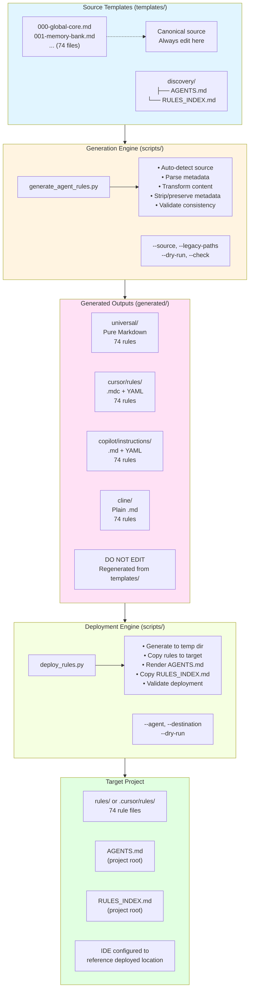
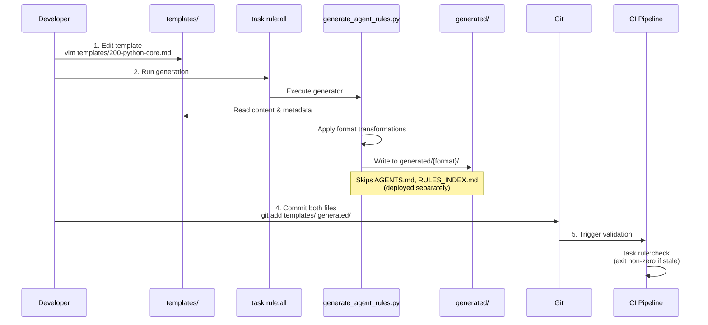
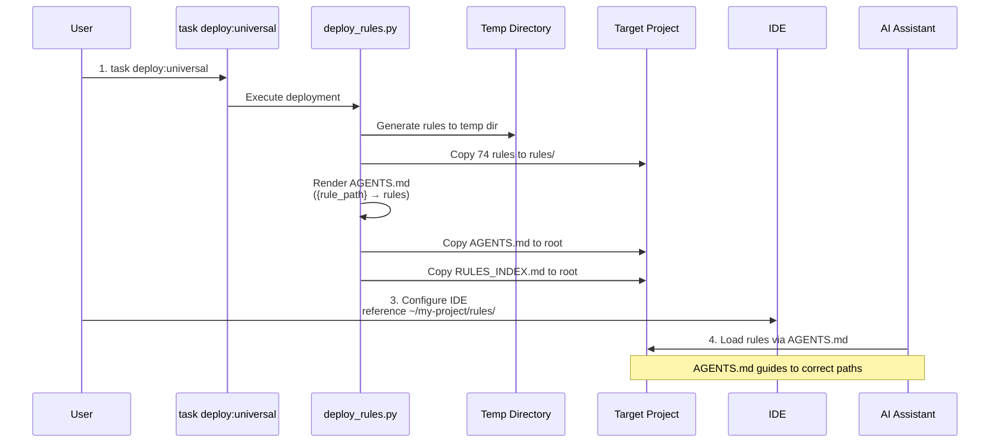
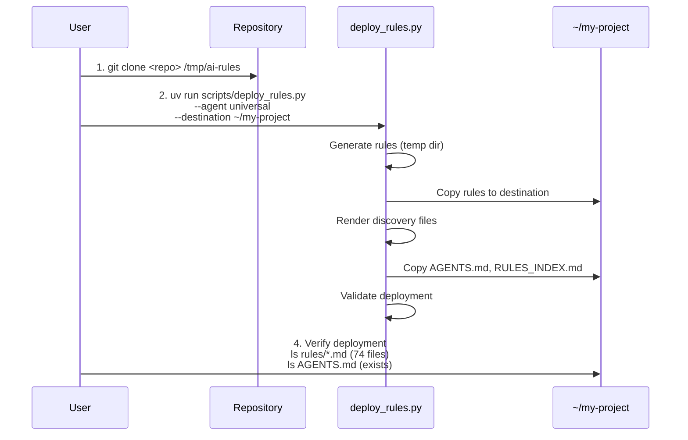
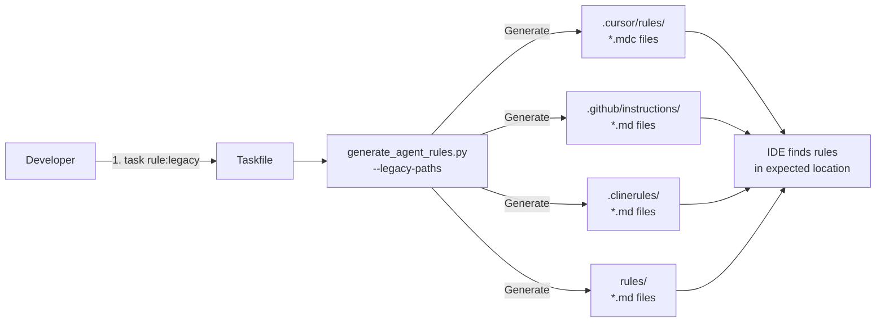

# Architecture: AI Coding Rules Generator

## System Overview

The AI Coding Rules Generator is a template-based generation system that transforms canonical rule templates into multiple IDE-specific formats. The architecture follows industry best practices from static site generators (Hugo, Jekyll) and template systems (cookiecutter).

## Universal-First Design Philosophy

The project follows a **universal-first architecture** where source rule files are generated into portable formats optimized for any IDE, agent, or LLM.

### Architecture Flow

```
┌────────────────────────────────────────────────────────────┐
│              Source Repository (Clone This)                │
│                  (ai_coding_rules/)                        │
│                                                            │
│  Source Rule Files (*.md in project root)                  │
│  ├── 000-global-core.md         [Foundation]               │
│  ├── 100-snowflake-core.md      [Domain Core]              │
│  ├── 200-python-core.md         [Language Core]            │
│  ├── 210-python-fastapi-core.md [Framework Specific]       │
│  └── ... (74 total rules)                                   │
│                                                            │
│  Discovery System (Committed in Repo, deployed to root)    │
│  ├── AGENTS.md          [AI assistant discovery guide]     │
│  ├── RULES_INDEX.md     [Searchable catalog]               │
│  └── generate_agent_rules.py [Generation script]           │
│                                                            │
│  ⚠️  The rules/ directory does NOT exist yet               │
└────────────────────────────────────────────────────────────┘
                            │
                            │ Run generation command
                            ▼
        ┌───────────────────────────────────────┐
        │   task rule:universal                 │
        │   (Generates Universal Format)        │
        └───────────────────────────────────────┘
                            │
                            ▼
        ┌───────────────────────────────────────┐
        │   Created: rules/ Directory           │
        │   (in current directory or DEST)      │
        │                                       │
        │  Generated files:                     │
        │  ├── rules/000-global-core.md         │
        │  ├── rules/100-snowflake-core.md      │
        │  ├── rules/200-python-core.md         │
        │  └── ... (all rules, cleaned)         │
        │                                       │
        │  ✅ Works with ANY tool/IDE/Agent     │
        │  ✅ Portable Markdown                 │
        │  ✅ Embedded metadata preserved       │
        │  ✅ No lock-in                        │
        │  ✅ Ready to use immediately          │
        └───────────────────────────────────────┘
                            │
                            │ (Optional)
                            ▼
        ┌────────────────────────────────────────┐
        │   Optional: Generate IDE-Specific      │
        │        Convenience Formats             │
        │                                        │
        │  task rule:cursor   → .cursor/rules/   │
        │  task rule:copilot  → .github/inst.../ │
        │  task rule:cline    → .clinerules/     │
        │                                        │
        │  (Same rules, different packaging)     │
        └────────────────────────────────────────┘
```

### Key Architectural Principles

1. **Single Source of Truth**: Universal rules in source repository are canonical
2. **Generate Anywhere**: Use `DEST` parameter to generate to any project directory
3. **Universal by Default**: `task rule:universal` creates portable format first
4. **IDE Formats Optional**: Generate IDE-specific formats only if you need convenience features
5. **Metadata Preservation**: Keywords, TokenBudget, ContextTier, and Depends metadata preserved in universal format
6. **Automatic Discovery**: AGENTS.md + RULES_INDEX.md (deployed to project root) enable intelligent rule loading

## Rule Generator Features

The project includes a sophisticated rule generator (`generate_agent_rules.py`) that transforms universal Markdown rules into IDE-specific formats with intelligent content adaptation.

### Supported Output Formats

| IDE/Tool | Output Format | Location | Features |
|----------|---------------|----------|----------|
| **Cursor** | `.mdc` files | `.cursor/rules/` | YAML frontmatter with globs, auto-apply, automatic `*.md` → `*.mdc` reference conversion |
| **GitHub Copilot** | `.md` files | `.github/instructions/` | YAML frontmatter with appliesTo patterns, preserves original `*.md` references |
| **Cline** | `.md` files | `.clinerules/` | Plain Markdown (no YAML frontmatter), all files automatically processed |
| **Universal** | `.md` files | `rules/` | Clean Markdown, no frontmatter/comments/metadata - works with any IDE/Agent/LLM |

### Reference Conversion Feature

The rule generator automatically converts cross-references for consistency:

**For Cursor Rules (`.mdc` files):**
- `201-python-lint-format.md` → `201-python-lint-format.mdc`
- `@some-rule.md` → `@some-rule.mdc`
- `path/to/file.md` → `path/to/file.mdc`
- **Preserves**: `README.md`, `CHANGELOG.md`, `CONTRIBUTING.md`, and other documentation files

**For Copilot Rules (`.md` files):**
- All references remain unchanged as `*.md`

This ensures that generated Cursor rules reference the correct `.mdc` file format while maintaining compatibility with standard documentation files.

**For Universal Rules (`.md` files):**
- All references remain unchanged as `*.md`
- No YAML frontmatter or generated comments
- **Preserves essential metadata:** Keywords, TokenBudget, ContextTier (as regular markdown after H1)
- **Strips IDE-specific metadata:** Type, Description, AutoAttach, AppliesTo, Version, LastUpdated
- Clean, portable Markdown suitable for any IDE, agent, or LLM
- Use `RULES_INDEX.md` and `AGENTS.md` (in project root) for semantic rule discovery

### Preserved Metadata Benefits

- **Keywords** - Enables semantic discovery and grep-based searches
- **TokenBudget** - Helps LLMs manage attention budget and decide which rules to load
- **ContextTier** - Provides prioritization (Critical/High/Medium/Low) for rule loading
- **Depends** - Specifies prerequisite rules that must be loaded first (dependency chain)

### Example Universal Rule Format

```markdown
# Rule Title

**Keywords:** keyword1, keyword2, keyword3
**TokenBudget:** ~400
**ContextTier:** High
**Depends:** 000-global-core, 100-snowflake-core

## Purpose
Rule content starts here...
```

### Universal Format Use Cases

The universal format is ideal for:
- Custom AI agents or LLM integrations
- Manual inclusion in project contexts
- Environments where IDE-specific formatting is not supported
- Maximum portability across different AI development tools

### Metadata Parsing

Rules support embedded metadata in Markdown:

```markdown
**Description:** Brief description of the rule's purpose
**Applies to:** `**/*.py`, `**/*.sql` (file patterns)  
**Auto-attach:** true (automatically apply rule)
**Version:** 2.0
**Last updated:** 2024-01-15
```

## Architecture Diagram



## Component Responsibilities

### Source Templates (`templates/`)

**Purpose:** Canonical source of truth for all rule content

**Format:** Markdown with embedded metadata
```markdown
**Description:** Brief rule description
**AppliesTo:** `**/*.py`, `**/*.sql`
**AutoAttach:** true
**Version:** 2.0
**LastUpdated:** 2024-11-05

# Rule Title

Rule content...
```

**Key Points:**
- Contains all metadata fields (Type, AutoAttach, AppliesTo, Keywords, etc.)
- Single source for all generated formats
- Always edit here, never in `generated/`
- 74 rule files covering all domains

### Discovery System (`discovery/`)

**Purpose:** Meta-documentation for rule discovery and usage

**Files:**
- `AGENTS.md` - Templated discovery guide with `{rule_path}` variable
- `RULES_INDEX.md` - Comprehensive rule catalog with keywords

**Behavior:**
- NOT copied to `generated/` directories
- Deployed to **project root** by deploy_rules.py
- Skipped by generation scripts (not treated as rules)
- Deployed to project root by `deploy_rules.py`
- `AGENTS.md` template variable `{rule_path}` replaced with agent-specific path during deployment
- `AGENTS.md` file extensions updated during deployment (`.md` → `.mdc` for Cursor, stays `.md` for others)

### Generation Engine (`scripts/generate_agent_rules.py`)

**Purpose:** Transform templates into IDE-specific formats

**Key Features:**

1. **Auto-detection of Source Directory**
   ```python
   # Priority order:
   # 1. templates/ (new structure)
   # 2. ai_coding_rules/ (legacy)
   # 3. . (current directory)
   ```

2. **Format-Specific Transformations**
   - **Universal**: Strip IDE metadata, preserve Keywords/TokenBudget/ContextTier/Depends
   - **Cursor**: Add YAML frontmatter, convert `.md` → `.mdc` references
   - **Copilot**: Add YAML frontmatter with `appliesTo` patterns
   - **Cline**: Plain Markdown with generated comment

3. **Metadata Parsing**
   - Extracts embedded metadata from Markdown
   - Converts to YAML frontmatter per format
   - Strips unnecessary metadata for universal format

4. **Validation**
   - `--check` mode validates generated files are current
   - Detects stale or missing outputs
   - Used in CI/CD pipelines

**Command-Line Interface:**
```bash
python scripts/generate_agent_rules.py \
  --agent {cursor|copilot|cline|universal} \
  [--source templates/] \
  [--destination path/] \
  [--legacy-paths] \
  [--dry-run] \
  [--check]
```

### Generated Outputs (`generated/`)

**Purpose:** IDE-ready rule files (DO NOT EDIT directly)

**Structure:**
```
generated/
├── universal/          # Pure Markdown, no frontmatter
│   └── *.md (74 rules only)
├── cursor/rules/       # .mdc files with YAML
│   └── *.mdc (74 rules)
├── copilot/instructions/ # .md with YAML
│   └── *.md (74 rules)
└── cline/              # Plain .md with comment
    └── *.md (74 rules)
```

**Important:**
- Discovery files (AGENTS.md, RULES_INDEX.md) are NOT in `generated/`
- Discovery files are deployed by `deploy_rules.py` to **target project root**
- Generated directories contain ONLY rule files (74 files each)

**Why Commit Generated Files:**
- Users can clone and use immediately (no build step)
- Clear git history of format-specific changes
- No Python dependency for end users
- CI validates consistency via `--check` mode

**Trade-offs:**
- Larger repository size
- Git diffs show both template and generated changes
- Risk of divergence (mitigated by CI validation)

### Deployment Engine (`scripts/deploy_rules.py`)

**Purpose:** Deploy rules to target projects with proper configuration

**Key Features:**

1. **Automatic Rule Generation**
   - Generates rules to temporary directory
   - Copies generated rules to target location

2. **Template Rendering**
   - Renders `AGENTS.md` template with agent-specific paths
   - Replaces `{rule_path}` variable (e.g., `rules`, `.cursor/rules`, etc.)

3. **Discovery File Deployment**
   - Copies `AGENTS.md` (rendered) to **project root**
   - Copies `RULES_INDEX.md` to **project root**

4. **Validation**
   - Validates destination is writable
   - Verifies all files copied successfully
   - Dry-run mode for previewing changes

**Command-Line Interface:**
```bash
python scripts/deploy_rules.py \
  --agent {cursor|copilot|cline|universal} \
  [--destination /path/to/project] \
  [--dry-run]
```

**Agent-Specific Path Mappings:**
- `cursor`: Rules → `.cursor/rules/`, paths → `.cursor/rules`
- `copilot`: Rules → `.github/copilot/instructions/`, paths → `.github/copilot/instructions`
- `cline`: Rules → `.clinerules/`, paths → `.clinerules`
- `universal`: Rules → `rules/`, paths → `rules`

## Data Flow

### Standard Generation Flow (For Contributors)



### Deployment Flow (For End Users)



### Manual Deployment Flow (Without Task)



### Legacy Path Generation Flow (For Development)



## Format Specifications

### Universal Format

**Purpose:** Pure Markdown suitable for any IDE/agent/LLM

**Characteristics:**
- No YAML frontmatter
- No generated comments
- Strips IDE-specific metadata (Type, Description, AutoAttach, AppliesTo)
- Preserves semantic metadata (Keywords, TokenBudget, ContextTier, Depends)

**Example:**
```markdown
# Python Core Development Standards

**Keywords:** python, best-practices, core, standards
**TokenBudget:** ~500
**ContextTier:** Critical
**Depends:** 000-global-core

## Purpose
...
```

**Use Cases:**
- Custom AI agents or LLM integrations
- Manual inclusion in project contexts
- Maximum portability across tools
- CLI-based rule loading

### Cursor Format (.mdc)

**Purpose:** Cursor IDE project rules

**Characteristics:**
- `.mdc` file extension
- YAML frontmatter with globs and alwaysApply
- Automatic `.md` → `.mdc` reference conversion
- Generated comment linking to Cursor docs

**Example:**
```markdown
---
description: "Python core development standards"
globs:
  - "**/*.py"
alwaysApply: false
---
<!-- Generated for Cursor project rules. See https://docs.cursor.com/en/context/rules#project-rules -->

# Python Core Development Standards

Reference: See @201-python-lint-format.mdc
...
```

**Reference Conversion:**
- Rule references: `201-python-lint-format.md` → `201-python-lint-format.mdc`
- @-mentions: `@some-rule.md` → `@some-rule.mdc`
- Placeholders: `[domain]-core.md` → `[domain]-core.mdc`
- Preserves: `README.md`, `CHANGELOG.md`, `RULES_INDEX.md` (non-rule files)
- Applied to: Rule files during generation, AGENTS.md during deployment

### Copilot Format

**Purpose:** GitHub Copilot repository instructions

**Characteristics:**
- `.md` file extension
- YAML frontmatter with appliesTo patterns
- Preserves `.md` references
- Generated comment linking to Copilot docs

**Example:**
```markdown
---
appliesTo:
  - "**/*.py"
---
<!-- Generated for GitHub Copilot repository instructions. See https://docs.github.com/en/copilot/how-tos/configure-custom-instructions/add-repository-instructions -->

# Python Core Development Standards
...
```

### Cline Format

**Purpose:** Cline agent rules

**Characteristics:**
- `.md` file extension
- No YAML frontmatter
- Plain Markdown content
- Generated comment linking to Cline docs

**Example:**
```markdown
<!-- Generated for Cline rules. See https://docs.cline.bot/features/cline-rules -->

# Python Core Development Standards
...
```

### AGENTS.md Templating System

**Purpose:** Enable agent-agnostic discovery documentation

**Problem:** Different agents expect rules in different locations:
- Cursor: `.cursor/rules/`
- Copilot: `.github/copilot/instructions/`
- Cline: `.clinerules/`
- Universal: `rules/`

**Solution:** Template variable `{rule_path}` in `discovery/AGENTS.md`

**Template Example:**
```markdown
## How to Load Rules

1. **Load Foundation**: Read `{rule_path}/000-global-core.md`
2. **Load Domain Rules**: Read `{rule_path}/100-snowflake-core.md`
```

**Deployment Rendering:**
- `cursor` deployment: `{rule_path}` → `.cursor/rules`
- `copilot` deployment: `{rule_path}` → `.github/copilot/instructions`
- `cline` deployment: `{rule_path}` → `.clinerules`
- `universal` deployment: `{rule_path}` → `rules`

**Benefits:**
- Single source AGENTS.md file for all agent types
- Correct paths automatically rendered during deployment
- No manual path updates needed
- Prevents path mismatches in documentation

**Implementation:**
- Template stored in `discovery/AGENTS.md` with `{rule_path}` placeholders
- `deploy_rules.py` performs string replacement during deployment
- Rendered AGENTS.md written to target project root
- Original template remains unchanged in repository

## Design Decisions

### Why Template-Based Generation?

**Decision:** Use source templates with generated outputs

**Rationale:**
- **Single Source of Truth:** Edit once in `templates/`, generate many formats
- **Consistency:** All formats generated from same source
- **Maintainability:** Update one file, regenerate all formats
- **Scalability:** Easy to add new IDE formats without duplicating content

**Industry Alignment:**
- Static site generators (Hugo, Jekyll, Sphinx)
- Template systems (cookiecutter, Yeoman)
- Build systems (Make, CMake, Bazel)

### Why Commit Generated Files?

**Decision:** Commit generated files to git

**Rationale:**
- **User Convenience:** Clone and use immediately (no build step)
- **Transparency:** Clear git history of what changed in each format
- **No Dependencies:** Users don't need Python/uv to consume rules
- **CI Validation:** `--check` mode ensures consistency

**Alternative Considered:** Gitignore generated files
- **Pros:** Cleaner git history, guaranteed consistency
- **Cons:** Requires build step, Python dependency, CI complexity

**Trade-offs Accepted:**
- Larger repository size (~10MB with 74 rules × 4 formats)
- Git diffs show both template and generated changes
- Risk of template/generated divergence (mitigated by CI)

### Why Flat templates/ Directory?

**Decision:** Keep templates in flat directory initially

**Rationale:**
- **Simpler Migration:** Direct move from root to `templates/`
- **Simpler Generator:** No recursive directory scanning needed
- **Manageable Scale:** 74 files navigable in flat structure
- **Numbering System:** 3-digit prefixes provide logical grouping

**Alternative Considered:** Subdirectories by domain
```
templates/
├── core/      # 000-099
├── snowflake/ # 100-199
├── python/    # 200-299
└── ...
```
- **Pros:** Logical organization, easier navigation
- **Cons:** More complex generator, harder migration
- **Future:** Can refactor later if needed

### Why No Symlinks?

**Decision:** No symlinks in project structure

**Rationale:**
- **Cleaner Structure:** No symbolic links cluttering project
- **Cross-Platform:** Symlinks problematic on Windows
- **Explicit Paths:** Users configure IDE to reference `generated/` directly
- **Flexibility:** `--legacy-paths` flag available when needed

**Alternative Considered:** Symlinks for compatibility
```
.cursor/rules → generated/cursor/rules
```
- **Pros:** IDEs find rules automatically
- **Cons:** Windows compatibility, repo clutter, implicit behavior

## Extension Points

### Adding New IDE Formats

To add support for a new IDE:

1. **Update `generate_agent_rules.py`:**
   ```python
   elif agent == "newide":
       self.spec = AgentSpec(
           name="newide",
           dest_dir=destination,
           header_key="patterns",
           prepend_comment="<!-- Generated for NewIDE -->\n\n"
       )
   ```

2. **Add format transformation logic:**
   ```python
   def build_header(self, patterns, description=None, always_apply=None):
       if self.name == "newide":
           # Build NewIDE-specific header
           return "# NewIDE Config\n..."
   ```

3. **Update default output paths:**
   ```python
   OUTPUT_DEFAULTS = {
       # ...
       "newide": "generated/newide/rules"
   }
   ```

4. **Add to `deploy_rules.py` AGENT_PATHS:**
   ```python
   AGENT_PATHS = {
       # ...
       "newide": ".newide/rules",
   }
   ```

5. **Update `deploy_rules.py` generate_rules() function:**
   ```python
   if agent == "newide":
       return temp_dir / "newide" / "rules"
   ```

6. **Add Taskfile tasks:**
   ```yaml
   rule:newide:
     desc: "Generate NewIDE rules"
     cmds:
       - uv run scripts/generate_agent_rules.py --agent newide
   
   deploy:newide:
     desc: "Deploy NewIDE rules to target project"
     cmds:
       - uv run scripts/deploy_rules.py --agent newide {{.CLI_ARGS}}
   ```

7. **Update documentation:**
   - README.md IDE integration section
   - docs/ONBOARDING.md deployment instructions
   - CONTRIBUTING.md with NewIDE workflow
   - This architecture document

### Adding New Metadata Fields

To add a new metadata field:

1. **Add regex pattern:**
   ```python
   RE_NEWFIELD = re.compile(r"^\*\*NewField:\*\*\s*(.*)$", re.IGNORECASE)
   ```

2. **Update parsing logic:**
   ```python
   def _parse_description_and_autoattach(text, fallback_name):
       newfield = None
       m = RE_NEWFIELD.match(line.strip())
       if m:
           newfield = m.group(1).strip()
   ```

3. **Handle in format generation:**
   ```python
   def build_header(self, patterns, newfield=None):
       # Use newfield value in header
   ```

4. **Update documentation:**
   - Template structure in CONTRIBUTING.md
   - Metadata parsing in README.md

## Security Considerations

**Trusted Input:**
- Templates are trusted input (maintained by project team)
- No user-provided content in templates
- No code execution during generation

**Deterministic Generation:**
- Generation is deterministic (same input → same output)
- No network access during generation
- Safe for CI/CD execution

**File System:**
- Validates output paths to prevent directory traversal
- Creates directories safely with `parents=True, exist_ok=True`
- No shell command execution

## Performance

**Generation Speed:**
- ~1-2 seconds for 74 rules (all formats)
- Linear scaling with number of rules
- Dominated by I/O (file reads/writes)

**Optimization:**
- No caching needed (fast enough without it)
- Minimal memory usage (process one file at a time)
- No database or complex data structures

**Scalability:**
- Can handle 1000+ rules without performance issues
- Parallel generation possible (not currently implemented)
- Incremental generation possible (only changed files)

## CI/CD Integration

### GitHub Actions Validation

```yaml
name: Validate Rules

on: [push, pull_request]

jobs:
  validate:
    runs-on: ubuntu-latest
    steps:
      - uses: actions/checkout@v4
      
      - name: Install uv
        uses: astral-sh/setup-uv@v1
      
      - name: Install dependencies
        run: uv sync
      
      - name: Check generated files are up-to-date
        run: |
          uv run scripts/generate_agent_rules.py --agent all --check
          # Exits non-zero if any outputs are stale
      
      - name: Validate rule structure
        run: uv run scripts/validate_agent_rules.py
```

### Pre-commit Hook

```yaml
# .pre-commit-config.yaml
repos:
  - repo: local
    hooks:
      - id: regenerate-rules
        name: Regenerate rule files
        entry: task rule:all
        language: system
        pass_filenames: false
        files: ^templates/.*\.md$
```

## Maintenance

### Regular Tasks

**Weekly:**
- Review and merge rule updates
- Validate generated files consistency
- Update dependencies (uv, ruff)

**Monthly:**
- Review and update IDE format specifications
- Check for new IDE support opportunities
- Update documentation

**Quarterly:**
- Performance profiling and optimization
- Architecture review and improvements
- User feedback analysis and roadmap planning

### Monitoring

**Key Metrics:**
- Generation time per rule
- Number of rules per format
- Repository size growth
- CI/CD pipeline success rate

**Health Checks:**
- All generated files up-to-date (CI)
- No linting errors (CI)
- All tests passing (CI)
- Documentation current
