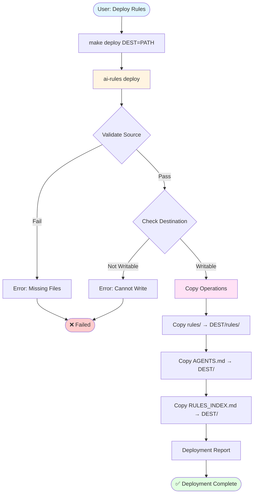

# Architecture: AI Coding Rules (v3.6.0)

**Last Updated:** 2026-03-02

## Table of Contents

- [System Overview](#system-overview)
- [Production-Ready Rules System](#production-ready-rules-system)
- [Directory Structure](#directory-structure)
- [Package Layout](#package-layout)
- [CLI Architecture](#cli-architecture)
- [Migration Notes](#migration-notes)
- [Rule Creation Workflow](#rule-creation-workflow)
- [Schema Validation System](#schema-validation-system)
- [Deployment System](#deployment-system)
- [Testing Infrastructure](#testing-infrastructure)
- [Makefile Architecture](#makefile-architecture)
- [Architecture Diagrams](#architecture-diagrams)
- [Design Decisions](#design-decisions)
- [Extension Points](#extension-points)
- [Related Documentation](#related-documentation)

## System Overview


### Core Architecture Principles

1. **Production-Ready by Default** — All rule files in `rules/` are directly editable and deployment-ready
2. **No Generation Step** — Rules are maintained in their final form, eliminating build complexity
3. **Universal Format** — Standard Markdown with embedded metadata works with any AI assistant or IDE
4. **Schema-Validated** — Declarative YAML schema ensures consistency and quality
5. **Agent-Agnostic Deployment** — Single `--dest` flag deploys to any project structure

### Architecture Benefits

**For Users:**
- Clone and use immediately (no build step)
- Direct editing of production rules
- Simplified deployment (one command)
- Works with any AI assistant or IDE

**For Contributors:**
- Clear file ownership (edit `rules/` only)
- Automated validation catches errors
- Test suite ensures script reliability
- Single source of truth (no template/generated divergence)

**For Maintainers:**
- Reduced complexity (no generation engine)
- Schema-driven validation (declarative)
- Comprehensive test coverage (100+ tests)

## Rule Loading Workflow

AI assistants follow a two-phase loading process: auto-loading by the IDE/tool, then rule discovery via the bootstrap protocol.

### Loading Sequence Diagram

```
┌─────────────────────────────────────────────────────────────────────────┐
│                     AI ASSISTANT INITIALIZATION                         │
└─────────────────────────────────────────────────────────────────────────┘
                                    │
                                    ▼
┌─────────────────────────────────────────────────────────────────────────┐
│ PHASE 1: AUTO-LOADED BY IDE/TOOL (Parallel)                             │
│                                                                         │
│   ┌─────────────┐              ┌─────────────┐                          │
│   │  AGENTS.md  │              │ PROJECT.md  │                          │
│   │  (Bootstrap │              │  (Project   │                          │
│   │   Protocol) │              │   Config)   │                          │
│   └─────────────┘              └─────────────┘                          │
│         │                            │                                  │
│         │ Defines rule loading       │ Defines project-specific         │
│         │ sequence and MODE/ACT      │ tooling requirements and         │
│         │ framework                  │ validation gates                 │
└─────────────────────────────────────────────────────────────────────────┘
                                    │
                                    ▼
┌─────────────────────────────────────────────────────────────────────────┐
│ PHASE 2: RULE LOADING PROTOCOL (Sequential, per AGENTS.md)              │
│                                                                         │
│   Step 1: Load Foundation                                               │
│   ┌────────────────────────┐                                            │
│   │ rules/000-global-core  │  Always loaded first, no exceptions        │
│   │ (Foundation Rule)      │  Defines MODE transitions, validation      │
│   └────────────────────────┘                                            │
│              │                                                          │
│              ▼                                                          │
│   Step 2: Search for Domain Rules                                       │
│   ┌────────────────────────┐                                            │
│   │    RULES_INDEX.md      │  Search Keywords field for task matches    │
│   │    (Rule Catalog)      │  Check Depends field for prerequisites     │
│   └────────────────────────┘                                            │
│              │                                                          │
│              ▼                                                          │
│   Step 3: Load Domain + Activity Rules                                  │
│   ┌────────────────────────┐                                            │
│   │  rules/XXX-domain.md   │  Load based on file extensions, keywords   │
│   │  rules/YYY-activity.md │  Load dependencies first (Depends field)   │
│   └────────────────────────┘                                            │
└─────────────────────────────────────────────────────────────────────────┘
                                    │
                                    ▼
┌─────────────────────────────────────────────────────────────────────────┐
│ READY: Agent has loaded context, begins in MODE: PLAN                   │
└─────────────────────────────────────────────────────────────────────────┘
```

### File Responsibilities

| File | Loading | Purpose |
|------|---------|---------|
| **AGENTS.md** | Auto-loaded by IDE | Bootstrap protocol, MODE/ACT framework, rule discovery instructions |
| **PROJECT.md** | Auto-loaded by IDE | Project-specific tooling, validation requirements, critical violations |
| **RULES_INDEX.md** | Referenced by AGENTS.md | Searchable catalog of all rules with keywords and dependencies |
| **rules/000-global-core.md** | First rule loaded | Foundation patterns, MODE transitions, validation gates |
| **rules/XXX-*.md** | Loaded on demand | Domain and activity-specific rules based on task requirements |

### Key Design Decisions

1. **Parallel auto-loading**: AGENTS.md and PROJECT.md are loaded simultaneously by the IDE, not sequentially
2. **PROJECT.md is not part of rule chain**: It's project configuration, not a rule file
3. **Sequential rule loading**: Rules load in dependency order per AGENTS.md protocol
4. **Lazy loading**: Specialized rules load only when needed (token optimization)

## Context Management System

The repository uses a dual-layer approach for context preservation:

**Primary Layer: Natural Language Instructions (Universal)**
- CRITICAL warnings in AGENTS.md and 000-global-core.md
- CORE RULE/FOUNDATION RULE markers in all -core.md and 002-series files
- Context Management Protocol in 000-global-core.md teaching explicit preservation hierarchy
- Works across all LLMs: Claude, GPT, Gemini, Llama, etc.

**Secondary Layer: ContextTier Metadata (Project-Specific)**
- Critical/High/Medium/Low values in rule metadata
- Provides fine-grained prioritization within natural language tiers
- Validated by schema but not universally recognized by LLMs
- Kept for compatibility and secondary signaling

**Design Principle:** Never rely solely on metadata that LLMs don't natively understand.
Natural language instructions are the primary mechanism for ensuring consistent behavior.

See `000-global-core.md` → "Context Window Management Protocol" for implementation details.

## Production-Ready Rules System

### Philosophy

The AI Coding Rules system uses **direct rule editing** with production-ready files. Rules are stored in their final, deployable form with embedded metadata that enables intelligent discovery and loading.

**Core Principles:**
- Rules are production-ready by default (no build step)
- Universal Markdown format works with any AI assistant
- Schema validation ensures consistency and quality
- Metadata enables intelligent rule discovery and loading

### Rule File Format

Every rule file follows this structure per schema v3.2:

```markdown
# Rule Title

## Metadata

**SchemaVersion:** v3.2
**RuleVersion:** v1.0.0
**LastUpdated:** 2025-01-05
**Keywords:** keyword1, keyword2, keyword3, ... (5-20 total)
**TokenBudget:** ~1200
**ContextTier:** Critical|High|Medium|Low
**Depends:** 000-global-core.md, XXX-dependency.md

## Scope

**What This Rule Covers:**
- Specific feature or technology aspect
- Boundaries of this rule's domain
- Related concepts included

**When to Load This Rule:**
- Scenario 1 (e.g., "When working with X")
- Scenario 2 (e.g., "When implementing Y")
- Scenario 3 (e.g., "When troubleshooting Z")

## References

### Dependencies
- 000-global-core.md
- XXX-dependency.md

### External Documentation
- [Official Docs](https://...)
- [API Reference](https://...)

### Related Rules
- XXX-related-rule.md
- YYY-related-rule.md

## Contract

### Inputs and Prerequisites
- Prerequisite 1
- Prerequisite 2

### Mandatory
- Must do A
- Must do B

### Forbidden
- Never do X
- Avoid doing Y

### Execution Steps
1. Step 1
2. Step 2
3. Step 3
4. Step 4
5. Step 5

### Output Format
[Expected output structure with examples]

### Validation
- Check 1
- Check 2

### Post-Execution Checklist
- [ ] Item 1
- [ ] Item 2
- [ ] Item 3
- [ ] Item 4
- [ ] Item 5

## Key Principles
[Core concepts - optional for simple rules]

## Anti-Patterns and Common Mistakes
[Problem/Correct Pattern pairs - strongly recommended]

## Output Format Examples
[Concrete code/command examples]
```

### Metadata Fields

| Field | Purpose | Format | Severity | Example |
|-------|---------|--------|----------|---------|
| **SchemaVersion** | Schema compatibility tracking | `vX.Y` or `vX.Y.Z` | CRITICAL | `v3.2` |
| **RuleVersion** | Individual rule versioning | `vX.Y.Z` (semver) | HIGH | `v1.0.0` |
| **LastUpdated** | Temporal context for troubleshooting | `YYYY-MM-DD` | HIGH | `2025-01-05` |
| **Keywords** | Semantic discovery by AI agents | 5-20 comma-separated terms | HIGH | `python, testing, pytest, fixtures, coverage` |
| **TokenBudget** | LLM context management | `~NUMBER` (approximate tokens) | MEDIUM | `~1200` |
| **ContextTier** | Loading prioritization | Critical \| High \| Medium \| Low | HIGH | `High` |
| **Depends** | Prerequisite rules | Comma-separated rule filenames | HIGH | `000-global-core.md, 200-python-core.md` |

**Why These Fields Matter:**

- **SchemaVersion** ensures rules are validated against the correct schema version (v3.2 is current)
- **RuleVersion** enables users to report issues against specific rule versions
- **LastUpdated** provides temporal context for troubleshooting and maintenance tracking
- **Keywords** enable AI assistants to automatically discover relevant rules based on task descriptions
- **TokenBudget** helps LLMs manage attention budget and decide which rules to load
- **ContextTier** provides prioritization when context windows are constrained
- **Depends** ensures prerequisite rules are loaded first (dependency chain)

### Rule Numbering System

Rules use 3-digit prefixes for logical organization:

| Range | Domain | Example Rules |
|-------|--------|---------------|
| **000-099** | Core/Foundational | 000-global-core, 002-rule-governance |
| **100-199** | Snowflake Ecosystem | 100-snowflake-core, 101-snowflake-streamlit-core |
| **200-299** | Python Ecosystem | 200-python-core, 201-python-lint-format, 221-python-htmx-core, 221b-python-htmx-flask, 221c-python-htmx-fastapi |
| **300-399** | Shell/Bash Scripting & Containers | 300-bash-scripting-core, 310-zsh-scripting-core, 350-docker-best-practices, 351-podman-best-practices |
| **400-499** | Frontend (JavaScript/TypeScript) | 420-javascript-core, 430-typescript-core, 440-react-core, 441-react-backend |
| **500-599** | Frontend | 500-frontend-htmx-core, 501-frontend-browser-globals-collisions |
| **600-699** | Systems/Backend Languages | 600-golang-core (Go project structure, error handling, interfaces, testing, concurrency) |
| **800-899** | Project Management | 800-project-changelog, 801-project-readme, 802-project-contributing, 803-project-git-workflow, 820-taskfile-automation |
| **900-999** | Analytics/Governance | 920-data-science-analytics, 930-data-governance-quality, 940-business-analytics, 950-create-dbt-semantic-view |

**Demo Rules (130-series):** Demo creation rules are now consolidated under Snowflake (130-snowflake-demo-sql, 131-snowflake-demo-creation, 132-snowflake-demo-modeling).

**Split Rules Pattern:** Rules may use letter suffixes (e.g., 101a, 101b, 101c) for subtopic specialization, improving token efficiency by allowing focused loading.

### HTMX Rules Architecture (v3.1.0)

Starting in v3.1.0, the project includes comprehensive HTMX support for building hypermedia-driven web applications. The HTMX rules follow a layered architecture:

**Architecture Layers:**

1. **Core Foundation (220)** — Request/response lifecycle, HTTP headers, security patterns (CSRF, XSS), HATEOAS principles
2. **Templates (221)** — Jinja2 organization patterns, partials, fragments, conditional rendering
3. **Framework Integration (222-223)** — Flask-HTMX extension and FastAPI async patterns with dependency injection
4. **Testing (224)** — Pytest fixtures, header assertions, HTML validation, mocking strategies  
5. **Patterns (225)** — Common implementation patterns (CRUD, forms, infinite scroll, search, real-time, modals)
6. **Frontend Integration (226, 500)** — Alpine.js, _hyperscript, CSS frameworks, pure HTMX frontend reference

**Design Decisions:**

- **Consistent Naming:** All HTMX rules follow `python-htmx-*.md` pattern for easy discovery
- **Framework Parity:** Separate rules for Flask (222) and FastAPI (223) to cover both ecosystems equally
- **Security First:** Core rule (220) includes CSRF and XSS protection as foundational concepts
- **Testing Emphasis:** Dedicated testing rule (224) ensures testability is a first-class concern
- **Progressive Enhancement:** Rules emphasize graceful degradation and accessibility throughout

**Dependency Chain:**

```
000-global-core.md (foundation)
  └── 200-python-core.md (Python basics)
      └── 221-python-htmx-core.md (HTMX foundation)
          ├── 221a-python-htmx-templates.md (template patterns)
          ├── 221b-python-htmx-flask.md (Flask integration)
          ├── 221c-python-htmx-fastapi.md (FastAPI integration)
          ├── 221d-python-htmx-testing.md (testing strategies)
          ├── 221e-python-htmx-patterns.md (common patterns)
          └── 221f-python-htmx-integrations.md (frontend libraries)

500-frontend-htmx-core.md (standalone frontend reference)
```

**Token Budget Management:**

Total HTMX token budget: ~9500 tokens across 8 rules
- Core (220): ~1500 tokens — Largest due to security, headers, and HATEOAS coverage
- Templates (221): ~1200 tokens — Template organization patterns
- Flask (222): ~1000 tokens — Framework-specific patterns
- FastAPI (223): ~1000 tokens — Async patterns
- Testing (224): ~1200 tokens — Comprehensive testing strategies
- Patterns (225): ~1800 tokens — Largest due to multiple pattern examples (CRUD, forms, search, etc.)
- Integrations (226): ~800 tokens — Lightest, focused on library integration points
- Frontend (500): ~1000 tokens — Pure HTMX reference without backend concerns

### Claude Agent Skills Architecture

Starting in v3.4.0, the project includes seven Claude Agent Skills following [Anthropic's best practices](https://claude.com/blog/equipping-agents-for-the-real-world-with-agent-skills).

**Skill Structure (both skills):**

```
skills/<skill-name>/
├── SKILL.md           # Main entrypoint with YAML frontmatter
├── README.md          # Usage documentation
├── VALIDATION.md      # Self-validation procedures
├── workflows/         # Phase-specific detailed guides
├── examples/          # Walkthrough examples + edge-cases.md
└── tests/             # Test cases for skill validation
```

**YAML Frontmatter (SKILL.md):**

```yaml
---
name: rule-reviewer
description: Execute agent-centric rule reviews (FULL/FOCUSED/STALENESS modes)...
version: 1.1.0
author: AI Coding Rules Project
tags: [rule-review, quality-audit, compliance, staleness-check]
dependencies: []
---
```

**Design Decisions:**

1. **Hybrid Code Embedding** — Simple validation inline in SKILL.md, complex scripts external
2. **Progressive Disclosure** — Workflows loaded on-demand, not all at once
3. **Edge Case Documentation** — 10 scenarios per skill for ambiguous situations
4. **Self-Validation** — VALIDATION.md with health checks and regression testing
5. **Cross-Skill Integration** — rule-reviewer validates rule-creator output

**rule-creator Skill (Internal-Only):**

| Component | Purpose |
|-----------|---------|
| `SKILL.md` | 5-phase workflow orchestration |
| `workflows/discovery.md` | Domain identification, research |
| `workflows/template-gen.md` | Template generation with scripts |
| `workflows/content-population.md` | Section filling guidance |
| `workflows/validation.md` | Schema validation loop |
| `workflows/indexing.md` | RULES_INDEX.md entry |
| `examples/` | Frontend, Python, Snowflake examples |
| `tests/` | Input validation, workflow execution tests |

**rule-reviewer Skill (Internal-Only):**

| Component | Purpose |
|-----------|---------|
| `SKILL.md` | Review execution with 3 modes |
| `workflows/input-validation.md` | Input checking procedures |
| `workflows/model-slugging.md` | Model name normalization |
| `workflows/review-execution.md` | Review generation steps |
| `workflows/file-write.md` | Output file handling |
| `workflows/error-handling.md` | Error recovery (10 patterns) |
| `examples/` | FULL, FOCUSED, STALENESS examples |
| `tests/` | Input, mode, output handling tests |

**doc-reviewer Skill (Deployed by Default):**

| Component | Purpose |
|-----------|---------|
| `SKILL.md` | Documentation review with 3 modes |
| `workflows/input-validation.md` | Input checking procedures |
| `workflows/model-slugging.md` | Model name normalization |
| `workflows/review-execution.md` | Review generation steps |
| `workflows/file-write.md` | Output file handling |
| `workflows/error-handling.md` | Error recovery patterns |
| `examples/` | FULL, FOCUSED, STALENESS examples |
| `tests/` | Input, mode, output handling tests |

**plan-reviewer Skill (Deployed by Default):**

Reviews LLM-generated implementation plans for autonomous agent executability using an 8-dimension rubric (100 points total). Supports 4 review modes and produces deterministic scores with <±2 point variance.

**See:** [Using the Plan Reviewer Skill](USING_PLAN_REVIEWER_SKILL.md) for quick start guide, examples, and FAQ.

**Core Files:**

| Component | Purpose |
|-----------|---------|
| `SKILL.md` | Main entrypoint with 4 modes, scoring formula, determinism requirements, workflow orchestration |
| `README.md` | Usage documentation with quick start, file structure, review dimensions |

**Review Modes:**

| Mode | Purpose | Output Location |
|------|---------|-----------------|
| **FULL** | Comprehensive single-plan review (all 8 dimensions) | `reviews/plan-reviews/<plan>-<model>-<date>.md` |
| **COMPARISON** | Rank multiple plans, declare winner with justification | `reviews/summaries/_comparison-<id>-<model>-<date>.md` |
| **META-REVIEW** | Analyze review consistency across multiple reviewers | `reviews/summaries/_meta-<doc>-<date>.md` |
| **DELTA** | Track issue resolution between plan versions | `reviews/plan-reviews/<plan>-delta-<old>-to-<new>-<model>.md` |

**Scoring System (100 points):**

| Dimension | Weight | Max Points | Focus |
|-----------|--------|------------|-------|
| Executability | 4 | 20 | Can agent execute without judgment? |
| Completeness | 4 | 20 | Are all steps present? |
| Success Criteria | 4 | 20 | Are completion signals verifiable? |
| Scope | 3 | 15 | Is work bounded? |
| Dependencies | 2 | 10 | Are prerequisites clear? |
| Decomposition | 1 | 5 | Are tasks right-sized? |
| Context | 1 | 5 | Is background provided? |
| Risk Awareness | 1 | 5 | Are risks documented? |

**Verdict Thresholds:**

| Score | Verdict | Meaning |
|-------|---------|---------|
| 90-100 | EXCELLENT_PLAN | Ready for execution |
| 80-89 | GOOD_PLAN | Minor refinements needed |
| 60-79 | NEEDS_WORK | Significant refinement required |
| 40-59 | POOR_PLAN | Not executable, major revision |
| <40 | INADEQUATE_PLAN | Rewrite from scratch |

**Rubrics (8 dimensions + overlap resolution):**

| File | Purpose |
|------|---------|
| `rubrics/executability.md` | Blocking issue detection: ambiguous phrases, implicit commands, missing branches, undefined thresholds |
| `rubrics/completeness.md` | Phase coverage: setup, validation, cleanup, error recovery |
| `rubrics/success-criteria.md` | Agent-verifiable criteria: exit codes, file existence, measurable outputs |
| `rubrics/scope.md` | Boundary definition: start/end states, exclusions, termination conditions |
| `rubrics/dependencies.md` | Prerequisite clarity: tool requirements, ordering, access needs |
| `rubrics/decomposition.md` | Task granularity: single-action steps, parallelization |
| `rubrics/context.md` | Background provision: rationale, domain terms, assumptions |
| `rubrics/risk-awareness.md` | Risk documentation: failure scenarios, mitigations, rollback |
| `rubrics/_overlap-resolution.md` | Prevents double-counting: 10 issue types, 8 IF-THEN rules |

**Workflows (8 workflow files):**

| File | Purpose |
|------|---------|
| `workflows/input-validation.md` | Input checking: required params, mode-specific validation, error messages |
| `workflows/model-slugging.md` | Model name normalization for filenames |
| `workflows/review-execution.md` | 3-phase review: (1) batch load rubrics, (2) fill worksheets, (3) calculate scores |
| `workflows/delta-review.md` | DELTA mode: 5-phase workflow for tracking issue resolution |
| `workflows/file-write.md` | Output handling: path computation, no-overwrite safety, collision avoidance |
| `workflows/error-handling.md` | Error recovery: 10 error patterns with resolution steps |
| `workflows/consistency-check.md` | Score locking, variance thresholds, inter-review consistency |
| `workflows/issue-inventory.md` | Issue ID format, status tracking across reviews |

**Examples (4 walkthrough files):**

| File | Purpose |
|------|---------|
| `examples/full-review.md` | Complete FULL mode walkthrough with scoring |
| `examples/comparison-review.md` | COMPARISON mode with 3 plans ranked |
| `examples/meta-review.md` | META-REVIEW analyzing consistency |
| `examples/edge-cases.md` | Ambiguous scenarios and resolutions |

**Tests (6 test files):**

| File | Purpose |
|------|---------|
| `tests/README.md` | Test overview and instructions |
| `tests/test-inputs.md` | Input validation test cases |
| `tests/test-modes.md` | Review mode test cases |
| `tests/test-outputs.md` | Output handling test cases |
| `tests/test-invocation-full.md` | FULL mode invocation tests |
| `tests/test-invocation-comparison.md` | COMPARISON mode invocation tests |

**Testing and Maintenance:**

| File | Purpose |
|------|---------|
| `testing/TESTING.md` | Skill health checks for maintainers |

**Determinism Requirements:**

The skill enforces strict determinism for reproducible scores:

1. **Batch Load Rubrics** — All 9 files (8 rubrics + overlap resolution) loaded BEFORE reading plan
2. **Create Worksheets First** — All 8 empty worksheets prepared BEFORE reading plan
3. **Systematic Enumeration** — Read plan from line 1 to END (no skipping)
4. **Use Pattern Lists** — Only count patterns from rubric inventories (don't invent)
5. **Check Non-Issues** — Always filter false positives before final count
6. **Apply Overlap Resolution** — Check `_overlap-resolution.md` for ambiguous issues
7. **Include Worksheets** — Copy completed worksheets into review output
8. **Use Score Matrices** — Look up scores in decision tables (no interpretation)

**Expected Variance:** ±1 blocking issue, ±1 dimension point, ±2 overall points.

**Quality Threshold for Cross-Skill Validation:**

When using rule-reviewer to validate rule-creator output:
- Overall score: ≥ 75/100
- No CRITICAL issues
- No HIGH issues in Actionability or Completeness dimensions
- Priority 1 violations < 6 (otherwise score capped at 60/100)

### Go/Golang Rules Architecture

Starting in v3.2.0, the project includes Go/Golang support establishing the 600s range for systems/backend languages.

**Architecture:**

The 600s range is reserved for systems and backend programming languages, with Go as the first entry:

1. **Core Foundation (600)** — Project structure, naming conventions, error handling, interfaces, testing patterns, concurrency fundamentals

**Future Rules (Reserved Numbers):**
- 601-golang-testing.md — Advanced testing patterns, benchmarks, fuzzing
- 602-golang-web-frameworks.md — Gin, Echo, Fiber, Chi integration
- 603-golang-cli.md — Cobra, urfave/cli patterns
- 605-golang-concurrency.md — Advanced goroutine patterns, channels, sync primitives
- 610-golang-project-structure.md — Detailed project layouts, monorepo patterns

**Design Decisions:**

- **New Domain Range:** 600s established for systems/backend languages (distinct from Python 200s and frontend 400s)
- **Industry Standards:** Rule follows Effective Go, Go Code Review Comments, and Uber Go Style Guide
- **Tooling Focus:** Emphasizes `go fmt`, `go vet`, `golangci-lint`, and `go test -race`
- **Error Handling:** Comprehensive coverage of `fmt.Errorf`, `%w` wrapping, `errors.Is`/`errors.As`

**Dependency Chain:**

```
000-global-core.md (foundation)
  └── 600-golang-core.md (Go foundation)
      ├── 601-golang-testing.md (future)
      ├── 602-golang-web-frameworks.md (future)
      └── 603-golang-cli.md (future)
```

**Token Budget:**
- Core (600): ~3500 tokens — Comprehensive coverage of Go fundamentals

## Directory Structure

```
ai_coding_rules/
├── src/                        # Python packages (installable via pip/uv)
│   ├── ai_rules/               # Main CLI package (ai-rules command)
│   │   ├── __init__.py             # Package metadata (__version__)
│   │   ├── __main__.py             # Entry point for `python -m ai_rules`
│   │   ├── cli.py                  # Typer app with 8 registered commands
│   │   ├── _shared/                # Shared utilities
│   │   │   ├── console.py          # Rich console helpers (log_info, log_success, etc.)
│   │   │   └── paths.py            # Project root detection, rules/schemas paths
│   │   └── commands/               # Individual command modules
│   │       ├── badges.py           # Update README badges
│   │       ├── deploy.py           # Deploy rules to projects
│   │       ├── index.py            # Generate RULES_INDEX.md
│   │       ├── keywords.py         # TF-IDF keyword extraction
│   │       ├── new.py              # Create new rule templates
│   │       ├── refs.py             # Validate index references
│   │       ├── tokens.py           # Token budget validation
│   │       └── validate.py         # Schema validation
│   └── agent_eval/             # AGENTS.md effectiveness evaluation
│       ├── __init__.py             # Package metadata
│       ├── __main__.py             # Entry point for `python -m agent_eval`
│       ├── cli.py                  # Typer CLI (run, list, verify commands)
│       ├── cortex.py               # Snowflake Cortex REST API client
│       ├── evaluator.py            # Core evaluation logic
│       ├── models.py               # Data models
│       └── parsers.py              # Response parsing
│
├── rules/                      # Production-ready rule files
│   ├── 000-global-core.md      # Foundation (ContextTier: Critical)
│   ├── 001-memory-bank.md      # Universal memory bank system
│   ├── 002-rule-governance.md  # Schema standards
│   ├── 100-snowflake-core.md   # Domain cores
│   ├── 200-python-core.md
│   ├── 221-python-htmx-core.md # HTMX foundation
│   ├── 221a-python-htmx-templates.md
│   ├── 221b-python-htmx-flask.md
│   ├── 221c-python-htmx-fastapi.md
│   ├── 221d-python-htmx-testing.md
│   ├── 221e-python-htmx-patterns.md
│   ├── 221f-python-htmx-integrations.md
│   ├── 500-frontend-htmx-core.md
│   ├── 600-golang-core.md      # Go/Golang foundation
│   ├── examples/               # Validated implementation examples
│   │   ├── 001-memory-bank-templates-example.md
│   │   ├── 106-semantic-view-ddl-example.md
│   │   ├── 106-semantic-view-workarounds-example.md
│   │   ├── 106-semantic-view-yaml-vqr-example.md
│   │   ├── 109b-sis-streamlit-deployment-example.md
│   │   ├── 110-snowflake-model-registry-example.md
│   │   ├── 115-cortex-agent-hybrid-python-example.md
│   │   ├── 115-cortex-agent-hybrid-sql-example.md
│   │   ├── 115-cortex-agent-prerequisites-example.md
│   │   ├── 116-cortex-search-service-example.md
│   │   ├── 120-spcs-service-spec-example.md
│   │   ├── 121-snowpipe-auto-ingest-example.md
│   │   ├── 220-python-typer-cli-example.md
│   │   └── 821-makefile-automation-example.md
│   └── ... (130 total)
│
├── schemas/                    # Validation schemas
│   ├── rule-schema.yml         # Rule file schema definition
│   ├── example-schema.yml      # Example file schema definition
│   └── README.md               # Schema documentation
│
├── tests/                      # Test suite (494 passing tests)
│   └── cli/                    # CLI command tests
│       ├── test_badges.py
│       ├── test_cli_misc.py
│       ├── test_deploy.py
│       ├── test_index.py
│       ├── test_keywords.py
│       ├── test_new.py
│       ├── test_paths.py
│       ├── test_refs.py
│       ├── test_tokens.py
│       └── test_validate.py
│
├── prompts/                    # Example user prompts
│   ├── EXAMPLE_PROMPT_01.md    # Linting task example
│   ├── EXAMPLE_PROMPT_02.md    # Performance optimization example
│   ├── EXAMPLE_PROMPT_03.md    # Simple task example
│   ├── EXAMPLE_PROMPT_04.md    # Additional example
│   ├── EXAMPLE_PROMPT_05.md    # Additional example
│   ├── EXAMPLE_PROMPT_06.md    # Additional example
│   ├── EXAMPLE_PROMPT_07.md    # Additional example
│   └── README.md               # Prompt writing guide
│
├── skills/                     # Claude Agent Skills (optional deployable artifacts)
│   ├── rule-creator/            # Internal-only: create rules (excluded from deploy)
│   │   ├── SKILL.md                 # Main entrypoint with YAML frontmatter
│   │   ├── README.md                # Usage documentation
│   │   ├── VALIDATION.md            # Self-validation procedures
│   │   ├── workflows/               # 5-phase workflow guides
│   │   ├── examples/                # Frontend, Python, Snowflake + edge-cases.md
│   │   └── tests/                   # Input and workflow test cases
│   ├── rule-reviewer/           # Internal-only: automate rule reviews (excluded from deploy)
│   │   ├── SKILL.md                 # Main entrypoint with YAML frontmatter
│   │   ├── README.md                # Usage documentation
│   │   ├── VALIDATION.md            # Self-validation procedures
│   │   ├── workflows/               # Input, execution, output, error handling
│   │   ├── examples/                # FULL, FOCUSED, STALENESS + edge-cases.md
│   │   └── tests/                   # Input, mode, output test cases
│   ├── bulk-rule-reviewer/      # Internal-only: orchestrate bulk rule reviews (excluded from deploy)
│   │   └── SKILL.md                 # Main entrypoint with YAML frontmatter
│   ├── doc-reviewer/           # Deployed by default: automate doc reviews
│   │   ├── SKILL.md                 # Main entrypoint with YAML frontmatter
│   │   ├── README.md                # Usage documentation
│   │   ├── VALIDATION.md            # Self-validation procedures
│   │   ├── workflows/               # Input, execution, output, error handling
│   │   ├── examples/                # FULL, FOCUSED, STALENESS + edge-cases.md
│   │   └── tests/                   # Input, mode, output test cases
│   ├── plan-reviewer/          # Deployed by default: automate plan reviews
│   │   ├── SKILL.md                 # Main entrypoint with YAML frontmatter
│   │   ├── README.md                # Usage documentation
│   │   ├── VALIDATION.md            # Self-validation procedures
│   │   ├── workflows/               # Input, execution, output, error handling
│   │   ├── examples/                # FULL, COMPARISON, META-REVIEW + edge-cases.md
│   │   └── tests/                   # Input, mode, output test cases
│   ├── rule-loader/            # Deployed by default: load rules for tasks
│   │   └── SKILL.md                 # Main entrypoint with YAML frontmatter
│   └── skill-timing/           # Deployed by default: measure skill performance
│       └── SKILL.md                 # Main entrypoint with YAML frontmatter
│
├── docs/                       # Project documentation
│   ├── ARCHITECTURE.md         # This file
│   ├── USING_RULE_REVIEW_SKILL.md # How to use rule-reviewer in Claude Code / Cursor
│   └── MEMORY_BANK.md          # Memory Bank system guide
│
├── AGENTS.md                   # Minimal AI agent bootstrap protocol (project root)
├── RULES_INDEX.md              # Searchable rule catalog with loading strategy (project root)
├── templates/                  # Source of truth for AGENTS.md variants
│   ├── AGENTS_MODE.md.template     # Template for AGENTS.md (full PLAN/ACT protocol)
│   └── AGENTS_NO_MODE.md.template  # Template for no-mode AGENTS.md
├── CHANGELOG.md                # Version history (Keep a Changelog v1.1.0)
├── CONTRIBUTING.md             # Contribution guidelines
├── README.md                   # Project overview and quick start
├── Makefile                    # Task automation (make help for all targets)
└── pyproject.toml              # Python dependencies and CLI entry points (uv/hatchling)
```

### Key Directory Roles

**`rules/`** — Single source of truth for all rules
- Production-ready files
- Directly editable
- No generation required
- 130 rules covering all domains (including 8 HTMX rules, Go/Golang core, Alpine.js, and Podman)

**`rules/examples/`** — Validated implementation examples
- Complete, runnable reference implementations for complex rules
- Validated separately against `schemas/example-schema.yml`
- Not rule files (not validated against rule-schema.yml)
- Naming pattern: `{rule-number}-{topic}-{variant}-example.md`
- Used by agents for concrete patterns when implementing Cortex Agents, Semantic Views, Cortex Search

**`src/`** — Python packages (installable via pip/uv)
- Three packages with CLI entry points defined in `pyproject.toml`
- `ai_rules/` — Main CLI for rule management (8 commands)
- `agent_eval/` — AGENTS.md effectiveness testing
- Build system: hatchling with `packages = ["src/ai_rules", "src/agent_eval"]`

**`templates/`** — Source of truth for AGENTS.md variants
- `AGENTS_MODE.md.template` — Full PLAN/ACT bootstrap protocol (deployed as AGENTS.md by default)
- `AGENTS_NO_MODE.md.template` — Simplified bootstrap without PLAN/ACT workflow (deployed via `--no-mode`)
- Used by `ai-rules deploy` for split deployment with placeholder substitution

**`schemas/`** — Declarative validation
- `rule-schema.yml` defines all requirements for rule files
- `example-schema.yml` defines validation for example files
- Used by `ai-rules validate`
- Single source of truth for validation logic

**`prompts/`** — User guidance
- Example prompts showing best practices
- Demonstrates keyword triggers
- Helps users write effective task descriptions

**`skills/`** — Claude Agent Skills
- Some skills are excluded from deployment in `pyproject.toml` (`[tool.rule_deployer].exclude_skills`)
- Follows [Anthropic Agent Skills best practices](https://claude.com/blog/equipping-agents-for-the-real-world-with-agent-skills)
- **rule-creator/** (internal-only, excluded from deployment):
  - Creates Cursor rules with template generation and schema validation
  - 5-phase workflow: Discovery → Template → Content → Validation → Indexing
  - Includes: SKILL.md, README.md, VALIDATION.md, workflows/, examples/, tests/
  - Trigger keywords: "create rule", "add rule", "new rule", "generate rule"
- **rule-reviewer/** (internal-only, excluded from deployment):
  - Automates rule quality reviews (FULL/FOCUSED/STALENESS modes)
  - Writes results to `reviews/` with no-overwrite safety
  - Includes: SKILL.md, README.md, VALIDATION.md, workflows/, examples/, tests/
  - Trigger keywords: "review rule", "audit rule", "check rule quality"
- **doc-reviewer/** (deployed by default):
  - Automates documentation quality reviews (FULL/FOCUSED/STALENESS modes)
  - Writes results to `reviews/` with no-overwrite safety
  - Includes: SKILL.md, README.md, VALIDATION.md, workflows/, examples/, tests/
  - Trigger keywords: "review docs", "audit documentation", "check doc quality"
- **plan-reviewer/** (deployed by default):
  - Reviews implementation plans for agent executability using 8-dimension rubric (100 points)
  - Supports 4 modes: FULL (single plan), COMPARISON (rank multiple), META-REVIEW (consistency), DELTA (track fixes)
  - Verdict ranges: EXCELLENT_PLAN (90-100), GOOD_PLAN (80-89), NEEDS_WORK (60-79), POOR_PLAN (40-59), INADEQUATE_PLAN (<40)
  - Writes results to `reviews/plan-reviews/` or `reviews/summaries/` with no-overwrite safety
  - Includes: SKILL.md, README.md, workflows/ (including delta-review.md), examples/, tests/
  - Trigger keywords: "review plan", "compare plans", "plan quality", "meta-review", "plan executability"
- **bulk-rule-reviewer/** (internal-only, excluded from deployment):
  - Orchestrates bulk rule reviews across all rules in the rules/ directory
  - Generates prioritized improvement reports
  - Trigger keywords: "review all rules", "bulk review", "audit all rules"
- **rule-loader/** (deployed by default):
  - Determines which rule files to load for a given user request
  - Matches file extensions, directory paths, and keywords against RULES_INDEX.md
  - Trigger keywords: "load rules", "select rules", "which rules"
- **skill-timing/** (deployed by default):
  - Measures skill execution time and tracks performance
  - Supports checkpoints, token tracking, anomaly detection, baseline comparison
  - Trigger keywords: "time skill", "measure duration", "skill performance"
- All skills feature:
  - Enhanced YAML frontmatter (version, author, tags, dependencies)
  - Inline validation snippets (hybrid code embedding)
  - Edge case documentation (10 scenarios each)
  - Self-validation procedures and test cases
  - Cross-skill integration (rule-reviewer validates rule-creator output)

## Package Layout

The project uses a modern Python package structure with three installable packages under `src/`.

### Entry Points (pyproject.toml)

```toml
[project.scripts]
ai-rules = "ai_rules.cli:app"       # Main CLI for rule management
agent-eval = "agent_eval.cli:app"   # AGENTS.md effectiveness testing
```

### Build Configuration

```toml
[build-system]
requires = ["hatchling"]
build-backend = "hatchling.build"

[tool.hatch.build.targets.wheel]
packages = ["src/ai_rules", "src/agent_eval"]
```

### Package Descriptions

| Package | Entry Point | Purpose |
|---------|-------------|---------|
| `ai_rules` | `ai-rules` | Unified CLI for all rule management operations |
| `agent_eval` | `agent-eval` | Test AGENTS.md bootstrap effectiveness via Cortex |

### Installation

```bash
# Development install (editable mode with all dependencies)
uv sync --all-groups

# Install specific extras
uv sync --extra agent-eval
```

## CLI Architecture

The `ai-rules` CLI uses [Typer](https://typer.tiangolo.com/) for command registration with a modular command structure.

### Command Registration (cli.py)

```python
# src/ai_rules/cli.py
import typer
from ai_rules.commands import badges, deploy, index, keywords, new, refs, tokens, validate

app = typer.Typer(name="ai-rules", help="Unified CLI for AI coding rules management.")

# Register 8 commands
app.command(name="badges")(badges.badges)
app.command()(refs)
app.command(name="new")(new_command)
app.command(name="tokens")(tokens)
app.command(name="deploy")(deploy)
app.command(name="index")(index)
app.command(name="keywords")(keywords)
app.command(name="validate")(validate)
```

### Available Commands

| Command | Description | Example |
|---------|-------------|---------|
| `ai-rules new` | Generate new rule template | `ai-rules new 300-example --context-tier High` |
| `ai-rules validate` | Validate rules against schema | `ai-rules validate rules/` |
| `ai-rules deploy` | Deploy rules to target project | `ai-rules deploy /path/to/project` |
| `ai-rules index` | Generate RULES_INDEX.md | `ai-rules index --check` |
| `ai-rules tokens` | Update token budgets | `ai-rules tokens rules/ --dry-run` |
| `ai-rules keywords` | Extract/update keywords | `ai-rules keywords rules/100-snowflake-core.md --corpus` |
| `ai-rules badges` | Update README badges | `ai-rules badges` |
| `ai-rules refs` | Validate index references | `ai-rules refs` |

### Shared Utilities (_shared/)

```python
# src/ai_rules/_shared/paths.py
def find_project_root() -> Path:
    """Find project root by looking for pyproject.toml."""
    
def get_rules_dir(project_root: Path | None = None) -> Path:
    """Get the rules directory path."""

# src/ai_rules/_shared/console.py  
def log_info(message: str) -> None:     # [blue]ℹ[/blue] message
def log_success(message: str) -> None:  # [green]✓[/green] message
def log_warning(message: str) -> None:  # [yellow]⚠[/yellow] message
def log_error(message: str) -> None:    # [red]✗[/red] message (stderr)
```

### Makefile Integration

The `Makefile` delegates to the `ai-rules` CLI for most operations:

```makefile
# Rules management targets delegate to ai-rules CLI
rules-validate:
    $(UV) run ai-rules validate rules/

index-generate:
    $(UV) run ai-rules index

rule-new:
    $(UV) run ai-rules new $(FILENAME) $(if $(TIER),--context-tier $(TIER))

deploy:
    $(UV) run ai-rules deploy $(DEST)
```

## Migration Notes

### tools/ → src/ Migration

The evaluation tools have been restructured as proper Python packages:

| Old Location | New Location | Entry Point |
|--------------|--------------|-------------|
| `tools/agent_eval/` | `src/agent_eval/` | `agent-eval` |
| N/A (new) | `src/ai_rules/` | `ai-rules` |

**Benefits:**
- Packages are now pip-installable (`pip install -e .`)
- Proper `__main__.py` support (`python -m ai_rules`)
- Shared utilities in `_shared/` avoid code duplication
- Entry points work system-wide after installation

### ./dev → Makefile Migration

The `./dev` bash script has been replaced with a standard `Makefile`:

| Old Command | New Command |
|-------------|-------------|
| `./dev test` | `make test` |
| `./dev test:all` | `make test` |
| `./dev quality:fix` | `make quality-fix` |
| `./dev lint` | `make lint` |
| `./dev lint:fix` | `make lint-fix` |
| `./dev rule:new FILENAME=xxx` | `make rule-new FILENAME=xxx` |
| `./dev deploy -- --dest /path` | `make deploy DEST=/path` |
| `./dev tokens:update` | `make tokens-update` |
| `./dev index:generate` | `make index-generate` |
| `./dev validate` | `make validate` |
| `./dev status` | `make status` |

**Benefits:**
- Standard build tool familiar to most developers
- Better IDE integration and tab-completion
- Parallel execution with `make -j`
- Clear dependency tracking between targets
- Self-documenting via `make help`

## Rule Creation Workflow

### Creating a New Rule

**Step 1: Generate Template**

```bash
# Basic usage (generates in rules/ directory)
make rule-new FILENAME=300-example-rule

# With custom context tier
make rule-new FILENAME=300-example-rule TIER=High

# With custom keywords (5-20 required)
ai-rules new 300-example-rule --keywords "keyword1, keyword2, ... (5-20 total)"

# Overwrite existing file (use with caution)
make rule-new-force FILENAME=300-example-rule
```

**What Happens:**
1. `ai-rules new` executes
2. Generates v3.2-compliant template in `rules/300-example-rule.md`
3. Auto-populates metadata based on numbering range
4. Includes all required sections with placeholders
5. Contract section pre-filled with 7 Markdown subsections

**Step 2: Fill Template Content**

Edit `rules/300-example-rule.md`:

```markdown
# Example Rule Title

## Metadata
**SchemaVersion:** v3.2
**RuleVersion:** v1.0.0
**LastUpdated:** 2025-01-05
**Keywords:** [AUTO-GENERATED - review and adjust]
**TokenBudget:** ~1200
**ContextTier:** Medium
**Depends:** 000-global-core.md

## Scope
**What This Rule Covers:**
- [Describe coverage]

**When to Load This Rule:**
- [Describe scenarios]

## References
### Dependencies
- 000-global-core.md
- Pattern 3 (minimum)

**Pre-Execution Checklist:**
- [ ] Item 1
- [ ] Item 2
... (5-7 total)

[Fill remaining sections...]
```

**Step 3: Validate**

```bash
# Validate single rule
ai-rules validate rules/300-example-rule.md

# Validate all rules
make rules-validate

# Verbose output
ai-rules validate rules/300-example-rule.md --verbose
```

**Validation Checks:**
- 6 metadata fields present and correctly formatted
- SchemaVersion and RuleVersion in semantic version format
- Keywords count: 5-20 terms
- All required sections present in correct order
- Contract has 7 Markdown subsections (### headers)
- Scope section has required markers
- Post-Execution Checklist has 5+ items

**Step 4: Generate Index Entry**

```bash
# Regenerate RULES_INDEX.md to include new rule
make index-generate
```

**Step 5: Commit**

```bash
git add rules/300-example-rule.md RULES_INDEX.md
git commit -m "feat(rules): add 300-example-rule for [purpose]"
```

### Keyword Selection Strategy

**Primary Keywords** (technology/framework):
- Exact technology names: `python`, `snowflake`, `docker`, `pytest`
- Framework names: `fastapi`, `streamlit`, `pandas`

**Activity Keywords** (what the rule helps with):
- Action verbs: `testing`, `deployment`, `optimization`, `validation`
- Outcomes: `performance`, `security`, `quality`, `debugging`

**Pattern Keywords** (specific techniques):
- Design patterns: `fixtures`, `caching`, `batching`, `async`
- Best practices: `error handling`, `type hints`, `documentation`

**Count Target:** Aim for 12-13 keywords (range: 5-20)

**Example (200-python-core.md):**
```
**Keywords:** python, best-practices, core, standards, uv, ruff, typing, 
code quality, linting, formatting, development workflow, testing
```
(12 keywords covering technology, practices, tools, outcomes)

## Schema Validation System

### Overview

This project uses a **declarative YAML schema** (`schemas/rule-schema.yml`) to define all validation requirements. This approach separates validation logic from implementation, making the system more maintainable and extensible.

### Schema Architecture

**Schema File:** `schemas/rule-schema.yml`

**Structure:**
```yaml
schema_version: "3.0"

metadata:
  required_fields:
    - name: Keywords
      pattern: '^\*\*Keywords:\*\* .+'
      validation: keyword_count
      min_count: 10
      max_count: 15
    - name: TokenBudget
      pattern: '^\*\*TokenBudget:\*\* ~\d+'
    # ... more fields

sections:
  required:
    - name: Purpose
      order: 1
      min_lines: 1
    - name: Rule Scope
      order: 2
    # ... more sections

contract:
  required_before_line: 160
  required_tags:
    - inputs_prereqs
    - mandatory
    - forbidden
    - steps
    - output_format
    - validation
```

### Validation Features

**1. Metadata Validation**
- Required fields: SchemaVersion, RuleVersion, Keywords, TokenBudget, ContextTier, Depends (6 fields)
- Pattern matching: `**FieldName:** value` format
- Version validation: SchemaVersion (vX.Y or vX.Y.Z), RuleVersion (vX.Y.Z semver)
- Count validation: Keywords must be 5-20 terms
- Enum validation: ContextTier must be Critical|High|Medium|Low

**2. Section Validation**
- 9 required sections in specific order
- Optional sections: Key Principles, Anti-Patterns
- Minimum content checks (e.g., 3 Essential Patterns)
- Section hierarchy validation

**3. Contract Validation**
- All 7 Markdown subsections required: Inputs and Prerequisites, Mandatory, Forbidden, Execution Steps, Output Format, Validation, Post-Execution Checklist
- Must use `###` headers (not XML tags)
- Must appear before line 200
- Non-empty content required

**4. Content Quality**
- Post-Execution Checklist: minimum 5 items
- Output Format Examples: must contain code blocks
- References: related rules and external docs

### Using the Validator

**Basic Usage:**

```bash
# Validate single rule
uv run ai-rules validate rules/100-snowflake-core.md

# Validate all rules
make rules-validate

# Verbose output (show all checks)
uv run ai-rules validate rules/100-snowflake-core.md --verbose

# Strict mode (warnings become errors)
uv run ai-rules validate rules/ --strict

# Debug mode (show schema loading)
uv run ai-rules validate rules/100-snowflake-core.md --debug

# Custom schema file
uv run ai-rules validate rules/ --schema custom-schema.yml
```

**Output Format:**

```
================================================================================
VALIDATION REPORT: rules/100-snowflake-core.md
================================================================================

SUMMARY:
  ❌ CRITICAL: 0
  ⚠️  HIGH: 0
  ℹ️  MEDIUM: 0
  ✓ Passed: 460 checks

✅ All validations passed!

================================================================================
```

**Error Example:**

```
================================================================================
VALIDATION REPORT: rules/example-bad.md
================================================================================

❌ CRITICAL ERRORS (2):
  Line 5: Missing required metadata field: Keywords
  Line 45: Contract section missing required tag: <validation>

⚠️  HIGH WARNINGS (1):
  Line 12: Keywords count is 8, expected 5-20

SUMMARY:
  ❌ CRITICAL: 2
  ⚠️  HIGH: 1
  ℹ️  MEDIUM: 0
  ✓ Passed: 457 checks

❌ Validation failed with CRITICAL errors

================================================================================
```

### Integration with Development Workflow

**Pre-Commit Hook:**
```bash
# .git/hooks/pre-commit
#!/bin/bash
uv run ai-rules validate rules/ --strict
```

**Makefile Automation:**
```bash
# Makefile provides task targets
make test             # Run all pytest tests
make rules-validate   # Validate all rules
make validate         # Run all CI/CD checks
```

**CI/CD Pipeline:**

See `.github/workflows/ci.yml` for the complete workflow. The `validate` job runs:
```bash
uv run ai-rules validate rules/
uv run ai-rules index --check
```

## Deployment System

### Philosophy

v3.0 deployment is **agent-agnostic** — a single `--dest` flag deploys rules to any project structure. AI assistants discover and load rules using AGENTS.md (discovery guide) and RULES_INDEX.md (searchable catalog).

### Deployment Architecture

**Source Files (in ai_coding_rules repository):**
- `rules/` — 130 production-ready rule files
- `AGENTS.md` — Discovery guide with loading protocol
- `RULES_INDEX.md` — Searchable catalog with keywords

**Deployment Process:**
1. Copy `rules/` directory to `DEST/rules/`
2. Copy `AGENTS.md` to `DEST/`
3. Copy `RULES_INDEX.md` to `DEST/`
4. Validate deployment integrity

**Target Structure (in user's project):**
```
/path/to/user-project/
├── rules/                  # 124 rule files
│   ├── 000-global-core.md
│   ├── 100-snowflake-core.md
│   └── ...
├── AGENTS.md               # Discovery guide
├── RULES_INDEX.md          # Rule catalog
└── [user's project files]
```

### Using the Deployer

**Basic Deployment:**

```bash
# Deploy to current directory
make deploy DEST=.

# Deploy to specific path
make deploy DEST=/path/to/project

# Deploy to home directory project
make deploy DEST=~/my-project

# Dry-run (preview without copying)
make deploy-dry DEST=/path/to/project

# Verbose output
make deploy-verbose DEST=/path/to/project
```

**Split Deployment (Multi-Destination):**

For AI assistants that require separate directories for agents, rules, and skills:

```bash
# Deploy only AGENTS.md (rules/skills paths reference CWD)
make deploy-split AGENTS=~/.claude

# Deploy AGENTS.md and rules to separate directories
make deploy-split AGENTS=~/.claude RULES=~/.claude/rules

# With separate skills directory
make deploy-split AGENTS=~/.claude RULES=~/.claude/rules SKILLS=~/.claude/skills

# Preview split deployment
make deploy-split AGENTS=~/.claude DRY_RUN=1
```

When only `AGENTS=` is specified (AGENTS-only mode):
- Only AGENTS.md is deployed to the target directory
- `{{rules_path}}` and `{{skills_path}}` in AGENTS.md are replaced with CWD-based absolute paths
- No rules, skills, or RULES_INDEX.md files are copied

Split mode uses template-based deployment with placeholder substitution:
- `{{rules_path}}` → Absolute path to rules directory
- `{{skills_path}}` → Absolute path to skills directory

This ensures AGENTS.md contains correct absolute paths regardless of deployment structure.

**Direct CLI Usage:**

```bash
# Using ai-rules CLI directly
ai-rules deploy /path/to/project

# With uv
uv run ai-rules deploy /path/to/project

# Dry-run mode
ai-rules deploy /path/to/project --dry-run

# Verbose mode
ai-rules deploy /path/to/project --verbose

# Split deployment
ai-rules deploy --split --agents-dest ~/.claude --rules-dest ~/.claude/rules
ai-rules deploy --split --agents-dest ~/.claude --rules-dest ~/.claude/rules --skills-dest ~/.claude/skills
```

**Output:**

```
================================================================================
AI Coding Rules Deployment
================================================================================

Configuration:
  Source: /Users/user/ai_coding_rules
  Destination: /path/to/project
  Mode: LIVE (files will be copied)

Validation:
  ✓ Source rules/ directory exists (130 files)
  ✓ Source AGENTS.md exists
  ✓ Source RULES_INDEX.md exists
  ✓ Destination writable

Deployment:
  → Creating destination rules/ directory
  → Copying 130 rule files...
  ✓ Copied 130 rules to /path/to/project/rules/
  ✓ Copied AGENTS.md to /path/to/project/
  ✓ Copied RULES_INDEX.md to /path/to/project/

================================================================================
✅ Deployment completed successfully!
================================================================================

Next Steps:
  1. Configure your AI assistant to reference /path/to/project/rules/
  2. Read /path/to/project/AGENTS.md for loading protocol
  3. Search /path/to/project/RULES_INDEX.md for rule discovery
```

### AI Assistant Configuration

After deployment, configure your AI assistant to load rules:

**For Cursor:**
```
Settings → Cursor Settings → Rules → Add folder: /path/to/project/rules/
```

**For VS Code with GitHub Copilot:**
```
Settings → GitHub Copilot → Copilot Instructions → Reference: /path/to/project/AGENTS.md
```

**For Claude Code:**
```
Project Settings → Include files: /path/to/project/rules/
                                  /path/to/project/AGENTS.md
```

**For any AI assistant:**
Include this in your prompt:
```
Load rules from /path/to/project/rules/ following the protocol in /path/to/project/AGENTS.md
```

### Discovery System

**AGENTS.md Purpose:**
- Minimal bootstrap protocol for AI agents
- Rule loading sequence (mandatory first actions)
- Rule discovery methods and organization
- Delegates execution details to rules/000-global-core.md

**RULES_INDEX.md Purpose:**
- Searchable catalog with keywords
- Dependency information
- Scope descriptions
- Quick reference table
- AI agent usage guidance (READ-ONLY notice)
- Rule loading strategy with 6-step algorithm
- Token budget management guidance

**How AI Assistants Use Them:**

1. **Read AGENTS.md** → Understand loading protocol
2. **Extract keywords** → From user's task description
3. **Search RULES_INDEX.md** → Find matching rules by keywords
4. **Check dependencies** → Load prerequisite rules first
5. **Load rules** → In dependency order
6. **State loaded rules** → In response header

**Example Discovery Flow:**

```
User: "Fix linting errors in Python script"

AI Analysis:
  - File type: .py → Load rules/200-python-core.md
  - Activity: "linting" → Search RULES_INDEX.md for "linting"
  - Found: 201-python-lint-format.md
  - Dependencies: 000-global-core.md, 200-python-core.md
  
AI Response:
  MODE: PLAN
  
  ## Rules Loaded
  - rules/000-global-core.md (foundation)
  - rules/200-python-core.md (Python file type: .py)
  - rules/201-python-lint-format.md (activity: linting)
  
  [Analysis and task list...]
```

## Evaluation Tools

### agent_eval — AGENTS.md Effectiveness Testing

Tests whether AI agents correctly follow the `AGENTS.md` bootstrap protocol by sending evaluation prompts through Snowflake Cortex and scoring responses against expected behaviors.

**Architecture:**
- `cli.py` — Typer CLI with `run`, `list`, `verify` commands
- `evaluator.py` — Core evaluation logic with Cortex LLM integration
- `cortex.py` — Snowflake Cortex REST API client with `verify_connection()`
- `test_cases.yaml` — Declarative test definitions with expected behaviors

**Features:** Connection verification, parallel execution with per-test progress tracking, thread-safe counters, configurable Cortex model selection.

## Testing Infrastructure

### Test Suite Overview

v3.0 includes comprehensive test coverage ensuring CLI and tooling reliability:

**Test Statistics:**
- **494 passing tests** across 10 test files
- **Comprehensive coverage** across all CLI commands and utilities
- **pytest-based** test framework
- **Fixture-driven** test data management

### Test Files

**`tests/cli/test_badges.py`**
- README badge update tests
- Badge count verification

**`tests/cli/test_cli_misc.py`**
- CLI miscellaneous tests
- Help command tests

**`tests/cli/test_deploy.py`**
- Deployment success scenarios
- Dry-run mode validation
- Source file validation
- Destination writability checks
- Split deployment tests

**`tests/cli/test_index.py`**
- RULES_INDEX.md generation
- Metadata extraction accuracy
- Table formatting validation
- Dependency parsing

**`tests/cli/test_keywords.py`**
- KeywordCandidate dataclass tests
- ExtractionResult diff calculations
- Technology term matching
- TF-IDF corpus building
- File update functionality

**`tests/cli/test_new.py`**
- Template structure validation
- Metadata generation tests
- Output file creation tests
- Error handling for invalid inputs

**`tests/cli/test_paths.py`**
- Path resolution tests
- Project root detection

**`tests/cli/test_refs.py`**
- Reference validation tests
- Cross-file link checking

**`tests/cli/test_tokens.py`**
- Token count accuracy
- TokenBudget format validation
- Tolerance checks (±5% default threshold)
- Multiple rule validation

**`tests/cli/test_validate.py`**
- Schema loading and parsing
- Metadata validation tests
- Section validation tests
- Contract validation
- Error reporting accuracy

### Running Tests

**All Tests:**
```bash
# Using make (recommended)
make test                  # Run all tests

# Using pytest directly
uv run pytest tests/ -v

# With coverage report
make test-cov
```

**Single Test File:**
```bash
uv run pytest tests/cli/test_validate.py -v
```

**Specific Test:**
```bash
uv run pytest tests/cli/test_validate.py::test_validate_metadata_fields -v
```

**Coverage Report:**
```bash
make test-cov
# Generates htmlcov/index.html

# Open coverage report in browser (macOS)
make test-cov-open
```

### Test Fixtures

**`tests/fixtures/`** — Sample rule files for testing
- `RULES_INDEX_baseline.md` — Baseline index for comparison tests
- `sample_rules/` — Directory with test rule variations

### CI/CD Integration

**GitHub Actions (.github/workflows/ci.yml):**

The CI workflow runs 4 parallel jobs on pushes and PRs to `main`:

| Job | Purpose | Details |
|-----|---------|---------|
| `quality` | Code quality | ruff lint, ruff format, ty type check |
| `markdown` | Markdown linting | pymarkdownlnt for rules/ and docs/ |
| `test` | Unit tests | pytest with Python 3.11, 3.12, 3.13 matrix |
| `validate` | Rules validation | schema validation, RULES_INDEX.md check |

```yaml
# Example: test job with Python matrix
test:
  runs-on: ubuntu-latest
  strategy:
    matrix:
      python-version: ['3.11', '3.12', '3.13']
  steps:
    - uses: actions/checkout@v4
    - uses: astral-sh/setup-uv@v4
    - run: uv python install ${{ matrix.python-version }}
    - run: uv sync --all-groups
    - run: uv run pytest tests/ -v
```

## Makefile Architecture

The project uses a standard `Makefile` for task automation, replacing the previous `./dev` bash script.

### Key Design Patterns

**1. Precondition Checks**
The Makefile validates required tools via the `preflight` target:
- Validates uv is installed
- Validates pyproject.toml exists

**2. CLI Delegation**
Most targets delegate to the `ai-rules` CLI for actual work:
```makefile
rules-validate:
    $(UV) run ai-rules validate rules/
```

**3. Self-Documenting Help**
Running `make` or `make help` shows a categorized menu of all available targets.

### Command Categories

| Category | Make Target | Purpose |
|----------|-------------|---------|
| **Environment** | `env-python`, `env-sync`, `env-deps` | Python setup |
| **Quality** | `lint`, `format`, `typecheck`, `quality-fix` | Linting, formatting, type checking |
| **Testing** | `test`, `test-cov` | pytest execution |
| **Rules** | `rules-validate`, `rule-new` | Rule management |
| **Index** | `index-generate`, `index-check` | RULES_INDEX.md |
| **Deployment** | `deploy`, `deploy-dry` | Rule deployment |
| **Tokens** | `tokens-update`, `tokens-check` | Token budget management |
| **Keywords** | `keywords-suggest`, `keywords-update` | Keyword generation |
| **Validation** | `validate`, `preflight` | CI/CD checks |
| **Cleanup** | `clean-cache`, `clean-venv`, `clean` | File cleanup |
| **Status** | `status` | Project summary |

## Architecture Diagrams

### Rule Creation Flow

```mermaid
flowchart TD
    Start([User: Create New Rule]) --> Generate
    Generate[make rule-new FILENAME=XXX] --> Template
    Template[ai-rules new] --> Create[Create rules/XXX.md<br/>with v3.0 structure]
    Create --> Edit[User: Edit Content]
    Edit --> Validate{Validate?}
    Validate -->|make rules-validate| SchemaVal[ai-rules validate]
    SchemaVal --> Pass{Passed?}
    Pass -->|No| Fix[Fix Errors]
    Fix --> Edit
    Pass -->|Yes| Index[make index-generate]
    Index --> UpdateIndex[Update RULES_INDEX.md]
    UpdateIndex --> Commit[git commit -m 'feat(rules): add XXX']
    Commit --> End([Rule Ready])
    
    style Start fill:#e1f5ff
    style Template fill:#fff4e1
    style SchemaVal fill:#ffe1f5
    style Pass fill:#f5ffe1
    style End fill:#e1ffe1
```

### Deployment Flow



### Directory Structure Visualization

```mermaid
graph TD
    Root[ai_coding_rules/] --> Rules[rules/<br/>130 production files]
    Root --> Src[src/ai_rules/<br/>CLI tool]
    Root --> Schemas[schemas/<br/>v3.0 YAML schema]
    Root --> Tests[tests/<br/>494 passing tests]
    Root --> Prompts[prompts/<br/>Example prompts]
    Root --> Docs[docs/<br/>Documentation]
    Root --> RootFiles[Root Files]
    
    Rules --> Rule1[000-global-core.md]
    Rules --> Rule2[100-snowflake-core.md]
    Rules --> Rule3[... 130 total]
    
    Src --> S1[ai-rules new]
    Src --> S2[ai-rules deploy]
    Src --> S3[ai-rules validate]
    Src --> S4[ai-rules tokens]
    Src --> S5[ai-rules keywords]
    Src --> S6[ai-rules index]
    
    Schemas --> Schema[rule-schema.yml]
    
    Tests --> T1[cli/test_badges.py]
    Tests --> T2[cli/test_deploy.py]
    Tests --> T3[cli/test_validate.py]
    Tests --> T4[cli/test_tokens.py]
    Tests --> T5[cli/test_keywords.py]
    Tests --> T6[cli/test_index.py]
    
    Prompts --> P1[EXAMPLE_PROMPT_01.md]
    Prompts --> P2[EXAMPLE_PROMPT_02.md]
    Prompts --> P3[EXAMPLE_PROMPT_03.md]
    
    RootFiles --> RF1[AGENTS.md]
    RootFiles --> RF2[RULES_INDEX.md]
    RootFiles --> RF3[CHANGELOG.md]
    RootFiles --> RF4[README.md]
    RootFiles --> RF5[Makefile]
    
    style Root fill:#e1f5ff
    style Rules fill:#fff4e1
    style Src fill:#ffe1f5
    style Tests fill:#f5ffe1
```



## Design Decisions

### Why Production-Ready Rules?

**Decision:** Store rules in final, deployable form instead of templates requiring generation

**Rationale:**

1. **Simplicity** — Users clone and use immediately, no build step
2. **Transparency** — What you see is what you get (no hidden transformations)
3. **Maintainability** — Single source of truth (no template/generated divergence)
4. **Universality** — Standard Markdown works with any AI assistant or IDE
5. **Velocity** — Direct editing faster than edit-generate-deploy cycle
6. **Reduced Complexity** — ~37% code reduction vs. v2.x through focused, single-purpose CLI commands

**Trade-offs Accepted:**
- Cannot generate IDE-specific formats (e.g., Cursor .mdc with auto-apply)
- Manual metadata management (mitigated by schema validation)
- Larger git diffs (entire rule files, not just templates)

**Industry Alignment:**
- Hugo/Jekyll use content directly (not templates)
- Modern CI/CD prefers artifact generation over source generation
- Infrastructure-as-code stores desired state (not generation instructions)

### Why Single Universal Format?

**Decision:** Use one Markdown format instead of multiple IDE-specific formats

**Rationale:**

1. **No Lock-In** — Users free to switch AI assistants without migration
2. **Broader Compatibility** — Works with emerging tools (Claude Code, Gemini, etc.)
3. **Easier Contribution** — Contributors edit one file, not four
4. **Metadata Preservation** — Keywords/TokenBudget/ContextTier enable intelligent loading
5. **Simpler Architecture** — Focused CLI commands vs. monolithic generation

**What We Lost:**
- IDE-specific features (Cursor's globs/alwaysApply, Copilot's appliesTo)
- Automatic rule application (users must configure paths)
- Format-specific optimizations

**What We Gained:**
- Universal compatibility
- Simpler maintenance
- Faster contribution workflow
- Clear upgrade path to future AI tools

### Why Declarative Schema?

**Decision:** Define validation in YAML instead of hardcoded Python logic

**Rationale:**

1. **Separation of Concerns** — Schema definition separate from validation implementation
2. **Extensibility** — Add new checks without modifying validator code
3. **Documentation** — Schema file serves as specification
4. **Version Control** — Schema changes tracked independently
5. **Tooling** — External tools can parse schema (linters, generators)

**Implementation:**
```yaml
# schemas/rule-schema.yml
sections:
  required:
    - name: Contract
      order: 4
      required_before_line: 160
      required_xml_tags:
        - inputs_prereqs
        - mandatory
        - forbidden
```

vs. v2.x hardcoded:
```python
# Old approach
if "Contract" not in sections:
    errors.append("Missing Contract section")
if sections["Contract"]["line"] > 160:
    errors.append("Contract must appear before line 160")
```

**Benefits Realized:**
- Added 4 new validation rules without code changes
- Schema v3.0 phases (1-3) only required schema edits
- Contributors understand requirements from schema alone

### Why Parallel Sub-Agents for Bulk Operations?

**Decision:** Use parallel sub-agents (not sequential in-context execution) for bulk rule reviews

**Rationale:**

1. **Context Drift Prevention** — Fresh context per sub-agent eliminates quality degradation after 50+ rules
2. **Speed** — 5× faster execution (1-2 hours vs 5-10 hours for 113 rules)
3. **Isolation** — One sub-agent failing doesn't stop others; partial results preserved
4. **Full Protocol Preservation** — Each sub-agent loads complete anti-optimization protocols
5. **No File Conflicts** — Unique filenames (rule-name-model-date.md) prevent write races

**Architecture:**
```
┌─────────────────────────────────────────────────────────────────────────┐
│                    BULK-RULE-REVIEWER (Coordinator)                      │
│   • Partitions rules into N groups                                       │
│   • Launches N sub-agents in background                                  │
│   • Monitors progress via agent_output polling                           │
│   • Aggregates results when all complete                                 │
└─────────────────────────────────────────────────────────────────────────┘
         │              │              │              │              │
         ▼              ▼              ▼              ▼              ▼
   ┌──────────┐  ┌──────────┐  ┌──────────┐  ┌──────────┐  ┌──────────┐
   │ Worker 1 │  │ Worker 2 │  │ Worker 3 │  │ Worker 4 │  │ Worker 5 │
   │ Rules    │  │ Rules    │  │ Rules    │  │ Rules    │  │ Rules    │
   │ 1-23     │  │ 24-46    │  │ 47-69    │  │ 70-92    │  │ 93-113   │
   └──────────┘  └──────────┘  └──────────┘  └──────────┘  └──────────┘
         │              │              │              │              │
         ▼              ▼              ▼              ▼              ▼
   ┌──────────────────────────────────────────────────────────────────┐
   │           Direct File Writes (No Conflicts)                       │
   │   reviews/rule-reviews/rule-name-claude-sonnet-4-2026-02-12.md   │
   └──────────────────────────────────────────────────────────────────┘
```

**Trade-offs Accepted:**
- More complex orchestration logic
- Requires agent_output polling for progress
- Higher token usage (duplicate protocol loading per sub-agent)

**Why Not Sequential?**
- Context drift causes quality degradation in long sessions
- Single-threaded: 5-10 hours for 100+ rules
- One failure can halt entire process
- Available as fallback via `max_parallel: 1`

**Implementation Files:**
- `skills/bulk-rule-reviewer/workflows/parallel-execution.md` — Orchestration strategy
- `skills/bulk-rule-reviewer/workflows/subagent-prompt-template.md` — Sub-agent prompt

## Directive Language Hierarchy

The rules use a structured directive language with clear priority levels to guide both AI agents and human developers.

### Behavioral Control Directives (By Strictness)

| Directive | Category | Priority | Meaning |
|-----------|----------|----------|---------|
| **Critical** | System Safety | Highest | Must never violate |
| **Mandatory** | Non-negotiable | High | Must always follow |
| **Always** | Universal Practice | High | Should be consistent |
| **Requirement** | Technical Standard | Medium | Should implement |
| **Rule** | Best Practice | Medium | Recommended pattern |
| **Consider** | Optional | Low | Suggestions and alternatives |

### Informational Directives

| Directive | Purpose |
|-----------|---------|
| **Error** | Troubleshooting guidance for problem descriptions |
| **Exception** | Override conditions for special cases |
| **Forbidden** | Explicitly prohibited actions |
| **Note** | Cross-references and additional context |

### Usage Examples

```markdown
Critical: In PLAN mode, you are FORBIDDEN from using ANY file-modifying tools
Mandatory: You MUST ask for explicit user confirmation of the TASK LIST
Always: Reference the most recent online official documentation
Requirement: Use fenced code blocks with language tags
Rule: Act as a senior, pragmatic software engineer
Consider: Use tables for structured information
Avoid: Mixing business logic and UI rendering in a single function
```

This hierarchy ensures consistent interpretation across different AI models and provides clear guidance on the relative importance of each directive.

## Extension Points

### Periodic Rule Review

Use the **Agent-Centric Rule Review Skill**:
- Skill: `skills/rule-reviewer/SKILL.md`
- Rubric: `skills/rule-reviewer/PROMPT.md`
- Usage guide: `docs/USING_RULE_REVIEW_SKILL.md`

**Design Priority Hierarchy:**
Reviews evaluate rules against the priority order defined in `000-global-core.md`:
1. **Priority 1:** Agent Understanding and Execution Reliability (CRITICAL)
2. **Priority 2:** Token and Context Window Efficiency (HIGH)
3. **Priority 3:** Human Readability (TERTIARY)

**Review Modes:**
- **FULL** — Comprehensive review for new rules or major revisions (all 6 criteria)
- **FOCUSED** — Targeted review when specific areas need attention
- **STALENESS** — Periodic maintenance for quarterly/annual audits

**Scoring Criteria (100 points total):**

Critical Dimensions (50 points):
- **Actionability (25)** — Can an agent follow instructions without judgment?
- **Completeness (25)** — Are all paths (including failures) covered?

Important Dimensions (30 points):
- **Consistency (15)** — Does guidance conflict within file or with dependencies?
- **Parsability (15)** — Can an agent extract structured data?

Standard Dimensions (20 points):
- **Token Efficiency (10)** — Is the rule appropriately sized?
- **Staleness (10)** — Are tools, APIs, and best practices current?

**Priority Compliance Gate:**
- Agent Execution Test required before scoring
- 3-5 Priority 1 violations: Actionability capped at 15/25
- 6+ Priority 1 violations: Overall score capped at 60/100 (NEEDS_REFINEMENT)

**Cross-Model Compatibility:**
Tested on GPT-4o, GPT-5.1, GPT-5.2, Claude Sonnet 4.5, Claude Opus 4.5, Gemini 2.5 Pro, Gemini 3 Pro.

**Recommended Cadence:**

- Foundation (000-*): Quarterly, FULL mode
- Domain Cores (1XX, 2XX, etc.): Quarterly, STALENESS mode
- Specialized/Activity Rules: Semi-annually, STALENESS mode
- Reference Rules (>5000 tokens): Annually, STALENESS mode

### Adding New Rules

**Process:**

1. **Choose Number** — Follow numbering system (see [Rule Numbering System](#rule-numbering-system))
2. **Generate Template** — `make rule-new FILENAME=XXX-description`
3. **Fill Content** — Edit `rules/XXX-description.md`
4. **Select Keywords** — 5-20 terms for semantic discovery
5. **Validate** — `make rules-validate` or `uv run ai-rules validate rules/XXX-description.md`
6. **Update Index** — `make index-generate`
7. **Commit** — `git commit -m "feat(rules): add XXX-description"`

**Best Practices:**

- **Study existing rules** in same range (e.g., 200-299 for Python)
- **Keep focused** — One rule per topic (split if >2000 tokens)
- **Use split pattern** — Add letter suffixes for subtopics (101a, 101b, 101c)
- **Test thoroughly** — Include real-world examples and anti-patterns
- **Document dependencies** — Specify all prerequisite rules in Depends field

### Customizing Schema

**Scenario:** Your organization needs additional validation rules

**Process:**

1. **Copy Schema** — `cp schemas/rule-schema.yml schemas/custom-schema.yml`
2. **Edit Schema** — Add/modify validation rules
3. **Test Locally** — `uv run ai-rules validate rules/ --schema schemas/custom-schema.yml`
4. **Update CI/CD** — Point to custom schema in pipeline
5. **Document Changes** — Add SCHEMA_CUSTOMIZATION.md explaining deviations

**Example Custom Validation:**

```yaml
# schemas/custom-schema.yml
metadata:
  required_fields:
    - name: Author
      pattern: '^\*\*Author:\*\* .+'
      description: "Organization requires author attribution"
    - name: ReviewedBy
      pattern: '^\*\*ReviewedBy:\*\* .+'
      description: "Rules must be peer-reviewed"
```

**Trade-offs:**
- Custom schema prevents direct upstream merge
- Requires maintenance when schema evolves
- Team must understand customizations

### Adding Custom Automation

**Scenario:** Need project-specific automation

**Process:**

1. **Create Command** — Add a new command module in `src/ai_rules/commands/`
2. **Follow Patterns** — Use existing commands as templates (e.g., `validate.py`, `index.py`)
3. **Add Tests** — `tests/cli/test_custom_task.py`
4. **Register Command** — Add to `src/ai_rules/cli.py`
5. **Add Makefile Target** — Add a `make` target that delegates to the CLI
6. **Document** — Add to CONTRIBUTING.md

**Example (CLI command):**

```python
# src/ai_rules/commands/audit.py
"""Audit rules for organization-specific requirements."""

def audit_rule(rule_path: Path) -> list[str]:
    """Check custom requirements."""
    issues = []
    content = rule_path.read_text()
    
    if "ACME Corp" not in content:
        issues.append("Missing company reference")
    
    return issues
```

**Example (Makefile target):**

```makefile
# Add to Makefile
audit:  ## Run organization-specific audit
	$(UV) run ai-rules audit rules/
```

### IDE-Specific Enhancements

**Scenario:** Want IDE-specific features while maintaining universal format

**Strategy:** Generate IDE formats on-the-fly during deployment

**Example for Cursor .mdc:**

```python
# src/ai_rules/commands/deploy_cursor.py
def convert_to_mdc(rule_path: Path) -> str:
    """Add Cursor-specific frontmatter."""
    content = rule_path.read_text()
    metadata = extract_metadata(content)
    
    frontmatter = f"""---
description: "{metadata['purpose']}"
globs: {metadata['file_patterns']}
alwaysApply: false
---
"""
    return frontmatter + content
```

**Deploy:**
```bash
uv run ai-rules deploy ~/project/.cursor/rules/
```

**Benefits:**
- Universal rules remain pure Markdown
- IDE features available when needed
- No maintenance of multiple source formats

## Related Documentation

### Core Documentation

- **[README.md](../README.md)** - Quick start, overview, and deployment instructions
- **[CONTRIBUTING.md](../CONTRIBUTING.md)** - Development guidelines and contribution workflow
- **[CHANGELOG.md](../CHANGELOG.md)** - Version history and detailed change log

### Schema and Validation

- **[Schema Documentation](../schemas/README.md)** - Current schema v3.2 specification and field documentation
- **[Rule Schema YAML](../schemas/rule-schema.yml)** - Declarative validation schema


