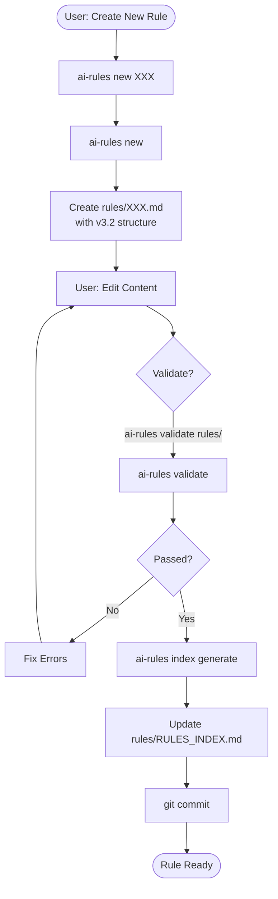
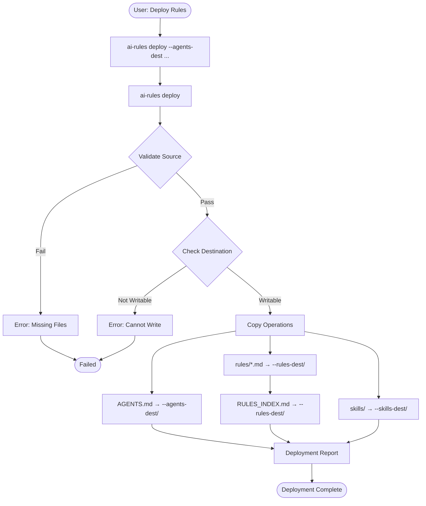

# Architecture: AI Coding Rules

**Last Updated:** 2026-05-14

> **What this document is**
> Design and rationale of the AI Coding Rules system: how it's shaped, why, and what extension points exist.
>
> **What this document is not**
> - Installation and usage → see [README.md](../README.md)
> - Contributing rules → see [CONTRIBUTING.md](../CONTRIBUTING.md)
> - Per-skill guides → see [docs/USING_*_SKILL.md](.)
> - Token budget tooling → see [TOKEN_BUDGETS.md](TOKEN_BUDGETS.md)
> - Memory bank usage → see [MEMORY_BANK.md](MEMORY_BANK.md)

## Table of Contents

- [1. Overview](#1-overview)
- [2. Key Architectural Concepts](#2-key-architectural-concepts)
- [3. System Components](#3-system-components)
- [4. Rule Loading Workflow](#4-rule-loading-workflow)
- [5. Design Decisions](#5-design-decisions)
- [6. Extension Points](#6-extension-points)
- [7. Related Documentation](#7-related-documentation)

---

## 1. Overview

> **Architecture update (2026-05-17, v3.8.0):** AGENTS.md is now a thin bootstrap pointer that invokes the `rule-loader` skill and references `rules/000-global-core.md` for the canonical Rule Loading Contract (R1-R8, with R8 binding the `**Depends:**` `required:`/`optional:` bucket grammar). Workflow content (foundation loading, domain matching, activity matching, dependency resolution, token budget, task switch detection, anti-patterns, failure modes, project tool discovery) lives in the skill at `skills/rule-loader/`. Sections 4 and 5 of this document describe the previous flow; the same logical workflow now lives in skill files instead of inline in AGENTS.md.

### 1.1 The Problem

AI assistants need consistent, high-signal guidance to produce reliable code across many domains. The default options are poor: stuffing every rule into a single system prompt wastes context, and IDE-specific formats fragment the same information across tools that don't share a standard.

AI Coding Rules solves this by storing rules as Markdown files with embedded metadata. An AI assistant loads a foundation rule, searches an index for task-relevant rules, and pulls only what it needs. This keeps context small while preserving depth.

### 1.2 Core Architecture Principles

1. **Production-Ready by Default.** Rule files in `rules/` are directly editable and deployment-ready.
2. **No Generation Step.** Rules live in their final form, so there's no build step.
3. **Universal Format.** Standard Markdown with embedded metadata works with any AI assistant or IDE.
4. **Schema-Validated.** A declarative YAML schema enforces consistency.
5. **Agent-Agnostic Deployment.** Optional destination flags (`--agents-dest`, `--rules-dest`, `--skills-dest`) deploy each artifact to the project location it belongs in.

### 1.3 High-Level System Diagram

```
┌──────────────────────────────────────────────────────────────────┐
│                    AI CODING RULES                                │
│                                                                   │
│   rules/ ─────────► RULES_INDEX.md ─────────────────► AGENTS.md           │
│   (195 files)       (searchable                (bootstrap         │
│                      catalog)                    protocol)        │
│         │                                          │              │
│         ▼                                          ▼              │
│   schemas/ ────► ai-rules CLI ────► Deployer ────► AI Assistant   │
│   (validation)   (validate,         (split by      (Claude,       │
│                   index, deploy)     artifact)      Cursor, …)    │
│                                                                   │
│   skills/  ─────────────────────────────────────► (agent          │
│   (agent-invokable                                  invocation)   │
│    capabilities)                                                  │
└──────────────────────────────────────────────────────────────────┘
```

The user clones this repository, optionally edits or adds rules, and runs `ai-rules deploy` to copy rules and a bootstrap protocol into a target project. The AI assistant in that project then auto-loads `AGENTS.md` and pulls rules from `rules/` on demand.

---

## 2. Key Architectural Concepts

### 2.1 Rule Files

A rule is a single Markdown file under `rules/`. Every rule has metadata (version, keywords, dependencies, token budget, context tier), a scope statement, references, and a structured contract that defines mandatory and forbidden behaviors plus execution steps.

Rules are designed to be loaded by an LLM with no preprocessing. The same file is editable by a human contributor, parsed by the validator, indexed by the index generator, and consumed by the AI assistant at runtime.

For the full rule template and field-by-field structure, see [CONTRIBUTING.md → Rule Structure](../CONTRIBUTING.md#rule-structure). The authoritative schema lives in [`schemas/rule-schema.yml`](../schemas/rule-schema.yml).

### 2.2 Companion Rule Pattern

Rules use letter suffixes to split large topics into focused, independently-loadable companion files. This is the primary architectural pattern for managing token budgets without losing depth.

**Naming Convention:** `<NNN><letter>-<technology>-<aspect>.md`

- Core rule: `NNN-technology-core.md` (no suffix). Foundation, always loaded first.
- Companions: `NNNa-technology-aspect.md`, `NNNb-…`, `NNNc-…`, etc.
- Letter suffixes must be single lowercase letters (a-z); multi-character suffixes are not permitted.

**How it works:**

1. The core rule provides foundational concepts and is the dependency target.
2. Companion rules extend the core with specialized subtopics.
3. Only the companions relevant to the current task are loaded.
4. All companions declare the core rule in their `Depends` field with the `required:` bucket prefix (see `rules/000-global-core.md` R8 and `rules/002-rule-governance.md` "Depends Bucket Semantics").

**Token budget benefits:**

- A Streamlit security task loads `101-core` + `101c-security` (~4K tokens) instead of all 15 Streamlit files (~25K+ tokens).
- Progressive expansion: start with core, add companions as task complexity grows.
- Independent updates: modify a companion without affecting siblings.

**Design constraints:**

- Core rule must be self-sufficient for basic tasks (companions are optional extensions).
- Companions must not create circular dependencies.
- Each companion should cover a single, clearly delineated subtopic.
- Split when a rule exceeds ~5500 tokens and covers multiple separable concepts.

**Rule size thresholds:**

| Threshold | Lines | Tokens | Action |
|-----------|-------|--------|--------|
| Optimal | 200-400 | ~2000-3500 | Standard rules, load normally |
| Advisory limit | 500 | ~5000 | Begin evaluating split candidates |
| Hard cap | 600 | ~5500+ | Must split into companion files |

### 2.3 Context Management

The repository uses a dual-layer approach for context preservation:

**Primary layer: natural language instructions (universal):**
- CRITICAL warnings in `AGENTS.md` and `000-global-core.md`.
- CORE RULE / FOUNDATION RULE markers in all `-core.md` and `002-series` files.
- Context Management Protocol in `000-global-core.md` teaching explicit preservation hierarchy.
- Works across all LLMs: Claude, GPT, Gemini, Llama, etc.

**Secondary layer: `ContextTier` metadata (project-specific):**
- Critical / High / Medium / Low values in rule metadata.
- Provides fine-grained prioritization within natural-language tiers.
- Validated by schema but not universally recognized by LLMs.
- Kept for compatibility and secondary signaling.

**Design principle:** never rely solely on metadata that LLMs don't natively understand. Natural-language instructions are the primary mechanism for ensuring consistent behavior.

See `000-global-core.md` → "Context Window Management Protocol" for implementation details.

### 2.4 Schema-First Design

Rule structure is declared in [`schemas/rule-schema.yml`](../schemas/rule-schema.yml) rather than hard-coded in validator logic. The schema is the specification: validator code interprets it, contributors read it to understand requirements, and external tools can parse it without coupling to the validator implementation.

Adding a new validation requirement is typically a schema-only change. See §5.3 for the full rationale.

### 2.5 Directive Language

Rules use a structured directive vocabulary (`Critical`, `Mandatory`, `Always`, `Requirement`, `Rule`, `Consider`) so that AI agents can apply consistent priority across rule content. The hierarchy is defined canonically in [CONTRIBUTING.md → Directive Language](../CONTRIBUTING.md#directive-language). Rules consume the vocabulary but do not redefine it.

### 2.6 Rule Numbering Convention

The `rules/` directory uses numeric ranges to group rules by domain. The full mapping (000-099 foundation, 100-199 Snowflake, 200-299 Python, 300-399 shells, 400-499 JavaScript, 500-599 frontend, 600-699 systems, 800-899 project tooling, 900-999 dbt, etc.) is documented in [README.md → Rule Categories](../README.md#rule-categories).

A new rule's number is determined by the domain it covers. Within a range, the core rule has no suffix and companions use single-letter suffixes per §2.2.

---

## 3. System Components

Each component below is described at the architecture layer only. For installation, command reference, and how-to material, follow the link to the component's canonical documentation.

### 3.1 The `rules/` Directory

The `rules/` directory is the single source of truth for all rules. Files are production-ready and directly editable; no generation step stands between source and deployment.

**Layout:**

```
rules/
├── 000-global-core.md             # Foundation (always loaded first)
├── 001-memory-bank.md             # Optional memory-bank protocol
├── 002-rule-governance.md (+002a-002m, 002n companions)
├── 100-snowflake-core.md          # Domain cores with companion families
├── 101-snowflake-streamlit-core.md (+101a-101n)
├── 200-python-core.md (+200a-200b)
├── 600-golang-core.md
├── ...                            # 194 rules covering all domains
└── examples/                      # Validated implementation examples
```

**Design decisions:**

- Files are loaded by AI assistants verbatim. Anything that should not appear in an LLM's context window does not belong in this directory.
- `rules/RULES_INDEX.md` is regenerated by `ai-rules index generate` from rule metadata; never hand-edit it.
- `examples/` holds runnable reference implementations validated against `schemas/example-schema.yml` rather than the rule schema.

For the file naming convention, rule lifecycle, and contribution flow, see [CONTRIBUTING.md](../CONTRIBUTING.md).

### 3.2 The Schema (`schemas/rule-schema.yml`)

The schema is a declarative YAML document that defines what a valid rule file looks like: required sections, metadata fields and patterns, severity levels, allowed orderings, and section-specific constraints. The validator (`ai-rules validate`) reads the schema and applies it to rule files.

**Architecture:**

```
schemas/rule-schema.yml
├── version + project metadata
├── metadata.required_fields[]      # SchemaVersion, RuleVersion, etc.
├── sections.required[]             # Scope, References, Contract, …
├── content_validation              # tier/keyword/dependency rules
└── severity_levels                 # CRITICAL / HIGH / MEDIUM / LOW
```

**Key design decisions:**

1. **Schema is the specification.** Contributors learn rule structure from the YAML, not from validator code.
2. **Severity-tiered findings.** CRITICAL fails CI; HIGH/MEDIUM/LOW are reported but configurable.
3. **External-tool friendly.** Other tools (linters, generators, IDE plugins) can parse the schema without depending on `ai-rules`.

For schema field reference and validation usage, see [`schemas/rule-schema.yml`](../schemas/rule-schema.yml) and [CONTRIBUTING.md → Rule Validation](../CONTRIBUTING.md#rule-validation).

### 3.3 The CLI (`ai-rules`)

The `ai-rules` CLI is a Typer-based Python application installed as a package entry point in `pyproject.toml`. It owns all rule lifecycle operations: creation, validation, indexing, token-budget checks, deployment, and badge updates.

**Architecture:**

```
src/ai_rules/
├── __main__.py        # python -m ai_rules entry point
├── cli.py             # Typer app: registers all commands
├── _shared/           # Cross-command utilities (paths, console)
└── commands/          # One module per command (validate, index, deploy, …)
```

**Key design decisions:**

1. **One command per file.** Each subcommand lives in its own module under `commands/` for testability.
2. **Shared utilities only in `_shared/`.** Cross-cutting helpers (project root detection, Rich console formatting) avoid duplication without coupling.
3. **All commands write structured output.** Logs flow through `_shared/console.py` so verbose / quiet modes are uniform.

For the full command reference, see [README.md → CLI Commands](../README.md#cli-commands).

### 3.4 The Deployer

The deployer writes the bootstrap protocol (`AGENTS.md`) to `--agents-dest` and optionally copies `rules/` and `skills/` to `--rules-dest` and `--skills-dest` respectively. When only `--agents-dest` is given (agents-only deploy), no rules or skills are copied; instead the generated `AGENTS.md` references the ai\_coding\_rules project's own `rules/` and `skills/` directories as absolute paths. Deployment is split by artifact so it can adapt to any project layout.

**Architecture:**

```
ai-rules deploy
├── Validate source structure
├── Resolve target paths (--agents-dest / --rules-dest / --skills-dest)
├── Render AGENTS.md template (with rules/skills path substitution)
├── Copy rules/ → --rules-dest  (excluded skills filtered)
├── Copy skills/ → --skills-dest (optional)
└── Emit deployment report
```

**Key design decisions:**

1. **Templates as source of truth.** `templates/AGENTS_NO_MODE.md.template` (default) and `templates/AGENTS_MODE.md.template` (opt-in via `--with-mode`) are the canonical AGENTS.md content; deployment substitutes paths into the template.
2. **Skill exclusions are config-driven.** `pyproject.toml` `[tool.rule_deployer].exclude_skills` keeps internal-only skills out of deployments.
3. **No write-by-default.** `--dry-run` previews exactly what will be copied, including paths and substitutions.
4. **Sentinel-gated template sections.** Both templates use `<!-- MODE-ONLY:start/end -->` and `<!-- NO-MODE-ONLY:start/end -->` sentinel comments to bracket variant-specific content. `strip_template_markers()` removes these sentinels (plus the `<!-- Template: ... -->` header) from the deployed file so no bookkeeping comments reach the AI assistant. The `tests/templates/` parity test validates that both templates share the same non-conditional structure.
5. **NO_MODE is the default.** `ai-rules deploy --agents-dest X` produces the auto-execute (NO_MODE) variant. Pass `--with-mode` to deploy the PLAN/ACT (MODE) variant. Internally the CLI computes `no_mode = not with_mode`; the internal `no_mode` parameter throughout `deploy_rules` and helpers is unchanged.
6. **Skills-only deployment.** `--only-skills` deploys only `skills/` to `--skills-dest`, skipping AGENTS.md and rules entirely. The `--skills-dest` requires `--agents-dest` constraint is relaxed when `--only-skills` is active.
7. **Rule-path resolution.** `{{rules_path}}` / `{{skills_path}}` in AGENTS.md templates are replaced with the absolute `--rules-dest` / `--skills-dest` paths when those flags are given (files are also copied there). When a destination is absent (agents-only deploy), the placeholder is set to the ai\_coding\_rules project's own absolute `rules/` or `skills/` directory — no files are copied to the target project. This means the target's `AGENTS.md` points at the live ai\_coding\_rules repository, so that repository must remain in place. `RULES_INDEX.md` is only copied when `--rules-dest` is given; `copy_root_files()` rewrites its relative `rules/` prefixes to the absolute deployed path at that time.

For deployment commands and destination configuration, see [README.md → Quick Start](../README.md#quick-start).

### 3.5 Agent Skills Architecture

The project includes Agent Skills following [Anthropic's best practices](https://claude.com/blog/equipping-agents-for-the-real-world-with-agent-skills). Skills are agent-invokable, modular capabilities that live under `skills/<skill-name>/` with a consistent layout.

**Common Skill Layout:**

```
skills/<skill-name>/
├── SKILL.md           # Main entrypoint with YAML frontmatter
├── CHANGELOG.md       # Skill version history
├── workflows/         # Optional: phase-specific guides loaded on demand
├── rubrics/           # Optional: scoring rubrics for review-style skills
├── examples/          # Optional: walkthroughs and edge-case scenarios
└── tests/             # Optional: test cases for skill validation
```

`SKILL.md` is the only required file. Optional subdirectories are added as a skill grows in complexity, allowing simple skills to remain a single file while larger skills decompose into focused workflow and rubric files.

**YAML Frontmatter (SKILL.md):**

```yaml
---
name: <skill-name>
description: <one-sentence purpose plus invocation triggers>
version: 1.0.0
---
```

The frontmatter is parsed by the agent at skill discovery time. The `description` field doubles as the trigger surface: it should describe both what the skill does and the phrases that should invoke it.

**Design decisions:**

1. **Hybrid Code Embedding.** Simple validation lives inline in `SKILL.md`; complex scripts are external files referenced by path.
2. **Progressive Disclosure.** Workflow files are loaded on demand by the skill, not eagerly at invocation time. This keeps the entrypoint small and predictable.
3. **Edge Case Documentation.** Skills with non-trivial decision logic include an `examples/edge-cases.md` covering ambiguous scenarios.
4. **Cross-Skill Integration.** Reviewer skills can be invoked against the output of authoring skills to enforce quality gates without coupling.

**User-facing documentation:**

Larger project-maintenance skills ship with a `docs/USING_<SKILL_NAME>_SKILL.md` user guide containing examples, mode tables, FAQ, and reference material. Smaller workflow skills are documented primarily in their own `SKILL.md` files. Architectural details about how a specific skill works belong in that skill's own documentation, not in this file.

---

## 4. Rule Loading Workflow

AI assistants follow a two-phase loading process: auto-loading by the IDE/tool, then on-demand rule discovery via the bootstrap protocol.

### 4.1 Loading Sequence

```
┌─────────────────────────────────────────────────────────────────────────┐
│                     AI ASSISTANT INITIALIZATION                         │
└─────────────────────────────────────────────────────────────────────────┘
                                    │
                                    ▼
┌─────────────────────────────────────────────────────────────────────────┐
│ PHASE 1: AUTO-LOADED BY IDE/TOOL (Parallel)                             │
│                                                                         │
│   ┌─────────────┐              ┌─────────────┐                          │
│   │  AGENTS.md  │              │ PROJECT.md  │                          │
│   │ (Bootstrap  │              │  (Project   │                          │
│   │  Protocol)  │              │   Config)   │                          │
│   └─────────────┘              └─────────────┘                          │
│         │                            │                                  │
│         │ Defines rule loading       │ Defines project-specific         │
│         │ sequence (auto-execute by  │ tooling requirements and         │
│         │ default; MODE/ACT via      │ validation gates                 │
│         │ --with-mode)               │                                  │
└─────────────────────────────────────────────────────────────────────────┘
                                    │
                                    ▼
┌─────────────────────────────────────────────────────────────────────────┐
│ PHASE 2: RULE LOADING PROTOCOL (Sequential, per AGENTS.md)              │
│                                                                         │
│   Step 1: Load Foundation                                               │
│   ┌────────────────────────┐                                            │
│   │ rules/000-global-core  │  Always loaded first, no exceptions        │
│   │ (Foundation Rule)      │  Defines MODE transitions, validation      │
│   └────────────────────────┘                                            │
│              │                                                          │
│              ▼                                                          │
│   Step 2: Search for Domain Rules                                       │
│   ┌────────────────────────┐                                            │
│   │    RULES_INDEX.md        │  Search Keywords field for task matches    │
│   │    (flat RULES_INDEX.md) │  Check Depends field for prerequisites     │
│   └────────────────────────┘                                            │
│              │                                                          │
│              ▼                                                          │
│   Step 3: Load Domain + Activity Rules                                  │
│   ┌────────────────────────┐                                            │
│   │  rules/XXX-domain.md   │  Load based on file extensions, keywords   │
│   │  rules/YYY-activity.md │  Load dependencies first (Depends field)   │
│   └────────────────────────┘                                            │
└─────────────────────────────────────────────────────────────────────────┘
                                    │
                                    ▼
┌─────────────────────────────────────────────────────────────────────────┐
│ READY: Agent has loaded context, begins in MODE: PLAN                   │
└─────────────────────────────────────────────────────────────────────────┘
```

### 4.2 File Responsibilities

| File | Loading | Purpose |
|------|---------|---------|
| **AGENTS.md** | Auto-loaded by IDE | Bootstrap protocol, rule discovery instructions (auto-execute by default; MODE/ACT framework included when deployed with `--with-mode`) |
| **PROJECT.md** | Auto-loaded by IDE | Project-specific tooling, validation requirements, critical violations |
| **RULES_INDEX.md** | Referenced by AGENTS.md | Searchable catalog of all rules with keywords and dependencies |
| **rules/000-global-core.md** | First rule loaded | Foundation patterns, MODE transitions, validation gates |
| **rules/XXX-*.md** | Loaded on demand | Domain and activity-specific rules based on task requirements |

### 4.3 Key Design Decisions

1. **Parallel auto-loading.** `AGENTS.md` and `PROJECT.md` are loaded simultaneously by the IDE, not sequentially.
2. **`PROJECT.md` is not part of the rule chain.** It's project configuration, not a rule file.
3. **Sequential rule loading.** Rules load in dependency order per the AGENTS.md protocol.
4. **Lazy loading.** Specialized rules load only when needed (token optimization).

### 4.4 Rule Creation Flow


```mermaid
flowchart TD
    Start([User: Create New Rule]) --> Generate
    Generate["ai-rules new XXX"] --> Template
    Template[ai-rules new] --> Create[Create rules/XXX.md<br/>with v3.2 structure]
    Create --> Edit[User: Edit Content]
    Edit --> Validate{Validate?}
    Validate -->|"ai-rules validate rules/"| SchemaVal[ai-rules validate]
    SchemaVal --> Pass{Passed?}
    Pass -->|No| Fix[Fix Errors]
    Fix --> Edit
    Pass -->|Yes| Index["ai-rules index generate"]
    Index --> UpdateIndex[Update rules/RULES_INDEX.md]
    UpdateIndex --> Commit[git commit]
    Commit --> End([Rule Ready])
```

### 4.5 Deployment Flow


```mermaid
flowchart TD
    Start([User: Deploy Rules]) --> Command
    Command["ai-rules deploy --agents-dest ..."] --> Deployer
    Deployer[ai-rules deploy] --> Validate{Validate Source}
    Validate -->|Fail| Error[Error: Missing Files]
    Validate -->|Pass| CheckDest{Check Destination}
    CheckDest -->|Not Writable| Error2[Error: Cannot Write]
    CheckDest -->|Writable| Copy
    Copy[Copy Operations] --> CopyAgents[AGENTS.md → --agents-dest/]
    Copy --> CopyRules[rules/*.md → --rules-dest/]
    CopyRules --> CopyIndex[RULES_INDEX.md → --rules-dest/]
    Copy --> CopySkills[skills/ → --skills-dest/]
    CopyAgents --> Report[Deployment Report]
    CopyIndex --> Report
    CopySkills --> Report
    Report --> Success([Deployment Complete])

    Error --> End([Failed])
    Error2 --> End
```

---

## 5. Design Decisions

This section captures the rationale behind the major architectural choices. Each subsection follows the same shape: decision, rationale, trade-offs accepted.

### 5.1 Why Production-Ready Rules?

**Decision:** Store rules in final, deployable form instead of templates requiring generation.

**Rationale:**

1. **Simplicity.** Users clone and use immediately, no build step.
2. **Transparency.** What you see is what you get; no hidden transformations.
3. **Maintainability.** Single source of truth (no template/generated divergence).
4. **Universality.** Standard Markdown works with any AI assistant or IDE.
5. **Velocity.** Direct editing is faster than an edit-generate-deploy cycle.

**Trade-offs accepted:**

- Cannot generate IDE-specific formats (e.g., Cursor `.mdc` with auto-apply).
- Manual metadata management (mitigated by schema validation).
- Larger git diffs (entire rule files, not just templates).

**Industry alignment:**

- Hugo / Jekyll use content directly (not templates).
- Modern CI/CD prefers artifact generation over source generation.
- Infrastructure-as-code stores desired state, not generation instructions.

### 5.2 Why a Single Universal Format?

**Decision:** Use one Markdown format instead of multiple IDE-specific formats.

**Rationale:**

1. **No lock-in.** Users are free to switch AI assistants without migration.
2. **Broader compatibility.** Works with emerging tools (Claude Code, Cursor, Gemini, etc.).
3. **Easier contribution.** Contributors edit one file, not four.
4. **Metadata preservation.** `Keywords` / `TokenBudget` / `ContextTier` enable intelligent loading.
5. **Simpler architecture.** Focused CLI commands instead of monolithic generation.

**What we lost:**

- IDE-specific features (Cursor `globs`/`alwaysApply`, Copilot `appliesTo`).
- Automatic rule application (users must configure paths).
- Format-specific optimizations.

**What we gained:**

- Universal compatibility.
- Simpler maintenance.
- Faster contribution workflow.
- Clear upgrade path to future AI tools.

### 5.3 Why a Declarative Schema?

**Decision:** Define validation in YAML instead of hard-coded Python logic.

**Rationale:**

1. **Separation of concerns.** Schema definition is separate from validation implementation.
2. **Extensibility.** Add new checks without modifying validator code.
3. **Documentation.** The schema file is the specification.
4. **Version control.** Schema changes tracked independently.
5. **Tooling.** External tools (linters, generators) can parse the schema directly.

**Implementation pattern:**

```yaml
# schemas/rule-schema.yml
sections:
  required:
    - name: Contract
      order: 4
      required_before_line: 160
```

vs. the older hard-coded approach:

```python
if "Contract" not in sections:
    errors.append("Missing Contract section")
if sections["Contract"]["line"] > 160:
    errors.append("Contract must appear before line 160")
```

**Benefits realized:**

- New validation rules added with schema-only edits.
- Contributors can read requirements from the schema alone.
- Validator logic stays small.

### 5.4 Why Parallel Sub-Agents for Bulk Operations?

**Decision:** Use parallel sub-agents (not sequential in-context execution) for bulk rule reviews.

**Rationale:**

1. **Context drift prevention.** Fresh context per sub-agent eliminates quality degradation after 50+ rules.
2. **Speed.** Roughly 5× faster execution (~50 minutes vs 4-6 hours for 180 rules).
3. **Isolation.** One sub-agent failing doesn't stop others; partial results are preserved.
4. **Full protocol preservation.** Each sub-agent loads complete protocols freshly.
5. **No file conflicts.** Unique filenames (`rule-name-model-date.md`) prevent write races.

**Architecture:**

```
┌─────────────────────────────────────────────────────────────────────────┐
│                    BULK-RULE-REVIEWER (Coordinator)                      │
│   • Partitions rules into N groups                                       │
│   • Launches N sub-agents in background                                  │
│   • Monitors progress via agent_output polling                           │
│   • Aggregates results when all complete                                 │
└─────────────────────────────────────────────────────────────────────────┘
         │              │              │              │              │
         ▼              ▼              ▼              ▼              ▼
   ┌──────────┐  ┌──────────┐  ┌──────────┐  ┌──────────┐  ┌──────────┐
   │ Worker 1 │  │ Worker 2 │  │ Worker 3 │  │ Worker 4 │  │ Worker 5 │
   │ Rules    │  │ Rules    │  │ Rules    │  │ Rules    │  │ Rules    │
   │ 1-26     │  │ 27-52    │  │ 53-78    │  │ 79-104   │  │ 105-129  │
   └──────────┘  └──────────┘  └──────────┘  └──────────┘  └──────────┘
         │              │              │              │              │
         ▼              ▼              ▼              ▼              ▼
   ┌──────────────────────────────────────────────────────────────────┐
   │           Direct File Writes (No Conflicts)                       │
   │   reviews/rule-reviews/<rule>-<model>-<date>.md                   │
   └──────────────────────────────────────────────────────────────────┘
```

**Trade-offs accepted:**

- More complex orchestration logic.
- Requires `agent_output` polling for progress.
- Higher token usage (duplicate protocol loading per sub-agent).

**Why not sequential?**

- Context drift causes quality degradation in long sessions.
- Single-threaded: 4-6 hours for 100+ rules.
- One failure can halt the entire process.
- Sequential is available as a fallback via `max_parallel: 1`.

---

## 6. Extension Points

The system is designed to be extended without forking. The four most common extension surfaces are below.

### 6.1 Adding New Rules

Rule authoring is the most frequent extension. Use `uv run ai-rules new NNN-description` to scaffold a new rule, then fill in content per the schema. Validate with `uv run ai-rules validate rules/` and regenerate the index with `ai-rules index generate`.

For the full rule-creation workflow, see [CONTRIBUTING.md → Adding a New Rule](../CONTRIBUTING.md#adding-a-new-rule).

### 6.2 Customizing the Schema

Organizations that need additional validation (e.g., requiring an `Author` field, enforcing peer review) can fork the schema rather than the validator code:

1. Copy `schemas/rule-schema.yml` to `schemas/custom-schema.yml`.
2. Add or modify validation rules in YAML.
3. Run with `ai-rules validate rules/ --schema schemas/custom-schema.yml`.

**Trade-offs:** custom schemas prevent direct upstream merges and require maintenance when the upstream schema evolves.

### 6.3 Adding Custom Automation

To add organization-specific commands, drop a new module under `src/ai_rules/commands/`, register it in `src/ai_rules/cli.py`. Existing commands (`validate.py`, `index.py`) work as templates. Tests follow the patterns in `tests/cli/`.

### 6.4 IDE-Specific Enhancements

Universal Markdown is the default, but IDE-specific formats (Cursor `.mdc`, Copilot `appliesTo`, etc.) can be generated at deploy time. The pattern is to add a deploy variant (e.g., `deploy_cursor.py`) that wraps the universal Markdown with IDE-specific frontmatter rather than maintaining parallel source files.

This preserves the single-source-of-truth invariant while letting downstream consumers opt into richer formats.

### 6.5 Periodic Rule Review

The `rule-reviewer` and `bulk-rule-reviewer` skills automate quality reviews. Recommended cadence:

- **Foundation rules (000-*):** quarterly, FULL mode.
- **Domain cores (1XX, 2XX, …):** quarterly, STALENESS mode.
- **Specialized / activity rules:** semi-annually, STALENESS mode.
- **Reference rules (>5000 tokens):** annually, STALENESS mode.

For review modes, scoring rubrics, and invocation, see [USING_RULE_REVIEWER_SKILL.md](USING_RULE_REVIEWER_SKILL.md) and [USING_BULK_RULE_REVIEWER_SKILL.md](USING_BULK_RULE_REVIEWER_SKILL.md).

---

## 7. Related Documentation

### 7.1 Core Documentation

- **[README.md](../README.md)**: quick start, deployment, and CLI reference.
- **[CONTRIBUTING.md](../CONTRIBUTING.md)**: development guidelines, rule authoring, and PR workflow.
- **[CHANGELOG.md](../CHANGELOG.md)**: version history.

### 7.2 Per-Skill Guides

| Skill | Guide |
|-------|-------|
| `bulk-rule-reviewer` | [USING_BULK_RULE_REVIEWER_SKILL.md](USING_BULK_RULE_REVIEWER_SKILL.md) |
| `rule-creator` | [USING_RULE_CREATOR_SKILL.md](USING_RULE_CREATOR_SKILL.md) |
| `rule-loader` | [USING_RULE_LOADER_SKILL.md](USING_RULE_LOADER_SKILL.md) |
| `rule-reviewer` | [USING_RULE_REVIEWER_SKILL.md](USING_RULE_REVIEWER_SKILL.md) |
| `skill-timer` | [USING_SKILL_TIMER_SKILL.md](USING_SKILL_TIMER_SKILL.md) |

### 7.3 Tooling and Optional Features

- **[TOKEN_BUDGETS.md](TOKEN_BUDGETS.md)**: token-budget validation tool reference.
- **[MEMORY_BANK.md](MEMORY_BANK.md)**: optional Memory Bank system for long-running projects.
- **[EVALUATING_RULE_LOADER.md](EVALUATING_RULE_LOADER.md)**: Rule Loading Evaluator. Pre-commit live-agent sanity check that the agent loads the expected rules (including dependency rules) for each fixture. CI runs only the trigger-evidence invariant; the live SDK runs locally.

### 7.4 Schema and Validation

- **[Schema Documentation](../schemas/README.md)**: current schema specification and field reference.
- **[`schemas/rule-schema.yml`](../schemas/rule-schema.yml)**: authoritative declarative validation schema.

### 7.5 External References

- **[Anthropic Agent Skills best practices](https://claude.com/blog/equipping-agents-for-the-real-world-with-agent-skills)**: background on the Agent Skills model used in section 3.5.
- **[CommonMark Spec](https://spec.commonmark.org/)**: all rule files comply with CommonMark Markdown.
