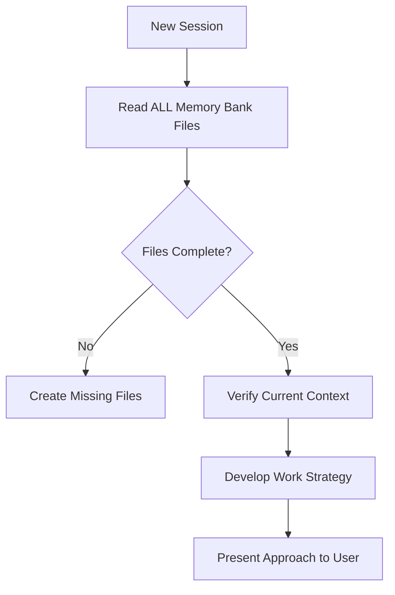
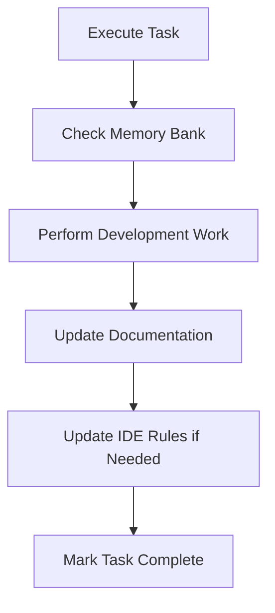

# Memory Bank System

> **Note:** Memory Bank is an optional feature designed for complex, long-running projects with multiple AI sessions. It's not required for basic rule usage.

## Overview

The Memory Bank is a project-level documentation system that enables AI assistants to maintain context and continuity across sessions. Since AI assistants reset their memory between sessions, the Memory Bank serves as the critical link for understanding project state, decisions, and ongoing work.

### The Problem

When an AI assistant starts a new session, it has no knowledge of previous work, decisions, or project context. This creates challenges for:

- Understanding project history and architectural decisions
- Maintaining consistency across multiple development sessions
- Avoiding repeated questions about project structure
- Tracking progress on long-running tasks

### The Solution

The Memory Bank addresses these challenges by maintaining a structured set of documentation files that capture:

- **Project foundation** — Core requirements, goals, and scope
- **System architecture** — Technical decisions and design patterns  
- **Current context** — Active work, recent changes, and next steps
- **Development progress** — What works, what's left to build, known issues

## File Structure

The Memory Bank uses a hierarchical structure with required core files:

```
memory-bank/
├── projectbrief.md      # Foundation document (project scope & goals)
├── productContext.md    # Why project exists, problems solved
├── systemPatterns.md    # Architecture & technical decisions  
├── techContext.md       # Technologies, setup, constraints
├── activeContext.md     # Current work focus & recent changes
├── progress.md          # Status, what works, known issues
└── [additional]/        # Optional: features, APIs, testing docs
```

### Core Files (Required)

| File | Purpose |
|------|---------|
| `projectbrief.md` | Foundation document defining core requirements and project scope |
| `productContext.md` | Business context: why project exists, problems solved, user experience goals |
| `systemPatterns.md` | System architecture, key technical decisions, design patterns |
| `techContext.md` | Technologies used, development setup, technical constraints |
| `activeContext.md` | Current work focus, recent changes, next steps, active decisions |
| `progress.md` | Current status, what works, what's left to build, known issues |

## Getting Started

### Initialization

For new projects, create the memory bank structure:

```bash
# Create memory bank directory
mkdir memory-bank

# Initialize core files (manual creation)
touch memory-bank/{projectbrief,productContext,systemPatterns,techContext,activeContext,progress}.md
```

The Memory Bank can be automatically created by your AI assistant when you request:

```
"initialize memory bank"
```

### Update Commands

The Memory Bank updates automatically during development, triggered by:

1. **Explicit user request**: `"update memory bank"`
2. **After significant changes**: Major feature implementations or architectural decisions
3. **Context clarification needs**: When project understanding requires documentation
4. **Pattern discovery**: New technical patterns or workflow insights

## Workflow Integration

### Plan Mode Workflow



### Act Mode Workflow  



## Usage Examples

### Starting a New Session

```bash
# AI assistant workflow (automatic)
1. Read all memory-bank/*.md files
2. Understand current project state  
3. Review activeContext.md for recent work
4. Check progress.md for known issues
5. Proceed with informed context
```

### Updating Memory Bank

```bash
# User command
"update memory bank"

# AI assistant workflow (automatic)
1. Review ALL memory bank files
2. Update current state in activeContext.md
3. Record progress in progress.md  
4. Document new patterns in systemPatterns.md
5. Update technical context if needed
```

## Best Practices

### Reading the Memory Bank

- **Always read**: Memory Bank files at session start (non-optional for AI assistants)
- **Full context**: Read all core files, not just one or two
- **Current focus**: Pay special attention to activeContext.md and progress.md
- **Historical awareness**: Review systemPatterns.md for architectural constraints

### Updating the Memory Bank

- **Update frequently**: After major changes or discoveries
- **Be precise**: Accuracy directly impacts work effectiveness
- **Stay organized**: Use additional files for complex features
- **Keep current**: Remove outdated information regularly
- **Document decisions**: Capture the "why" behind technical choices

### Maintenance

- **Weekly**: Review activeContext.md and progress.md for accuracy
- **After features**: Update progress.md when completing major work
- **Architecture changes**: Update systemPatterns.md immediately
- **Quarterly**: Full review of all files for staleness

## When to Use Memory Bank

### Good Use Cases

- **Long-running projects** with development spanning weeks or months
- **Complex architectures** requiring detailed technical documentation
- **Multiple AI sessions** where context continuity matters
- **Team collaboration** where AI assists need shared understanding
- **Evolving requirements** that need historical tracking

### When to Skip

- **Quick scripts** or one-off projects
- **Simple applications** with minimal architecture
- **Single-session work** that completes quickly
- **Well-documented projects** with existing comprehensive docs
- **Learning/exploration** where formal structure adds overhead

## Advanced Patterns

### Additional Files

For complex projects, you may add specialized files:

```
memory-bank/
├── [core files...]
├── features/
│   ├── authentication.md    # Detailed auth implementation
│   ├── api-design.md        # API architecture
│   └── data-pipeline.md     # Data processing details
├── apis/
│   └── external-services.md # Third-party integrations
└── testing/
    └── test-strategy.md     # Testing approach
```

### Integration with Version Control

Add `.gitignore` patterns if you want to keep Memory Bank files local:

```gitignore
# Keep Memory Bank local (optional)
memory-bank/
```

Or commit Memory Bank files to share context with team and AI assistants:

```bash
# Commit Memory Bank for shared context
git add memory-bank/
git commit -m "docs: update memory bank with current project state"
```

## Troubleshooting

### Memory Bank Not Being Read

**Problem:** AI assistant doesn't seem aware of Memory Bank content.

**Solutions:**
1. Explicitly ask: "Please read all memory-bank files"
2. Verify files exist and have content
3. Check file names match expected structure
4. Ensure files are in project root or accessible path

### Stale Information

**Problem:** Memory Bank contains outdated information.

**Solutions:**
1. Request update: "update memory bank"
2. Manually review and edit outdated sections
3. Remove completed tasks from progress.md
4. Archive old decisions in systemPatterns.md with dates

### Overwhelming Detail

**Problem:** Memory Bank files are too long and detailed.

**Solutions:**
1. Move detailed info to additional files
2. Keep core files focused on essentials
3. Use summaries in core files, details in supplemental docs
4. Archive historical content periodically

## References

### Related Documentation

- [README.md](../README.md) - Project overview and setup
- [CONTRIBUTING.md](../CONTRIBUTING.md) - Development guidelines
- [docs/ARCHITECTURE.md](ARCHITECTURE.md) - System architecture details

### External Resources

- [Cline Memory Bank](https://docs.cline.bot/prompting/cline-memory-bank) - Original inspiration
- [Working with AI Assistants](https://docs.anthropic.com/claude/docs) - Claude documentation

