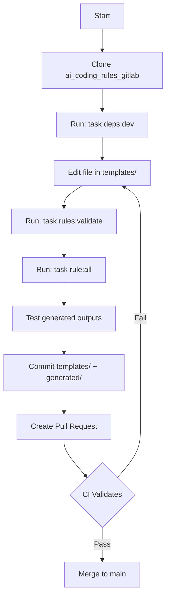

# End-User Workflows: Option 1 Structure

## Overview

After migrating to Option 1, there are **two distinct user personas** with different workflows:

1. **Rule System Maintainers** - Contributors to the ai_coding_rules repository
2. **Rule System Consumers** - Developers using rules in their projects

---

## Persona 1: Rule System Maintainers (Repository Contributors)

### Workflow: Adding or Updating Rules



#### Step-by-Step: Updating an Existing Rule

```bash
# 1. Clone and setup (one-time)
git clone https://snow.gitlab-dedicated.com/.../ai_coding_rules.git
cd ai_coding_rules
task deps:dev

# 2. Edit template (source of truth)
vim templates/200-python-core.md
# OR
vim templates/snowflake/100-snowflake-core.md  # If using subdirectories

# 3. Validate template follows governance
task rules:validate
# Checks: Required sections, metadata format, cross-references

# 4. Generate all outputs
task rule:all
# Creates:
#   - generated/universal/ (or rules/)
#   - generated/cursor/rules/
#   - generated/copilot/instructions/
#   - generated/cline/

# 5. Review changes
git status
git diff templates/200-python-core.md              # Template change
git diff generated/universal/200-python-core.md    # Generated change
git diff generated/cursor/rules/200-python-core.mdc

# 6. Commit both template and generated files
git add templates/200-python-core.md
git add generated/
git commit -m "feat: update Python core rule with uv improvements"

# 7. Push and create PR
git push origin feature/update-python-core
# Create PR on GitLab
```

#### Step-by-Step: Creating a New Rule

```bash
# 1. Create template using governance template
cp templates/000-global-core.md templates/205-python-new-feature.md

# 2. Edit template with new content
vim templates/205-python-new-feature.md
# Follow structure from 002-rule-governance.md

# 3. Update RULES_INDEX.md template
vim discovery/RULES_INDEX.md
# Add new row for 205-python-new-feature.md

# 4. Validate
task rules:validate

# 5. Generate all outputs
task rule:all

# 6. Commit
git add templates/205-python-new-feature.md
git add discovery/RULES_INDEX.md
git add generated/
git commit -m "feat: add Python new feature rule (205)"

# 7. Push and PR
git push origin feature/add-python-new-feature
```

#### Key Points for Maintainers

✅ **Single Source of Truth**: Only edit `templates/` directory
✅ **Always Regenerate**: Run `task rule:all` after template changes
✅ **Commit Both**: Commit both templates and generated outputs
✅ **Validate First**: Use `task rules:validate` before committing
❌ **Never Edit Generated Files Directly**: Changes will be overwritten

---

## Persona 2: Rule System Consumers (Project Developers)

### Workflow Options for End Users

End users have **three primary workflows** depending on their needs:

#### Option A: Use Pre-Generated Universal Rules (RECOMMENDED - Simplest)

**Best For**: Most users, any IDE/agent/LLM

```bash
# 1. Add ai_coding_rules as git submodule (OR download release)
cd my-project
git submodule add https://snow.gitlab-dedicated.com/.../ai_coding_rules.git .ai-rules

# 2. Verify rules/ directory exists in submodule
ls .ai-rules/generated/universal/
# OR if we expose as rules/:
ls .ai-rules/rules/

# 3. Add AGENTS.md to your AI assistant's context
# Cursor: @.ai-rules/generated/universal/AGENTS.md
# Claude Projects: Upload .ai-rules/generated/universal/AGENTS.md
# ChatGPT: Paste .ai-rules/generated/universal/AGENTS.md content

# 4. Point assistant to rules directory
# Your agent automatically loads rules from .ai-rules/generated/universal/

# Done! Rules are now available to your AI assistant
```

**User Experience:**
```
User: "Build a FastAPI application"

AI: Let me load the relevant rules first:
    - Reading .ai-rules/generated/universal/000-global-core.md
    - Reading .ai-rules/generated/universal/RULES_INDEX.md
    - Reading .ai-rules/generated/universal/200-python-core.md
    - Reading .ai-rules/generated/universal/210-python-fastapi-core.md
    
    Rules loaded. Following Python and FastAPI best practices...
    [Implementation follows]
```

**Update Workflow:**
```bash
# When ai_coding_rules updates
cd my-project
git submodule update --remote .ai-rules
git add .ai-rules
git commit -m "chore: update ai coding rules"
```

---

#### Option B: Use IDE-Specific Pre-Generated Rules

**Best For**: Users who want IDE-native integration

##### For Cursor Users

```bash
# Option B1: Symlink to IDE location
cd my-project
ln -s .ai-rules/generated/cursor/rules .cursor/rules

# Option B2: Copy to IDE location
cp -r .ai-rules/generated/cursor/rules .cursor/

# Option B3: Git submodule directly to .cursor/
git submodule add https://snow.gitlab-dedicated.com/.../ai_coding_rules.git .ai-rules
ln -s ../.ai-rules/generated/cursor/rules .cursor/rules
```

**User Experience:**
- Rules automatically appear in Cursor's AI context
- No manual rule loading needed
- Auto-attach rules activate automatically

**Update Workflow:**
```bash
# If using symlink (Option B1)
cd my-project
git submodule update --remote .ai-rules
# Symlink automatically points to updated rules

# If using copy (Option B2)
rm -rf .cursor/rules
cp -r .ai-rules/generated/cursor/rules .cursor/
git add .cursor/rules
git commit -m "chore: update cursor rules"
```

##### For GitHub Copilot Users

```bash
# Add to .github/instructions/
cd my-project
cp -r .ai-rules/generated/copilot/instructions/* .github/instructions/
git add .github/instructions/
git commit -m "chore: add GitHub Copilot instructions"
git push

# Wait 5-10 minutes for GitHub to index
# Rules now active in Copilot
```

##### For Cline Users

```bash
# Copy to .clinerules/
cd my-project
cp -r .ai-rules/generated/cline/* .clinerules/
git add .clinerules/
git commit -m "chore: add Cline rules"
```

---

#### Option C: Generate Custom Rules (Advanced)

**Best For**: Users who want project-specific customizations or subsets

```bash
# 1. Add ai_coding_rules as submodule
cd my-project
git submodule add https://snow.gitlab-dedicated.com/.../ai_coding_rules.git .ai-rules

# 2. Install dependencies
cd .ai-rules
task deps:dev

# 3. Generate only rules you need
# Example: Only Python rules for a Python project
cd ..
uv run .ai-rules/scripts/generate_agent_rules.py \
  --agent universal \
  --source .ai-rules/templates \
  --destination . \
  --filter "200-*.md,210-*.md,220-*.md"  # Hypothetical filter flag
# Generates rules/ in your project root

# 4. Customize generated rules (if needed)
vim rules/200-python-core.md
# Add project-specific modifications

# 5. Commit customized rules
git add rules/
git commit -m "chore: add customized Python rules"
```

**Use Cases:**
- Large monorepo with only Python (don't need Snowflake rules)
- Project-specific customizations to base rules
- Offline environments (no submodule access)

---

## Recommended Workflow by User Type

### Table: Workflow Selection Guide

| User Type | Needs | Recommended Workflow | Complexity | Maintenance |
|-----------|-------|----------------------|------------|-------------|
| **Casual User** | Basic rules, any IDE | Option A (Universal) | ⭐ Easy | ⭐ Low |
| **Cursor User** | Native integration | Option B (Cursor-specific) | ⭐⭐ Moderate | ⭐⭐ Medium |
| **Copilot User** | GitHub integration | Option B (Copilot-specific) | ⭐⭐ Moderate | ⭐⭐ Medium |
| **Multi-IDE Team** | Works everywhere | Option A (Universal) | ⭐ Easy | ⭐ Low |
| **Customization Needed** | Project-specific rules | Option C (Custom generation) | ⭐⭐⭐ Advanced | ⭐⭐⭐ High |
| **Air-Gapped** | No submodule access | Option C (Copy + customize) | ⭐⭐⭐ Advanced | ⭐⭐⭐ High |

---

## Detailed Workflow: Option A (Universal Rules - RECOMMENDED)

### Initial Setup (5 minutes)

```bash
# Step 1: Add as submodule to your project
cd /path/to/your-project
git submodule add https://snow.gitlab-dedicated.com/.../ai_coding_rules.git .ai-rules

# Step 2: Initialize submodule (if cloning project later)
git submodule update --init --recursive

# Step 3: Verify rules exist
ls .ai-rules/generated/universal/
# Expected output: 000-global-core.md, 100-snowflake-core.md, ..., AGENTS.md, RULES_INDEX.md

# Step 4: Create symlink for convenience (optional)
ln -s .ai-rules/generated/universal rules
# Now you can reference @rules/ instead of @.ai-rules/generated/universal/
```

### Configure Your AI Assistant (One-Time per Tool)

#### Cursor

```bash
# Option 1: Add to project context manually
# In Cursor, use: @.ai-rules/generated/universal/AGENTS.md

# Option 2: Create .cursorrules file (if Cursor supports)
echo "@.ai-rules/generated/universal/AGENTS.md" > .cursorrules
```

#### Claude Projects / ChatGPT

1. Upload `.ai-rules/generated/universal/AGENTS.md` to project knowledge
2. Upload `.ai-rules/generated/universal/EXAMPLE_PROMPT.md` (optional baseline)
3. Ensure AI has access to read `.ai-rules/generated/universal/` directory
4. AI automatically discovers rules via AGENTS.md protocol

#### VS Code with Copilot

```bash
# Add custom instructions to workspace settings
# .vscode/settings.json:
{
  "github.copilot.advanced": {
    "contextFiles": [
      ".ai-rules/generated/universal/AGENTS.md",
      ".ai-rules/generated/universal/RULES_INDEX.md"
    ]
  }
}
```

#### CLI Tools (aider, mentat, etc.)

```yaml
# .aider.conf.yml
context_files:
  - .ai-rules/generated/universal/AGENTS.md
  - .ai-rules/generated/universal/RULES_INDEX.md
  - .ai-rules/generated/universal/000-global-core.md

read_dirs:
  - .ai-rules/generated/universal/
```

### Daily Usage (Automatic)

Once configured, the workflow is **completely automatic**:

```
# User works on their project
User: "Add authentication to my FastAPI app"

# AI assistant automatically:
# 1. Reads .ai-rules/generated/universal/AGENTS.md (knows how to discover rules)
# 2. Reads .ai-rules/generated/universal/RULES_INDEX.md (finds relevant rules)
# 3. Searches keywords: "FastAPI", "authentication", "security"
# 4. Loads:
#    - .ai-rules/generated/universal/000-global-core.md
#    - .ai-rules/generated/universal/200-python-core.md
#    - .ai-rules/generated/universal/210-python-fastapi-core.md
#    - .ai-rules/generated/universal/210a-python-fastapi-security.md
# 5. Implements following loaded rules

AI: Loaded rules 000, 200, 210, 210a for authentication implementation.
    
    Following rule 210a-python-fastapi-security, I'll implement OAuth2...
    [Implementation follows]
```

**User does NOT need to:**
- ❌ Manually specify which rules to load
- ❌ Copy rules into project
- ❌ Remember rule numbers
- ❌ Update rules manually (submodule handles it)

### Updating Rules (When ai_coding_rules Releases Updates)

```bash
# Check for updates
cd your-project
git submodule update --remote .ai-rules

# Review changes
cd .ai-rules
git log --oneline -10
# Shows recent rule updates

# Commit update to your project
cd ..
git add .ai-rules
git commit -m "chore: update ai coding rules to v2.1.0"
git push

# Done! Your AI assistant now uses updated rules
```

**Frequency**: Update when:
- Major rule improvements released
- New rules added for technologies you use
- Bug fixes in existing rules
- Monthly maintenance window

---

## Workflow Comparison: Before vs After Migration

### Before Migration (Current State)

```bash
# User workflow (confusing)
cd my-project

# Option 1: Generate rules locally (requires Python)
git clone https://snow.gitlab-dedicated.com/.../ai_coding_rules.git
cd ai_coding_rules
task deps:dev
task rule:universal  # Generates rules/ directory
cd ..
cp -r ai_coding_rules/rules .

# Option 2: Copy from .cursor/rules/ (incomplete)
cp -r ai_coding_rules/.cursor/rules .cursor/

# Problems:
# - Unclear which directory is source (root *.md or generated rules/)
# - Must regenerate for updates
# - Not obvious this is a template system
```

### After Migration (Option 1)

```bash
# User workflow (clear and simple)
cd my-project
git submodule add https://snow.gitlab-dedicated.com/.../ai_coding_rules.git .ai-rules

# Reference in AI: @.ai-rules/generated/universal/AGENTS.md
# Done!

# Updates:
git submodule update --remote .ai-rules

# Benefits:
# ✅ Crystal clear: generated/universal/ is the output to use
# ✅ No local generation needed
# ✅ Easy updates via git submodule
# ✅ Single command setup
```

---

## Distribution Strategies

### Strategy 1: Git Submodule (RECOMMENDED)

**Pros:**
- ✅ Always up-to-date (submodule update)
- ✅ Version pinning (lock to specific commit)
- ✅ Small repository size (references external repo)
- ✅ Shared across all projects

**Cons:**
- ⚠️ Requires git submodule knowledge
- ⚠️ Additional clone step (`--recursive`)
- ⚠️ Requires network access to update

**Setup:**
```bash
git submodule add https://snow.gitlab-dedicated.com/.../ai_coding_rules.git .ai-rules
```

---

### Strategy 2: Package Manager (Python pip/uv)

**If we publish to PyPI:**

```bash
# Install globally
uv tool install ai-coding-rules

# Install in project
uv add ai-coding-rules

# Use in project
ln -s .venv/lib/python3.11/site-packages/ai_coding_rules/generated/universal rules
```

**Pros:**
- ✅ Familiar Python workflow
- ✅ Version pinning via requirements.txt
- ✅ Easy updates (`uv sync`)

**Cons:**
- ⚠️ Requires Python environment
- ⚠️ Must publish to PyPI
- ⚠️ Path to rules more complex

---

### Strategy 3: Release Downloads

**For users without git access:**

```bash
# Download latest release
curl -L https://gitlab.com/.../releases/latest/download/ai-coding-rules-universal.tar.gz | tar xz

# Extract to project
mv ai-coding-rules-universal .ai-rules
```

**Pros:**
- ✅ No git required
- ✅ Works in air-gapped environments
- ✅ Simple download

**Cons:**
- ⚠️ Manual update process
- ⚠️ No version pinning
- ⚠️ Must download full archive

---

### Strategy 4: Copy to Project (Not Recommended)

```bash
# Copy rules directly into project
cp -r .ai-rules/generated/universal/* rules/
git add rules/
git commit -m "chore: add ai coding rules"
```

**Pros:**
- ✅ Self-contained (no external dependencies)
- ✅ Works offline
- ✅ Can customize rules

**Cons:**
- ❌ No automatic updates
- ❌ Duplicates rules across projects
- ❌ Increases repository size
- ❌ Customizations lost on update

**Only Use When:**
- Air-gapped environment
- Heavy customization needed
- Long-term project with frozen dependencies

---

## Project Setup Examples

### Example 1: New Python Project with FastAPI

```bash
# 1. Create project
mkdir my-fastapi-app
cd my-fastapi-app
git init

# 2. Add ai_coding_rules
git submodule add https://snow.gitlab-dedicated.com/.../ai_coding_rules.git .ai-rules

# 3. Create symlink for convenience
ln -s .ai-rules/generated/universal rules

# 4. Configure Cursor (if using)
# Add to .cursor/context.json or reference @rules/AGENTS.md

# 5. Start coding with AI
# AI automatically discovers and loads:
# - rules/000-global-core.md
# - rules/200-python-core.md
# - rules/210-python-fastapi-core.md

# Your AI assistant now follows all Python/FastAPI best practices!
```

---

### Example 2: Existing Snowflake Project

```bash
# 1. Navigate to existing project
cd my-snowflake-project

# 2. Add ai_coding_rules
git submodule add https://snow.gitlab-dedicated.com/.../ai_coding_rules.git .ai-rules

# 3. Create symlink
ln -s .ai-rules/generated/universal rules

# 4. Add to .gitignore (if you don't want to commit submodule reference)
# echo ".ai-rules" >> .gitignore  # Usually you DO want to commit it

# 5. Commit
git add .gitmodules .ai-rules rules
git commit -m "chore: add ai coding rules for Snowflake best practices"

# 6. Tell AI to use rules
# Cursor: @rules/AGENTS.md
# Claude: Upload rules/AGENTS.md to project

# AI now knows:
# - rules/100-snowflake-core.md
# - rules/101-snowflake-streamlit-core.md
# - rules/103-snowflake-performance-tuning.md
# - etc.
```

---

### Example 3: Multi-Language Project (Python + Snowflake)

```bash
# Same setup as above, but AI loads both domains:
cd my-full-stack-app
git submodule add https://snow.gitlab-dedicated.com/.../ai_coding_rules.git .ai-rules
ln -s .ai-rules/generated/universal rules

# When user asks: "Build a Streamlit dashboard with FastAPI backend"
# AI automatically loads:
# - rules/000-global-core.md (foundation)
# - rules/100-snowflake-core.md (Snowflake)
# - rules/101-snowflake-streamlit-core.md (Streamlit)
# - rules/200-python-core.md (Python)
# - rules/210-python-fastapi-core.md (FastAPI)

# No manual configuration needed - AGENTS.md handles discovery!
```

---

## Troubleshooting Common User Issues

### Issue 1: Submodule Not Initialized

```bash
# Problem: User clones project, but .ai-rules/ is empty

# Solution:
git submodule update --init --recursive
```

**Prevention:** Add to README:
```markdown
## Setup
```bash
git clone <project>
cd <project>
git submodule update --init --recursive  # Initialize submodules
```
```

---

### Issue 2: AI Not Finding Rules

```bash
# Problem: AI says "I don't have access to rules"

# Diagnosis:
ls .ai-rules/generated/universal/
# If empty, submodule not initialized

# Solution 1: Initialize submodule
git submodule update --init --recursive

# Solution 2: Explicitly tell AI where rules are
# "Use rules from .ai-rules/generated/universal/"

# Solution 3: Create symlink
ln -s .ai-rules/generated/universal rules
# "Use rules from @rules/ directory"
```

---

### Issue 3: Outdated Rules

```bash
# Problem: Rules seem outdated (old practices)

# Check submodule version:
cd .ai-rules
git log -1 --oneline
# Shows: "abc1234 fix: update Python packaging (3 months ago)"

# Update to latest:
cd ..
git submodule update --remote .ai-rules
git add .ai-rules
git commit -m "chore: update to latest ai coding rules"
```

---

### Issue 4: Rules Directory Not Found

```bash
# Problem: AGENTS_V2.md references rules/ but it doesn't exist

# Cause: Using pre-migration structure

# Solution: If rules/ doesn't exist, it should be at:
.ai-rules/generated/universal/

# Create symlink:
ln -s .ai-rules/generated/universal rules

# Or tell AI the correct path:
# "Use rules from .ai-rules/generated/universal/"
```

---

## Documentation to Provide Users

### Quick Start Guide (README.md)

```markdown
## Adding AI Coding Rules to Your Project

### 1. Add as Git Submodule

```bash
git submodule add https://snow.gitlab-dedicated.com/.../ai_coding_rules.git .ai-rules
ln -s .ai-rules/generated/universal rules
```

### 2. Configure Your AI Assistant

- **Cursor**: Add `@rules/AGENTS.md` to context
- **Claude Projects**: Upload `rules/AGENTS.md` to project knowledge
- **Copilot**: Add to workspace settings (see docs)

### 3. Start Coding

Your AI assistant will automatically discover and load relevant rules!

### 4. Update Rules

```bash
git submodule update --remote .ai-rules
git add .ai-rules && git commit -m "chore: update rules"
```

For detailed instructions, see [AI Coding Rules Documentation](link).
```

---

### Team Onboarding Checklist

For new team members:

- [ ] Clone project with `git clone --recursive <project>`
- [ ] Verify submodule: `ls .ai-rules/generated/universal/`
- [ ] Configure AI tool (Cursor/Claude/Copilot)
- [ ] Test: Ask AI "What rules are available for Python?"
- [ ] Expected: AI lists rules from RULES_INDEX.md

---

## Summary: Recommended End-User Workflow

### For Most Users (95%)

```bash
# Setup (5 minutes, one-time)
cd my-project
git submodule add https://snow.gitlab-dedicated.com/.../ai_coding_rules.git .ai-rules
ln -s .ai-rules/generated/universal rules

# Configure AI assistant (one-time)
# Cursor: @rules/AGENTS.md
# Claude: Upload rules/AGENTS.md

# Daily work (automatic)
# AI: Automatically loads relevant rules based on your requests

# Update rules (monthly)
git submodule update --remote .ai-rules
```

**Benefits:**
- ✅ **5-minute setup**
- ✅ **Zero daily overhead** (automatic rule loading)
- ✅ **Easy updates** (single git command)
- ✅ **Version pinning** (submodule commit hash)
- ✅ **Universal compatibility** (works with any AI assistant)

### Key Success Metrics

After migration, user experience should be:

1. **Setup Time**: < 5 minutes from clone to working
2. **Daily Friction**: Zero (AI handles everything)
3. **Update Time**: < 1 minute (git submodule update)
4. **Support Tickets**: Minimal (clear documentation)
5. **Adoption Rate**: High (easy to use)

---

**Next Steps for You:**

1. Decide on distribution strategy (recommend git submodule)
2. Create end-user documentation (Quick Start + Troubleshooting)
3. Add example projects to `examples/` directory
4. Create video walkthrough (5-minute setup demo)
5. Write team onboarding checklist

---

*This workflow analysis follows industry best practices for distributable development tools and AI assistant integrations*

