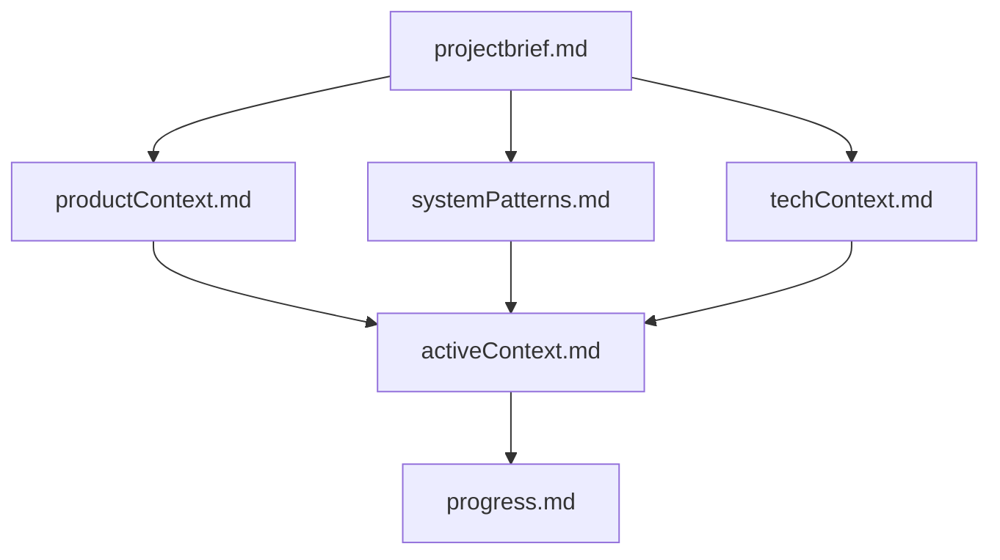
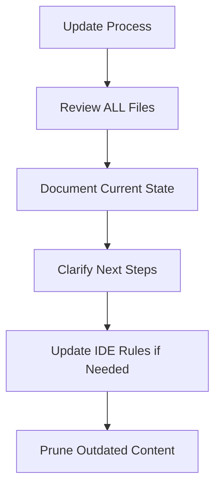
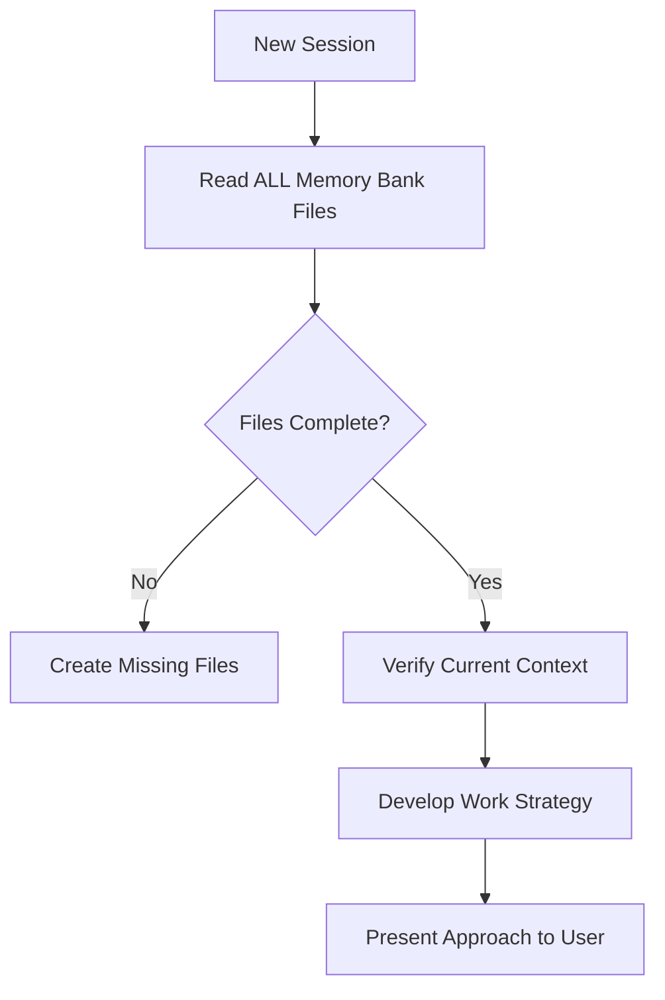

<!-- Generated for Cline rules. See https://docs.cline.bot/features/cline-rules -->

**Keywords:** memory bank, context, session recovery, project brief, active context, progress tracking, continuity, context rot, attention budget, compaction, context engineering, rapid recovery, signal maximization
**TokenBudget:** ~2850
**ContextTier:** Critical
**Depends:** 000-global-core

# Universal Memory Bank System

## Purpose
Establish universal principles for maintaining project context and ensuring AI effectiveness through structured documentation, enabling seamless context recovery across session resets regardless of specific AI model or editor implementation.

## Rule Type and Scope

- **Type:** Auto-attach
- **Scope:** Universal memory bank principles for project context management across all AI models and editors

## Contract
- **Inputs/Prereqs:** Project context files; clear documentation structure; session reset understanding
- **Allowed Tools:** Read-only context tools; documentation tools; structured update tools
- **Forbidden Tools:** Tools that duplicate information across contexts; unstructured narrative documentation
- **Required Steps:** 
  1. Initialize memory bank if not already initialized: ensure `memory-bank/` exists (run "initialize memory bank" task first); all write operations must be scoped under `memory-bank/` only
  2. Read all relevant context at session start (non-optional)
  3. Maintain single source of truth per information type
  4. Update context after significant changes
  5. Prune outdated information aggressively
  6. Structure information for rapid context recovery
- **Output Format:** Structured documentation with clear sections, minimal redundancy, forward-looking focus
- **Validation Steps:** Initialization verified; `memory-bank/` folder exists; no writes occurred outside `memory-bank/`; context completeness check; information uniqueness verification; productivity within 20 lines test

## Key Principles

- **Rapid Recovery:** AI must be productive within first 20 lines of reading
- **Signal Maximization:** Every line must provide actionable value
- **Zero Redundancy:** Each piece of information lives in exactly one place
- **Aggressive Pruning:** Remove outdated or redundant content ruthlessly
- **Structured Communication:** Use lists, tables, and bullets over narrative prose
- **Reference Over Duplication:** Link to existing documentation rather than copying
- **Temporal Boundaries:** Separate current, recent, and historical context clearly
- **Forward Focus:** Emphasize what's next, not what's done
- **Context Rot Awareness:** As context grows, attention degrades (n² pairwise relationships) - keep context minimal
- **Attention Budget:** Treat context like limited working memory - every token depletes attention budget

## Quick Start TL;DR (Read First - 30 Seconds)

**MANDATORY:**
**Essential Patterns:**
- **Read ALL memory bank files at session start** - Non-optional, enables rapid context recovery
- **Keep activeContext.md ≤100 lines** - Most critical file, current + last session only
- **Initialize before writing** - Run "initialize memory bank" if `memory-bank/` doesn't exist
- **All writes scoped to `memory-bank/`** - Never write context files outside this directory
- **Aggressive pruning** - Remove completed work details, archive old context
- **Zero redundancy** - Each piece of information lives in exactly ONE place
- **Never duplicate information** - Reference existing docs, don't copy content

**Quick Checklist:**
- [ ] `memory-bank/` directory exists (initialize if needed)
- [ ] All writes scoped under `memory-bank/` only
- [ ] activeContext.md ≤100 lines (current + last session)
- [ ] Quick Start section in activeContext.md (lines 1-30)
- [ ] No duplicate information across files
- [ ] Outdated content removed or archived
- [ ] Total context ≤600 lines across all files

## 1. Universal Context Structure

### Core Information Types
- **Project Brief**: Foundation, scope, and requirements (stable reference)
- **Active Context**: Current work, immediate next steps, blocking issues (most critical)
- **Technical Context**: Stack, constraints, essential commands (stable reference)
- **System Patterns**: Architecture decisions and design patterns in use (evolving reference)
- **Progress Tracking**: Status, accomplishments, known issues (dynamic status)
- **Product Context**: Why project exists, problems solved, user experience goals (stable vision)

### File Organization Principles


**File Structure:**
- **Single Purpose**: Each file serves one specific context type
- **Clear Hierarchy**: Dependencies and relationships between contexts are explicit
- **Bounded Size**: Each context file maintains specific size limits
- **Forward Focus**: Current context emphasizes what's next, not what's done

## 2. Content Guidelines

### Core Files (Required)

#### activeContext.md (≤100 lines) - MOST CRITICAL
**Structure Required:**
1. Quick Start section (lines 1-30)
2. Current work focus (≤2 paragraphs)
3. Active decisions (blocking current work only)
4. Dependencies & blockers (current only)
5. Session change log (≤5 entries)

**Content Rules:**
- Current + last session only; archive older content
- Start with Quick Start section (primary objective, next steps, validation)
- Update after every significant task completion
- Remove completed work details (archive them)

#### projectbrief.md (≤120 lines)
- Foundation document defining core requirements and project scope
- Source of truth for project boundaries and goals
- Stable reference document (rarely changes)

#### productContext.md (≤120 lines)
- Why this project exists and problems it solves
- User experience goals and success criteria
- Business context and value proposition

#### systemPatterns.md (≤150 lines)
- System architecture and key technical decisions
- Design patterns currently in use with rationale
- Component relationships and integration points

#### techContext.md (≤150 lines)
- Technology stack (table format preferred)
- Technical constraints and dependencies
- Essential commands and development workflow
- Reference setup instructions rather than duplicating them

#### progress.md (≤140 lines)
- Current state summary and compressed accomplishments
- Known issues and technical debt (current only)
- Immediate roadmap (next 2-3 sprints maximum)

## 3. Performance Standards

### Size Budgets (Mandatory)
- **Total context**: ≤600 lines across all files
- **Active context**: ≤100 lines (most critical)
- **Technical context**: ≤150 lines
- **Progress tracking**: ≤140 lines
- **Project brief**: ≤120 lines
- **Product context**: ≤120 lines
- **System patterns**: ≤150 lines

### Efficiency Targets  
- **Context Load Time**: AI productive within 20 lines of reading
- **Information Density**: Every line provides actionable value
- **Update Frequency**: Balance currency with maintenance overhead
- **Reference Accuracy**: All links and references remain current
- **Session Recovery**: ≤ 1 minute for complex projects, ≤ 30 seconds for familiar projects

### Context Compaction Strategies

**Why Compaction Matters:**
From Anthropic's context engineering research, as context length increases, models experience "context rot" - diminished ability to recall specific information due to n² pairwise attention relationships. Compaction helps maintain model effectiveness.

**When to Compact:**
- Memory bank files approaching size budget limits
- Accumulation of completed work details
- Historical context no longer actively relevant
- Information can be summarized without critical loss

**Compaction Techniques:**

**1. Summarize Completed Work:**
```markdown
# Before Compaction (50 lines)
### Sprint 3 Details
- Implemented user authentication with bcrypt
- Created 15 unit tests for auth module
- Fixed 3 edge cases in password validation
- Updated documentation for auth API
- Reviewed PR feedback and made 8 commits
- Final merge on Jan 15th

# After Compaction (3 lines)
### Sprint 3 (Completed Jan 15)
- User authentication with bcrypt (15 tests, fully documented)
```

**2. Archive to External Files:**
- Move detailed historical context to `memory-bank/archive/YYYY-MM.md`
- Keep only summary references in active context
- Load archived details only when specifically needed

**3. Consolidate Redundant Information:**
- Merge duplicate status updates
- Remove repeated decisions already documented
- Collapse verbose explanations to bullet points

**4. Progressive Pruning:**
- Current session: Full details
- Last 2-3 sessions: Compressed summaries
- Older sessions: Key decisions only or archived

**Compaction Guidelines:**
- **Preserve:** Active objectives, unresolved blockers, key architectural decisions, recent file references
- **Remove:** Resolved issues, exploratory dead-ends, redundant tool outputs, verbose explanations
- **Compress:** Completed tasks (outcomes only), historical decisions (rationale + result), old session logs

## 4. Maintenance Workflows

### Context Update Triggers
- After implementing significant changes
- When discovering new project patterns  
- When user requests with **"update memory bank"** (MUST review ALL files)
- When context needs clarification for effectiveness
- At major project milestones

### Update Process


Pre-step: If `memory-bank/` does not exist, run "initialize memory bank" to create the folder before proceeding.

0. **Initialize If Needed**: Ensure `memory-bank/` exists and restrict writes to this directory
1. **Review All Contexts**: Check each context type for relevance
2. **Document Current State**: Capture new patterns and decisions  
3. **Clarify Next Steps**: Update active context with immediate priorities
4. **Prune Outdated Content**: Remove completed, changed, or irrelevant information
5. **Update IDE Rules**: Capture new patterns in project-specific rules

### Session Start Protocol


**Critical:** Read ALL memory bank files at the start of EVERY session - this is not optional.

**Precondition:** Verify the `memory-bank/` folder exists. If missing, run "initialize memory bank" before any write operation.

## 5. IDE Integration

### Project Intelligence Rules
- **Purpose**: IDE-specific rules file serves as learning journal for each project
- **Content**: Capture patterns, preferences, and project intelligence that improve effectiveness
- **Format**: Flexible - focus on capturing valuable insights
- **Evolution**: Treat as living document that grows smarter over time

### What to Document in IDE Rules
- Critical implementation paths and user workflow patterns
- Project-specific conventions and known challenges
- Tool usage patterns and evolution of project decisions
- Solutions to recurring problems

## Quick Compliance Checklist
- [ ] All core memory bank files exist and are within size budgets
- [ ] Initialization run before updates (or previously initialized)
- [ ] `memory-bank/` directory exists
- [ ] All writes are scoped under `memory-bank/` (no writes elsewhere)
- [ ] activeContext.md updated after significant changes
- [ ] No information duplication across contexts
- [ ] Quick start information readily accessible in activeContext.md
- [ ] Outdated content removed or archived appropriately
- [ ] All references and links are current and functional
- [ ] Context structure follows hierarchical dependencies
- [ ] Forward-looking focus maintained (what's next vs what's done)
- [ ] Essential commands and workflows documented in techContext.md
- [ ] AI can resume work effectively using only context files

## Validation
- **Success Checks**: Initialization confirmed; `memory-bank/` exists; writes limited to `memory-bank/`; AI can resume work effectively using only context files; no duplicate information exists; all references work; productivity achieved within 20 lines of reading; context load completes within time targets
- **Negative Tests**: Update attempted before initialization; files written outside `memory-bank/`; context files with missing quick start fail effectiveness test; duplicate information causes confusion and wasted time; broken references impede progress; oversized contexts delay session recovery

> **Investigation Required**  
> When applying this rule:
> 1. **Check if `memory-bank/` directory exists BEFORE any write operation** - Use list_dir to verify, run initialization if missing
> 2. **Read ALL existing memory bank files at session start** - Never assume context structure, always verify what exists
> 3. **Never speculate about current project state** - Read activeContext.md to understand actual current focus
> 4. **Verify file sizes against budgets** - Check line counts, not just file existence
> 5. **Make grounded updates based on investigated context** - Don't add generic content that doesn't match project reality
>
> **Anti-Pattern:**
> "Based on typical projects, you probably have these memory bank files..."
> "Let me update the memory bank with standard sections..."
>
> **Correct Pattern:**
> "Let me check if memory-bank/ exists and what files are present."
> [runs list_dir to check memory-bank/]
> "I see memory-bank/ exists with activeContext.md (85 lines) and projectbrief.md (110 lines). Based on activeContext.md, the current focus is [specific project task]. Here's how I'll update it..."

## Response Template

```markdown
MODE: [PLAN|ACT]

Rules Loaded:
- rules/000-global-core.md (foundation)
- [additional rules based on task]

Analysis:
[Brief analysis of the requirement]

Task List:
1. [Specific task with clear deliverable]
2. [Another task with validation criteria]
3. [Final task with success metrics]

Implementation:
[Code/configuration changes following established patterns]

Validation:
- [x] Changes validated against requirements
- [x] Tests passing / linting clean
- [x] Documentation updated
```

## Memory Bank Analysis
- **Precondition**: Memory bank initialized and `memory-bank/` folder exists
- **Session Status**: [New session / Continuing work]
- **Context Health**: [Complete / Missing files / Needs updates]
- **Active Focus**: [Current priority from activeContext.md]  
- **Next Steps**: [Immediate actions from context]
- **Blockers**: [Any dependencies or constraints]
- **Validation**: [How to verify completion]

## Context Summary
- **Project**: [Brief description from projectbrief.md]
- **Current State**: [Status from progress.md]
- **Technical Stack**: [Key technologies from techContext.md]

## Implementation Plan
[Minimal changes based on context understanding]
```

## References

### External Documentation

**Anthropic Engineering Articles:**
- [Effective Context Engineering for AI Agents](https://www.anthropic.com/engineering/effective-context-engineering-for-ai-agents) - Context rot, attention budgets, compaction strategies, and memory management

**Technical Writing and Documentation:**
- [Technical Writing Best Practices](https://developers.google.com/tech-writing) - Google's guide for clear, effective documentation
- [Documentation Systems](https://documentation.divio.com/) - Framework for organizing technical documentation  
- [Cursor Documentation](https://docs.cursor.com/) - AI-powered code editor features and capabilities
- [Cursor Rules Guide](https://docs.cursor.com/en/context/rules) - Project rules and context management
- [Markdown Guide](https://www.markdownguide.org/) - Complete Markdown syntax and formatting reference

### Related Rules
- **Global Core**: `000-global-core.md` - Foundational workflow and safety protocols
- **Rule Governance**: `002-rule-governance.md` - Token budgets and rule sizing standards
- **Context Engineering**: `003-context-engineering.md` - Comprehensive attention budget and compaction strategies
