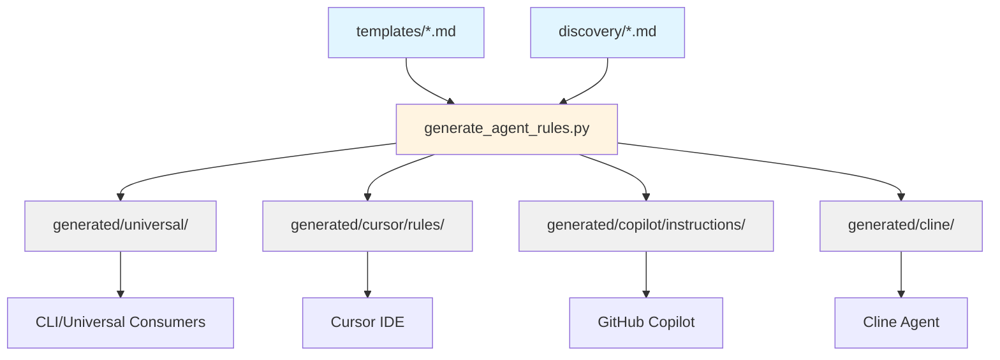

# Project Structure Implementation Plan: Option 1 (Source-First with Generated Outputs)

## Executive Summary

This document provides a detailed implementation plan for migrating the ai_coding_rules_gitlab project to a clean, industry-standard structure following Option 1 from `project-structure-recommendations.md`. The migration will establish clear separation between source templates and generated outputs, improving maintainability and aligning with proven patterns from Hugo, Sphinx, and cookiecutter.

**Target Structure:**
```
ai_coding_rules_gitlab/
├── templates/          ← Source templates (canonical)
├── discovery/          ← Discovery system templates
├── generated/          ← All generated outputs
│   ├── universal/
│   ├── cursor/
│   ├── copilot/
│   └── cline/
├── scripts/            ← Generation tooling
├── tests/              ← Test suite
├── examples/           ← Usage examples
└── docs/               ← Documentation
```

**Key Benefits:**
- Crystal clear separation between templates and generated outputs
- Industry-standard structure (Hugo, Sphinx, cookiecutter patterns)
- Scalable for future format additions
- Professional, maintainable codebase
- Clean root directory

---

## Implementation Approach: Phased Migration

The migration will be executed in **5 phases** to minimize disruption and ensure backward compatibility during the transition period.

### Timeline Overview
- **Phase 1:** Preparation & Structure Creation (2-3 hours)
- **Phase 2:** Tooling Updates (3-4 hours)
- **Phase 3:** Documentation Updates (2-3 hours)
- **Phase 4:** Transition Period (1-2 weeks)
- **Phase 5:** Cleanup & Launch (1 hour)

**Total Estimated Effort:** 8-10 hours of active work + 1-2 weeks transition period

---

## Phase 1: Create Directory Structure (No Breaking Changes)

### Objectives
- Create new directory structure alongside existing files
- Copy (not move) templates to preserve current functionality
- Establish foundation for new structure without disrupting existing workflows

### Tasks

#### 1.1 Create Core Directories
```bash
mkdir -p templates
mkdir -p discovery
mkdir -p generated/universal
mkdir -p generated/cursor/rules
mkdir -p generated/copilot/instructions
mkdir -p generated/cline
mkdir -p scripts
mkdir -p docs
mkdir -p examples/memory-bank
mkdir -p examples/integration
```

**Validation:** All directories exist and are tracked in git (add .gitkeep if needed)

#### 1.2 Copy Template Files
```bash
# Copy all rule template files to templates/
# Preserve .md extension as these are source templates
cp 0*.md 1*.md 2*.md 3*.md 4*.md 5*.md 6*.md 7*.md 8*.md 9*.md templates/

# Count files to verify
echo "Template files copied: $(ls -1 templates/*.md | wc -l)"
```

**Expected Result:** ~70 .md files in `templates/`

**Validation:** 
```bash
# Verify all template files copied
diff <(ls -1 *.md | grep -E '^[0-9]' | sort) <(ls -1 templates/*.md | xargs -n1 basename | sort)
```

#### 1.3 Copy Discovery Files
```bash
cp AGENTS.md discovery/
cp AGENTS_V2.md discovery/
cp EXAMPLE_PROMPT.md discovery/
cp RULES_INDEX.md discovery/
```

**Validation:** All 4 discovery files exist in `discovery/`

#### 1.4 Move Scripts
```bash
mv generate_agent_rules.py scripts/
mv validate_agent_rules.py scripts/ 2>/dev/null || echo "validate_agent_rules.py not found (OK if doesn't exist)"
```

**Validation:** `scripts/generate_agent_rules.py` exists and is executable

#### 1.5 Create Example Memory Bank
```bash
# If memory-bank/ exists in root, copy it
if [ -d "memory-bank" ]; then
  cp -r memory-bank/ examples/
fi
```

#### 1.6 Initial Git Commit
```bash
git add templates/ discovery/ generated/ scripts/ docs/ examples/
git commit -m "feat: add new directory structure for template-based generation

- Create templates/ directory with copies of all source templates
- Create discovery/ directory for discovery system files
- Create generated/ directory structure for all output formats
- Move scripts/ to dedicated directory
- Add examples/ and docs/ directories

This is Phase 1 of migration to Option 1 structure.
Both old and new structures coexist during transition period."
```

**Deliverables:**
- [ ] All directories created
- [ ] ~70 template files in `templates/`
- [ ] 4 discovery files in `discovery/`
- [ ] Scripts in `scripts/`
- [ ] Example directories created
- [ ] Changes committed to git

---

## Phase 2: Update Tooling (Backward Compatible)

### Objectives
- Update `generate_agent_rules.py` to support new structure
- Maintain backward compatibility with current structure
- Update `Taskfile.yml` to use new paths
- Add validation and testing capabilities

### Tasks

#### 2.1 Update generate_agent_rules.py

**Changes Required:**

1. **Add --source flag with auto-detection**
```python
# Add to argument parser (around line 15-30)
parser.add_argument(
    "--source",
    type=str,
    default=None,
    help="Source directory for template files (auto-detects templates/ or current dir)"
)

# Add auto-detection logic
def detect_source_directory(args):
    """Auto-detect source directory: templates/ if exists, else current dir"""
    if args.source:
        return Path(args.source)
    
    # Try templates/ first (new structure)
    templates_dir = Path("templates")
    if templates_dir.exists() and list(templates_dir.glob("*.md")):
        print(f"✓ Using source directory: templates/ (new structure)")
        return templates_dir
    
    # Fall back to current directory (legacy)
    print(f"✓ Using source directory: . (legacy structure)")
    return Path(".")
```

2. **Update output path defaults**
```python
# Update default output paths based on agent type
OUTPUT_DEFAULTS = {
    "universal": "generated/universal",  # New: generated/universal/, Legacy: rules/
    "cursor": "generated/cursor/rules",  # New: generated/cursor/rules/, Legacy: .cursor/rules/
    "copilot": "generated/copilot/instructions",  # New: generated/copilot/instructions/, Legacy: .github/instructions/
    "cline": "generated/cline",  # New: generated/cline/, Legacy: .clinerules/
}

# Add --legacy-paths flag for backward compatibility
parser.add_argument(
    "--legacy-paths",
    action="store_true",
    help="Use legacy output paths (.cursor/rules/, .github/instructions/, etc.)"
)
```

3. **Add --check mode for CI/CD**
```python
parser.add_argument(
    "--check",
    action="store_true",
    help="Check if generated files are up-to-date (exit non-zero if stale)"
)

def check_generated_files(source_dir, output_dir, agent_type):
    """Check if generated files are up-to-date with templates"""
    stale_files = []
    
    for template_file in source_dir.glob("*.md"):
        output_file = get_output_path(template_file, output_dir, agent_type)
        
        if not output_file.exists():
            stale_files.append(f"Missing: {output_file}")
        elif template_file.stat().st_mtime > output_file.stat().st_mtime:
            stale_files.append(f"Stale: {output_file}")
    
    if stale_files:
        print("❌ Generated files are out of date:")
        for file in stale_files:
            print(f"  - {file}")
        sys.exit(1)
    
    print("✓ All generated files are up-to-date")
```

4. **Copy discovery files to generated/universal/**
```python
def copy_discovery_files(output_dir):
    """Copy discovery files from discovery/ to generated output"""
    discovery_files = ["AGENTS.md", "EXAMPLE_PROMPT.md", "RULES_INDEX.md"]
    discovery_dir = Path("discovery")
    
    for file_name in discovery_files:
        src = discovery_dir / file_name
        if src.exists():
            dst = output_dir / file_name
            shutil.copy2(src, dst)
            print(f"✓ Copied {file_name} to {output_dir}")
```

**Validation:** 
```bash
# Test new structure
python scripts/generate_agent_rules.py --agent universal --dry-run

# Test legacy structure
python scripts/generate_agent_rules.py --agent universal --source . --legacy-paths --dry-run

# Test check mode
python scripts/generate_agent_rules.py --agent all --check
```

#### 2.2 Update Taskfile.yml

**Changes Required:**

```yaml
# Update all rule generation tasks to use new paths

tasks:
  # Universal format (default output: generated/universal/)
  rule:universal:
    desc: Generate universal format rules (stripped of IDE-specific metadata)
    cmds:
      - uv run scripts/generate_agent_rules.py --agent universal --source templates --destination {{.DEST | default "generated/universal"}}
  
  # Cursor format
  rule:cursor:
    desc: Generate Cursor-specific rules (.mdc format)
    cmds:
      - uv run scripts/generate_agent_rules.py --agent cursor --source templates --destination {{.DEST | default "generated/cursor/rules"}}
  
  # GitHub Copilot format
  rule:copilot:
    desc: Generate GitHub Copilot instructions
    cmds:
      - uv run scripts/generate_agent_rules.py --agent copilot --source templates --destination {{.DEST | default "generated/copilot/instructions"}}
  
  # Cline format
  rule:cline:
    desc: Generate Cline-specific rules
    cmds:
      - uv run scripts/generate_agent_rules.py --agent cline --source templates --destination {{.DEST | default "generated/cline"}}
  
  # Generate all formats
  rule:all:
    desc: Generate all rule formats
    cmds:
      - task: rule:universal
      - task: rule:cursor
      - task: rule:copilot
      - task: rule:cline
  
  # Validation task
  rule:check:
    desc: Check if generated files are up-to-date with templates
    cmds:
      - uv run scripts/generate_agent_rules.py --agent all --check
  
  # Legacy compatibility (output to old paths)
  rule:legacy:
    desc: Generate rules using legacy output paths (backward compatibility)
    cmds:
      - uv run scripts/generate_agent_rules.py --agent cursor --source templates --legacy-paths
      - uv run scripts/generate_agent_rules.py --agent copilot --source templates --legacy-paths
      - uv run scripts/generate_agent_rules.py --agent cline --source templates --legacy-paths
```

**Validation:**
```bash
# Test each task
task rule:universal
task rule:cursor
task rule:copilot
task rule:cline
task rule:all
task rule:check
```

#### 2.3 Create Symlinks for IDE Compatibility

To ensure IDEs can find rules in their expected locations during transition:

```bash
# Create symlinks pointing to generated outputs
ln -sf generated/cursor/rules .cursor/rules
ln -sf generated/copilot/instructions .github/instructions
ln -sf generated/cline .clinerules
ln -sf generated/universal rules
```

**Note:** Add these to `.gitignore` if committing generated files:
```gitignore
# Symlinks to generated outputs
.cursor/rules
.github/instructions
.clinerules
rules
```

**Validation:**
```bash
# Verify symlinks work
ls -la .cursor/rules
ls -la .github/instructions
ls -la .clinerules
ls -la rules
```

#### 2.4 Create Migration Helper Script

Create `scripts/migrate_to_templates.sh`:

```bash
#!/usr/bin/env bash
set -euo pipefail

# Migration helper script for Option 1 structure
# This script automates the complete migration process

SCRIPT_DIR="$(cd "$(dirname "${BASH_SOURCE[0]}")" && pwd)"
PROJECT_ROOT="$(cd "$SCRIPT_DIR/.." && pwd)"

echo "🚀 Starting migration to Option 1 structure..."

# Phase 1: Create structure
echo "📁 Creating directory structure..."
cd "$PROJECT_ROOT"
mkdir -p templates discovery generated/{universal,cursor/rules,copilot/instructions,cline} scripts docs examples/{memory-bank,integration}

# Phase 2: Copy files
echo "📋 Copying template files..."
cp [0-9]*.md templates/ 2>/dev/null || true
echo "   Copied $(ls -1 templates/*.md 2>/dev/null | wc -l) template files"

echo "📋 Copying discovery files..."
cp AGENTS.md AGENTS_V2.md EXAMPLE_PROMPT.md RULES_INDEX.md discovery/ 2>/dev/null || true

# Phase 3: Generate outputs
echo "🔨 Generating all rule formats..."
if command -v task &> /dev/null; then
    task rule:all
else
    uv run scripts/generate_agent_rules.py --agent all --source templates
fi

# Phase 4: Create symlinks
echo "🔗 Creating compatibility symlinks..."
ln -sf generated/cursor/rules .cursor/rules
ln -sf generated/copilot/instructions .github/instructions
ln -sf generated/cline .clinerules
ln -sf generated/universal rules

echo "✅ Migration complete!"
echo ""
echo "📊 Structure summary:"
echo "   Templates: $(ls -1 templates/*.md 2>/dev/null | wc -l) files"
echo "   Generated universal: $(ls -1 generated/universal/*.md 2>/dev/null | wc -l) files"
echo "   Generated cursor: $(ls -1 generated/cursor/rules/*.mdc 2>/dev/null | wc -l) files"
echo ""
echo "Next steps:"
echo "  1. Review generated files in generated/ directories"
echo "  2. Test with your IDE (Cursor, Copilot, Cline)"
echo "  3. Update documentation (Phase 3)"
echo "  4. Commit changes: git add . && git commit -m 'feat: migrate to Option 1 structure'"
```

Make executable:
```bash
chmod +x scripts/migrate_to_templates.sh
```

**Validation:**
```bash
# Test migration script in dry-run mode
scripts/migrate_to_templates.sh
```

#### 2.5 Git Commit
```bash
git add scripts/ Taskfile.yml
git commit -m "feat: update tooling for new template-based structure

- Add --source flag to generate_agent_rules.py with auto-detection
- Add --legacy-paths flag for backward compatibility
- Add --check mode for CI/CD validation
- Update Taskfile.yml to use new directory paths
- Create migration helper script
- Add symlinks for IDE compatibility during transition

Phase 2 of Option 1 migration. Tools now support both structures."
```

**Deliverables:**
- [ ] `generate_agent_rules.py` updated with new flags
- [ ] `Taskfile.yml` updated with new paths
- [ ] Symlinks created for IDE compatibility
- [ ] Migration helper script created
- [ ] All tasks tested and working
- [ ] Changes committed to git

---

## Phase 3: Update Documentation

### Objectives
- Update all documentation to reflect new structure
- Create migration guide for external users
- Update architectural diagrams
- Ensure all file paths are correct

### Tasks

#### 3.1 Update README.md

**Changes Required:**

1. **Update Architecture diagram**
```markdown
## Architecture

### Project Structure

```
ai_coding_rules_gitlab/
├── templates/              ← Source templates (canonical, edit these)
│   ├── 000-global-core.md
│   ├── 001-memory-bank.md
│   └── ... (70+ template files)
│
├── discovery/              ← Discovery system templates
│   ├── AGENTS.md           ← Primary discovery guide
│   ├── AGENTS_V2.md        ← Alternative discovery guide
│   ├── EXAMPLE_PROMPT.md   ← Baseline prompt
│   └── RULES_INDEX.md      ← Rule catalog
│
├── generated/              ← Generated outputs (DO NOT EDIT)
│   ├── universal/          ← Universal format (stripped metadata)
│   ├── cursor/rules/       ← Cursor-specific (.mdc format)
│   ├── copilot/instructions/ ← GitHub Copilot format
│   └── cline/              ← Cline format
│
├── scripts/                ← Generation tools
│   ├── generate_agent_rules.py
│   └── validate_agent_rules.py
│
├── examples/               ← Usage examples
│   ├── memory-bank/        ← Example memory bank structure
│   └── integration/        ← IDE integration examples
│
└── docs/                   ← Project documentation
```
```

2. **Update Quick Start section**
```markdown
## Quick Start

### 1. Clone the Repository
```bash
git clone https://gitlab.com/your-org/ai_coding_rules_gitlab.git
cd ai_coding_rules_gitlab
```

### 2. Install Dependencies
```bash
# Install uv (if not already installed)
curl -LsSf https://astral.sh/uv/install.sh | sh

# Install project dependencies
uv sync
```

### 3. Generate Rules (if needed)
```bash
# Generate all formats
task rule:all

# Or generate specific formats
task rule:cursor    # For Cursor IDE
task rule:copilot   # For GitHub Copilot
task rule:cline     # For Cline
```

**Note:** Generated files are committed to git by default, so you may not need to run generation unless modifying templates.
```

3. **Update Development Workflow section**
```markdown
## Development Workflow

### Editing Rules

**Important:** Always edit files in `templates/`, never edit generated files directly.

1. Edit template file: `templates/XXX-your-rule.md`
2. Generate outputs: `task rule:all`
3. Test with your IDE
4. Commit changes:
   ```bash
   git add templates/XXX-your-rule.md
   git add generated/  # If committing generated files
   git commit -m "feat: update XXX rule"
   ```

### Adding New Rules

1. Create template: `templates/XXX-new-rule.md`
2. Follow rule structure from `002-rule-governance.md`
3. Update `discovery/RULES_INDEX.md`
4. Generate: `task rule:all`
5. Test and commit
```

4. **Add migration note**
```markdown
## Migration Notice

**v2.0.0 Structure Change (November 2024)**

This project migrated from root-level templates to a structured template-based generation system in v2.0.0. 

- **Source templates** moved to `templates/` directory
- **Generated outputs** organized in `generated/` directory
- **Backward compatibility** maintained via symlinks and legacy paths

See `docs/migration-guide.md` for details.

**For v1.x users:**
- Old paths still work via symlinks during transition
- Update your workflows to reference `templates/` for editing
- Use `task rule:legacy` to generate with old paths
```

**Validation:**
```bash
# Check all links in README work
grep -o '\[.*\](.*)' README.md | sed 's/.*(\(.*\))/\1/' | while read link; do
  if [[ $link == http* ]]; then
    curl -sI "$link" | head -1
  else
    [ -f "$link" ] && echo "✓ $link" || echo "✗ Missing: $link"
  fi
done
```

#### 3.2 Create docs/migration-guide.md

Create comprehensive migration guide:

```markdown
# Migration Guide: v1.x to v2.0.0 (Option 1 Structure)

## Overview

Version 2.0.0 introduces a significant restructuring to improve maintainability and align with industry best practices for template-based generation systems.

## What Changed

### Directory Structure

**Before (v1.x):**
```
ai_coding_rules_gitlab/
├── 000-global-core.md      ← Templates in root
├── 001-memory-bank.md
├── ... (70+ .md files)
├── AGENTS.md
├── generate_agent_rules.py
├── .cursor/rules/*.mdc     ← Generated
└── .github/instructions/*.md
```

**After (v2.0.0):**
```
ai_coding_rules_gitlab/
├── templates/              ← Source templates (edit these)
│   ├── 000-global-core.md
│   └── ...
├── discovery/              ← Discovery files
├── generated/              ← Generated outputs (don't edit)
│   ├── universal/
│   ├── cursor/rules/
│   └── ...
└── scripts/                ← Tools
```

## Migration for External Users

### Option 1: Fresh Clone (Recommended)
```bash
# Clone the new structure
git clone https://gitlab.com/your-org/ai_coding_rules_gitlab.git
cd ai_coding_rules_gitlab

# Generated files are already included, ready to use
```

### Option 2: Update Existing Clone
```bash
# Pull latest changes
git pull origin main

# Generated files should be updated automatically
# If needed, regenerate:
task rule:all
```

### Option 3: Use Legacy Paths
```bash
# If your workflow depends on old paths, use legacy mode
task rule:legacy

# This generates to old locations:
# - .cursor/rules/
# - .github/instructions/
# - .clinerules/
```

## Migration for Contributors

### Editing Rules

**Old workflow:**
```bash
# v1.x - edited files in root
vim 000-global-core.md
git add 000-global-core.md
```

**New workflow:**
```bash
# v2.0.0 - edit in templates/
vim templates/000-global-core.md
task rule:all  # Regenerate outputs
git add templates/000-global-core.md generated/
```

### Adding New Rules

**Old workflow:**
```bash
# v1.x
vim 123-new-rule.md
python generate_agent_rules.py --agent all
```

**New workflow:**
```bash
# v2.0.0
vim templates/123-new-rule.md
vim discovery/RULES_INDEX.md  # Update catalog
task rule:all
```

## Breaking Changes

### File Paths
- Source templates: `*.md` → `templates/*.md`
- Discovery files: `AGENTS.md` → `discovery/AGENTS.md`
- Scripts: `generate_agent_rules.py` → `scripts/generate_agent_rules.py`

### Command Changes
```bash
# Old
python generate_agent_rules.py --agent cursor

# New
task rule:cursor
# OR
python scripts/generate_agent_rules.py --agent cursor --source templates
```

## Compatibility

### Symlinks (Transition Period)
During transition, symlinks maintain compatibility:
```bash
.cursor/rules → generated/cursor/rules
.github/instructions → generated/copilot/instructions
.clinerules → generated/cline
rules → generated/universal
```

These allow old paths to continue working while you migrate workflows.

## Rollback

If issues occur, roll back to v1.x:
```bash
git checkout v1.9.0  # Last v1.x version
```

## Support

Questions? Issues? 
- Open an issue on GitLab
- Check updated README.md
- Review project-structure-recommendations.md

---

*Migration guide for v2.0.0 - November 2024*
```

**Validation:**
```bash
# Verify migration guide is complete
grep -i "TODO\|FIXME\|XXX" docs/migration-guide.md && echo "Found incomplete sections" || echo "✓ Guide complete"
```

#### 3.3 Update CONTRIBUTING.md

Add section on new structure:

```markdown
## Project Structure (v2.0.0+)

### Directory Organization

- **`templates/`** - Source template files (edit these)
  - Contains all rule templates with IDE-specific metadata
  - These are the canonical source - always edit here
  
- **`discovery/`** - Discovery system templates
  - AGENTS.md, RULES_INDEX.md, EXAMPLE_PROMPT.md
  - Edit these to modify discovery documentation
  
- **`generated/`** - Generated outputs (DO NOT EDIT)
  - Automatically generated from templates/
  - Different formats: universal, cursor, copilot, cline
  - Regenerated with `task rule:all`
  
- **`scripts/`** - Generation and validation tools
- **`examples/`** - Usage examples and memory bank templates
- **`docs/`** - Project documentation

### Editing Rules

1. **Always edit in `templates/`**, never in `generated/`
2. Follow rule structure defined in `templates/002-rule-governance.md`
3. Test changes by regenerating: `task rule:all`
4. Commit both template and generated files

### Adding New Rules

1. Create `templates/XXX-new-rule.md` following governance template
2. Add entry to `discovery/RULES_INDEX.md`
3. Generate outputs: `task rule:all`
4. Test with at least one IDE
5. Submit PR with template + generated files

### Rule Numbering

Follow existing ranges:
- **000-099:** Core/Foundation
- **100-199:** Snowflake
- **200-299:** Python
- **300-399:** Shell
- **400-499:** Infrastructure
- **500-599:** Data Science
- **600-699:** Data Governance
- **700-799:** Business Intelligence
- **800-899:** Project Management
- **900-999:** Demos/Examples
```

**Validation:**
```bash
# Check CONTRIBUTING.md structure
grep "^##" CONTRIBUTING.md
```

#### 3.4 Update CHANGELOG.md

Add v2.0.0 entry:

```markdown
## [2.0.0] - 2024-11-XX

### 🚨 BREAKING CHANGES

**Project Structure Reorganization (Option 1: Source-First with Generated Outputs)**

This release introduces a significant restructuring to improve maintainability and align with industry best practices.

#### Changed
- **Source templates moved** from root to `templates/` directory
- **Discovery files moved** from root to `discovery/` directory
- **Scripts moved** from root to `scripts/` directory
- **Generated outputs organized** in `generated/` directory structure

#### Added
- `templates/` - Source template directory (canonical source)
- `discovery/` - Discovery system templates
- `generated/` - Organized generated outputs
  - `generated/universal/` - Universal format (stripped metadata)
  - `generated/cursor/rules/` - Cursor-specific format
  - `generated/copilot/instructions/` - GitHub Copilot format
  - `generated/cline/` - Cline format
- `scripts/` - Generation and validation tools
- `docs/` - Project documentation
- `examples/` - Usage examples
- `docs/migration-guide.md` - Comprehensive migration documentation
- `scripts/migrate_to_templates.sh` - Migration helper script

#### Enhanced
- `generate_agent_rules.py` - Added `--source` flag with auto-detection
- `generate_agent_rules.py` - Added `--legacy-paths` flag for backward compatibility
- `generate_agent_rules.py` - Added `--check` mode for CI/CD validation
- `Taskfile.yml` - Updated all tasks to use new directory paths
- `README.md` - Updated architecture diagram and workflows

#### Backward Compatibility
- Symlinks created for IDE compatibility during transition:
  - `.cursor/rules` → `generated/cursor/rules`
  - `.github/instructions` → `generated/copilot/instructions`
  - `.clinerules` → `generated/cline`
  - `rules` → `generated/universal`
- Legacy path support via `--legacy-paths` flag
- `task rule:legacy` command for old path generation

#### Migration
See `docs/migration-guide.md` for detailed migration instructions.

**For Users:** Clone latest version - generated files included, ready to use.
**For Contributors:** Edit templates in `templates/`, run `task rule:all` to regenerate.

#### Rationale
This restructuring aligns with industry standards (Hugo, Sphinx, cookiecutter) and provides:
- Clear separation between source templates and generated outputs
- Improved maintainability and scalability
- Professional, organized project structure
- Easier onboarding for new contributors

### Fixed
- Clarified distinction between source templates and generated files
- Reduced root directory clutter
- Improved discoverability of template files

---

## [1.9.0] - 2024-XX-XX (Last v1.x release)
...
```

**Validation:**
```bash
# Check CHANGELOG follows conventional commits format
grep "^## \[" CHANGELOG.md
```

#### 3.5 Update Cross-References

Update all rule files that reference paths:

```bash
# Find files with path references to update
grep -r "000-global-core.md" templates/ discovery/ docs/ README.md CONTRIBUTING.md

# Common patterns to update:
# - "See `000-global-core.md`" → "See `templates/000-global-core.md`"
# - "`@000-global-core.md`" → "`@templates/000-global-core.md`"
# - "Read `AGENTS.md`" → "Read `discovery/AGENTS.md`"
```

**Manual review required** - context-dependent changes.

#### 3.6 Create docs/architecture.md

Document system architecture:

```markdown
# Architecture: AI Coding Rules Generator

## System Overview

The AI Coding Rules Generator is a template-based generation system that transforms canonical rule templates into multiple IDE-specific formats.

## Architecture Diagram



## Component Responsibilities

### Source Templates (`templates/`)
- **Purpose:** Canonical source of truth for all rule content
- **Format:** Markdown with IDE-specific metadata
- **Editing:** Always edit here, never in `generated/`
- **Metadata:** Contains all fields (Type, AutoAttach, Keywords, etc.)

### Discovery System (`discovery/`)
- **Purpose:** Meta-documentation for rule discovery and usage
- **Files:**
  - `AGENTS.md` - Primary discovery guide
  - `RULES_INDEX.md` - Comprehensive rule catalog
  - `EXAMPLE_PROMPT.md` - Baseline prompt template
- **Copying:** Files copied to generated outputs unchanged

### Generation Engine (`scripts/`)
- **Core:** `generate_agent_rules.py`
- **Purpose:** Transform templates into IDE-specific formats
- **Capabilities:**
  - Auto-detect source directory
  - Strip IDE-specific metadata for universal format
  - Add IDE-specific formatting (Cursor .mdc, Copilot YAML)
  - Validate consistency with `--check` mode

### Generated Outputs (`generated/`)
- **Purpose:** IDE-ready rule files (DO NOT EDIT)
- **Formats:**
  - `universal/` - Stripped metadata, pure markdown
  - `cursor/rules/` - .mdc extension, Cursor-specific
  - `copilot/instructions/` - YAML frontmatter, Copilot format
  - `cline/` - Plain markdown, Cline format

## Data Flow

1. **Authoring:** Developer edits `templates/XXX-rule.md`
2. **Generation:** Developer runs `task rule:all`
3. **Transformation:** Generator processes template:
   - Reads template content and metadata
   - Applies format-specific transformations
   - Writes to appropriate `generated/` subdirectory
4. **Distribution:** Generated files committed to git
5. **Consumption:** IDEs/agents use generated files directly

## Format Specifications

### Universal Format
```markdown
<!-- Generated for universal consumption -->
# Rule Title

[Content without IDE-specific metadata]
```

### Cursor Format (.mdc)
```markdown
**Type:** Auto-attach
**AutoAttach:** true
**AppliesTo:** *.py

# Rule Title

[Full content including metadata]
```

### Copilot Format
```yaml
---
description: "One-line rule description"
applies_to:
  - "*.py"
---

# Rule Title

[Content]
```

### Cline Format
```markdown
# Rule Title

[Plain markdown content]
```

## Build Process

### Standard Generation
```bash
task rule:all
```

1. Read all `templates/*.md`
2. For each target format:
   - Apply format transformation
   - Write to `generated/{format}/`
3. Copy discovery files
4. Report generation summary

### CI/CD Validation
```bash
task rule:check
```

1. Compare template mtimes with generated files
2. Exit non-zero if any stale files detected
3. Used in GitHub Actions to ensure consistency

## Extension Points

### Adding New IDE Formats

1. Add format to `OUTPUT_DEFAULTS` in `generate_agent_rules.py`
2. Implement transformation function
3. Add task to `Taskfile.yml`
4. Update documentation

### Adding New Rules

1. Create `templates/XXX-new-rule.md`
2. Follow `002-rule-governance.md` structure
3. Add entry to `discovery/RULES_INDEX.md`
4. Run `task rule:all`
5. Test with target IDEs

## Design Decisions

### Why Commit Generated Files?
**Decision:** Commit generated files to git

**Rationale:**
- Users can clone and immediately use rules (no build step)
- Clear git history of what changed in each format
- No Python dependency for end users
- CI validates consistency via `--check` mode

**Trade-offs:**
- Larger repository size
- Git diffs show both template and generated changes
- Risk of template/generated divergence (mitigated by CI)

### Why Single templates/ Directory (Not Subdirectories)?
**Decision:** Flat `templates/` structure initially

**Rationale:**
- Simpler migration from root
- Simpler generator logic (no recursive scanning)
- 70 files manageable in one directory
- Can add subdirectories later if needed

**Future:** May organize into subdirectories by domain (snowflake/, python/, etc.)

### Why Symlinks for Compatibility?
**Decision:** Create symlinks `.cursor/rules` → `generated/cursor/rules`

**Rationale:**
- Smooth transition for existing users
- IDEs find rules in expected locations
- Allows gradual workflow migration
- Can remove after transition period

## Security Considerations

- Templates are trusted input (project maintainers)
- No user-provided content in templates
- Generation is deterministic (safe for CI/CD)
- No network access during generation

## Performance

- Generation time: ~1-2 seconds for 70 rules
- Scales linearly with number of rules
- No caching needed (fast enough without it)

---

*Architecture documentation for v2.0.0 - November 2024*
```

**Validation:**
```bash
# Check mermaid diagram renders
# Paste into https://mermaid.live/ to verify
```

#### 3.7 Git Commit
```bash
git add README.md docs/ CONTRIBUTING.md CHANGELOG.md
git commit -m "docs: update documentation for Option 1 structure

- Update README.md with new architecture diagram
- Create docs/migration-guide.md for v2.0.0 transition
- Update CONTRIBUTING.md with new workflow
- Add CHANGELOG.md v2.0.0 entry with breaking changes
- Create docs/architecture.md system documentation
- Update all cross-references to new paths

Phase 3 of Option 1 migration. Documentation complete."
```

**Deliverables:**
- [ ] README.md updated with new structure
- [ ] docs/migration-guide.md created
- [ ] CONTRIBUTING.md updated
- [ ] CHANGELOG.md v2.0.0 entry added
- [ ] docs/architecture.md created
- [ ] All cross-references updated
- [ ] Changes committed to git

---

## Phase 4: Transition Period (1-2 Weeks)

### Objectives
- Maintain both old and new structures during transition
- Allow users and workflows to migrate gradually
- Monitor for issues and gather feedback
- Ensure backward compatibility

### Tasks

#### 4.1 Create Transition Branch
```bash
# Create transition branch from current main
git checkout -b feat/option-1-structure-transition
git push -u origin feat/option-1-structure-transition
```

#### 4.2 Tag Pre-Migration Version
```bash
# Tag last version with old structure
git tag -a v1.9.0 -m "Last version before Option 1 structure migration"
git push origin v1.9.0
```

#### 4.3 Announce Migration

Create GitLab issue:

**Title:** "v2.0.0 Structure Migration: Action Required"

**Body:**
```markdown
## 🚨 Action Required: Project Structure Migration

### Summary
Version 2.0.0 will introduce a new directory structure to improve maintainability and align with industry best practices.

### Timeline
- **Now - Week 1:** Transition period (both structures work)
- **Week 2:** Review and testing
- **Week 2 End:** Merge to main, release v2.0.0
- **Week 3:** Cleanup old structure

### What's Changing
- Source templates move to `templates/` directory
- Generated outputs organized in `generated/`
- Scripts move to `scripts/` directory
- Discovery files move to `discovery/`

### Action Required

**For Users (consuming rules):**
- ✅ No action required - clone latest and use
- ℹ️ Generated files included, no build step needed

**For Contributors (editing rules):**
- 📝 Update workflows to edit `templates/` instead of root
- 🔄 Run `task rule:all` after edits
- 📖 Read `docs/migration-guide.md`

### Resources
- Migration Guide: `docs/migration-guide.md`
- Architecture: `docs/architecture.md`
- Recommendations: `project-structure-recommendations.md`

### Feedback
Please comment with:
- Issues encountered during transition
- Suggestions for migration process
- Questions about new structure

### Support
- Check updated README.md
- Review migration guide
- Comment on this issue
- Create new issue if blocked

---

**Branch:** `feat/option-1-structure-transition`
**Expected Release:** [Date 2 weeks from now]
```

#### 4.4 Update README with Transition Notice

Add banner to README.md:

```markdown
# AI Coding Rules for GLab

> **⚠️ Migration Notice:** This project is transitioning to v2.0.0 structure.
> - **Current branch:** `feat/option-1-structure-transition`
> - **Status:** Transition period (both structures work)
> - **Action Required:** See [Migration Guide](docs/migration-guide.md)
> - **Feedback:** Comment on [Issue #XXX](https://gitlab.com/your-org/ai_coding_rules_gitlab/-/issues/XXX)
> - **Timeline:** v2.0.0 release scheduled for [Date]

[Rest of README...]
```

#### 4.5 Testing Checklist

Test all critical workflows:

**For Users:**
- [ ] Fresh clone works with all IDEs
- [ ] Cursor IDE finds rules in `.cursor/rules/`
- [ ] GitHub Copilot finds rules in `.github/instructions/`
- [ ] Cline finds rules in `.clinerules/`
- [ ] Universal format available in `generated/universal/` or `rules/`
- [ ] AGENTS.md references work
- [ ] RULES_INDEX.md accurate

**For Contributors:**
- [ ] Edit template in `templates/` works
- [ ] `task rule:all` generates correctly
- [ ] `task rule:cursor` generates correctly
- [ ] `task rule:copilot` generates correctly
- [ ] `task rule:cline` generates correctly
- [ ] `task rule:check` detects stale files
- [ ] `task rule:legacy` generates to old paths
- [ ] Git workflow (edit → generate → commit) works
- [ ] Adding new rule workflow works

**For CI/CD:**
- [ ] GitHub Actions validation works
- [ ] `--check` mode detects stale files correctly
- [ ] CI fails on stale generated files

#### 4.6 Gather Feedback

Monitor during transition period:
- GitLab issue comments
- User reports
- CI/CD failures
- Edge cases discovered

Create feedback document:

```markdown
# v2.0.0 Transition Feedback

## Week 1 Feedback
- [Date] User X: Issue with symlinks on Windows
- [Date] User Y: Cursor not finding rules → Fixed with symlink
- [Date] CI: Detection of stale files working correctly

## Week 2 Feedback
- [Date] Contributor A: Migration guide unclear about X → Updated
- [Date] Contributor B: Task commands intuitive

## Issues Discovered
1. [Issue description] → [Resolution]
2. [Issue description] → [Resolution]

## Success Metrics
- [ ] All external users migrated successfully
- [ ] All contributors using new structure
- [ ] No critical bugs reported
- [ ] CI/CD stable
- [ ] Documentation complete and accurate

## Go/No-Go Decision
- Date: [Week 2 End]
- Decision: [Go for v2.0.0 release / Delay]
- Rationale: [Reason]
```

#### 4.7 Make Adjustments

Based on feedback, make necessary adjustments:
- Fix discovered bugs
- Clarify documentation
- Add missing examples
- Update tooling as needed

Commit all adjustments to transition branch.

**Deliverables:**
- [ ] Transition branch created
- [ ] Pre-migration version tagged (v1.9.0)
- [ ] Migration announcement posted
- [ ] README updated with transition notice
- [ ] All critical workflows tested
- [ ] Feedback collected and addressed
- [ ] Adjustments committed

---

## Phase 5: Cleanup & Launch

### Objectives
- Remove old structure from repository
- Release v2.0.0
- Update external references
- Close transition period

### Tasks

#### 5.1 Final Testing

Complete final validation:

```bash
# Full test suite
task rule:all
task rule:check

# Manual testing
# - Test with Cursor IDE
# - Test with GitHub Copilot
# - Test with Cline
# - Test fresh clone
```

All tests must pass before proceeding.

#### 5.2 Remove Old Structure

```bash
# Remove old template files from root
rm [0-9]*.md

# Remove old discovery files from root (keep what's needed)
rm AGENTS.md EXAMPLE_PROMPT.md RULES_INDEX.md
# Keep AGENTS_V2.md if still relevant, or move to discovery/

# Remove old script location (already in scripts/)
# (Already moved in Phase 1)

# Update .gitignore
cat >> .gitignore << 'EOF'

# Symlinks to generated outputs (transition compatibility)
.cursor/rules
.github/instructions
.clinerules
rules

EOF
```

**Validation:**
```bash
# Verify root is clean
ls -la *.md

# Should only show:
# - README.md
# - CHANGELOG.md
# - CONTRIBUTING.md
# - LICENSE (if exists)
```

#### 5.3 Remove Transition Notice from README

Remove the migration banner added in Phase 4.4.

Update README to stable v2.0.0 documentation.

#### 5.4 Final Git Commit

```bash
git add -A
git commit -m "feat!: complete migration to Option 1 structure (v2.0.0)

BREAKING CHANGE: Project structure reorganized for improved maintainability

- Removed old template files from root
- Removed old discovery files from root
- Updated .gitignore for new structure
- Removed transition notice from README
- Finalized v2.0.0 structure

This is the final phase of Option 1 migration.
All users must now use new structure (templates/, generated/, etc.)

See docs/migration-guide.md for migration instructions.

Closes #XXX (migration tracking issue)"
```

#### 5.5 Merge to Main

```bash
# Ensure branch is up-to-date
git fetch origin main
git rebase origin/main

# Push final changes
git push origin feat/option-1-structure-transition

# Create merge request on GitLab
# Title: "feat!: Migrate to Option 1 structure (v2.0.0)"
# Description: [Summary of changes, link to migration guide]

# After review and approval, merge to main
```

#### 5.6 Release v2.0.0

```bash
# Tag release
git checkout main
git pull origin main
git tag -a v2.0.0 -m "Version 2.0.0: Option 1 structure migration

Major restructuring for improved maintainability:
- Source templates in templates/ directory
- Generated outputs in generated/ directory
- Scripts in scripts/ directory
- Comprehensive documentation in docs/

See CHANGELOG.md and docs/migration-guide.md for details."

git push origin v2.0.0
```

Create GitLab release:
- **Tag:** v2.0.0
- **Title:** "v2.0.0: Template-Based Structure Migration"
- **Description:**
```markdown
## 🎉 Version 2.0.0 Released

Major version release with complete project restructuring for improved maintainability and alignment with industry best practices.

### ✨ What's New

- **Structured template system** - Source templates in dedicated `templates/` directory
- **Organized outputs** - Generated files in `generated/` directory structure
- **Enhanced tooling** - Improved generation scripts with auto-detection and validation
- **Comprehensive documentation** - New docs/ directory with migration guides and architecture

### 🚨 Breaking Changes

**Project structure has been reorganized.** See [Migration Guide](docs/migration-guide.md) for details.

**For Users:**
- Clone latest version - generated files included, ready to use
- No build step required

**For Contributors:**
- Edit templates in `templates/` directory
- Run `task rule:all` to regenerate outputs
- See [CONTRIBUTING.md](CONTRIBUTING.md) for updated workflow

### 📚 Documentation

- [Migration Guide](docs/migration-guide.md) - Detailed migration instructions
- [Architecture](docs/architecture.md) - System architecture documentation
- [README](README.md) - Updated with new structure

### 🔗 Resources

- [CHANGELOG](CHANGELOG.md) - Complete change history
- [Issue #XXX](link) - Migration tracking issue

### ⬆️ Upgrading

```bash
# Fresh clone (recommended)
git clone https://gitlab.com/your-org/ai_coding_rules_gitlab.git

# Or update existing clone
git pull origin main
```

See [Migration Guide](docs/migration-guide.md) for workflow updates.

---

**Full Changelog:** [v1.9.0...v2.0.0](link to GitLab compare)
```

#### 5.7 Announce Release

Post announcement:
- GitLab project page
- Team communication channels (Slack, email, etc.)
- Update any external documentation that references the project

**Announcement Template:**
```markdown
🎉 **AI Coding Rules v2.0.0 Released!**

We're excited to announce v2.0.0, featuring a complete restructuring for improved maintainability and professional project organization.

**Key Improvements:**
✅ Clear separation: templates → generation → outputs
✅ Industry-standard structure (Hugo, Sphinx patterns)
✅ Enhanced tooling with auto-detection
✅ Comprehensive documentation

**For Users:** Clone and use immediately - no build step needed
**For Contributors:** New workflow - edit templates/, run task rule:all

📖 Read the migration guide: docs/migration-guide.md
🏗️ See architecture docs: docs/architecture.md

Questions? Open an issue or check the migration guide!

#v2 #migration #ai-rules
```

#### 5.8 Close Migration Tracking Issue

Update and close the migration tracking issue created in Phase 4.3:

```markdown
## ✅ Migration Complete

v2.0.0 has been successfully released with Option 1 structure.

**Completed:**
- ✅ Phase 1: Directory structure created
- ✅ Phase 2: Tooling updated
- ✅ Phase 3: Documentation updated
- ✅ Phase 4: Transition period completed
- ✅ Phase 5: Cleanup and release

**Released:**
- Version: v2.0.0
- Tag: v2.0.0
- Date: [Release Date]

**Resources:**
- [CHANGELOG](link)
- [Migration Guide](link)
- [Release Notes](link)

Thanks to everyone who provided feedback during the transition!

Closing this issue. For any issues with the new structure, please open a new issue.
```

#### 5.9 Monitor Post-Release

Monitor for issues in the days following release:
- Watch for new issues opened
- Monitor CI/CD pipelines
- Check for user questions
- Be ready to patch if critical issues found

Create `v2.0.x` patch releases if needed.

**Deliverables:**
- [ ] Final testing completed successfully
- [ ] Old structure removed from repository
- [ ] Transition notice removed from README
- [ ] Final commit pushed
- [ ] Merge request created and merged
- [ ] v2.0.0 tag created
- [ ] GitLab release created
- [ ] Release announced
- [ ] Migration tracking issue closed
- [ ] Post-release monitoring active

---

## Post-Migration: Optional Enhancements

After successful v2.0.0 release, consider these enhancements:

### 1. Organize templates/ by Domain (Optional)

Currently flat, could organize:

```
templates/
├── core/           # 000-099
├── snowflake/      # 100-199
├── python/         # 200-299
├── shell/          # 300-399
└── ...
```

**Effort:** 2-3 hours
**Benefit:** Easier navigation with 70+ rules
**Risk:** Low (generator just needs recursive scanning)

### 2. Generate RULES_INDEX.md Automatically (Optional)

Currently maintained manually, could auto-generate from template metadata.

**Effort:** 3-4 hours
**Benefit:** Always up-to-date catalog
**Risk:** Medium (complex parsing logic)

### 3. Add Pre-Commit Hooks (Optional)

Ensure generated files stay synchronized:

```yaml
# .pre-commit-config.yaml
repos:
  - repo: local
    hooks:
      - id: regenerate-rules
        name: Regenerate rule files
        entry: task rule:all
        language: system
        pass_filenames: false
```

**Effort:** 1 hour
**Benefit:** Prevents stale generated files
**Risk:** Low (may slow down commits)

### 4. Enhanced Testing (Optional)

Add comprehensive test suite:
- Unit tests for generator
- Integration tests for each format
- Validation tests for rule structure

**Effort:** 4-6 hours
**Benefit:** Higher confidence in changes
**Risk:** Low (improves quality)

### 5. Rule Template Snippets (Optional)

Add IDE snippets for creating new rules:

```json
// .vscode/snippets/rules.json
{
  "New Rule Template": {
    "prefix": "rule",
    "body": [
      "**Type:** ${1|Auto-attach,Agent Requested|}",
      "",
      "# ${2:Rule Title}",
      "",
      "## Purpose",
      "${3:Purpose description}",
      // ... full template
    ]
  }
}
```

**Effort:** 1-2 hours
**Benefit:** Faster rule creation
**Risk:** Low

---

## Success Criteria

### Migration Success Metrics

**Phase 1 Success:**
- [ ] All directories created
- [ ] All template files copied to templates/
- [ ] All discovery files in discovery/
- [ ] Scripts in scripts/

**Phase 2 Success:**
- [ ] `task rule:all` generates all formats correctly
- [ ] `task rule:check` validates consistency
- [ ] Symlinks work for IDE compatibility
- [ ] Both old and new structures functional

**Phase 3 Success:**
- [ ] README.md updated and accurate
- [ ] Migration guide complete
- [ ] CONTRIBUTING.md updated
- [ ] CHANGELOG.md v2.0.0 entry added
- [ ] All cross-references updated

**Phase 4 Success:**
- [ ] Transition period completed without major issues
- [ ] All users successfully migrated
- [ ] Contributors using new workflow
- [ ] Feedback collected and addressed

**Phase 5 Success:**
- [ ] Old structure removed
- [ ] v2.0.0 released
- [ ] No critical post-release issues
- [ ] Documentation accurate and complete

### Overall Project Success

**Technical:**
- ✅ Clear separation: templates vs generated
- ✅ All formats generate correctly
- ✅ CI/CD validates consistency
- ✅ Symlinks provide backward compatibility

**Process:**
- ✅ Smooth migration with minimal disruption
- ✅ Comprehensive documentation
- ✅ User and contributor satisfaction
- ✅ Professional, maintainable structure

**Business:**
- ✅ Improved maintainability
- ✅ Easier onboarding for contributors
- ✅ Scalable for future growth
- ✅ Industry-standard practices

---

## Rollback Plan

If critical issues discovered during any phase:

### Rollback from Phase 1-3 (Pre-merge)
```bash
# Discard changes
git checkout main
git branch -D feat/option-1-structure-transition
```

No user impact - changes not released.

### Rollback from Phase 4 (Transition Period)
```bash
# Revert merge request (if merged to main)
git revert <merge-commit-sha>
git push origin main

# Or rollback to v1.9.0
git reset --hard v1.9.0
```

Users can continue with v1.9.0.

### Rollback from Phase 5 (Post-release)
```bash
# Tag v2.0.0 as deprecated
git tag -a v2.0.0-deprecated -m "Deprecated: rollback to v1.9.0"

# Create v2.0.1 that reverts to v1.9.0 structure
git revert <v2.0.0-merge-commit>
git tag -a v2.0.1 -m "Rollback to v1.9.0 structure"
git push origin v2.0.1
```

**Communication:**
- Announce rollback immediately
- Explain reason for rollback
- Provide timeline for fix
- Update documentation

---

## Risk Mitigation

### High-Risk Areas

**1. File Path References**
- **Risk:** Broken cross-references after migration
- **Mitigation:** 
  - Comprehensive grep for path references
  - Update all references in Phase 3
  - Test all AGENTS.md links

**2. IDE Detection of Rules**
- **Risk:** IDEs can't find rules in new locations
- **Mitigation:**
  - Create symlinks for compatibility
  - Test with all target IDEs
  - Document IDE configuration

**3. External User Workflows**
- **Risk:** External users' workflows break
- **Mitigation:**
  - Maintain backward compatibility via symlinks
  - Provide migration guide
  - Transition period with both structures

**4. CI/CD Pipelines**
- **Risk:** CI/CD breaks with new paths
- **Mitigation:**
  - Update CI/CD in Phase 2
  - Test thoroughly before merge
  - `--check` mode validates consistency

### Medium-Risk Areas

**1. Documentation Accuracy**
- **Risk:** Documentation doesn't match implementation
- **Mitigation:**
  - Update docs in same PR as code changes
  - Review all docs during Phase 3
  - Test examples in documentation

**2. Generator Script Bugs**
- **Risk:** Generator produces incorrect output
- **Mitigation:**
  - Test with known-good inputs
  - Compare generated outputs before/after
  - Add validation to generator

**3. Git Merge Conflicts**
- **Risk:** Long-running branch gets conflicts
- **Mitigation:**
  - Rebase regularly during transition
  - Complete migration within 2 weeks
  - Coordinate with team on changes

### Low-Risk Areas

**1. Symlink Support**
- **Risk:** Symlinks don't work on Windows
- **Mitigation:**
  - Test on Windows
  - Document alternative (copy commands)
  - Provide `task rule:legacy` fallback

**2. File Size Growth**
- **Risk:** Committing generated files increases repo size
- **Mitigation:**
  - Accept trade-off for user convenience
  - Monitor repo size
  - Consider gitignore in future if needed

---

## Communication Plan

### Internal Team

**Phase 1-2:** Daily updates in team channel
**Phase 3:** Documentation review meeting
**Phase 4:** Weekly migration status reports
**Phase 5:** Release announcement and celebration

### External Users

**Pre-migration:**
- Announcement issue (Phase 4 start)
- README banner (Phase 4)

**During migration:**
- Regular updates on migration issue
- Respond to feedback quickly

**Post-migration:**
- Release announcement
- Migration guide prominent in docs
- Support for migration questions

### Communication Channels

- **GitLab Issues:** Primary channel for feedback
- **README.md:** Migration notices and status
- **CHANGELOG.md:** Detailed change documentation
- **Team Slack/Chat:** Internal coordination
- **Email:** Release announcement (if applicable)

---

## Timeline Summary

### Week 0: Preparation
- Day 1-2: Review project-structure-recommendations.md
- Day 3: Approve migration plan (this document)
- Day 4-5: Phase 1 execution

### Week 1: Implementation
- Day 1-2: Phase 2 execution (tooling)
- Day 3-4: Phase 3 execution (documentation)
- Day 5: Create transition branch, announce migration

### Week 2-3: Transition Period (Phase 4)
- Week 2: Testing, gather feedback, make adjustments
- Week 3: Final review, prepare for cleanup

### Week 4: Cleanup & Launch (Phase 5)
- Day 1-2: Final testing
- Day 3: Remove old structure
- Day 4: Merge to main, tag v2.0.0
- Day 5: Release, announce, monitor

**Total Duration:** ~4 weeks from start to v2.0.0 release

---

## Checklist: Complete Migration

Use this master checklist to track progress:

### Phase 1: Structure Creation
- [ ] Create all directories (templates/, discovery/, generated/, scripts/, docs/, examples/)
- [ ] Copy template files to templates/
- [ ] Copy discovery files to discovery/
- [ ] Move scripts to scripts/
- [ ] Commit Phase 1 changes

### Phase 2: Tooling Updates
- [ ] Update generate_agent_rules.py with --source flag
- [ ] Add --legacy-paths flag
- [ ] Add --check mode
- [ ] Update Taskfile.yml
- [ ] Create symlinks for compatibility
- [ ] Create migration helper script
- [ ] Test all generation tasks
- [ ] Commit Phase 2 changes

### Phase 3: Documentation
- [ ] Update README.md architecture
- [ ] Create docs/migration-guide.md
- [ ] Update CONTRIBUTING.md
- [ ] Add CHANGELOG.md v2.0.0 entry
- [ ] Create docs/architecture.md
- [ ] Update all cross-references
- [ ] Commit Phase 3 changes

### Phase 4: Transition Period
- [ ] Create transition branch
- [ ] Tag v1.9.0 (pre-migration)
- [ ] Post migration announcement
- [ ] Add transition notice to README
- [ ] Complete testing checklist
- [ ] Gather and address feedback
- [ ] Make necessary adjustments

### Phase 5: Cleanup & Launch
- [ ] Complete final testing
- [ ] Remove old structure from root
- [ ] Remove transition notice
- [ ] Final commit
- [ ] Create and merge merge request
- [ ] Tag v2.0.0
- [ ] Create GitLab release
- [ ] Announce release
- [ ] Close migration issue
- [ ] Monitor post-release

### Post-Migration (Optional)
- [ ] Consider organizing templates/ by domain
- [ ] Consider auto-generating RULES_INDEX.md
- [ ] Consider adding pre-commit hooks
- [ ] Consider enhanced testing
- [ ] Consider rule template snippets

---

## Resources

### Key Documents
- **project-structure-recommendations.md** - Detailed analysis and rationale
- **README.md** - Main project documentation
- **CONTRIBUTING.md** - Contribution guidelines
- **CHANGELOG.md** - Version history
- **docs/migration-guide.md** - Migration instructions (created in Phase 3)
- **docs/architecture.md** - System architecture (created in Phase 3)

### Tools
- **scripts/generate_agent_rules.py** - Main generator
- **scripts/validate_agent_rules.py** - Validator (if exists)
- **scripts/migrate_to_templates.sh** - Migration helper (created in Phase 2)
- **Taskfile.yml** - Task automation

### External References
- Hugo static site generator: https://gohugo.io/
- Sphinx documentation: https://www.sphinx-doc.org/
- Cookiecutter templates: https://cookiecutter.readthedocs.io/
- Industry best practices for template systems

---

## FAQ

**Q: Why Option 1 instead of simpler options?**
A: Option 1 aligns with industry standards (Hugo, Sphinx, cookiecutter), is most maintainable long-term, and provides clearest separation. Worth the upfront migration cost.

**Q: Can we still use old paths during transition?**
A: Yes, symlinks and `--legacy-paths` flag provide backward compatibility during Phase 4 transition period.

**Q: What if we discover issues during Phase 4?**
A: Transition period allows time to address issues. Can delay Phase 5 if needed. Rollback plan available if critical issues found.

**Q: Do users need to rebuild after cloning?**
A: No, generated files are committed to git. Clone and use immediately.

**Q: How do we keep generated files in sync?**
A: CI/CD uses `--check` mode to detect stale files. Fails build if templates changed without regenerating.

**Q: Will this break existing IDE configurations?**
A: No during transition (symlinks maintain compatibility). After Phase 5, some users may need to update configs, documented in migration guide.

**Q: How long will transition period last?**
A: 1-2 weeks recommended. Long enough to identify issues, short enough to avoid prolonged dual-maintenance.

**Q: What if external projects depend on our old structure?**
A: Migration guide documents how to update. Can extend transition period if needed. Symlinks provide compatibility bridge.

---

## Next Steps

1. **Review this plan** with team and stakeholders
2. **Get approval** to proceed with migration
3. **Schedule timeline** - pick start date for Week 0
4. **Assign responsibilities** - who will execute each phase
5. **Begin Phase 1** - create directory structure

---

*Implementation plan for Option 1 (Source-First with Generated Outputs) migration*
*Version: 1.0*
*Last Updated: 2024-11-05*
*Owner: Project Team*

