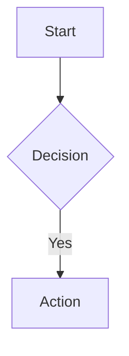

# 002m: Agent Format Anti-Patterns

> **REFERENCE RULE: FORMAT VIOLATION EXAMPLES**
>
> Complete set of formatting anti-patterns for agent-optimized rules.
> Extracted from 002g-agent-optimization.md for size management.

## Metadata

**SchemaVersion:** v3.2
**RuleVersion:** v1.0.0
**LastUpdated:** 2026-03-09
**Keywords:** anti-pattern, format, ASCII table, arrow character, decision tree, passive voice, terminology, mermaid, horizontal rule, agent optimization
**TokenBudget:** ~1650
**ContextTier:** Medium
**Depends:** 002g-agent-optimization.md, 000-global-core.md

## Scope

**What This Rule Covers:**
The 9 formatting anti-patterns that prevent reliable agent execution, extracted from 002g-agent-optimization.md. Each anti-pattern includes the problem, a failing example, and the correct pattern.

**When to Load This Rule:**
- Reviewing or auditing rule files for formatting violations
- Need detailed examples of correct vs incorrect formatting
- Referenced from 002g-agent-optimization.md for full anti-pattern details

## References

### Rule Dependencies

**Must Load First:**
- **000-global-core.md** - Foundation rule with core patterns
- **002g-agent-optimization.md** - Parent rule for agent optimization

**Related:**
- **002-rule-governance.md** - v3.2 schema standards

## Contract

### Inputs and Prerequisites

- Rule file identified with formatting violations
- Access to `ai-rules validate` command
- Understanding of v3.2 schema requirements

### Mandatory

- Apply structured lists instead of ASCII tables
- Use sequential phrasing instead of arrow characters
- Use active voice with explicit agent subjects
- Maintain consistent terminology throughout

### Forbidden

- ASCII table patterns (`|---|`)
- Arrow characters for sequences (`→`, `->`)
- Passive voice without explicit subjects
- Inconsistent terminology across sections

### Execution Steps

1. Identify which anti-pattern applies to the formatting issue
2. Compare current content against the Problem example
3. Apply the Correct Pattern transformation
4. Verify with `ai-rules validate`

### Validation

**Success Criteria:**
- All 9 anti-patterns are recognizable by example
- Correct patterns are copy-paste applicable

### Output Format

```markdown
**Problem:** [Description of why this pattern fails]

**Correct Pattern:** [Description of the fix]
- **Item 1:** Description
- **Item 2:** Description
```

### Post-Execution Checklist

- [ ] Identified applicable anti-pattern from the 9 patterns
- [ ] Compared against Problem example
- [ ] Applied Correct Pattern transformation
- [ ] Verified with `ai-rules validate`

## Anti-Patterns and Common Mistakes

### Anti-Pattern 1: ASCII Tables for Simple Data

**Problem:** Tables waste tokens and confuse sequential parsing

```markdown
| Option | Description |
|--------|-------------|
| --verbose | Show details |
| --quiet | Suppress output |
```

**Correct Pattern:** Use structured lists

```markdown
**Options:**
- **`--verbose`** - Show details
- **`--quiet`** - Suppress output
```

### Anti-Pattern 2: Passive Voice Instructions

**Problem:** Passive voice creates ambiguity about who acts

```markdown
Errors should be logged before the function returns.
```

**Correct Pattern:** Use imperative voice

```markdown
Log errors before returning from the function.
```

### Anti-Pattern 3: Visual Formatting for Meaning

**Problem:** Agents don't interpret visual layout

```markdown
CRITICAL    ...    Always do this
OPTIONAL    ...    Consider doing this
```

**Correct Pattern:** Use explicit labels

```markdown
**CRITICAL:** Always do this
**OPTIONAL:** Consider doing this
```

### Anti-Pattern 4: Inconsistent Terminology

**Problem:** Different terms for same concept cause confusion

```markdown
Run the validator... Execute the checker... Start the verification...
```

**Correct Pattern:** Single term throughout

```markdown
Run the validator... Run the validator... Run the validator...
```

### Anti-Pattern 5: Buried Critical Information

**Problem:** Important content hidden in middle of paragraph

```markdown
When working with files, you should consider various factors including
performance, readability, and most importantly, always validate the path
exists before attempting to read or write.
```

**Correct Pattern:** Front-load critical information

```markdown
**Always validate path exists before read/write operations.**
Consider performance and readability as secondary factors.
```

### Anti-Pattern 6: Arrow Characters for Flow

**Problem:** Arrow character (`→`) is ambiguous for agents

```markdown
Step 1 → Step 2 → Step 3
Input → Process → Output
Bad pattern → Use this instead
```

**Correct Pattern:** Use context-appropriate text

```markdown
# For sequences:
Step 1, then Step 2, then Step 3

# For data flow:
Input to Process to Output

# For corrections:
Bad pattern. Instead, use this.

# For navigation paths:
Monitoring > Traces > Logs
```

### Anti-Pattern 7: ASCII Decision Trees

**Problem:** Tree characters (`├─`, `└─`, `│`) confuse sequential parsing

```markdown
Is condition true?
├─ YES → Do action A
│  └─ Then do B
└─ NO → Do action C
```

**Correct Pattern:** Use nested conditional lists

```markdown
**Is condition true?**
- If YES: Do action A, then do B
- If NO: Do action C
```

### Anti-Pattern 8: Visual Diagrams (Mermaid, ASCII Art)

**Problem:** Rules are for agents, not humans. Visual diagrams waste tokens.

````markdown

````

**Why It Fails:** Agents parse Mermaid as raw DSL syntax, not rendered flowcharts. The diagram above consumes ~50 tokens while conveying less information than 2 lines of structured text. Rules in `rules/` are intended exclusively for autonomous agents — any content targeting human visual consumption is wasted token space.

**Correct Pattern:** Use structured conditional lists

```markdown
**Decision Flow:**
1. Start process
2. If CONDITION: Do Action
3. If NOT CONDITION: Do Alternative
```

**Rule:** Mermaid diagrams and ASCII art are FORBIDDEN in rule files. All content must provide direct value to agent execution.

### Anti-Pattern 9: Horizontal Rule Separators

**Problem:** Standalone `---` lines waste tokens as visual dividers

```markdown
**Section A content**

---

**Section B content**
```

**Why It Fails:** Markdown headers (`###`, `####`) already provide structure. Horizontal rules add ~4 tokens per occurrence with zero semantic value for agents.

**Correct Pattern:** Use headers for structure, remove visual separators

```markdown
### Section A
Content...

### Section B
Content...
```

**Rule:** Horizontal rule separators (`---`) are FORBIDDEN in rule files. Use headers to delineate sections.

### Legacy Rule Migration

When optimizing existing rules with heavy visual formatting, fix in priority order:

1. CRITICAL violations first (ASCII tables, undefined subjective terms)
2. Arrow characters using the Arrow Replacement Guide in 002g-agent-optimization.md
3. ASCII decision trees using nested conditional lists
4. Mermaid diagrams and ASCII art, replace with structured text
5. Horizontal rule separators last (lowest impact)

Run `ai-rules validate` after each step.
